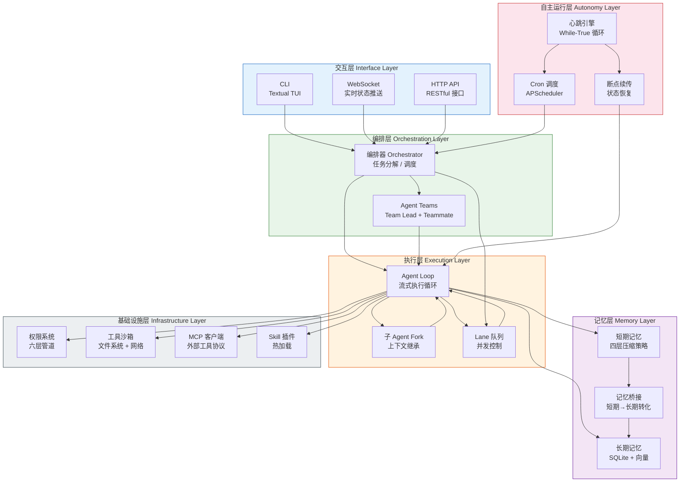
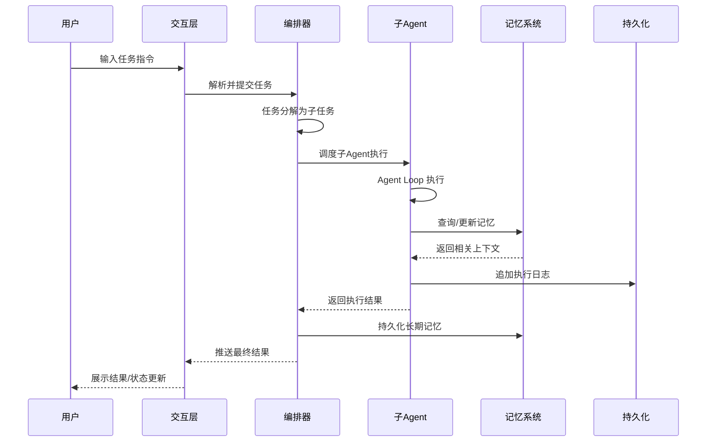
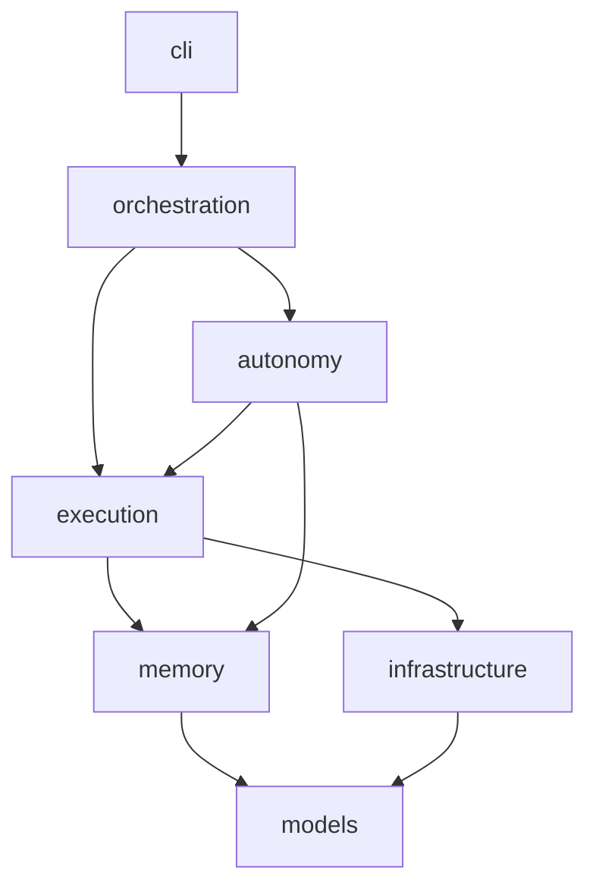

# SherryAgent 架构概述

本文档提供 SherryAgent 系统架构的高层概览，帮助开发者快速理解系统设计。

## 六层融合架构

SherryAgent 采用六层分层架构，融合了 Claude Code 的编排精度和 OpenClaw 的自主运行能力。

## 各层职责

| 层级 | 核心职责 | 关键组件 |
|------|---------|---------|
| **交互层** | 用户输入/输出，多通道适配 | CLI（Textual TUI）、WebSocket、HTTP API |
| **编排层** | 任务分解、子Agent分配、团队协调 | Orchestrator、Agent Teams |
| **执行层** | Agent执行循环、子Agent派生、并发控制 | Agent Loop、Fork、Lane队列 |
| **自主运行层** | 持续运行、定时调度、崩溃恢复 | 心跳引擎、Cron调度、断点续传 |
| **记忆层** | 上下文管理、信息压缩、知识持久化 | 短期记忆、长期记忆、记忆桥接 |
| **基础设施层** | 安全管控、工具执行、插件扩展 | 权限系统、沙箱、MCP、Skill插件 |

## 运行模式

系统支持三种运行模式：

| 模式 | 特征 | 适用场景 |
|------|------|----------|
| **CLI 交互模式** | 同步阻塞、人工监督、实时流式输出 | 开发、调试 |
| **后台自主模式** | 异步非阻塞、心跳驱动、自动决策 | 监控、巡检、自动化运维 |
| **混合模式** | 模式热切换、WebSocket状态推送 | 编译、部署、批量处理 |

## 数据流

## 模块依赖关系

## 详细文档

| 主题 | 文档 |
|------|------|
| 六层架构详解 | [docs/specs/six-layer-architecture.md](docs/specs/six-layer-architecture.md) |
| Agent Loop 设计 | [docs/specs/agent-loop.md](docs/specs/agent-loop.md) |
| 记忆系统设计 | [docs/specs/memory-system.md](docs/specs/memory-system.md) |
| 权限系统设计 | [docs/specs/permission-system.md](docs/specs/permission-system.md) |
| 多Agent编排设计 | [docs/specs/multi-agent-orchestration.md](docs/specs/multi-agent-orchestration.md) |
| 心跳引擎设计 | [docs/specs/heartbeat-engine.md](docs/specs/heartbeat-engine.md) |
| 项目结构 | [docs/reference/project-structure.md](docs/reference/project-structure.md) |
