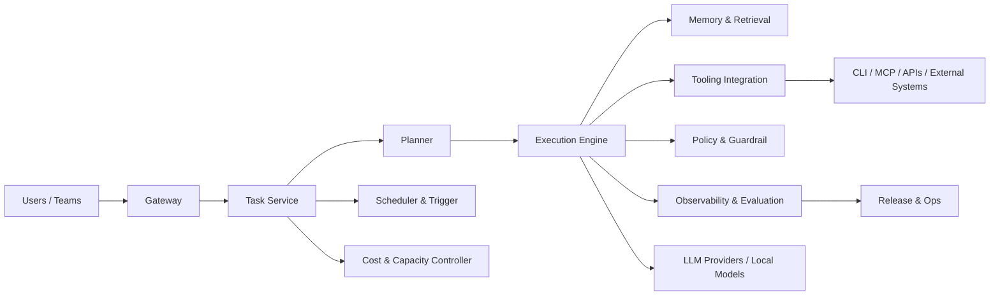

# System Blueprint

## 系统上下文

SherryAgent 作为平台位于用户入口、外部工具、模型提供方和运行治理层之间：

## 核心边界

- Gateway：统一 CLI/API/Webhook/cron/event 请求入口。
- Task Service：维护任务状态机、幂等、优先级、依赖和 run 生命周期。
- Planner：负责拆解任务、选择模式、分配预算、模型与工具路由。
- Execution Engine：负责 agent loop、子任务执行、取消/超时/恢复。
- Memory & Retrieval：承接上下文压缩、长期记忆、检索与热冷数据。
- Tooling Integration：连接本地工具、MCP、外部 API 和 repo/系统接口。
- Policy & Guardrail：拦截越权、高风险、破坏性或不合规动作。
- Scheduler & Trigger：负责 cron、条件触发、事件触发与批处理调度。
- Observability & Evaluation：负责 run replay、metrics、trace、benchmark、regression。
- Cost & Capacity Controller：负责预算、限流、缓存命中、资源配额、回退策略。
- Release & Ops：承接配置管理、发布门禁、回滚、值班和事故管理。

## 设计原则

- 同一条主链路必须能追踪 `task -> run -> evidence -> decision -> cost record`。
- 入口与执行解耦，避免高并发下交互任务被后台任务拖死。
- 审计、策略、成本和观测不是附属逻辑，而是核心路径的一部分。
- 早期可以同进程实现，但接口边界必须按未来拆分服务的方式设计。

