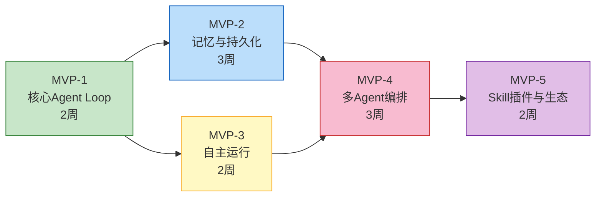

# MVP实现路线图总览

## 阶段概览

## 各阶段目标

| 阶段 | 目标 | 核心交付物 | 预估工期 |
|------|------|-----------|----------|
| MVP-1 | 实现最小可用的Agent执行循环 | Agent Loop + 3个基础工具 + CLI | 2周 |
| MVP-2 | 实现上下文压缩和任务持久化 | 记忆系统 + 断点续传 | 3周 |
| MVP-3 | 实现后台自主运行能力 | 心跳引擎 + Cron调度 | 2周 |
| MVP-4 | 实现任务分解和并行执行 | 编排器 + 子Agent Fork | 3周 |
| MVP-5 | 实现插件化能力扩展 | Skill插件 + MCP客户端 | 2周 |

**总预估工期**：12周（约3个月），MVP-1至MVP-3可部分并行开发。

## 依赖关系

| 阶段 | 依赖 | 说明 |
|------|------|------|
| MVP-1 | 无 | 基础框架，所有后续阶段的基础 |
| MVP-2 | MVP-1 | 需要Agent Loop支持记忆管理 |
| MVP-3 | MVP-1, MVP-2 | 需要Agent Loop和持久化支持 |
| MVP-4 | MVP-2, MVP-3 | 需要记忆系统和自主运行支持 |
| MVP-5 | MVP-4 | 需要多Agent编排支持插件管理 |

## 验收标准汇总

### MVP-1 验收标准

| 编号 | 验收条件 | 验证方式 |
|------|---------|---------|
| 1.1 | CLI启动后能接收用户输入 | 手动测试 |
| 1.2 | LLM响应流式输出到终端 | 观察输出 |
| 1.3 | 能调用文件读写工具完成文件操作 | 端到端测试 |
| 1.4 | 能调用Shell工具执行命令 | 端到端测试 |
| 1.5 | 危险命令被权限系统拦截 | 单元测试 |
| 1.6 | 用户可中止正在执行的任务 | 手动测试 |

### MVP-2 验收标准

| 编号 | 验收条件 | 验证方式 |
|------|---------|---------|
| 2.1 | 长对话自动触发上下文压缩 | 压力测试 |
| 2.2 | 压缩后保留关键信息 | 回归测试 |
| 2.3 | 任务执行过程写入transcript.jsonl | 文件检查 |
| 2.4 | 进程崩溃后重启可恢复未完成任务 | 崩溃恢复测试 |
| 2.5 | 跨会话可检索到历史记忆 | 集成测试 |

### MVP-3 验收标准

| 编号 | 验收条件 | 验证方式 |
|------|---------|---------|
| 3.1 | 心跳引擎持续运行24小时无崩溃 | 长时间运行测试 |
| 3.2 | Cron任务按预期时间触发 | 定时任务测试 |
| 3.3 | CLI可切换到后台，WebSocket推送状态 | 手动测试 |
| 3.4 | 断电重启后心跳引擎自动恢复 | 崩溃恢复测试 |
| 3.5 | 空闲时自动进入低功耗模式 | 资源监控 |

### MVP-4 验收标准

| 编号 | 验收条件 | 验证方式 |
|------|---------|---------|
| 4.1 | 编排器能将复杂任务分解为合理子任务 | 人工评审 |
| 4.2 | 无依赖的子任务并行执行 | 并发测试 |
| 4.3 | 有依赖的子任务按序执行 | 顺序测试 |
| 4.4 | 子Agent继承父Agent系统提示 | 对比测试 |
| 4.5 | Lane队列并发度不超过配置上限 | 压力测试 |

### MVP-5 验收标准

| 编号 | 验收条件 | 验证方式 |
|------|---------|---------|
| 5.1 | 运行时动态加载Skill插件 | 手动测试 |
| 5.2 | Skill卸载后Agent不再调用相关工具 | 回归测试 |
| 5.3 | MCP客户端成功连接外部工具服务器 | 集成测试 |
| 5.4 | 自动模式分类器正确判断风险等级 | 单元测试 |
| 5.5 | 用户配置规则正确生效 | 配置测试 |

## 里程碑交付物

| 里程碑 | 交付物 | 用户价值 |
|--------|--------|----------|
| M1 (Week 2) | 可运行的CLI Agent | 基本的AI编程助手功能 |
| M2 (Week 5) | 记忆系统上线 | 支持长对话和跨会话记忆 |
| M3 (Week 7) | 自主运行能力 | 24/7后台运行，定时任务 |
| M4 (Week 10) | 多Agent协作 | 复杂任务自动分解并行执行 |
| M5 (Week 12) | 插件生态 | 可扩展的技能系统 |
