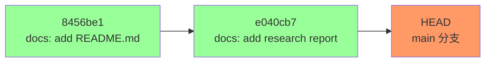
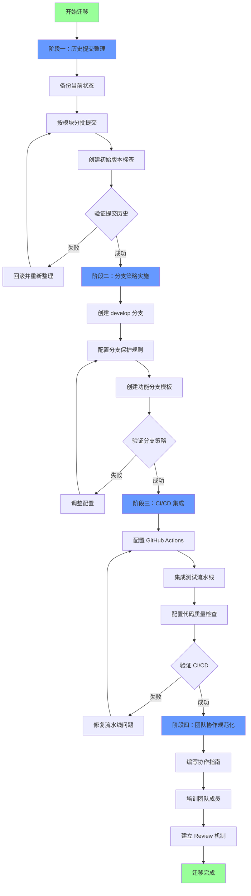
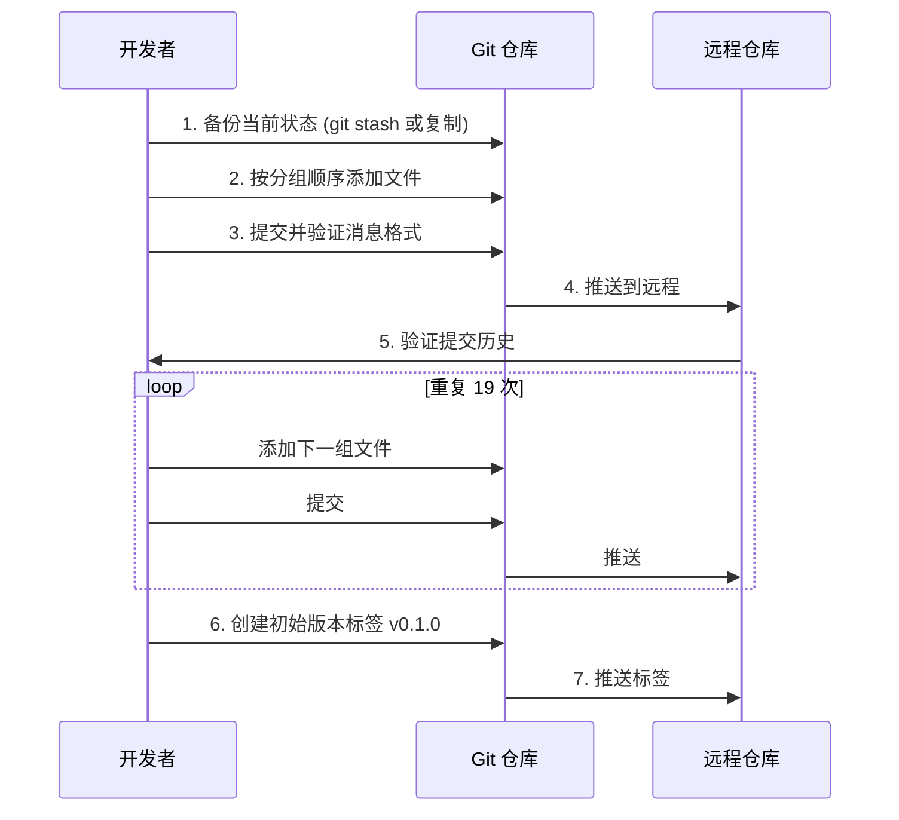
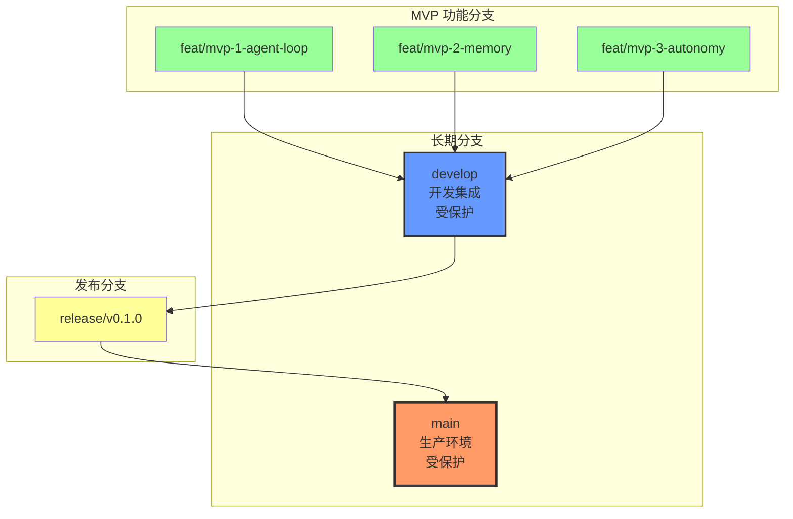
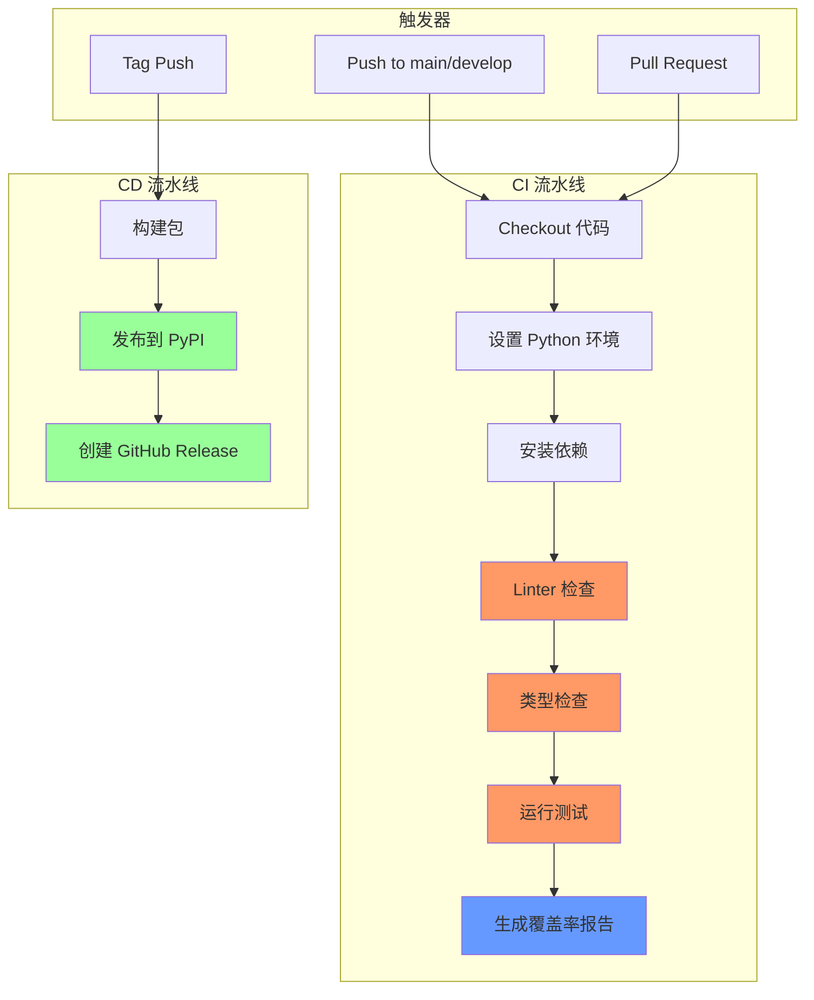
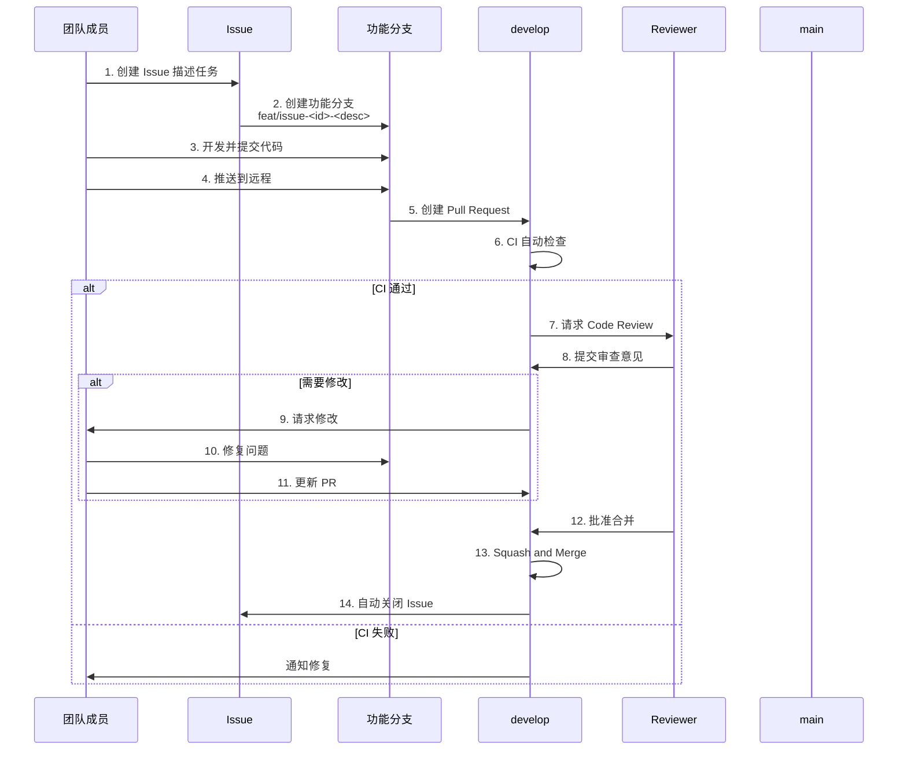
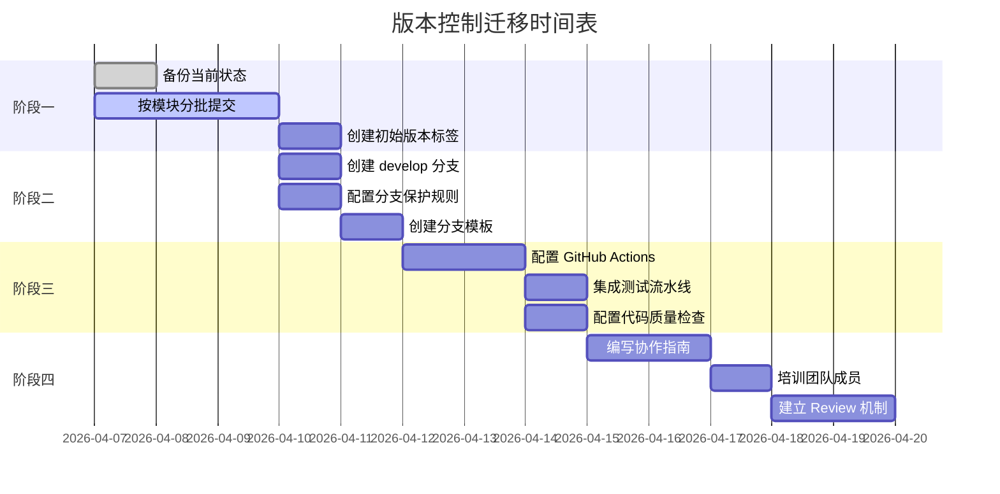

# 版本控制迁移计划

## 执行摘要

本文档制定 SherryAgent 项目从当前 Git 使用不足状态迁移到规范化版本控制工作流的完整计划。迁移分为四个阶段：历史提交整理、分支策略实施、CI/CD 集成、团队协作规范化。

**迁移目标：**
- 建立清晰的提交历史，便于追溯和回滚
- 实施分支策略，支持并行开发和代码审查
- 集成 CI/CD 流水线，自动化质量保障
- 建立团队协作规范，提升开发效率

**预计完成时间：** 2 周（2026-04-07 至 2026-04-21）

## 当前状态评估

### Git 使用现状

截至 2026-04-07，项目 Git 使用情况：

| 指标 | 当前值 | 目标值 | 差距 |
|------|--------|--------|------|
| 提交记录数 | 2 | 100+ | 🔴 严重不足 |
| 分支数量 | 1 (main) | 5+ | 🔴 无分支策略 |
| 提交消息规范 | 部分遵循 | 100% 遵循 | 🟡 需改进 |
| 版本标签 | 0 | 每个里程碑 | 🔴 缺失 |
| PR 流程 | 无 | 必须经过 | 🔴 缺失 |
| CI/CD 集成 | 无 | 完整流水线 | 🔴 缺失 |

### 提交历史分析



**问题诊断：**

| 问题 | 影响 | 严重度 |
|------|------|--------|
| 提交记录仅 2 条 | 无法追溯开发历史，丢失上下文 | 🔴 高 |
| 无功能分支 | 直接在 main 开发，主分支不稳定 | 🔴 高 |
| 无版本标签 | 无法回滚到稳定版本 | 🟡 中 |
| 大量未提交文件 | 工作区混乱，存在丢失风险 | 🔴 高 |

### 未提交文件统计

| 类别 | 文件数 | 说明 |
|------|--------|------|
| 核心代码 (src/) | ~50 | Agent Loop、Memory、Orchestration 等核心模块 |
| 测试代码 (tests/) | ~40 | 单元测试、集成测试、E2E 测试 |
| 文档 (docs/) | ~30 | 架构文档、API 文档、指南 |
| 配置文件 | ~10 | pyproject.toml, uv.lock, .env.example 等 |
| 示例代码 (examples/) | ~5 | 插件示例、多 Agent 演示 |
| 插件与技能 | ~5 | hello_plugin, weather_skill |
| **总计** | **~140** | 需要分批提交 |

## 迁移策略

### 整体迁移流程



### 迁移原则

1. **渐进式迁移**：分阶段实施，每个阶段独立验证
2. **安全第一**：每个阶段前备份，失败可回滚
3. **最小影响**：避免破坏现有代码和配置
4. **文档同步**：迁移过程中同步更新文档

## 阶段一：历史提交整理

### 目标

将当前未提交的文件按逻辑模块分批提交，建立清晰的提交历史。

### 提交分组策略

根据项目架构和功能模块，将文件分为以下提交组：

| 提交序号 | 提交类型 | 提交范围 | 文件列表 | 提交消息 |
|---------|---------|---------|---------|---------|
| 1 | chore | 项目初始化 | `.gitignore`, `pyproject.toml`, `uv.lock`, `uv.toml`, `.env.example` | `chore: initialize project with Python 3.12+ and uv package manager` |
| 2 | feat | 核心配置 | `src/sherry_agent/__init__.py`, `src/sherry_agent/config/`, `src/sherry_agent/models/` | `feat(config): add configuration management with pydantic-settings` |
| 3 | feat | Agent Loop | `src/sherry_agent/execution/`, `src/sherry_agent/llm/` | `feat(agent): implement core agent loop with Claude and OpenAI SDK` |
| 4 | feat | 记忆系统 | `src/sherry_agent/memory/` | `feat(memory): add short-term and long-term memory with bridge` |
| 5 | feat | 自主运行 | `src/sherry_agent/autonomy/` | `feat(autonomy): add heartbeat engine and scheduler for autonomous execution` |
| 6 | feat | 多 Agent 编排 | `src/sherry_agent/orchestration/` | `feat(orchestration): implement multi-agent orchestration with fork and lane` |
| 7 | feat | 基础设施 | `src/sherry_agent/infrastructure/` | `feat(infra): add MCP, security, and tool infrastructure` |
| 8 | feat | 插件系统 | `src/sherry_agent/plugins/`, `plugins/`, `skills/` | `feat(plugins): implement plugin system with pluggy and skill parser` |
| 9 | feat | CLI 界面 | `src/sherry_agent/cli/` | `feat(cli): add TUI interface with Textual and click` |
| 10 | test | 单元测试 | `tests/unit/`, `tests/conftest.py` | `test: add unit tests for core modules` |
| 11 | test | 集成测试 | `tests/integration/` | `test: add integration tests for agent and memory systems` |
| 12 | test | E2E 测试 | `tests/e2e/`, `tests/benchmark/` | `test: add E2E tests and benchmark suite` |
| 13 | docs | 核心文档 | `AGENTS.md`, `ARCHITECTURE.md`, `README.md` | `docs: add project overview and architecture documentation` |
| 14 | docs | 标准文档 | `docs/standard/` | `docs: add coding standards and design principles` |
| 15 | docs | 规范文档 | `docs/specs/` | `docs: add technical specifications for all modules` |
| 16 | docs | 指南文档 | `docs/guides/` | `docs: add development guides and best practices` |
| 17 | docs | 参考文档 | `docs/reference/`, `docs/plans/`, `docs/research/` | `docs: add API reference, plans, and research documents` |
| 18 | feat | 示例代码 | `examples/` | `feat: add plugin and multi-agent examples` |
| 19 | chore | Git 配置 | `.git/commit-template`, `.github/` | `chore: add Git commit template and GitHub templates` |

### 执行步骤



### 详细操作命令

**步骤 1：备份当前状态**

```bash
# 创建备份分支
git checkout -b backup/pre-migration

# 返回 main 分支
git checkout main

# 或者使用 git stash 保存未提交的更改
git stash push -u -m "pre-migration backup"
```

**步骤 2-19：分批提交**

```bash
# 提交 1：项目初始化
git add .gitignore pyproject.toml uv.lock uv.toml .env.example
git commit -m "chore: initialize project with Python 3.12+ and uv package manager"

# 提交 2：核心配置
git add src/sherry_agent/__init__.py src/sherry_agent/config/ src/sherry_agent/models/
git commit -m "feat(config): add configuration management with pydantic-settings"

# 提交 3：Agent Loop
git add src/sherry_agent/execution/ src/sherry_agent/llm/
git commit -m "feat(agent): implement core agent loop with Claude and OpenAI SDK"

# ... 继续按表格顺序提交

# 提交完成后推送
git push origin main
```

**步骤 20：创建初始版本标签**

```bash
# 创建带注释的标签
git tag -a v0.1.0 -m "MVP-1: Core Agent Loop

Initial release with basic agent loop functionality:
- Agent loop with Claude and OpenAI SDK integration
- Configuration management with pydantic-settings
- Memory system (short-term and long-term)
- Autonomous execution with heartbeat engine
- Multi-agent orchestration
- Plugin system with skill parser
- TUI interface with Textual
- Comprehensive test suite
- Complete documentation

See CHANGELOG.md for details."

# 推送标签
git push origin v0.1.0
```

### 验证清单

- [ ] 所有文件已提交（`git status` 显示工作区干净）
- [ ] 提交消息符合 Conventional Commits 规范
- [ ] 提交历史清晰可读（`git log --oneline` 显示 20+ 条记录）
- [ ] 版本标签已创建并推送
- [ ] 远程仓库与本地同步

## 阶段二：分支策略实施

### 目标

建立规范的分支策略，支持并行开发和代码审查。

### 分支模型

采用改进的 Git Flow 模型：



### 分支创建步骤

| 步骤 | 操作 | 命令 | 负责人 | 预计时间 |
|------|------|------|--------|----------|
| 1 | 创建 develop 分支 | `git checkout -b develop` | 项目负责人 | 5 分钟 |
| 2 | 推送 develop 到远程 | `git push origin develop` | 项目负责人 | 5 分钟 |
| 3 | 配置 main 分支保护 | GitHub Settings → Branches | 项目负责人 | 10 分钟 |
| 4 | 配置 develop 分支保护 | GitHub Settings → Branches | 项目负责人 | 10 分钟 |
| 5 | 创建分支命名规范文档 | 更新 `docs/guides/git-workflow.md` | 文档负责人 | 30 分钟 |
| 6 | 创建功能分支模板 | 创建 `.github/ISSUE_TEMPLATE/` | 项目负责人 | 30 分钟 |

### 分支保护规则配置

**main 分支保护规则：**

```yaml
# GitHub Branch Protection Settings
branch_protection:
  main:
    required_pull_request_reviews:
      required_approving_review_count: 1
      dismiss_stale_reviews: true
      require_code_owner_reviews: true
    
    required_status_checks:
      strict: true
      contexts:
        - test
        - lint
        - typecheck
    
    enforce_admins: true
    restrictions: null
    
    allow_force_pushes: false
    allow_deletions: false
```

**develop 分支保护规则：**

```yaml
branch_protection:
  develop:
    required_pull_request_reviews:
      required_approving_review_count: 0  # 允许自动合并
    
    required_status_checks:
      strict: false
      contexts:
        - test
        - lint
    
    enforce_admins: false
    restrictions: null
    
    allow_force_pushes: false
    allow_deletions: false
```

### 验证清单

- [ ] develop 分支已创建并推送
- [ ] main 分支保护规则已配置
- [ ] develop 分支保护规则已配置
- [ ] 无法直接推送到 main 分支（测试验证）
- [ ] 分支命名规范文档已更新

## 阶段三：CI/CD 集成

### 目标

建立自动化 CI/CD 流水线，确保代码质量。

### CI/CD 架构



### GitHub Actions 配置

**主 CI 流水线：**

```yaml
# .github/workflows/ci.yml
name: CI

on:
  push:
    branches: [main, develop]
  pull_request:
    branches: [main, develop]

jobs:
  test:
    runs-on: ubuntu-latest
    strategy:
      matrix:
        python-version: ['3.12', '3.13']
    
    steps:
      - uses: actions/checkout@v4
      
      - name: Install uv
        uses: astral-sh/setup-uv@v4
        with:
          version: 'latest'
      
      - name: Set up Python ${{ matrix.python-version }}
        run: uv python install ${{ matrix.python-version }}
      
      - name: Install dependencies
        run: uv sync --all-extras
      
      - name: Run linter
        run: uv run ruff check src/ tests/
      
      - name: Run type checker
        run: uv run mypy src/
      
      - name: Run tests
        run: uv run pytest tests/ -v --cov=src/sherry_agent --cov-report=xml
      
      - name: Upload coverage
        uses: codecov/codecov-action@v4
        with:
          files: ./coverage.xml
          fail_ci_if_error: true
```

**发布流水线：**

```yaml
# .github/workflows/release.yml
name: Release

on:
  push:
    tags:
      - 'v*'

jobs:
  release:
    runs-on: ubuntu-latest
    permissions:
      contents: write
      id-token: write
    
    steps:
      - uses: actions/checkout@v4
      
      - name: Install uv
        uses: astral-sh/setup-uv@v4
      
      - name: Build package
        run: uv build
      
      - name: Publish to PyPI
        run: uv publish --token ${{ secrets.PYPI_TOKEN }}
      
      - name: Create GitHub Release
        uses: softprops/action-gh-release@v1
        with:
          generate_release_notes: true
          files: |
            dist/*.whl
            dist/*.tar.gz
```

### CI/CD 配置步骤

| 步骤 | 操作 | 负责人 | 预计时间 |
|------|------|--------|----------|
| 1 | 创建 `.github/workflows/` 目录 | 开发者 | 5 分钟 |
| 2 | 编写 `ci.yml` 配置文件 | 开发者 | 30 分钟 |
| 3 | 编写 `release.yml` 配置文件 | 开发者 | 20 分钟 |
| 4 | 配置 GitHub Secrets (PYPI_TOKEN) | 项目负责人 | 10 分钟 |
| 5 | 推送配置文件并触发首次 CI | 开发者 | 5 分钟 |
| 6 | 验证 CI 流水线运行正常 | 开发者 | 15 分钟 |
| 7 | 配置 Codecov 集成（可选） | 开发者 | 20 分钟 |

### 质量门禁标准

| 检查项 | 通过标准 | 阻塞级别 |
|--------|----------|----------|
| Linter | 0 errors, 0 warnings | 🔴 阻塞 |
| 类型检查 | 0 errors | 🔴 阻塞 |
| 单元测试 | 100% 通过 | 🔴 阻塞 |
| 代码覆盖率 | ≥ 80% | 🟡 警告 |
| 安全扫描 | 0 高危漏洞 | 🔴 阻塞 |

### 验证清单

- [ ] `.github/workflows/ci.yml` 已创建
- [ ] `.github/workflows/release.yml` 已创建
- [ ] GitHub Secrets 已配置
- [ ] CI 流水线在 push 时自动触发
- [ ] 所有检查项通过
- [ ] 覆盖率报告已生成

## 阶段四：团队协作规范化

### 目标

建立团队协作规范，确保所有成员遵循统一的工作流程。

### 协作流程



### 协作规范文档

需要创建或更新的文档：

| 文档 | 路径 | 内容 | 负责人 | 预计时间 |
|------|------|------|--------|----------|
| Git 工作流指南 | `docs/guides/git-workflow.md` | 分支策略、提交规范、PR 流程 | 已完成 | - |
| PR 模板 | `.github/pull_request_template.md` | PR 检查清单、描述模板 | 开发者 | 30 分钟 |
| Issue 模板 | `.github/ISSUE_TEMPLATE/` | Bug 报告、功能请求模板 | 开发者 | 30 分钟 |
| 提交消息模板 | `.git/commit-template` | Conventional Commits 模板 | 开发者 | 15 分钟 |
| Code Owners | `.github/CODEOWNERS` | 代码审查责任人分配 | 项目负责人 | 20 分钟 |
| 贡献指南 | `CONTRIBUTING.md` | 如何贡献代码、开发环境搭建 | 开发者 | 1 小时 |

### PR 模板示例

```markdown
## 变更类型
- [ ] feat: 新功能
- [ ] fix: Bug 修复
- [ ] refactor: 重构
- [ ] test: 测试
- [ ] docs: 文档
- [ ] chore: 构建/工具

## 变更描述
<!-- 简要描述本次变更的内容和原因 -->

## 相关 Issue
Closes #

## 测试计划
- [ ] 单元测试已通过
- [ ] 集成测试已通过
- [ ] 手动测试已完成

## 检查清单
- [ ] 代码遵循项目编码规范
- [ ] 已添加必要的文档和注释
- [ ] 无破坏性变更（或已在描述中说明）
- [ ] 提交消息符合 Conventional Commits 规范
```

### 团队培训计划

| 培训内容 | 时长 | 形式 | 参与人员 |
|---------|------|------|----------|
| Git 工作流介绍 | 1 小时 | 线上会议 | 全体开发人员 |
| 分支策略实操 | 30 分钟 | 演示 + 练习 | 全体开发人员 |
| PR 流程演练 | 30 分钟 | 演示 + 练习 | 全体开发人员 |
| CI/CD 流程说明 | 30 分钟 | 线上会议 | 全体开发人员 |

### 验证清单

- [ ] PR 模板已创建
- [ ] Issue 模板已创建
- [ ] 提交消息模板已配置
- [ ] CODEOWNERS 文件已创建
- [ ] CONTRIBUTING.md 已创建
- [ ] 团队培训已完成

## 风险评估与回滚方案

### 风险矩阵

| 风险 | 可能性 | 影响 | 风险等级 | 缓解措施 |
|------|--------|------|----------|----------|
| 提交历史整理失败 | 中 | 高 | 🔴 高 | 创建备份分支，失败可回滚 |
| 分支保护配置错误 | 低 | 中 | 🟡 中 | 先在测试仓库验证配置 |
| CI/CD 流水线失败 | 中 | 中 | 🟡 中 | 分步配置，逐个验证 |
| 团队成员不熟悉流程 | 高 | 低 | 🟡 中 | 提供培训和文档 |
| 推送敏感信息 | 低 | 高 | 🔴 高 | 使用 `.gitignore` 过滤，配置 pre-commit hook |

### 回滚方案

**场景 1：提交历史整理失败**

```bash
# 方案 A：使用备份分支恢复
git checkout backup/pre-migration
git checkout -b main-rollback
git branch -D main
git branch -m main-rollback main
git push origin main --force

# 方案 B：使用 git reflog 恢复
git reflog
git reset --hard HEAD@{n}  # n 为迁移前的提交
git push origin main --force
```

**场景 2：分支保护配置错误**

```bash
# 在 GitHub Settings → Branches 中移除保护规则
# 或使用 GitHub CLI
gh api repos/:owner/:repo/branches/main/protection -X DELETE
```

**场景 3：CI/CD 流水线失败**

```bash
# 临时禁用流水线
# 在 GitHub Actions 中取消运行或禁用 workflow

# 或删除 workflow 文件
git rm .github/workflows/ci.yml
git commit -m "temp: disable CI pipeline"
git push origin main
```

**场景 4：误推送敏感信息**

```bash
# 立即从历史中移除
git filter-branch --force --index-filter \
  "git rm --cached --ignore-unmatch PATH_TO_SENSITIVE_FILE" \
  --prune-empty --tag-name-filter cat -- --all

# 强制推送（需谨慎）
git push origin --force --all

# 轮换泄露的密钥和令牌
```

### 应急联系机制

| 角色 | 职责 | 联系方式 |
|------|------|----------|
| 项目负责人 | 决策、协调、审批 | [待填写] |
| 技术负责人 | 技术问题解决、架构决策 | [待填写] |
| CI/CD 管理员 | 流水线配置和维护 | [待填写] |

## 迁移时间表

### 详细时间计划



### 里程碑

| 里程碑 | 完成日期 | 交付物 | 验收标准 |
|--------|----------|--------|----------|
| M1：历史提交整理完成 | 2026-04-10 | 清晰的提交历史、v0.1.0 标签 | 20+ 条提交记录，所有文件已提交 |
| M2：分支策略实施完成 | 2026-04-11 | develop 分支、分支保护规则 | 分支保护生效，无法直接推送 main |
| M3：CI/CD 集成完成 | 2026-04-14 | CI/CD 流水线 | 所有检查项通过，覆盖率报告生成 |
| M4：团队协作规范化完成 | 2026-04-21 | 协作文档、培训材料 | 团队成员熟悉流程，首次 PR 成功 |

## 成功指标

### 量化指标

| 指标 | 当前值 | 目标值 | 测量方法 |
|------|--------|--------|----------|
| 提交记录数 | 2 | 20+ | `git log --oneline | wc -l` |
| 分支数量 | 1 | 5+ | `git branch -a | wc -l` |
| 提交消息规范遵循率 | 50% | 100% | Linter 检查 |
| PR 审核率 | 0% | 100% | GitHub PR 统计 |
| CI 通过率 | N/A | ≥ 95% | GitHub Actions 统计 |
| 代码覆盖率 | N/A | ≥ 80% | Coverage 报告 |

### 质量指标

| 指标 | 目标 | 说明 |
|------|------|------|
| 提交历史清晰度 | 高 | 每个提交对应一个逻辑变更，消息描述清晰 |
| 分支策略执行度 | 100% | 所有开发在功能分支进行，main 始终稳定 |
| CI/CD 稳定性 | ≥ 95% | 流水线稳定运行，无频繁失败 |
| 团队满意度 | ≥ 4/5 | 团队成员对工作流程满意 |

## 后续改进

### 短期改进（1-3 个月）

| 改进项 | 优先级 | 预计收益 |
|--------|--------|----------|
| 配置 pre-commit hooks | P1 | 本地自动检查，减少 CI 失败 |
| 集成 Dependabot | P2 | 自动依赖更新，提升安全性 |
| 配置自动化 CHANGELOG 生成 | P2 | 简化发布流程 |
| 添加 Git blame 忽略规则 | P3 | 提升代码追溯准确性 |

### 长期改进（3-6 个月）

| 改进项 | 优先级 | 预计收益 |
|--------|--------|----------|
| 实施 GitOps 流程 | P2 | 基础设施即代码，提升部署可靠性 |
| 配置多环境部署 | P2 | 支持 staging、production 环境 |
| 集成安全扫描工具 | P1 | 自动检测安全漏洞 |
| 建立 Git 度量体系 | P3 | 量化开发效率和质量 |

## 附录

### 参考文档

- [Git 工作流规范](../guides/git-workflow.md)
- [MVP 路线图](./mvp-roadmap.md)
- [编码标准](../standard/coding-standards.md)
- [设计原则](../standard/design-principles.md)

### 相关工具

| 工具 | 用途 | 文档链接 |
|------|------|----------|
| uv | Python 包管理器 | https://docs.astral.sh/uv/ |
| ruff | Python Linter | https://docs.astral.sh/ruff/ |
| mypy | 静态类型检查 | https://mypy.readthedocs.io/ |
| pytest | 测试框架 | https://docs.pytest.org/ |
| pre-commit | Git Hooks 管理 | https://pre-commit.com/ |
| git-cliff | CHANGELOG 生成 | https://github.com/orhun/git-cliff |

### 常见问题

**Q1：为什么要分批提交而不是一次性提交所有文件？**

A：分批提交有以下优势：
- 提交历史清晰，每个提交对应一个逻辑变更
- 便于代码审查和问题定位
- 支持选择性合并和回滚
- 符合原子提交原则

**Q2：如何处理已经推送到远程的敏感信息？**

A：立即采取以下措施：
1. 从 Git 历史中移除文件（使用 `git filter-branch` 或 BFG）
2. 强制推送（需通知所有团队成员）
3. 轮换所有泄露的密钥和令牌
4. 配置 pre-commit hook 防止再次提交

**Q3：CI/CD 流水线失败时如何快速修复？**

A：遵循以下步骤：
1. 查看失败日志，定位问题
2. 在本地复现问题
3. 修复代码或配置
4. 推送修复并验证 CI 通过
5. 如无法快速修复，可临时禁用失败的检查项

**Q4：团队成员不熟悉 Git 工作流怎么办？**

A：提供以下支持：
1. 组织培训会议，演示完整流程
2. 编写详细的操作指南和 FAQ
3. 设置 Code Owner，新人提交时自动分配审查者
4. 建立 Slack/钉钉群，及时解答问题

---

**文档版本：** v1.0  
**最后更新：** 2026-04-07  
**维护者：** SherryAgent Team
