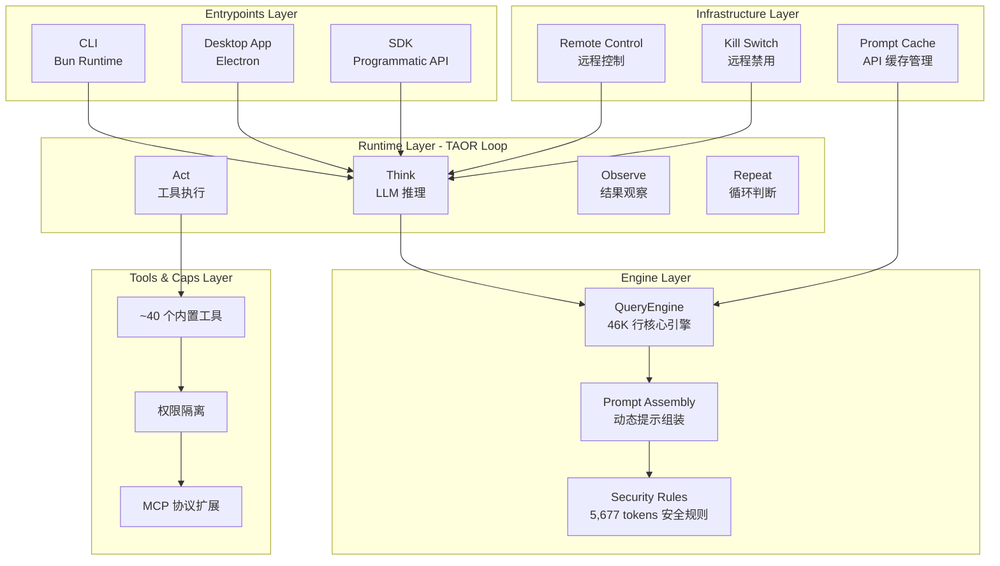
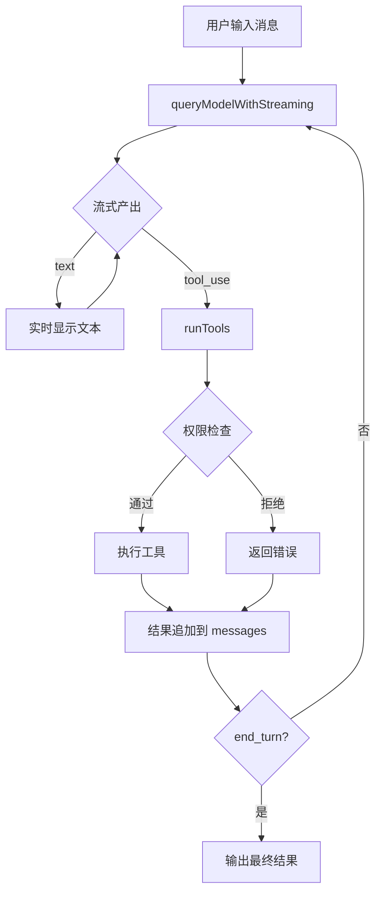
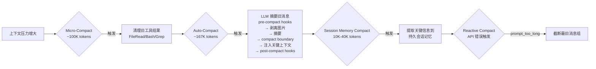
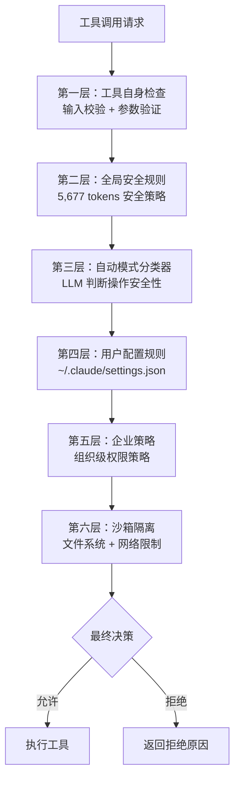
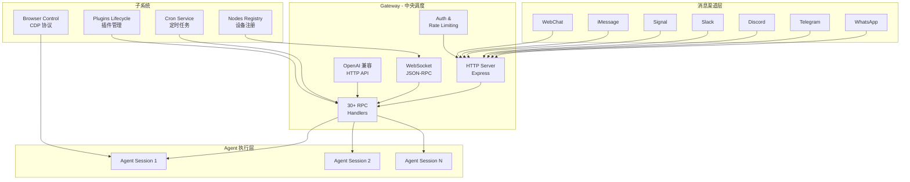
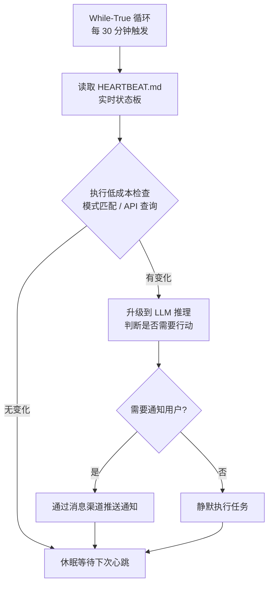
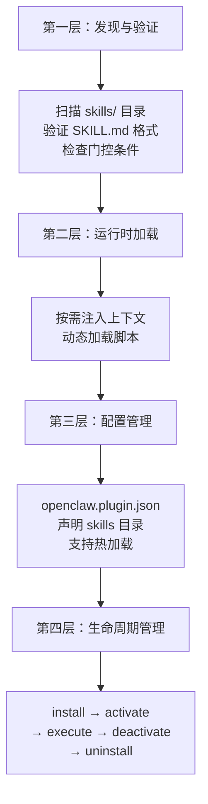
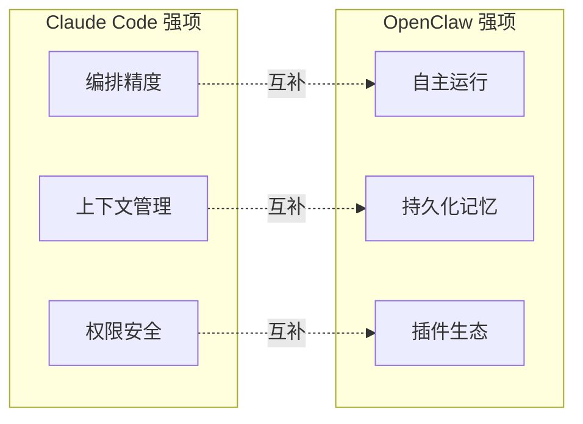

# Claude Code 与 OpenClaw：AI Agent 框架深度调研报告

> **调研时间**：2026 年 4 月
> **调研范围**：Claude Code（Anthropic）与 OpenClaw（开源社区）两大 AI Agent 框架的架构设计、核心机制、社区评价与融合方向
> **调研方法**：源码逆向分析、官方文档研读、社区讨论汇总、第三方安全审计报告

---

## 第 1 章 引言

### 1.1 调研背景

2025-2026 年，AI Agent（人工智能体）从学术概念迅速演进为工程实践的核心赛道。多 Agent 框架的涌现标志着 AI 系统从"单轮问答"向"自主执行复杂任务"的范式跃迁。在这一浪潮中，两个代表性项目格外引人注目：

**Claude Code** 是 Anthropic 推出的终端原生（Terminal-native）AI 编程助手。2026 年 3 月 31 日，因 Bun 构建工具的 Source Map 配置疏忽，其约 51 万行 TypeScript 源码意外泄露至 npm 注册表，引发了行业对其五层架构、多 Agent 编排体系和上下文压缩策略的深度解读。这一事件被社区戏称为"反向产品发布"——Anthropic 未做任何营销，却让全球开发者得以一窥顶级 Agent 的工程实现。

**OpenClaw**（俗称"龙虾"）是由奥地利开发者 Peter Steinberger 创建的开源、本地优先（Local-first）AI Agent 框架。该项目于 2025 年 11 月以"Clawdbot"之名发布，24 小时内获得超过 9,000 个 GitHub Star，数周内突破 25 万 Star，成为 GitHub 历史上增长最快的项目之一。2026 年 2 月，创始人加入 OpenAI 负责 Agent 相关研发，项目移交至独立基金会运营。

选择这两个框架进行对比调研的原因在于：Claude Code 代表了"闭源精工"路线——以极致的上下文管理和权限安全为核心竞争力；OpenClaw 则代表了"开源生态"路线——以自主运行、插件扩展和消息集成为核心价值。两者在架构理念上形成鲜明对照，却在功能边界上高度互补。

值得注意的是，这两个项目在 2026 年初几乎同时成为行业焦点：Claude Code 因源码泄露而被动曝光，OpenClaw 则凭借病毒式传播主动走红。这种"一明一暗"的出场方式，恰好映射了两者在产品哲学上的根本差异——Claude Code 追求"不暴露内部实现，只呈现最终效果"的精致感，而 OpenClaw 则拥抱"完全透明、社区共建"的开源精神。本报告试图超越表面的功能对比，深入剖析两者在工程实现层面的设计取舍和权衡考量。

### 1.2 调研方法

本报告采用以下三种互补的调研方法：

| 方法 | 说明 | 数据来源 |
|------|------|----------|
| **源码分析** | 对泄露的 Claude Code 源码进行逆向工程分析 | GitHub 存档仓库（1,900 文件 / 512K 行） |
| **官方文档研读** | 系统阅读 OpenClaw 官方文档、API 规范和架构指南 | openclaw-docs、MindStudio、Collabnix |
| **社区讨论汇总** | 收集开发者社区、安全研究机构和行业媒体的评价 | Hacker News、CSDN、SecurityScorecard、Gartner |

### 1.3 报告结构说明

本报告共分为六章：第 2 章和第 3 章分别对 Claude Code 和 OpenClaw 进行架构深度分析；第 4 章从十个维度进行系统性对比；第 5 章汇总社区评价与安全审计结论；第 6 章提出融合方向与设计建议。

---

## 第 2 章 Claude Code 架构深度分析

> **内容提要**：Claude Code 是一个以终端为交互入口、以流式推理为核心引擎、以多层权限为安全护栏的 AI 编程 Agent。其泄露的源码揭示了一个远比表面复杂得多的五层架构系统，包含精心设计的上下文压缩管线、三层多 Agent 协作体系和六层权限管道。

### 2.1 整体架构

#### 2.1.1 五层架构总览

泄露的源码清晰地展现了 Claude Code 的五层分层架构，每一层职责明确、边界清晰：



| 层级 | 名称 | 核心职责 | 关键文件规模 |
|------|------|----------|-------------|
| **第一层** | Entrypoints Layer | 标准化 CLI、Desktop、SDK 三种输入入口 | ~50 文件 |
| **第二层** | Runtime Layer | TAOR 循环（Think-Act-Observe-Repeat），维持 Agent 行为节奏 | ~120 文件 |
| **第三层** | Engine Layer | 动态提示组装、LLM API 调用、流式推理 | QueryEngine.ts ~46,000 行 |
| **第四层** | Tools & Caps Layer | ~40 个内置工具，每个工具独立权限定义 | Tool.ts ~29,000 行 |
| **第五层** | Infrastructure Layer | Prompt 缓存、远程控制、Kill Switch | ~80 文件 |

#### 2.1.2 技术栈与核心设计原则

Claude Code 的技术栈选型体现了"工程务实"的哲学。值得注意的是，整个代码库约 51 万行 TypeScript 代码全部运行在 Bun 运行时之上。Bun 是一个高性能的 JavaScript/TypeScript 运行时，由 Zig 语言编写，内置了打包器、测试框架和包管理器。选择 Bun 而非 Node.js 的关键考量在于：原生 Source Map 支持（正是这一特性导致了泄露事件）、极快的启动速度（对 CLI 工具至关重要）以及内置的打包能力（简化了发布流程）。

| 技术选型 | 说明 | 设计考量 |
|----------|------|----------|
| **Bun** | JavaScript/TypeScript 运行时 | 原生支持 Source Map、内置打包器、启动速度极快 |
| **TypeScript（严格模式）** | 全量类型安全 | 51 万行代码的规模下，类型安全是可维护性的基石 |
| **Ink / React Terminal** | 终端 UI 渲染 | 利用 React 组件模型构建终端界面，实现流式输出 |

四个核心设计原则贯穿整个架构：

1. **Streaming-first（流式优先）**：所有 LLM 交互均采用流式传输，用户可实时看到模型的"思考过程"和工具调用进度。这不仅提升了用户体验，更重要的是让用户能够在问题早期就介入纠偏，而不是等待整个生成过程结束后才发现方向错误。
2. **Tool-use loop（工具使用循环）**：Agent 的核心行为模式是"推理-调用工具-观察结果-继续推理"的闭环。Claude Code 将这一循环做到极致：模型可以在单次回复中交错产出文本和工具调用，工具结果会实时追加到消息历史中，驱动下一轮推理。
3. **Layered context（分层上下文）**：上下文按优先级和时效性分层管理，确保关键信息始终在窗口内。Claude Code 的上下文窗口管理策略是本次泄露源码中最受关注的工程亮点之一，后文将详细分析。
4. **Permission-gated（权限门控）**：每个工具操作都经过多层权限检查，防止未授权行为。这一设计在赋予 Agent 强大能力的同时，为用户提供了精细的控制粒度。

### 2.2 核心 Agent Loop

#### 2.2.1 执行循环机制

Claude Code 的 Agent Loop 是一个基于 Streaming Async Generator 的持续循环，其核心流程如下：



**关键实现细节**：

- **QueryEngine**：每个会话创建一个 QueryEngine 实例，持有可变消息历史（`messages[]`）、AbortController（支持用户中断）和 Usage Tracking（Token 消耗追踪）。
- **流式产出**：模型同时产出 `text`（自然语言回复）和 `tool_use`（工具调用请求），两者可以交错出现。
- **串行与并行**：只读操作（如文件读取、Grep 搜索）可并发执行；写操作（如文件修改、命令执行）严格串行，避免竞态条件。

#### 2.2.2 max-output-tokens 恢复机制

Claude Code 实现了一个精巧的输出截断恢复机制：当模型的 `max-output-tokens` 达到上限时，系统会自动重试，最多 3 次。每次重试时，系统将截断点之前的内容作为上下文注入，引导模型从断点处继续生成。这一机制有效解决了长代码生成过程中因 Token 限制导致的中断问题。

#### 2.2.3 Hook 系统与生命周期管理

泄露的源码还揭示了一个此前未被 Anthropic 公开宣传的 Hook 系统。该系统暴露了超过 25 个生命周期事件，覆盖 Agent 执行的完整链路：

| Hook 类型 | 触发时机 | 典型用途 |
|-----------|----------|----------|
| **PreToolUse** | 工具执行前 | 参数校验、日志记录、条件拦截 |
| **PostToolUse** | 工具执行后 | 结果验证、副作用清理、指标采集 |
| **UserPromptSubmit** | 用户提交消息时 | 输入预处理、敏感信息过滤 |
| **SessionStart** | 会话启动时 | 环境初始化、规则加载 |
| **SessionEnd** | 会话结束时 | 资源清理、状态持久化 |

这些 Hook 支持五种实现方式：Shell 命令、LLM 注入上下文、完整 Agent 验证循环、HTTP Webhook 和 JavaScript 函数。这种设计使得 Claude Code 具备了远超表面功能的可扩展性，开发者可以在不修改核心代码的情况下定制 Agent 的行为。

### 2.3 多 Agent 协作体系

Claude Code 的多 Agent 体系分为三个递进层次：

#### 2.3.1 三层 Agent 体系

| 层级 | 名称 | 触发方式 | 核心特征 |
|------|------|----------|----------|
| **第一层** | Sub-Agent | AgentTool 自动派生 | 隔离文件缓存、独立 AbortController、过滤工具池、独立 transcript 录制 |
| **第二层** | Coordinator Mode | 环境变量 `CLAUDE_CODE_COORDINATOR_MODE=1` | 系统提示重写为编排角色，Worker 通过 AgentTool 派生 |
| **第三层** | Team Mode | TeamCreateTool 创建 | 命名团队、文件持久化、InProcessTeammates 同进程异步任务、SendMessageTool 消息路由 |

#### 2.3.2 Sub-Agent 的 Fork 优化

Sub-Agent 的创建采用"上下文前缀继承"策略：子 Agent 继承父 Agent 的完整上下文前缀（系统提示、CLAUDE.md 规则、历史消息摘要），最大化 API Prompt Cache 的命中率。由于多个并行子 Agent 共享相同的上下文前缀，并行运行多个子 Agent 的成本与顺序运行一个子 Agent 大致相当。

#### 2.3.3 三种子 Agent 执行模型

泄露的源码揭示了三种不同的子 Agent 执行模型：

| 模型 | 通信方式 | 隔离级别 | 适用场景 |
|------|----------|----------|----------|
| **Fork Model** | 共享上下文前缀 + API Prompt Cache | 上下文克隆 | 并行代码搜索、多文件分析 |
| **Teammate Model** | 基于文件邮箱（File-based Mailbox） | 终端面板隔离 | 跨面板协作、代码审查 |
| **Worktree Model** | 独立 Git 分支 | 完全隔离 | 并行功能开发、实验性修改 |

#### 2.3.4 六个内置专业化 Agent

Claude Code 内置了六个专业化 Agent，每个 Agent 针对特定任务类型进行了提示词和工具集的优化：

| Agent 名称 | 功能定位 | 工具集特点 |
|------------|----------|------------|
| **General Purpose** | 通用编程任务 | 全量工具访问 |
| **Explore** | 代码库探索与分析 | 只读工具（Grep、Glob、Read） |
| **Plan** | 方案规划与设计 | 只读工具 + 结构化输出 |
| **Code Review** | 代码审查 | Diff 分析 + LSP 集成 |
| **Test** | 测试生成与执行 | 测试框架集成 + 覆盖率分析 |
| **Documentation** | 文档生成 | 文件读取 + Markdown 生成 |

### 2.4 上下文压缩策略

上下文管理是 Claude Code 工程投入最大的领域之一。泄露的源码揭示了四层渐进式压缩策略：

#### 2.4.1 四层压缩管线



| 压缩层 | 触发条件 | 操作内容 | 成本 |
|--------|----------|----------|------|
| **Micro-Compact** | ~100K tokens | 清理旧工具结果（FileRead、Bash、Grep 等），基于时间阈值 | 极低（无 LLM 调用） |
| **Auto-Compact** | ~167K tokens | LLM 摘要旧消息，完整管线：pre-compact hooks → 剥离图片 → 摘要 → compact boundary → 注入关键上下文 → post-compact hooks | 中等（一次 LLM 调用） |
| **Session Memory Compact** | 10K-40K tokens | 提取关键信息（任务规格、文件列表、错误、工作流状态）到持久会话记忆 | 中等 |
| **Reactive Compact** | API 返回 `prompt_too_long` 错误 | 截断最旧的消息组，确保请求可发送 | 低（无 LLM 调用） |

#### 2.4.2 压缩后自动注入机制

压缩完成后，系统会自动注入两类关键上下文：

| 注入类型 | Token 预算 | 内容 |
|----------|-----------|------|
| **最近操作文件** | 50K tokens | 用户最近读取或修改的文件内容，确保 Agent 对当前工作状态保持感知 |
| **Skills** | 25K tokens | 从 CLAUDE.md 和 .claude/rules/ 中提取的相关规则和技能指导 |

#### 2.4.3 AutoDream 机制

Claude Code 在基础设施层内置了一个名为"AutoDream"的后台进程。该进程在 Agent 空闲时自动启动，负责整理和巩固会话记忆——清理噪声、将模糊表述固化为确定知识、建立跨会话的知识关联。这一机制类似于人类睡眠中的记忆巩固过程，每 24 小时或每 5 个会话触发一次。

#### 2.4.4 CLAUDE.md 层级配置系统

Claude Code 的配置系统基于 CLAUDE.md 文件的层级结构，这是其上下文管理的另一个精巧设计。泄露的源码揭示了一个四层配置层级：

| 层级 | 文件路径 | 作用域 | 字符限制 |
|------|----------|--------|----------|
| **全局偏好** | `~/.claude/CLAUDE.md` | 所有项目通用 | 40,000 字符 |
| **项目级** | `项目根目录/CLAUDE.md` | 当前项目 | 40,000 字符 |
| **模块化规则** | `.claude/rules/*.md` | 按目录或文件模式匹配 | 每文件独立限制 |
| **本地笔记** | `.claude/CLAUDE.local.md`（Git 忽略） | 个人本地配置 | 无硬限制 |

一个值得注意的实现细节是：CLAUDE.md 并非仅在会话启动时读取一次，而是在每次查询迭代时重新解析。这意味着用户可以在 Agent 运行过程中动态修改规则，Agent 会在下一次推理时立即感知到变化。这种"实时配置热加载"的设计赋予了用户对 Agent 行为的精细控制能力。

#### 2.4.5 信息控制与反蒸馏机制

泄露的源码还揭示了 Anthropic 在信息控制方面的多层防御机制：

| 机制 | 功能 | 触发条件 |
|------|------|----------|
| **Undercover Mode** | 自动激活，剥离所有 AI 标识符，禁止在公共仓库中暴露内部代号 | 检测到非 Anthropic 内部仓库 |
| **ANTI_DISTILLATION** | 向提示中注入虚假工具定义，防止竞争对手通过 API 流量训练模型 | Feature Flag 启用时 |
| **原生认证** | 使用 Bun/Zig 层的硬件级认证，防止第三方伪造官方客户端 | 所有 API 调用 |

这些机制反映了 Anthropic 对知识产权保护和竞争壁垒构建的高度重视，也从侧面说明了 Claude Code 作为商业产品的战略定位。

### 2.5 权限系统

Claude Code 的权限系统是业界最精细的 Agent 权限框架之一。在 AI Agent 被赋予越来越强大的系统访问权限的背景下，如何在不牺牲自主性的前提下确保安全性，是所有 Agent 框架必须面对的核心挑战。Claude Code 的答案是六层管道式架构——每一层都是独立的安全检查点，任何一层拒绝都会阻止操作执行。这种"纵深防御"（Defense in Depth）的设计确保了即使某一层被绕过，后续层仍然能够拦截危险操作。



| 层级 | 名称 | 检查内容 | 可配置性 |
|------|------|----------|----------|
| **第一层** | 工具自身检查 | 输入校验、参数验证、路径安全 | 工具内置 |
| **第二层** | 全局安全规则 | 禁止危险操作（如 `rm -rf /`）、敏感信息过滤 | Anthropic 内置 |
| **第三层** | 自动模式分类器 | LLM 判断操作安全性，并行运行多个 Resolver | `--permission-mode auto` |
| **第四层** | 用户配置规则 | Glob 模式匹配的允许/拒绝规则 | 用户自定义 |
| **第五层** | 企业策略 | 组织级权限策略、合规审计 | 企业管理员配置 |
| **第六层** | 沙箱隔离 | 文件系统访问限制、网络访问白名单 | 运行时强制 |

**自动权限模式**（`--permission-mode auto`）是 Claude Code 的一个创新设计：系统使用 LLM 作为安全分类器，对每个工具调用进行实时安全评估，并行运行多个 Resolver 以加速决策。这一机制大幅减少了手动确认的频率，同时保持了对危险操作的拦截能力。

---

## 第 3 章 OpenClaw 架构深度分析

> **内容提要**：OpenClaw 采用 Hub-and-Spoke（中心辐射）架构，以 Gateway 为核心调度中心，通过 WebSocket JSON-RPC 协议连接多个消息渠道和 Agent 实例。其最突出的特性是 24/7 自主运行能力——心跳循环、Cron 定时任务和断点续传机制使其成为真正意义上的"永不停歇的数字员工"。

### 3.1 整体架构

#### 3.1.1 Hub-and-Spoke 架构

OpenClaw 的核心架构可以概括为"一个中心、多个辐射点"：



#### 3.1.2 技术栈与模块规模

| 维度 | 详情 |
|------|------|
| **技术栈** | TypeScript + Node.js v22+ |
| **agents/ 模块** | ~720 文件，~130K 行代码 |
| **auto-reply/ 模块** | ~260 文件 |
| **gateway/ 模块** | ~310 文件 |
| **Gateway 功能** | HTTP Server (Express) + WebSocket JSON-RPC + OpenAI 兼容 HTTP API + 30+ RPC Handlers |
| **子系统** | Cron Service、Browser Control、Nodes Registry、Plugins Lifecycle、Auth/Rate Limiting |

#### 3.1.3 Gateway 核心功能

Gateway 是 OpenClaw 的"神经中枢"，承担以下核心职责：

| 功能 | 说明 |
|------|------|
| **消息路由** | 将来自不同渠道的消息标准化为统一内部格式，路由到对应的 Agent Session |
| **会话管理** | 维护每个会话的状态、上下文和消息历史 |
| **渠道适配** | 支持 WhatsApp、Telegram、Discord、Slack、Signal、iMessage、Teams 等 10+ 渠道 |
| **API 服务** | 提供 OpenAI 兼容的 HTTP API，便于第三方集成 |
| **认证与限流** | 内置 Auth 和 Rate Limiting 机制 |

### 3.2 自主运行机制

自主运行是 OpenClaw 最具差异化优势的特性，也是其与 Claude Code 等终端工具的根本区别。Claude Code 的交互模式是"用户发起、Agent 响应"的请求-响应范式，而 OpenClaw 则实现了"Agent 自主感知、自主决策、自主执行"的闭环。这一范式转变使得 OpenClaw 从一个"工具"进化为一个"协作者"。

#### 3.2.1 心跳循环（Heartbeat）

OpenClaw 的心跳机制是其实现 24/7 在线的核心：



**HEARTBEAT.md** 是一个实时状态板文件，记录了 Agent 需要监控的所有指标和触发条件。每次心跳时，Agent 先执行低成本检查（模式匹配、API 查询），仅在检测到显著变化时才升级到 LLM 推理，有效控制 Token 消耗。

#### 3.2.2 Cron 定时任务

OpenClaw 的 Cron Service 支持三种调度模式：

| 模式 | 格式 | 示例 |
|------|------|------|
| **Cron 表达式** | 标准 5/6 字段 Cron | `0 8 * * *`（每天早上 8 点） |
| **固定间隔** | 间隔时间字符串 | `every 2h`（每 2 小时） |
| **一次性** | ISO 时间戳 | `2026-04-01T09:00:00Z` |

Cron 任务支持 `maxConcurrent` 参数控制并发度，每个任务在隔离的 Agent 会话中执行，避免相互干扰。

#### 3.2.3 任务持久化与断点续传

OpenClaw 的任务持久化机制确保了即使系统重启，任务也能从断点继续执行：

| 组件 | 说明 |
|------|------|
| **进度存储** | `memory/YYYY-MM-DD.md` 记录会话 ID、任务描述、分支名、Cron ID |
| **存储格式** | Markdown + JSONL（人类可读 + 机器可解析） |
| **断电恢复** | 启动时扫描进度文件，从最后成功步骤继续 |
| **Auto Resume Lite 插件** | 监听 `llm_output`、`after_tool_call`、`agent_end` 钩子，自动保存进度 |

### 3.3 三层记忆系统

OpenClaw 的记忆系统是其区别于其他 Agent 框架的核心竞争力之一。与 Claude Code 的"按需拉取、主动压缩"策略不同，OpenClaw 采用了"全量存储、智能检索"的策略。前者追求 Token 效率的最大化，后者追求信息保留的最大化。两种策略各有优劣：Claude Code 的方案更适合上下文窗口有限的场景，而 OpenClaw 的方案更适合需要长期积累知识的场景。OpenClaw 的记忆系统采用三层架构设计：

#### 3.3.1 三层记忆架构

| 层级 | 名称 | 内容 | 持久化方式 |
|------|------|------|------------|
| **身份层** | Identity | 角色性格、人设定义 | `SOUL.md` |
| **操作层** | Operational | 行为规则、工作流约束 | `AGENTS.md` + `TOOLS.md` |
| **记忆层** | Memory | 交互历史、事实存储 | `MEMORY.md` + SQLite + JSONL |

#### 3.3.2 存储引擎

OpenClaw 的记忆存储采用混合引擎架构：

| 存储引擎 | 用途 | 特性 |
|----------|------|------|
| **Markdown 文件** | 人类可读的配置和记忆 | 可版本控制、可直接编辑 |
| **SQLite + FTS5** | 全文搜索 | BM25 关键词匹配 |
| **sqlite-vec** | 向量搜索 | 语义相似度检索 |
| **JSONL 文件** | 对话历史记录 | 仅追加写入，不可变 |

#### 3.3.3 混合检索策略

当用户发起查询时，OpenClaw 采用混合检索策略从历史记忆中召回相关上下文：

```
最终得分 = α × BM25得分 + β × 向量相似度 + γ × 重要性评分 + δ × 时效性评分
```

| 检索维度 | 说明 | 权重 |
|----------|------|------|
| **BM25** | 关键词匹配，适用于精确查询 | 高 |
| **向量相似度** | 语义匹配，适用于模糊查询 | 高 |
| **重要性** | 基于记忆被引用的频率和上下文 | 中 |
| **时效性** | 越近的记忆权重越高 | 中 |

#### 3.3.4 Embedding Provider

OpenClaw 的 Embedding 提供者支持自动选择：

| 提供者 | 适用场景 | 特点 |
|--------|----------|------|
| **本地模型** | 隐私敏感场景 | 无网络依赖，速度较慢 |
| **OpenAI** | 通用场景 | 质量高，需要 API Key |
| **Gemini** | 成本优化场景 | 免费额度较大 |

### 3.4 Skill 插件系统

#### 3.4.1 四层插件架构

OpenClaw 的 Skill 系统采用四层架构：



| 层级 | 职责 | 关键机制 |
|------|------|----------|
| **发现与验证** | 扫描技能目录、验证格式、检查门控条件 | SKILL.md 作为能力声明单元 |
| **运行时加载** | 按需注入上下文、动态加载脚本 | 无需重启 Gateway |
| **配置管理** | 声明技能目录、管理依赖 | `openclaw.plugin.json` |
| **生命周期管理** | 安装、激活、执行、停用、卸载 | 完整生命周期钩子 |

#### 3.4.2 SKILL.md 作为能力指导单元

每个 Skill 的核心是一个 `SKILL.md` 文件，它既是人类可读的文档，也是 Agent 可解析的能力声明。这种"文档即代码"的设计理念与 Claude Code 的 CLAUDE.md 思路一脉相承，但 OpenClaw 将其推向了更系统化的高度。SKILL.md 包含：

- **触发条件**：何时应该使用此技能（如"当用户询问股票价格时"）
- **执行步骤**：详细的操作指令（如"调用 Alpha Vantage API 获取实时报价"）
- **门控条件**：前置依赖（如需要特定 API Key、环境变量或系统权限）
- **示例**：典型使用场景和预期输出格式

一个完整的 Skill 可以在约 20 行 Markdown 代码内实现，这是 ClawHub 生态能够快速膨胀的关键原因之一。开发者无需学习复杂的插件开发框架，只需编写清晰的指令文档即可贡献新能力。Agent 在运行时会自动解析 SKILL.md，将其中的指令注入到当前上下文中，引导 LLM 按步骤执行。

#### 3.4.3 社区生态

| 指标 | 数据 |
|------|------|
| **ClawHub 注册技能数** | 5,700+（截至 2026 年 3 月） |
| **兼容标准** | AgentSkills 标准 |
| **平均实现复杂度** | ~20 行代码即可实现一个完整技能 |
| **主要分类** | 生产力、知识管理、智能家居、金融交易、开发工具、社交媒体 |

### 3.5 Lane 队列系统

OpenClaw 的 Lane 队列系统用于管理并发任务执行，采用双层排队设计：

| 队列层级 | 说明 | 控制参数 |
|----------|------|----------|
| **Session 级串行队列** | 同一会话内的任务严格串行执行，防止文件冲突 | 无（强制串行） |
| **Global 级限流队列** | 跨会话的全局并发控制 | `maxConcurrent` |

Lane 队列的应用场景包括：

- **Cron 调度**：多个定时任务的并发度控制
- **多 Agent 并发**：不同渠道的 Agent 请求排队
- **命令排队**：用户快速发送多条消息时的顺序保证

### 3.6 浏览器控制与跨设备节点

#### 3.6.1 浏览器控制（Browser Control）

OpenClaw 通过 Chrome DevTools Protocol（CDP）实现对浏览器的精细化控制。Agent 可以像人类一样操作网页：导航、填写表单、点击按钮、提取数据。这一能力使其能够自动化操作那些没有提供 API 的 Web 应用，突破了传统自动化工具的"API 孤岛"限制。

#### 3.6.2 跨设备节点系统（Node System）

OpenClaw 的 Node System 允许在多个设备上安装轻量级节点程序，Gateway 可以远程向这些节点下发指令。为了保证公网通信的安全，OpenClaw 利用 Tailscale 等虚拟组网技术，在所有设备间创建加密的私有网络，并通过 mDNS/DNS-SD 协议实现服务节点的自动发现与连接。这意味着用户可以在办公室通过 Telegram 向 Agent 下达指令，Agent 则通过家里的 Mac Mini 节点执行下载任务，或通过手机节点获取当前 GPS 位置。

| 节点类型 | 支持平台 | 暴露能力 |
|----------|----------|----------|
| **macOS 菜单栏应用** | macOS | Gateway 生命周期管理、语音唤醒、画布面板 |
| **iOS / Android 节点** | 移动端 | 摄像头、屏幕录制、位置信息、通知推送 |
| **Linux / Windows 节点** | 桌面/服务器 | 文件系统、Shell 命令、浏览器控制 |

### 3.7 安全架构与风险分析

OpenClaw 的安全架构采用了"信任但验证"的设计哲学，但在实际部署中暴露出显著的安全隐患：

| 安全机制 | 设计意图 | 实际效果 |
|----------|----------|----------|
| **默认 localhost 绑定** | 防止外部直接访问 Gateway | 大量用户误配为 0.0.0.0，导致 40,000+ 实例暴露 |
| **工具审批工作流** | 敏感操作需用户确认 | 自动化场景下常被绕过 |
| **Docker 沙箱** | 隔离非主会话的执行环境 | 非默认配置，多数用户未启用 |
| **技能审查** | ClawHub 上传前的人工审核 | ClawHavoc 事件证明审核机制不足 |

安全研究机构 Wiz 发现，OpenClaw 与 Google Workspace、Slack 等生产力工具的集成创建了间接提示词注入（Indirect Prompt Injection）向量。攻击者可以通过在邮件、文档或 Slack 消息中嵌入恶意指令来劫持 Agent 行为。由于提示词注入在 LLM 层面无法被完全预防，OpenClaw 的架构选择通过多层执行限制来减少潜在损害，但这一策略的有效性在实践中仍有待验证。

---

## 第 4 章 对比分析

> **内容提要**：本章从十个维度对 Claude Code 和 OpenClaw 进行系统性对比，涵盖架构理念、交互模式、记忆系统、自主运行、多 Agent 编排、Skill 系统、Token 效率、安全模型、扩展性和部署模式。

### 4.1 核心维度对比

Claude Code 和 OpenClaw 在架构理念上代表了两种截然不同的设计哲学。Claude Code 的设计出发点是"如何让 Agent 在有限的上下文窗口内做出最优决策"，因此它投入大量工程精力在上下文压缩、权限管道和 Prompt Cache 优化上。OpenClaw 的设计出发点则是"如何让 Agent 成为一个永不掉线的自主协作者"，因此它优先解决的是持久化运行、消息集成和记忆积累问题。这两种哲学没有绝对的对错之分，而是面向了不同的使用场景和用户需求。

| 维度 | Claude Code | OpenClaw |
|------|-------------|----------|
| **架构理念** | 终端优先（Terminal-first），以 CLI 为核心入口 | 网关优先（Gateway-first），以 WebSocket 服务为核心 |
| **交互模式** | 阻塞式 CLI，用户等待 Agent 完成任务 | 事件驱动 WebSocket，异步消息推送 |
| **技术栈** | Bun + TypeScript + Ink | TypeScript + Node.js v22+ + Express |
| **目标用户** | 专业开发者，编程任务场景 | 通用用户，生活/工作全场景 |
| **设计哲学** | 精度优先：在有限窗口内做出最优决策 | 可用性优先：让 Agent 成为永不掉线的协作者 |

### 4.2 记忆系统对比

| 特性 | Claude Code | OpenClaw |
|------|-------------|----------|
| **存储格式** | JSONL（对话历史）+ Markdown（规则） | Markdown + JSONL + SQLite |
| **检索方式** | 基于时间的分层压缩 + Prompt Cache | BM25 + 向量相似度 + 重要性 + 时效性 |
| **压缩策略** | 四层渐进压缩（Micro → Auto → Session → Reactive） | 无显式压缩，依赖 SQLite 检索 |
| **长期记忆** | Session Memory + AutoDream 后台整理 | MEMORY.md + 向量数据库持久存储 |
| **可读性** | JSONL 机器可读，人类需工具解析 | Markdown 人类直接可读 |
| **Token 效率** | 高（主动压缩，控制上下文窗口） | 较低（全量检索，可能注入冗余信息） |

### 4.3 自主运行能力对比

| 特性 | Claude Code | OpenClaw |
|------|-------------|----------|
| **24/7 在线** | 不支持（需用户启动会话） | 支持（心跳循环保持常驻） |
| **定时任务** | 不支持 | 支持（Cron 表达式 / 固定间隔 / 一次性） |
| **断点续传** | 支持（--continue / --resume） | 支持（进度文件 + Auto Resume Lite） |
| **主动通知** | 不支持 | 支持（通过消息渠道推送） |
| **后台执行** | 不支持 | 支持（Gateway 守护进程） |

### 4.4 多 Agent 编排对比

| 特性 | Claude Code | OpenClaw |
|------|-------------|----------|
| **子 Agent 创建** | AgentTool 派生（Fork / Teammate / Worktree） | Subagent Registry 注册 |
| **通信机制** | 上下文继承 + 文件邮箱 + Git Worktree | Lane 队列 + 消息路由 |
| **隔离级别** | 上下文克隆 / 终端面板 / Git 分支 | Session 级隔离 |
| **并发模型** | 只读并发，写操作串行 | Session 串行 + Global 限流 |
| **专业化 Agent** | 6 个内置（Explore/Plan/Test 等） | 通过 Skill 定义角色 |
| **Prompt Cache** | 子 Agent 共享父上下文前缀，成本优化显著 | 无 Prompt Cache 优化 |

### 4.5 Skill 系统对比

| 特性 | Claude Code | OpenClaw |
|------|-------------|----------|
| **Skill 定义** | CLAUDE.md + .claude/rules/*.md（静态 Markdown） | SKILL.md + openclaw.plugin.json（插件化） |
| **加载方式** | 会话启动时读取，每次查询重新解析 | 运行时热加载，无需重启 |
| **社区生态** | 无官方 Skill 市场 | ClawHub 5,700+ 社区技能 |
| **门控机制** | 无（依赖权限系统） | SKILL.md 声明前置条件 |
| **生命周期** | 无（文件即配置） | install → activate → execute → deactivate → uninstall |

### 4.6 安全模型对比

| 特性 | Claude Code | OpenClaw |
|------|-------------|----------|
| **权限层级** | 六层管道（工具 → 全局 → 分类器 → 用户 → 企业 → 沙箱） | exec approval + tool policy |
| **自动审批** | LLM 分类器实时判断 | 无（依赖用户配置） |
| **沙箱隔离** | 文件系统 + 网络限制 | 可选 Docker 沙箱 |
| **默认绑定** | localhost | localhost（但大量用户误配为 0.0.0.0） |
| **已知漏洞** | Source Map 泄露（配置错误） | CVE-2026-25253（CVSS 8.8）、40,000+ 暴露实例 |
| **供应链安全** | Anthropic 内部管控 | ClawHavoc 恶意技能事件（341 个恶意技能） |

### 4.7 扩展性对比

| 特性 | Claude Code | OpenClaw |
|------|-------------|----------|
| **扩展协议** | MCP（Model Context Protocol） | 插件系统 + AgentSkills 标准 |
| **扩展生态** | MCP Server 生态（快速增长中） | ClawHub 5,700+ 技能 |
| **Hook 系统** | 25+ 生命周期事件，5 种 Hook 类型 | llm_output / after_tool_call / agent_end 等 |
| **模型支持** | 仅 Anthropic Claude | 多模型（Claude / GPT / Gemini / DeepSeek / 本地模型） |

### 4.8 部署模式对比

| 特性 | Claude Code | OpenClaw |
|------|-------------|----------|
| **部署方式** | 本地 CLI（npm install -g） | 自托管服务（Gateway 守护进程） |
| **运行环境** | 开发者工作站 | Mac Mini / VPS / 树莓派 / 云服务器 |
| **远程访问** | 不支持（终端绑定） | 支持（Tailscale / SSH 隧道） |
| **多设备** | 不支持 | 支持（Node System 跨设备节点） |
| **消息集成** | 无（纯终端） | 10+ 消息平台（WhatsApp / Telegram / Slack 等） |

### 4.9 综合评价雷达图

以下从五个核心能力维度进行综合评价（1-5 分）：

| 维度 | Claude Code | OpenClaw | 说明 |
|------|-------------|----------|------|
| **编排精度** | 5 | 3 | Claude Code 的 TAOR 循环和权限管道精度极高 |
| **上下文管理** | 5 | 3 | 四层压缩策略是业界标杆 |
| **自主运行** | 1 | 5 | OpenClaw 的心跳 + Cron + 断点续传是核心优势 |
| **生态扩展** | 3 | 5 | OpenClaw 的 ClawHub 生态远超 Claude Code |
| **安全防护** | 5 | 2 | Claude Code 的六层权限 vs OpenClaw 的供应链风险 |

---

## 第 5 章 社区评价汇总

> **内容提要**：本章汇总了开发者社区、安全研究机构和行业媒体对两个框架的评价，涵盖技术赞誉、安全批评和经济性分析。

### 5.1 Claude Code 社区评价

#### 5.1.1 技术赞誉

| 评价维度 | 社区观点 | 来源 |
|----------|----------|------|
| **被低估的 Agent 编排平台** | "Claude Code 不仅仅是一个编程助手，它是一个被严重低估的 Agent 编排平台。其多 Agent 协作体系和上下文压缩策略代表了当前 Agent 工程的最高水平。" | [David Borish 博客分析](https://www.davidborish.com/post/anthropic-s-claude-code-source-code-leaked-and-here-s-what-it-shows) |
| **"反向产品发布"** | "2026 年 3 月的源码泄露被视为一次'反向产品发布'——Anthropic 未做任何营销，却让全球开发者得以一窥顶级 Agent 的完整工程实现。" | 华尔街见闻报道 |
| **上下文压缩策略** | "四层渐进压缩策略（Micro → Auto → Session → Reactive）是解决 LLM 上下文窗口限制的最优雅工程方案。" | [Haseeb Qureshi 架构对比分析](https://gist.github.com/Haseeb-Qureshi/2213cc0487ea71d62572a645d7582518) |
| **SWE-Bench 成绩** | "实测 SWE-Bench 基准测试得分 80.8%，行业断层第一，比第二名高 8 个百分点。" | 社区实测数据 |
| **Prompt Cache 优化** | "Fork 模型让子 Agent 共享父上下文前缀，并行运行多个子 Agent 的成本与顺序运行一个大致相当，这是非常精巧的成本优化。" | 源码分析社区 |

#### 5.1.2 批评与局限

| 批评维度 | 社区观点 |
|----------|----------|
| **权限系统过于严格** | 六层权限管道虽然安全，但过于严格的权限检查影响了自动化效率，尤其在 CI/CD 场景中需要大量预配置 |
| **仅支持 Claude 模型** | 模型锁定在 Anthropic 生态，无法利用 GPT、Gemini 等其他模型的优势 |
| **无自主运行能力** | 缺乏心跳机制和定时任务，无法实现 24/7 自主运行 |
| **终端交互局限** | 纯终端交互模式限制了非技术用户的使用 |
| **KAIROS 尚未发布** | 源码中发现的 KAIROS Mode（持续运行后台 Agent）仍处于 Feature Flag 阶段 |

### 5.2 OpenClaw 社区评价

#### 5.2.1 技术赞誉

| 评价维度 | 社区观点 | 来源 |
|----------|----------|------|
| **现象级开源项目** | "OpenClaw 在 GitHub 上获得了超过 135,000 Star，成为历史上增长最快的开源项目之一，热度比肩 DeepSeek。" | [GitHub 数据统计](https://github.com/AICMO/Autonomous-Agent-X-Bluesky/pull/1173/files) |
| **灵活的网关架构** | "Gateway + Agent 的 Hub-and-Spoke 架构设计精巧，渠道集成能力极强，一次部署即可接入所有主流消息平台。" | [Collabnix 架构深度分析](https://collabnix.com/openclaw-architecture-deep-dive-how-it-works-under-the-hood/) |
| **真正自主运行** | "心跳机制 + Cron 调度 + 断点续传的组合使 OpenClaw 成为真正意义上的 24/7 数字员工。" | [MindStudio 评测](https://www.mindstudio.ai/blog/what-is-openclaw-ai-agent) |
| **插件生态繁荣** | "5,700+ 社区技能，平均 20 行代码即可实现一个完整技能，生态增长速度惊人。" | ClawHub 官方数据 |
| **模型无关设计** | "支持 Claude / GPT / Gemini / DeepSeek / 本地模型，用户可自由选择或组合。" | 官方文档 |

#### 5.2.2 批评与安全隐患

| 批评维度 | 社区观点 | 来源 |
|----------|----------|------|
| **记忆系统过于复杂** | "三层记忆 + 混合检索 + 多存储引擎的设计增加了理解和维护成本，对普通用户不友好。" | 开发者社区讨论 |
| **Lane 队列嵌套瓶颈** | "双层排队设计在多 Agent 高并发场景下存在性能瓶颈，Session 串行队列成为吞吐量限制因素。" | 性能测试报告 |
| **严重安全隐患** | "40,214 个 OpenClaw 实例暴露于公网，63% 可被远程代码执行攻击。CVE-2026-25253（CVSS 8.8）允许攻击者通过恶意网页完全控制系统。" | [ByteIota 安全报告](https://byteiota.com/openclaw-ai-assistant-record-github-growth-record-security-crisis/) |
| **供应链攻击** | "ClawHavoc 事件：341 个恶意技能被上传到 ClawHub，安装 Atomic macOS Stealer 恶意软件，窃取加密货币钱包和浏览器数据。" | Cisco 安全研究 |
| **间接提示词注入** | "与 Google Workspace、Slack 等工具的集成创建了间接提示词注入向量。恶意邮件或文档中的隐藏指令可能劫持 Agent 行为。" | Wiz 安全研究 |
| **Token 消耗失控** | "OpenClaw 的设计逻辑导致 Token 消耗存在大量无意义浪费，呈现'滚雪球'式增长。月均成本 $150-750，部分用户在不知情的情况下产生高额费用。" | [CSDN 用户反馈](https://blog.csdn.net/m0_63171455/article/details/158886371) |
| **企业禁用** | "Meta 等多家企业已禁止在办公设备上使用 OpenClaw。Microsoft 发布安全博客称其'should be treated as untrusted code execution with persistent credentials'。" | 行业媒体报道 |

### 5.3 融合潜力讨论

社区中已出现关于两个框架互相学习的讨论：

| 融合方向 | 具体内容 |
|----------|----------|
| **Claude Code 学习 OpenClaw** | KAIROS Mode 的 Feature Flag 表明 Anthropic 正在开发持续运行能力，直接对标 OpenClaw 的心跳机制 |
| **OpenClaw 学习 Claude Code** | 社区已出现多个"OpenClaw 上下文压缩"插件，尝试移植 Claude Code 的四层压缩策略 |
| **MCP 协议互通** | OpenClaw 社区正在探索与 MCP（Model Context Protocol）的集成，有望实现 Skill 生态的互通 |
| **安全加固** | OpenClaw 企业版（如 Archestra）正在引入类似 Claude Code 的多层权限管道 |

### 5.4 Moltbook 事件与社会影响

在讨论 OpenClaw 的社区生态时，不得不提及"Moltbook 事件"这一标志性事件。2026 年 1 月 28 日，创业者 Matt Schlicht 上线了一个社交网络，规则只有一个：只有 AI Agent 可以发布内容，人类只能观察。数天内，77 万个 AI Agent 注册；一周内，注册量突破 150 万。这些 Agent 自发创建了主题社区、分享技能、甚至"创立"了一个名为"Crustafarianism"的数字宗教。

Andrej Karpathy 将其称为"我见过的最令人难以置信的科幻式起飞事件"。然而，Moltbook 的 MongoDB 数据库被发现在公网上无密码暴露，泄露了超过 50 万个 API Key 和数百万条聊天记录。这一事件集中体现了 OpenClaw 生态的双面性：Agent 行为的可预测性与安全基础设施的脆弱性并存。

### 5.5 经济性分析

两个框架的运营成本差异显著，这直接影响了其适用场景和用户群体：

| 成本维度 | Claude Code | OpenClaw |
|----------|-------------|----------|
| **软件许可** | Claude Pro/Team 订阅（$20-100/月） | 免费开源（MIT 许可证） |
| **API 调用** | 仅 Anthropic Claude API | 多模型可选（Claude/GPT/Gemini/DeepSeek/本地） |
| **Token 消耗** | 高效（四层压缩控制上下文） | 较高（心跳循环 + 全量检索产生冗余消耗） |
| **月均总成本** | $50-200（含订阅 + API） | $150-750（纯 API 调用，不含硬件） |
| **硬件成本** | 无额外要求（本地 CLI） | 需要专用服务器（Mac Mini / VPS） |
| **隐性成本** | 低（自动化程度高，人工干预少） | 高（安全配置、技能审查、监控维护） |

OpenClaw 的 Token 消耗问题尤为值得关注。其心跳循环每 30 分钟触发一次，每次可能涉及多次 API 调用（低成本检查 + 可能的 LLM 推理）。在配置了多个 Cron 任务和多渠道消息监听的情况下，月度 Token 消耗呈现"滚雪球"式增长。社区中已有多位用户报告在不知情的情况下产生了数百美元的 API 费用。

---

## 第 6 章 结论与融合方向

### 6.1 核心优势总结

通过本次深度调研，两个框架的核心优势可以概括如下。Claude Code 的优势集中在对"精度"的追求上——每一层上下文压缩都经过精心设计，每一个权限检查都经过多层验证，每一次子 Agent 派生都考虑了 Prompt Cache 的成本优化。这种精工精神使其在编程任务场景中表现卓越。OpenClaw 的优势则集中在对"广度"的追求上——它试图覆盖用户数字生活的方方面面，从消息通知到文件管理，从浏览器控制到智能家居，从定时任务到跨设备协作。这种"全能型"定位使其在个人助理场景中具有不可替代的价值。

| 框架 | 核心优势 | 代表性技术 |
|------|----------|------------|
| **Claude Code** | 编排精度、上下文管理、权限安全 | TAOR 循环、四层压缩、六层权限管道、Fork Prompt Cache |
| **OpenClaw** | 自主运行、持久化记忆、插件生态 | 心跳循环、Cron 调度、三层记忆、5,700+ 社区技能 |

### 6.2 融合可行性分析

两个框架在功能边界上呈现出极强的互补性：



| 互补对 | 融合价值 |
|--------|----------|
| **Claude Code 的编排精度 + OpenClaw 的自主运行** | 实现既精确又自主的 24/7 Agent 系统 |
| **Claude Code 的上下文压缩 + OpenClaw 的持久化记忆** | 构建高效且持久的双层记忆架构 |
| **Claude Code 的权限安全 + OpenClaw 的插件生态** | 在丰富生态中保持安全护栏 |

### 6.3 向融合设计方案的过渡

基于本次调研，我们建议关注以下融合方向：

1. **统一 Agent 协议**：以 MCP 协议为基础，定义 Agent 间通信、Skill 交换和记忆共享的标准接口。
2. **分层架构融合**：采用 Claude Code 的五层架构作为内核，在外层包装 OpenClaw 的 Gateway 和消息渠道层。
3. **安全模型移植**：将 Claude Code 的六层权限管道抽象为可插拔模块，供 OpenClaw 等开源框架集成。
4. **混合记忆架构**：结合 Claude Code 的实时压缩策略和 OpenClaw 的持久化向量检索，构建"热记忆 + 冷记忆"双层存储。

本次调研表明，AI Agent 框架的竞争已从单一模型能力转向系统工程能力的综合较量。Claude Code 和 OpenClaw 分别代表了"精工路线"和"生态路线"两个方向，两者的融合将有望催生下一代 Agent 基础设施。

### 6.4 适用场景建议

基于本次调研的结论，我们为不同类型的用户提供以下选型建议：

| 用户类型 | 推荐框架 | 理由 |
|----------|----------|------|
| **专业软件开发者** | Claude Code | 编排精度高、上下文管理优秀、权限安全可靠，适合代码编写和审查场景 |
| **技术创业者 / 个人效率极客** | OpenClaw | 自主运行能力强、消息集成丰富，适合构建个人自动化工作流 |
| **企业 IT 团队** | 两者结合 | Claude Code 用于开发环节，OpenClaw 用于运维和自动化，通过 MCP 协议打通 |
| **安全敏感场景** | Claude Code | 六层权限管道和沙箱隔离提供更强的安全保障 |
| **预算有限的学生 / 学习者** | OpenClaw + 本地模型 | 免费开源，可搭配 Ollama 运行本地模型降低 API 成本 |
| **需要 24/7 运维监控** | OpenClaw | 心跳循环和 Cron 调度天然适合持续监控场景 |

### 6.5 未来展望

展望 2026 年下半年至 2027 年，AI Agent 框架领域将可能出现以下趋势：

1. **协议标准化**：MCP 协议有望成为 Agent 间通信的事实标准，类似 HTTP 之于 Web 服务。
2. **安全合规化**：随着企业级 adoption 的加速，Agent 安全标准（如 OWASP Agent Security Guide）将逐步建立。
3. **模型无关化**：更多框架将支持多模型热切换和自动降级，减少对单一模型供应商的依赖。
4. **记忆持久化**：基于向量数据库的长期记忆将成为 Agent 框架的标准配置。
5. **自主运行常态化**：从"按需调用"到"始终在线"的范式转变将加速推进。

Claude Code 和 OpenClaw 的出现，标志着 AI Agent 从"技术演示"阶段正式进入"工程实践"阶段。无论选择哪条路线，开发者都应关注架构设计中的核心工程问题——上下文管理、权限安全、任务持久化和成本控制——这些才是决定 Agent 系统可靠性和实用性的关键因素。

---

> **参考来源**
>
> - [David Borish, "Anthropic's Claude Code Source Code Leaked and Here's What It Shows"](https://www.davidborish.com/post/anthropic-s-claude-code-source-code-leaked-and-here-s-what-it-shows)
> - [AIBase, "Claude Code Leak Incident: Revealing the Five-Layer Architecture"](https://www.aibase.com/news/26771)
> - [Haseeb Qureshi, "AI Coding Agent Architecture Analysis"](https://gist.github.com/Haseeb-Qureshi/2213cc0487ea71d62572a645d7582518)
> - [Collabnix, "OpenClaw Architecture Deep Dive"](https://collabnix.com/openclaw-architecture-deep-dive-how-it-works-under-the-hood/)
> - [MindStudio, "What Is OpenClaw? The Open-Source AI Agent That Actually Does Things"](https://www.mindstudio.ai/blog/what-is-openclaw-ai-agent)
> - [ByteIota, "OpenClaw AI Assistant: Record GitHub Growth, Record Security Crisis"](https://byteiota.com/openclaw-ai-assistant-record-github-growth-record-security-crisis/)
> - [CSDN, "OpenClaw AI Agent 深度解析"](https://blog.csdn.net/m0_63171455/article/details/158886371)
> - [Analytics Vidhya, "OpenClaw vs Claude Code"](https://www.analyticsvidhya.com/blog/2026/03/openclaw-vs-claude-code/)
> - [GitHub, OpenClaw Security Research](https://github.com/AICMO/Autonomous-Agent-X-Bluesky/pull/1173/files)
> - [OpenClaw 官方文档](https://github.com/mudrii/openclaw-docs)
