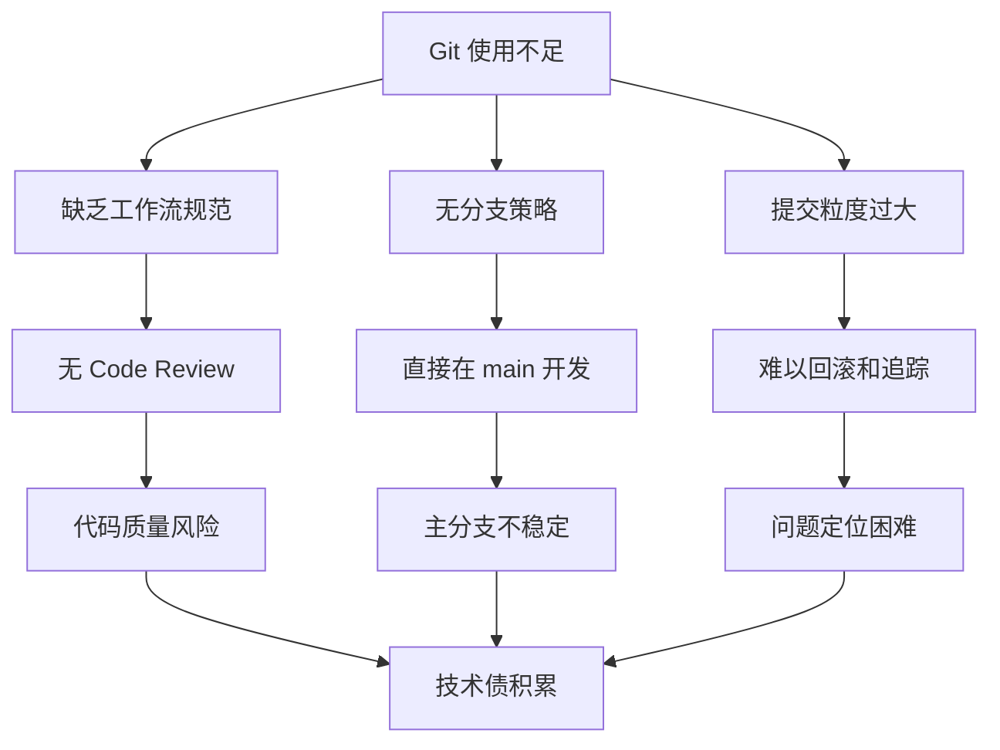
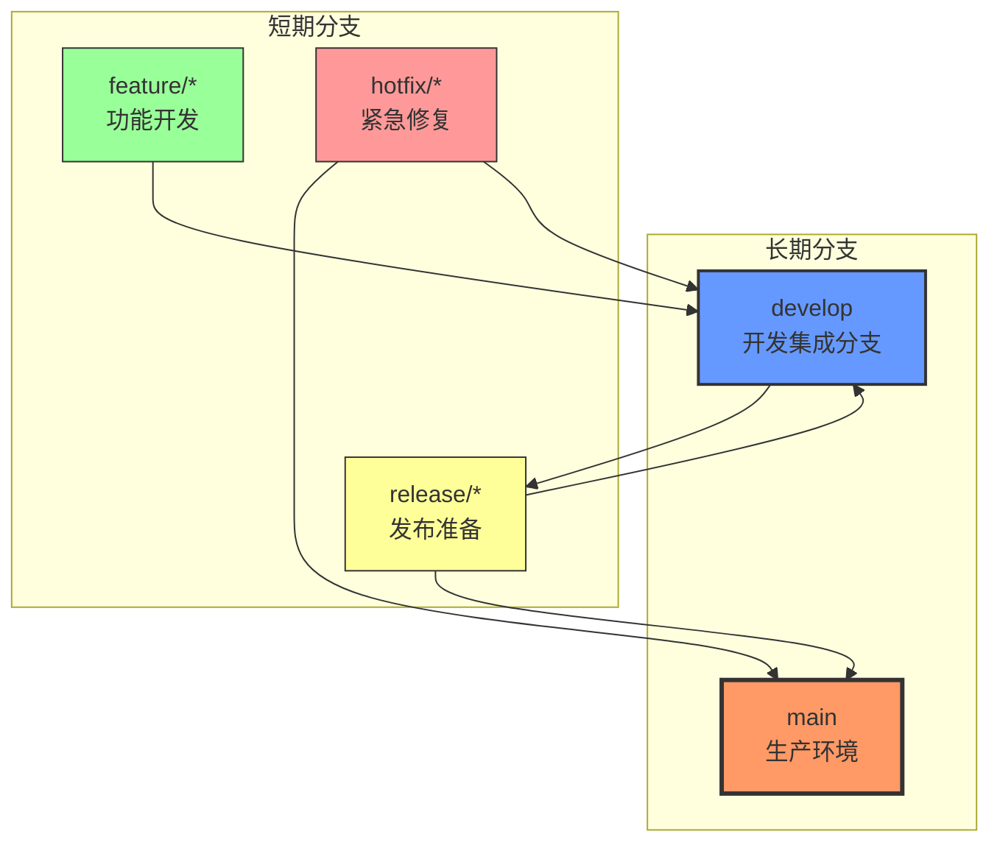
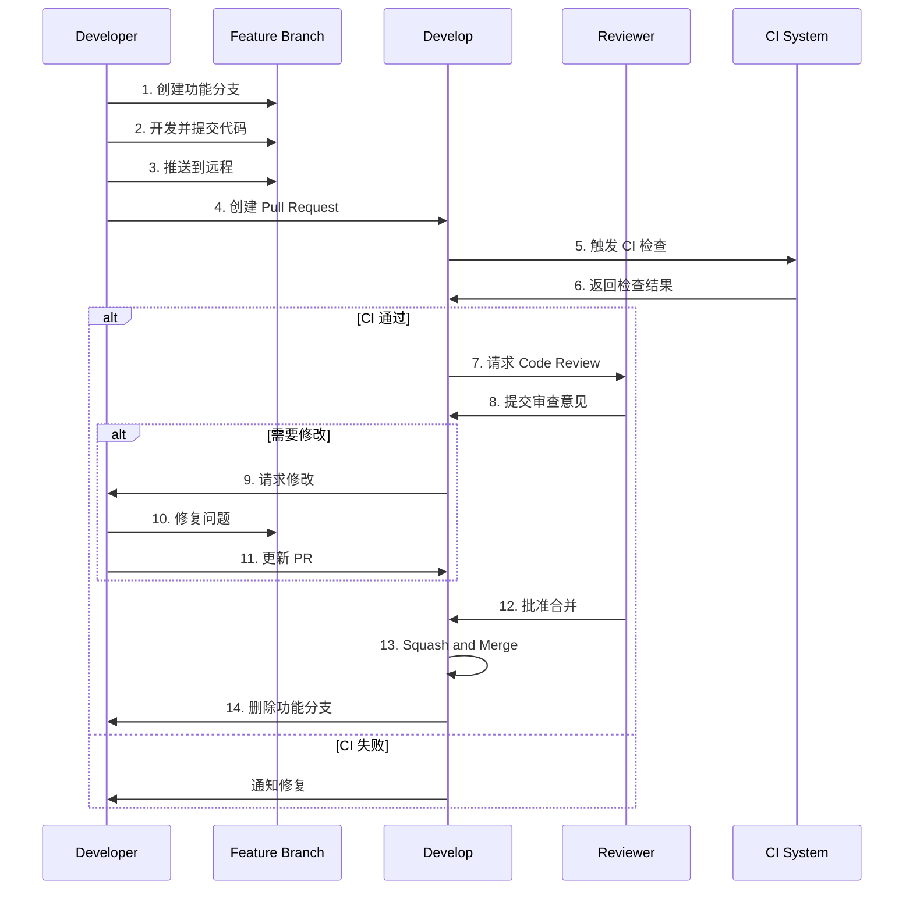
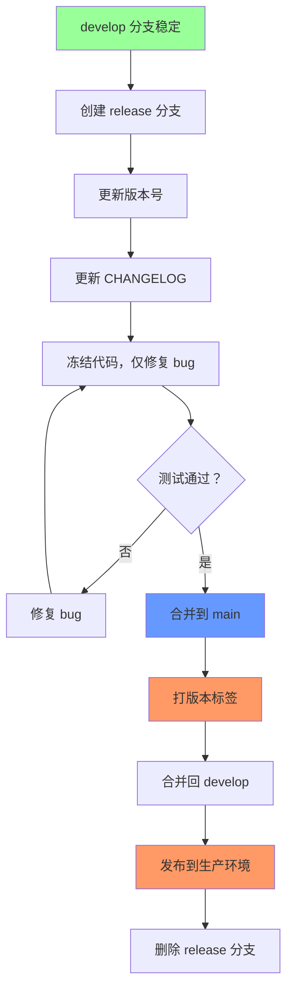

# Git 工作流规范

## 历史问题分析

### 当前状态

截至 2026-04-07，项目 Git 使用情况：

| 指标 | 当前值 | 目标值 | 状态 |
|------|--------|--------|------|
| 提交记录数 | 2 | 100+ | ❌ 严重不足 |
| 分支数量 | 1 (main) | 5+ | ❌ 无分支策略 |
| 提交消息规范 | 部分遵循 | 100% 遵循 | ⚠️ 需改进 |
| 版本标签 | 0 | 每个里程碑 | ❌ 缺失 |
| PR 流程 | 无 | 必须经过 | ❌ 缺失 |

### 问题根因



### 影响分析

| 问题 | 影响 | 严重度 |
|------|------|--------|
| 提交记录少 | 无法追溯变更历史，丢失开发上下文 | 🔴 高 |
| 无分支策略 | main 分支不稳定，无法并行开发 | 🔴 高 |
| 无 PR 流程 | 缺少代码审查，质量无法保障 | 🔴 高 |
| 无版本标签 | 无法回滚到稳定版本 | 🟡 中 |
| 提交粒度大 | 难以定位问题，无法选择性合并 | 🟡 中 |

## 分支策略

### 分支模型

采用改进的 Git Flow 模型，适配 AI Agent 开发场景：



### 分支类型定义

| 分支类型 | 命名规则 | 生命周期 | 用途 | 合并目标 |
|----------|----------|----------|------|----------|
| `main` | `main` | 永久 | 生产环境代码，始终稳定可发布 | - |
| `develop` | `develop` | 永久 | 开发集成分支，包含下一版本功能 | `main` (via release) |
| `feature` | `feat/<issue-id>-<desc>` | 短期 | 新功能开发 | `develop` |
| `release` | `release/v<version>` | 短期 | 发布准备，仅修复 bug | `main` + `develop` |
| `hotfix` | `fix/<issue-id>-<desc>` | 短期 | 生产环境紧急修复 | `main` + `develop` |

### 分支命名规范

```bash
# 功能分支
feat/mvp-1-agent-loop
feat/issue-42-memory-compression

# 发布分支
release/v0.1.0
release/v1.0.0-beta.1

# 热修复分支
fix/critical-auth-bypass
fix/issue-99-sql-injection
```

### 分支保护规则

| 分支 | 保护措施 | 合并要求 |
|------|----------|----------|
| `main` | 禁止直接推送，禁止 force push | 必须通过 PR，至少 1 人审核 |
| `develop` | 禁止 force push | 必须通过 PR，可自动合并 |
| `feature/*` | 无特殊保护 | 可自行合并到 develop |

## 提交消息规范

### Conventional Commits

采用 [Conventional Commits](https://www.conventionalcommits.org/) 规范：

```
<type>(<scope>): <description>

[optional body]

[optional footer(s)]
```

### 类型定义

| 类型 | 用途 | 示例 |
|------|------|------|
| `feat` | 新功能 | `feat(agent): add heartbeat engine for autonomous execution` |
| `fix` | Bug 修复 | `fix(memory): resolve context overflow in long conversations` |
| `refactor` | 重构（不改变功能） | `refactor(orchestrator): extract task scheduling logic` |
| `test` | 测试相关 | `test(agent): add unit tests for agent loop` |
| `docs` | 文档更新 | `docs(api): update OpenAPI specification` |
| `chore` | 构建/工具/依赖 | `chore(deps): upgrade anthropic SDK to 0.18.0` |
| `perf` | 性能优化 | `perf(memory): optimize vector search with indexing` |
| `style` | 代码格式（不影响逻辑） | `style: fix linting errors in agent module` |

### 作用域定义

| 作用域 | 模块 | 说明 |
|--------|------|------|
| `agent` | Agent Loop | 核心代理循环 |
| `memory` | Memory System | 记忆系统 |
| `orchestrator` | Orchestrator | 多代理编排 |
| `heartbeat` | Heartbeat Engine | 心跳引擎 |
| `permission` | Permission System | 权限系统 |
| `cli` | CLI Interface | 命令行界面 |
| `api` | API Layer | HTTP/WebSocket 接口 |
| `db` | Database | 数据库层 |
| `config` | Configuration | 配置管理 |
| `deps` | Dependencies | 依赖管理 |

### 提交消息模板

```bash
# 设置 Git 模板
git config commit.template .git/commit-template

# .git/commit-template 内容
# <type>(<scope>): <description>
#
# [optional body: explain WHY, not WHAT]
#
# [optional footer: BREAKING CHANGE: ... | Closes #...]
```

### 提交消息示例

```bash
# 好的提交消息
feat(agent): implement fork mechanism for parallel task execution

Add ability to fork agent instances for parallel execution of
independent tasks. Each fork maintains isolated context but shares
long-term memory.

Closes #42

# 带破坏性变更
refactor(api)!: change agent configuration schema

BREAKING CHANGE: AgentConfig now requires `model_settings` field
instead of individual model parameters. Migration guide:
- Replace `model: "claude-3-opus"` with `model_settings: {name: "claude-3-opus"}`
- Replace `max_tokens: 4096` with `model_settings: {max_tokens: 4096}`

# Bug 修复
fix(memory): prevent token budget overflow in context compaction

The compaction algorithm was not accounting for system prompts,
causing token budget to exceed limits in long conversations.

Fixes #89
```

### 提交粒度要求

| 场景 | 要求 | 示例 |
|------|------|------|
| 新功能 | 每个功能点一个提交 | 一个 API 端点、一个类、一个模块 |
| Bug 修复 | 每个独立修复一个提交 | 修复一个具体问题 |
| 重构 | 每个重构目标一个提交 | 提取一个函数、重命名一个模块 |
| 文档 | 按文档类型分组 | API 文档更新、README 更新 |

**禁止事项：**
- ❌ "WIP" 临时提交
- ❌ "fix"、"update" 等模糊描述
- ❌ 混合多个不相关变更
- ❌ 提交无法编译/测试失败的代码

## PR 与 Code Review 流程

### PR 工作流



### PR 模板

```markdown
## 变更类型
- [ ] feat: 新功能
- [ ] fix: Bug 修复
- [ ] refactor: 重构
- [ ] test: 测试
- [ ] docs: 文档
- [ ] chore: 构建/工具

## 变更描述
<!-- 简要描述本次变更的内容和原因 -->

## 相关 Issue
Closes #

## 测试计划
- [ ] 单元测试已通过
- [ ] 集成测试已通过
- [ ] 手动测试已完成

## 检查清单
- [ ] 代码遵循项目编码规范
- [ ] 已添加必要的文档和注释
- [ ] 无破坏性变更（或已在描述中说明）
- [ ] 提交消息符合 Conventional Commits 规范

## 截图（如适用）
<!-- UI 变更请提供截图 -->
```

### Code Review 标准

| 检查项 | 要求 | 严重度 |
|--------|------|--------|
| 功能正确性 | 实现符合需求描述 | 🔴 阻塞 |
| 测试覆盖 | 核心逻辑有单元测试 | 🔴 阻塞 |
| 代码规范 | 通过 Linter 检查 | 🔴 阻塞 |
| 类型安全 | 通过类型检查 | 🔴 阻塞 |
| 安全性 | 无安全漏洞 | 🔴 阻塞 |
| 性能 | 无明显性能问题 | 🟡 建议 |
| 可读性 | 代码清晰易懂 | 🟡 建议 |
| 文档 | 公开 API 有文档 | 🟡 建议 |

### Review 审核者职责

**必须审核：**
- 架构变更、数据库 Schema 变更
- 安全相关代码（认证、授权、加密）
- 性能关键路径
- 公共 API 接口

**可选审核：**
- 内部实现细节
- 测试用例
- 文档更新

### PR 合并策略

| 场景 | 合并方式 | 说明 |
|------|----------|------|
| 功能分支 → develop | Squash and Merge | 压缩为单个提交，保持历史清晰 |
| Release 分支 → main | Merge Commit | 保留完整发布历史 |
| Hotfix 分支 → main | Merge Commit | 保留紧急修复记录 |

## 版本发布流程

### 语义化版本

遵循 [Semantic Versioning 2.0.0](https://semver.org/)：

```
MAJOR.MINOR.PATCH[-PRERELEASE][+BUILD]

示例：
1.0.0           正式版本
1.1.0           新增功能，向后兼容
1.1.1           Bug 修复
2.0.0           破坏性变更
1.0.0-beta.1    预发布版本
1.0.0+build.123 包含构建元数据
```

### 版本号规则

| 变更类型 | 版本号变化 | 示例 |
|----------|------------|------|
| 破坏性变更 | MAJOR +1 | 1.0.0 → 2.0.0 |
| 新功能（向后兼容） | MINOR +1 | 1.0.0 → 1.1.0 |
| Bug 修复 | PATCH +1 | 1.0.0 → 1.0.1 |
| 预发布版本 | 添加后缀 | 1.0.0 → 1.0.0-beta.1 |

### 发布流程



### 发布检查清单

**发布前：**
- [ ] 所有测试通过（单元、集成、E2E）
- [ ] 文档已更新（API 文档、CHANGELOG）
- [ ] 版本号已更新（pyproject.toml、__init__.py）
- [ ] CHANGELOG 已更新（遵循 Keep a Changelog）
- [ ] 依赖版本已锁定（uv.lock）

**发布时：**
- [ ] 创建 Git Tag（`v<version>`）
- [ ] 构建 Docker 镜像（如适用）
- [ ] 发布到 PyPI（如适用）
- [ ] 创建 GitHub Release

**发布后：**
- [ ] 验证生产环境部署
- [ ] 监控错误日志
- [ ] 通知相关团队

### CHANGELOG 规范

遵循 [Keep a Changelog](https://keepachangelog.com/) 格式：

```markdown
# Changelog

## [Unreleased]

## [0.2.0] - 2026-04-15

### Added
- Heartbeat engine for autonomous execution
- Memory compression with multiple strategies

### Changed
- Improved agent loop performance by 30%

### Fixed
- Context overflow in long conversations (#89)

### Security
- Upgraded cryptography library to fix CVE-2026-XXXX

## [0.1.0] - 2026-04-01

### Added
- Initial MVP-1 implementation
- Basic agent loop with Claude SDK integration
```

### MVP 版本规划

| 版本 | 里程碑 | 发布时间 | 主要功能 |
|------|--------|----------|----------|
| v0.1.0 | MVP-1 | 2026-04-15 | 核心 Agent Loop |
| v0.2.0 | MVP-2 | 2026-05-06 | 记忆与持久化 |
| v0.3.0 | MVP-3 | 2026-05-20 | 自主运行 |
| v0.4.0 | MVP-4 | 2026-06-10 | 多 Agent 编排 |
| v0.5.0 | MVP-5 | 2026-06-24 | Skill 插件与生态 |
| v1.0.0 | 正式版 | 2026-07-01 | 生产就绪版本 |

## 改进建议

### 优先级排序

| 优先级 | 改进项 | 预期收益 | 实施成本 | 负责人 |
|--------|--------|----------|----------|--------|
| 🔴 P0 | 建立 Git 分支策略 | 防止 main 分支污染 | 低 | 立即 |
| 🔴 P0 | 强制 PR 流程 | 保障代码质量 | 低 | 立即 |
| 🔴 P0 | 配置分支保护规则 | 防止误操作 | 低 | 立即 |
| 🟡 P1 | 配置提交消息模板 | 规范提交格式 | 低 | 1 天 |
| 🟡 P1 | 设置 CI 检查 | 自动化质量保障 | 中 | 2 天 |
| 🟡 P1 | 编写 PR 模板 | 规范 PR 内容 | 低 | 1 天 |
| 🟢 P2 | 配置自动化发布 | 简化发布流程 | 中 | 3 天 |
| 🟢 P2 | 集成 CHANGELOG 生成 | 自动化文档 | 低 | 1 天 |
| 🟢 P2 | 配置 Git Hooks | 本地检查 | 低 | 1 天 |

### 立即行动项

**1. 配置分支保护（GitHub 设置）：**

```yaml
# .github/branch-protection.yml
branches:
  - name: main
    protection:
      required_pull_request_reviews:
        required_approving_review_count: 1
      required_status_checks:
        strict: true
        contexts:
          - test
          - lint
          - typecheck
      enforce_admins: true
      restrictions: null
```

**2. 创建提交消息模板：**

```bash
# 创建模板文件
cat > .git/commit-template << 'EOF'
# <type>(<scope>): <description>
#
# Types: feat|fix|refactor|test|docs|chore|perf|style
# Scopes: agent|memory|orchestrator|heartbeat|permission|cli|api|db|config
#
# [optional body: explain WHY, not WHAT]
#
# [optional footer: BREAKING CHANGE: ... | Closes #...]
EOF

# 配置 Git 使用模板
git config commit.template .git/commit-template
```

**3. 创建 PR 模板：**

```bash
mkdir -p .github
cat > .github/pull_request_template.md << 'EOF'
## 变更类型
- [ ] feat: 新功能
- [ ] fix: Bug 修复
- [ ] refactor: 重构
- [ ] test: 测试
- [ ] docs: 文档
- [ ] chore: 构建/工具

## 变更描述
<!-- 简要描述本次变更的内容和原因 -->

## 相关 Issue
Closes #

## 测试计划
- [ ] 单元测试已通过
- [ ] 集成测试已通过
- [ ] 手动测试已完成

## 检查清单
- [ ] 代码遵循项目编码规范
- [ ] 已添加必要的文档和注释
- [ ] 无破坏性变更（或已在描述中说明）
- [ ] 提交消息符合 Conventional Commits 规范
EOF
```

**4. 配置 Git Hooks（使用 pre-commit）：**

```yaml
# .pre-commit-config.yaml
repos:
  - repo: https://github.com/compilerla/conventional-pre-commit
    rev: v3.0.0
    hooks:
      - id: conventional-pre-commit
        stages: [commit-msg]

  - repo: https://github.com/astral-sh/ruff-pre-commit
    rev: v0.1.0
    hooks:
      - id: ruff
        args: [--fix]

  - repo: https://github.com/pre-commit/mirrors-mypy
    rev: v1.8.0
    hooks:
      - id: mypy
```

### 长期改进项

**1. 自动化发布流程：**

```yaml
# .github/workflows/release.yml
name: Release

on:
  push:
    tags:
      - 'v*'

jobs:
  release:
    runs-on: ubuntu-latest
    steps:
      - uses: actions/checkout@v4
      
      - name: Build
        run: |
          uv build
      
      - name: Publish to PyPI
        run: |
          uv publish --token ${{ secrets.PYPI_TOKEN }}
      
      - name: Create GitHub Release
        uses: softprops/action-gh-release@v1
        with:
          generate_release_notes: true
```

**2. CHANGELOG 自动生成：**

```bash
# 使用 git-cliff
# cliff.toml
[changelog]
header = """# Changelog\n\n"""
body = """
## [{{ version | trim_start_matches(pat="v") }}] - {{ timestamp | date(format="%Y-%m-%d") }}
## [Unreleased]


### {{ group | upper_first }}

- {{ commit.message | upper_first }}

\n
"""

[git]
conventional_commits = true
filter_unconventional = true
```

## 参考资源

- [Pro Git Book](https://git-scm.com/book/zh/v2)
- [Conventional Commits](https://www.conventionalcommits.org/)
- [Semantic Versioning](https://semver.org/)
- [Keep a Changelog](https://keepachangelog.com/)
- [Git Flow](https://nvie.com/posts/a-successful-git-branching-model/)
- [GitHub Flow](https://docs.github.com/en/get-started/quickstart/github-flow)
