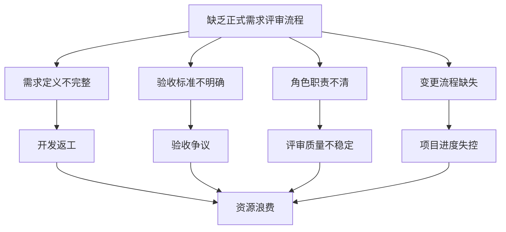
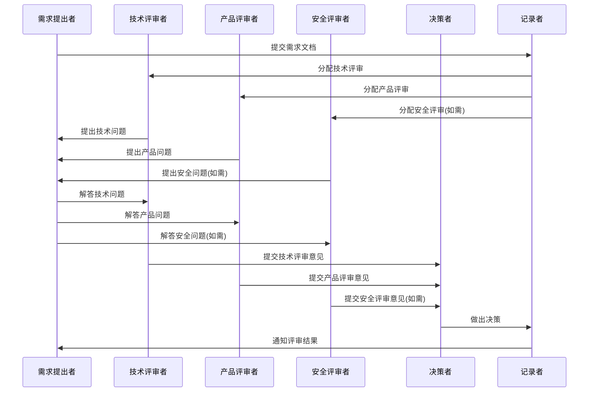
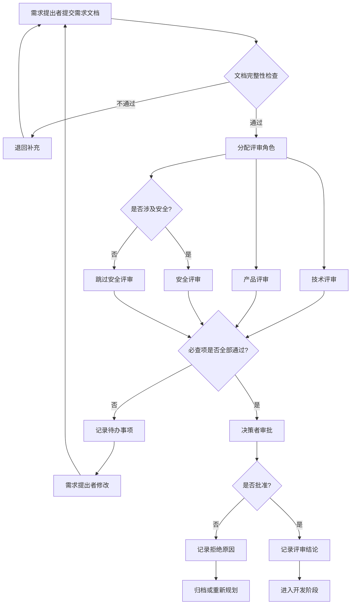
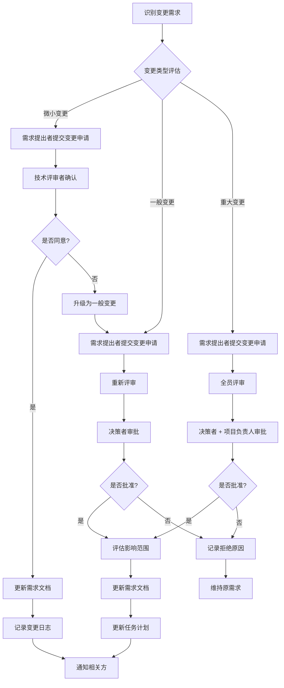

# 需求评审流程与模板

## 概述

本文档建立 SherryAgent 项目的需求评审流程，确保需求在进入开发前经过充分的分析、讨论和确认，避免因需求不清晰导致的返工和浪费。

## 当前缺失环节分析

### 问题现状

项目在 MVP-1 到 MVP-5 的开发过程中，缺乏正式的需求评审流程，存在以下问题：

| 问题类型 | 具体表现 | 影响 |
|---------|---------|------|
| 需求定义不完整 | 部分功能边界模糊，Non-Goals 定义不够清晰 | 开发过程中频繁调整范围 |
| 验收标准不明确 | Acceptance Criteria 缺乏可量化指标 | 无法客观判断任务完成度 |
| 角色职责不清 | 缺乏明确的需求提出者、评审者、决策者角色 | 评审过程随意，质量不稳定 |
| 变更流程缺失 | 需求变更缺乏正式流程和影响评估 | 变更失控，影响项目进度 |
| 文档模板不统一 | `.trae/specs/` 中的需求文档格式不完全一致 | 增加理解成本，降低协作效率 |

### 根因分析



### 改进目标

- 建立标准化的需求评审流程，确保所有需求在开发前经过充分评审
- 定义明确的角色职责，提高评审质量和效率
- 提供统一的需求文档模板，降低理解成本
- 建立需求变更流程，控制变更影响

## 需求评审参与角色

### 角色定义

| 角色 | 职责 | 权限 | 必须参与场景 |
|------|------|------|-------------|
| **需求提出者** | 提出需求、编写需求文档、回答评审问题 | 提出需求、修改需求 | 所有评审会议 |
| **技术评审者** | 评估技术可行性、识别技术风险、审核技术方案 | 技术否决权 | 涉及技术架构变更的需求 |
| **产品评审者** | 评估业务价值、优先级排序、审核用户体验 | 优先级决策权 | 涉及用户交互的需求 |
| **安全评审者** | 评估安全风险、审核权限设计、检查合规性 | 安全否决权 | 涉及数据操作、权限变更的需求 |
| **决策者** | 最终决策、资源分配、进度协调 | 最终批准权 | 所有评审会议 |
| **记录者** | 记录评审结论、待办事项、跟踪决议执行 | 无决策权 | 所有评审会议 |

### 角色分配原则

1. **一人可兼任多角色**，但技术评审者和决策者不能为同一人
2. **安全评审者**必须由熟悉项目安全规范的人担任
3. **记录者**可由任意参与者兼任，建议轮换以降低负担
4. **决策者**通常为项目负责人或架构师

### 角色协作流程



## 需求评审检查清单

### 必查项（Blocker）

以下检查项必须全部通过，否则需求不得进入开发阶段：

| 检查项 | 检查内容 | 负责角色 | 验证方式 |
|--------|---------|---------|---------|
| **目标清晰** | Goals 和 Non-Goals 明确，无歧义 | 产品评审者 | 文档审查 |
| **验收标准可量化** | Acceptance Criteria 包含可验证的指标 | 技术评审者 | 文档审查 |
| **技术方案可行** | 技术实现路径明确，无重大技术风险 | 技术评审者 | 技术评审会议 |
| **安全风险可控** | 无未识别的安全风险，权限设计合理 | 安全评审者 | 安全评审会议 |
| **依赖关系明确** | 外部依赖、前置任务已识别并确认 | 技术评审者 | 文档审查 |
| **资源需求合理** | 人力、时间估算在项目资源范围内 | 决策者 | 资源评估会议 |

### 建议项（Warning）

以下检查项建议通过，但可根据实际情况豁免：

| 检查项 | 检查内容 | 负责角色 | 豁免条件 |
|--------|---------|---------|---------|
| **用户故事完整** | 包含典型用户场景和使用流程 | 产品评审者 | 技术性需求 |
| **性能指标明确** | 包含响应时间、吞吐量等性能要求 | 技术评审者 | MVP 阶段可豁免 |
| **异常场景覆盖** | 包含错误处理和降级方案 | 技术评审者 | 简单需求可豁免 |
| **测试策略明确** | 包含测试范围和测试方法 | 技术评审者 | 后续补充 |
| **文档计划明确** | 包含用户文档和 API 文档计划 | 产品评审者 | 内部需求可豁免 |

### 评审流程



### 评审会议规范

#### 会议前准备

- 需求文档至少提前 24 小时提交
- 评审者提前阅读文档，准备问题
- 记录者准备评审记录模板

#### 会议流程

| 阶段 | 时长 | 内容 |
|------|------|------|
| 需求陈述 | 5-10 分钟 | 需求提出者陈述需求背景、目标、范围 |
| 技术评审 | 10-15 分钟 | 技术评审者提问，讨论技术方案 |
| 产品评审 | 5-10 分钟 | 产品评审者提问，讨论用户体验 |
| 安全评审 | 5-10 分钟 | 安全评审者提问，讨论安全风险（如需） |
| 决策讨论 | 5-10 分钟 | 决策者综合意见，做出决策 |
| 总结记录 | 5 分钟 | 记录者总结结论和待办事项 |

#### 会议后跟进

- 记录者在 24 小时内输出评审记录
- 待办事项录入任务跟踪系统
- 需求提出者按待办事项修改文档
- 修改后重新提交评审（如需）

## 需求文档模板

### 模板结构

```markdown
# <项目名称> - <需求名称> 产品需求文档

## Overview
- **Summary**: <一句话概述需求内容>
- **Purpose**: <需求的目的和价值>
- **Target Users**: <目标用户群体>

## Goals
- <目标 1>
- <目标 2>
- <目标 3>

## Non-Goals (Out of Scope)
- <不在范围内的内容 1>
- <不在范围内的内容 2>

## Background & Context
- <背景信息>
- <上下文说明>

## Functional Requirements
- **FR-1**: <功能需求 1>
- **FR-2**: <功能需求 2>

## Non-Functional Requirements
- **NFR-1**: <非功能需求 1>
- **NFR-2**: <非功能需求 2>

## Constraints
- **Technical**: <技术约束>
- **Business**: <业务约束>
- **Dependencies**: <依赖约束>

## Assumptions
- <假设 1>
- <假设 2>

## Acceptance Criteria

### AC-1: <验收标准标题>
- **Given**: <前置条件>
- **When**: <触发动作>
- **Then**: <预期结果>
- **Verification**: `programmatic` | `human-judgment` | `manual`

## Open Questions
- [ ] <待解决问题 1>
- [ ] <待解决问题 2>

## Risks & Mitigations
| 风险 | 影响 | 概率 | 缓解措施 |
|------|------|------|---------|
| <风险描述> | High/Medium/Low | High/Medium/Low | <缓解方案> |

## Dependencies
| 依赖项 | 类型 | 状态 | 负责人 |
|--------|------|------|--------|
| <依赖名称> | internal/external | pending/ready | <负责人> |
```

### 模板填写规范

| 字段 | 必填 | 说明 |
|------|------|------|
| Overview | ✅ | 必须包含 Summary、Purpose、Target Users |
| Goals | ✅ | 目标应具体、可衡量，避免模糊表述 |
| Non-Goals | ✅ | 明确边界，防止范围蔓延 |
| Background & Context | ⚠️ | 复杂需求必填，简单需求可省略 |
| Functional Requirements | ✅ | 每个需求应独立、原子化 |
| Non-Functional Requirements | ⚠️ | 涉及性能、安全的需求必填 |
| Constraints | ✅ | 必须列出技术、业务、依赖约束 |
| Assumptions | ⚠️ | 有假设时必填 |
| Acceptance Criteria | ✅ | 每个功能需求至少对应一个验收标准 |
| Open Questions | ⚠️ | 有未解决问题时必填 |
| Risks & Mitigations | ⚠️ | 高风险需求必填 |
| Dependencies | ⚠️ | 有外部依赖时必填 |

### 验收标准编写规范

#### Given-When-Then 格式

- **Given**: 描述前置条件（系统状态、用户状态）
- **When**: 描述触发动作（用户操作、系统事件）
- **Then**: 描述预期结果（系统响应、状态变更）
- **Verification**: 描述验证方式

#### 验证方式分类

| 验证方式 | 说明 | 适用场景 |
|---------|------|---------|
| `programmatic` | 自动化测试验证 | 功能逻辑、API 行为 |
| `human-judgment` | 人工评审验证 | 用户体验、界面设计 |
| `manual` | 手动测试验证 | 复杂交互、边界场景 |

#### 示例

```markdown
### AC-1: CLI启动与用户输入
- **Given**: 用户在终端启动SherryAgent
- **When**: 用户输入任务指令
- **Then**: Agent接收并解析用户输入，准备执行
- **Verification**: `programmatic`
```

## 需求变更流程

### 变更分类

| 变更类型 | 定义 | 审批流程 | 示例 |
|---------|------|---------|------|
| **微小变更** | 不影响 Goals、验收标准、技术方案 | 需求提出者 + 技术评审者确认 | 文案调整、参数微调 |
| **一般变更** | 影响 Non-Goals、功能细节、非功能需求 | 重新评审，决策者批准 | 新增功能点、性能要求调整 |
| **重大变更** | 影响 Goals、验收标准、技术架构 | 全员评审，决策者 + 项目负责人批准 | 核心功能调整、架构重构 |

### 变更流程



### 变更申请模板

```markdown
## 变更申请

### 基本信息
- **需求名称**: <需求名称>
- **变更类型**: 微小变更 | 一般变更 | 重大变更
- **申请人**: <申请人>
- **申请日期**: <YYYY-MM-DD>

### 变更内容
- **原需求**: <原需求描述>
- **变更后**: <变更后描述>
- **变更原因**: <变更原因>

### 影响评估
- **影响范围**: <影响的功能模块、任务、人员>
- **进度影响**: <预计延迟时间>
- **资源影响**: <额外资源需求>
- **风险评估**: <变更带来的风险>

### 审批记录
- **技术评审者**: <姓名> - <意见> - <日期>
- **产品评审者**: <姓名> - <意见> - <日期>
- **安全评审者**: <姓名> - <意见> - <日期>
- **决策者**: <姓名> - <意见> - <日期>
```

### 变更控制原则

1. **变更必须记录**：所有变更必须记录在需求文档和变更日志中
2. **影响必须评估**：变更前必须评估对进度、资源、风险的影响
3. **相关方必须通知**：变更批准后必须通知所有相关方
4. **文档必须同步**：变更批准后必须同步更新需求文档、任务计划、设计文档

## 评审记录模板

```markdown
## 需求评审记录

### 基本信息
- **需求名称**: <需求名称>
- **评审日期**: <YYYY-MM-DD>
- **评审方式**: 会议评审 | 异步评审
- **参与人员**: <姓名列表>

### 评审结论
- **结论**: 通过 | 有条件通过 | 不通过 | 待定
- **决策者**: <姓名>
- **决策理由**: <理由>

### 必查项检查结果
| 检查项 | 结果 | 备注 |
|--------|------|------|
| 目标清晰 | ✅/❌ | <备注> |
| 验收标准可量化 | ✅/❌ | <备注> |
| 技术方案可行 | ✅/❌ | <备注> |
| 安全风险可控 | ✅/❌ | <备注> |
| 依赖关系明确 | ✅/❌ | <备注> |
| 资源需求合理 | ✅/❌ | <备注> |

### 待办事项
| 事项 | 负责人 | 截止日期 | 状态 |
|------|--------|---------|------|
| <事项描述> | <姓名> | <YYYY-MM-DD> | pending/done |

### 遗留问题
- <问题 1>
- <问题 2>

### 下一步行动
- <行动 1>
- <行动 2>
```

## 工具与自动化

### 推荐工具

| 工具 | 用途 | 集成方式 |
|------|------|---------|
| GitHub Issues | 需求跟踪、任务管理 | 原生集成 |
| GitHub Projects | 看板管理、进度跟踪 | 原生集成 |
| Markdown 模板 | 需求文档编写 | `.trae/specs/` 目录 |
| Mermaid | 流程图、时序图绘制 | 文档内嵌 |

### 自动化检查

建议在 CI/CD 中集成以下自动化检查：

```yaml
# .github/workflows/requirement-review.yml
name: Requirement Review Check

on:
  pull_request:
    paths:
      - '.trae/specs/**'

jobs:
  check-requirement-doc:
    runs-on: ubuntu-latest
    steps:
      - uses: actions/checkout@v3
      
      - name: Check YAML frontmatter
        run: |
          # 检查需求文档是否包含必要的 frontmatter
          python scripts/check_requirement_frontmatter.py
          
      - name: Check acceptance criteria
        run: |
          # 检查验收标准是否符合 Given-When-Then 格式
          python scripts/check_acceptance_criteria.py
          
      - name: Check links
        run: |
          # 检查文档中的链接是否有效
          markdown-link-check .trae/specs/**/*.md
```

## 附录

### 评审检查清单速查表

#### 技术评审者检查清单

- [ ] 技术方案是否可行？
- [ ] 是否存在重大技术风险？
- [ ] 验收标准是否可量化？
- [ ] 依赖关系是否明确？
- [ ] 性能要求是否合理？
- [ ] 是否需要安全评审？

#### 产品评审者检查清单

- [ ] 目标是否清晰？
- [ ] 用户价值是否明确？
- [ ] 用户体验是否合理？
- [ ] 优先级是否合理？
- [ ] 是否与现有功能冲突？

#### 安全评审者检查清单

- [ ] 是否涉及敏感数据操作？
- [ ] 是否涉及权限变更？
- [ ] 是否存在安全风险？
- [ ] 权限设计是否合理？
- [ ] 是否符合安全规范？

### 常见问题 FAQ

**Q: 需求评审需要多长时间？**

A: 简单需求约 30 分钟，中等复杂度需求约 1 小时，复杂需求可能需要多次评审。

**Q: 评审不通过怎么办？**

A: 根据待办事项修改需求文档，解决遗留问题后重新提交评审。

**Q: 可以跳过评审直接开发吗？**

A: 不可以。所有需求必须经过评审，确保质量可控。

**Q: 需求变更太频繁怎么办？**

A: 在需求评审阶段投入更多时间，确保需求充分讨论后再进入开发。

### 参考资料

- [设计目标与原则](../standard/design-principles.md)
- [MVP 实现路线图](../plans/mvp-roadmap.md)
- [编码标准](../standard/coding-standards.md)
- [测试运行指南](testing-guide.md)
