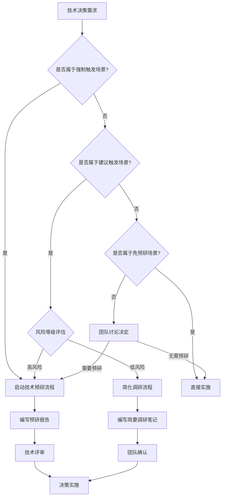
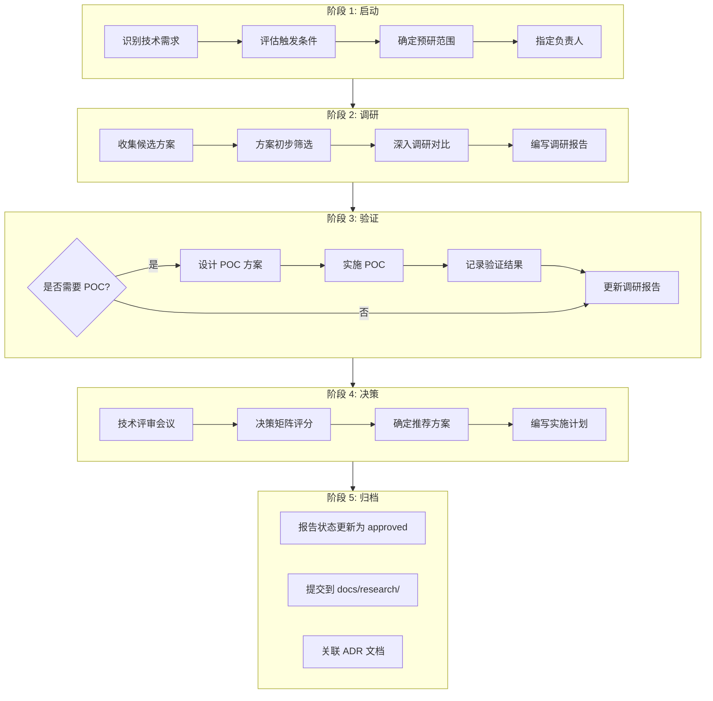
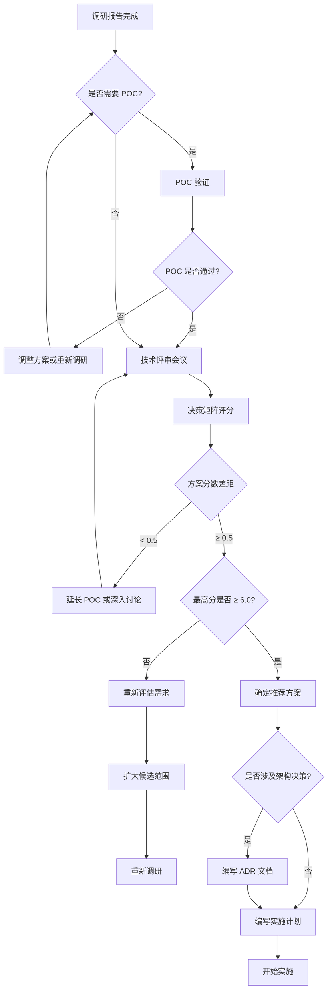
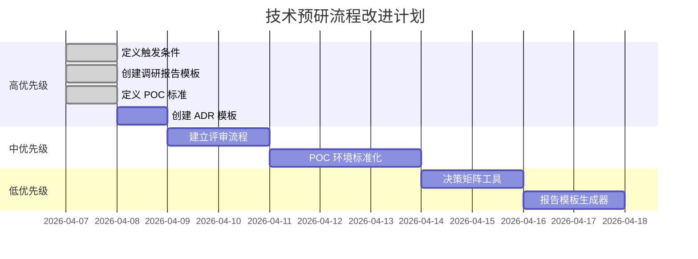

# 技术预研流程指南

本文档定义 SherryAgent 项目的技术预研流程、触发条件、决策标准和 POC 验证规范，确保技术选型科学、可追溯、风险可控。

## 1. 概述

### 1.1 技术预研定义

技术预研是在正式开发前，对新技术、新方案、新架构进行系统性调研和验证的过程，目标是降低技术风险、确保方案可行性。

### 1.2 核心原则

| 原则 | 说明 |
|------|------|
| **问题驱动** | 预研必须解决明确的技术问题，禁止"为预研而预研" |
| **数据支撑** | 决策必须基于量化数据，避免主观判断 |
| **风险优先** | 高风险技术决策必须经过 POC 验证 |
| **文档留存** | 所有预研过程和结论必须文档化，便于追溯 |

## 2. 技术预研触发条件

### 2.1 强制触发场景

以下场景**必须**启动技术预研流程：

| 触发场景 | 判断标准 | 预研重点 |
|----------|----------|----------|
| **引入核心依赖** | 新增生产环境核心依赖库/框架 | 功能完整性、性能、安全性、社区活跃度 |
| **架构方案变更** | 影响系统架构的重大变更 | 可行性、迁移成本、风险评估 |
| **性能优化方案** | 性能提升目标 > 30% | 性能基准、优化空间、副作用 |
| **安全方案选型** | 认证、授权、加密等安全相关 | 安全性、合规性、易用性 |
| **技术栈升级** | 主版本升级（如 Python 3.11 → 3.12） | 兼容性、迁移成本、收益评估 |
| **自研 vs 外购决策** | 核心功能实现方式选择 | 成本对比、维护成本、可控性 |

### 2.2 建议触发场景

以下场景**建议**启动技术预研流程：

| 触发场景 | 判断标准 | 预研重点 |
|----------|----------|----------|
| **引入辅助工具** | 新增开发/测试/运维工具 | 效率提升、学习成本、集成难度 |
| **数据库选型** | 新增数据存储方案 | 数据模型、查询性能、扩展性 |
| **第三方服务集成** | 接入外部 API 或 SaaS 服务 | 稳定性、成本、SLA |
| **跨平台方案** | 需要支持多平台/多环境 | 兼容性、维护成本 |

### 2.3 免预研场景

以下场景**无需**启动技术预研流程：

- Bug 修复（不涉及架构变更）
- 配置调整（不引入新依赖）
- 文档更新
- 测试用例补充
- 代码重构（不改变外部接口）

### 2.4 触发决策流程



## 3. 技术预研流程

### 3.1 完整流程



### 3.2 阶段详细说明

#### 阶段 1: 启动（1-2 天）

**输入**：技术需求描述

**活动**：
1. 明确问题陈述（一句话描述核心问题）
2. 确定调研目标（功能、性能、质量目标）
3. 划定调研范围（包含/排除范围）
4. 指定预研负责人

**输出**：预研任务卡片（包含上述信息）

**负责人职责**：
- 主导调研过程
- 编写调研报告
- 组织技术评审
- 跟进实施落地

#### 阶段 2: 调研（3-7 天）

**输入**：预研任务卡片

**活动**：
1. 收集候选方案（至少 3 个，包括"不作为"选项）
2. 初步筛选（排除明显不合适的方案）
3. 深入调研（功能、性能、成本、风险）
4. 编写调研报告（使用标准模板）

**输出**：调研报告初稿

**调研方法**：
| 方法 | 适用场景 | 时间投入 |
|------|----------|----------|
| 官方文档阅读 | 所有调研 | 2-4 小时 |
| 社区讨论调研 | 开源项目 | 1-2 小时 |
| 性能基准测试 | 性能敏感场景 | 4-8 小时 |
| 原型验证 | 高风险方案 | 1-3 天 |
| 专家咨询 | 复杂技术领域 | 1-2 小时 |

#### 阶段 3: 验证（视需要）

**POC 触发条件**：
- 方案涉及核心技术架构变更
- 性能要求严格（响应时间 < 100ms 或吞吐量 > 10000 QPS）
- 存在重大技术风险或不确定性
- 多方案性能接近，需要实测数据支撑决策

**POC 设计原则**：
1. **最小化范围**：仅验证核心假设，避免过度开发
2. **可量化指标**：明确定义通过/失败标准
3. **环境隔离**：使用独立的测试环境，不影响生产
4. **结果可复现**：记录所有配置和步骤

#### 阶段 4: 决策（1-2 天）

**输入**：调研报告（含 POC 结果）

**活动**：
1. 召开技术评审会议（至少 2 人参与）
2. 使用决策矩阵评分
3. 确定推荐方案
4. 编写实施计划

**输出**：
- 决策记录（会议纪要）
- 实施计划（时间表、里程碑）

**决策矩阵示例**：

| 评估维度 | 权重 | 方案 A | 方案 B | 方案 C |
|----------|------|--------|--------|--------|
| 功能完整性 | 30% | 8/10 | 9/10 | 7/10 |
| 性能表现 | 25% | 9/10 | 7/10 | 8/10 |
| 易用性 | 15% | 7/10 | 8/10 | 9/10 |
| 社区/生态 | 10% | 9/10 | 6/10 | 5/10 |
| 成本效益 | 10% | 8/10 | 7/10 | 9/10 |
| 风险可控性 | 10% | 7/10 | 8/10 | 6/10 |
| **加权总分** | **100%** | **8.1** | **7.7** | **7.3** |

**决策规则**：
- 最高分方案为推荐方案
- 分数差距 < 0.5 时，需进一步讨论或延长 POC
- 所有方案分数 < 6.0 时，重新评估需求或扩大候选范围

#### 阶段 5: 归档（1 天内）

**活动**：
1. 更新报告状态为 `approved`
2. 提交到 `docs/research/` 目录
3. 如涉及架构决策，编写 ADR 文档
4. 更新相关技术文档

**命名规范**：
- 调研报告：`YYYY-MM-DD-<topic>-research.md`
- ADR 文档：`adr-<number>-<topic>.md`

## 4. 技术预研报告结构

### 4.1 标准结构

技术预研报告应遵循 [research-template.md](../standard/research-template.md) 定义的结构：

```
1. 调研背景
   - 问题陈述
   - 调研目标
   - 调研范围
2. 候选方案
   - 方案列表
   - 方案详细说明
3. 方案对比
   - 功能对比矩阵
   - 性能对比
   - 成本对比
   - 综合评分
4. POC 验证结果（如适用）
   - POC 设计
   - POC 结果
5. 结论与建议
   - 推荐方案
   - 实施建议
   - 风险缓解计划
6. 参考资料
```

### 4.2 简化结构

对于低风险、小范围的调研，可使用简化结构：

```markdown
---
title: "调研主题"
status: draft | approved
created: YYYY-MM-DD
updated: YYYY-MM-DD
---

## 问题背景
[一句话描述问题]

## 候选方案
| 方案 | 优势 | 劣势 | 推荐度 |
|------|------|------|--------|
| A | ... | ... | ⭐⭐⭐ |
| B | ... | ... | ⭐⭐ |

## 推荐方案
方案 A，理由：...

## 参考资料
- [链接 1]
- [链接 2]
```

## 5. POC 验证标准

### 5.1 POC 设计标准

| 标准项 | 要求 | 检查方式 |
|--------|------|----------|
| **目标明确** | 定义 1-3 个核心验证目标 | 文档审查 |
| **指标量化** | 每个目标有明确的通过标准 | 文档审查 |
| **环境隔离** | 使用独立测试环境 | 环境检查 |
| **范围最小** | 仅实现验证所需功能 | 代码审查 |
| **可复现** | 记录所有配置和步骤 | 文档审查 |

### 5.2 POC 实施标准

| 标准项 | 要求 | 检查方式 |
|--------|------|----------|
| **数据真实** | 使用真实或接近真实的数据规模 | 数据检查 |
| **负载模拟** | 模拟真实负载模式 | 负载脚本审查 |
| **多次测试** | 至少运行 3 次取平均值 | 测试记录 |
| **异常测试** | 包含异常场景测试 | 测试用例审查 |
| **结果记录** | 详细记录测试数据和现象 | 文档审查 |

### 5.3 POC 验收标准

**通过标准**：
- ✅ 所有核心验证目标达成
- ✅ 性能指标满足预期（误差 < 10%）
- ✅ 无严重缺陷或风险
- ✅ 结果可复现

**失败处理**：
- ❌ 核心目标未达成 → 分析原因，调整方案或重新调研
- ⚠️ 部分目标达成 → 评估影响，决定是否接受或优化

### 5.4 POC 报告模板

```markdown
## POC 验证报告

### 验证目标
| 目标编号 | 验证项 | 通过标准 |
|----------|--------|----------|
| G1 | [验证项] | [标准] |

### 测试环境
| 环境项 | 配置 |
|--------|------|
| 硬件 | ... |
| 软件 | ... |
| 数据规模 | ... |

### 测试结果
| 目标 | 预期 | 实际 | 通过 | 备注 |
|------|------|------|------|------|
| G1 | ... | ... | ✅/❌ | ... |

### 关键发现
1. [发现 1]
2. [发现 2]

### 结论
[POC 是否通过，是否推荐该方案]
```

## 6. 技术选型决策流程

### 6.1 决策流程图



### 6.2 决策矩阵权重指南

| 场景类型 | 功能 | 性能 | 易用性 | 社区 | 成本 | 风险 |
|----------|------|------|--------|------|------|------|
| **核心架构** | 30% | 25% | 10% | 15% | 5% | 15% |
| **性能优化** | 20% | 40% | 15% | 5% | 10% | 10% |
| **安全方案** | 25% | 15% | 10% | 10% | 10% | 30% |
| **工具选型** | 25% | 15% | 30% | 15% | 10% | 5% |
| **数据库** | 30% | 30% | 10% | 10% | 10% | 10% |

### 6.3 评分标准

| 分数 | 含义 | 说明 |
|------|------|------|
| 9-10 | 优秀 | 完全满足需求，有额外优势 |
| 7-8 | 良好 | 满足核心需求，小缺陷可接受 |
| 5-6 | 及格 | 基本满足需求，有明显不足 |
| 3-4 | 较差 | 部分满足需求，缺陷明显 |
| 1-2 | 很差 | 无法满足核心需求 |

### 6.4 决策会议规范

**参与人员**：
- 预研负责人（必须）
- 技术负责人（必须）
- 相关领域专家（建议）
- 项目经理（可选）

**会议议程**：
1. 预研负责人汇报调研报告（15-20 分钟）
2. 参会人员提问和讨论（15-30 分钟）
3. 独立评分（5 分钟）
4. 统计分数并讨论差异（10-15 分钟）
5. 确定推荐方案和实施计划（10 分钟）

**会议输出**：
- 决策记录（包含评分表、讨论要点、最终决策）
- 实施计划（时间表、责任人、里程碑）

## 7. 当前缺失环节分析

### 7.1 流程缺失

| 缺失环节 | 影响 | 优先级 | 建议措施 |
|----------|------|--------|----------|
| **无预研触发机制** | 技术决策随意性强，风险不可控 | 高 | 本文档定义触发条件 |
| **无决策记录留存** | 决策依据无法追溯，重复调研 | 高 | 强制使用调研报告模板 |
| **无 POC 标准** | 验证不充分，上线后问题频发 | 高 | 本文档定义 POC 标准 |
| **无评审流程** | 决策质量依赖个人经验 | 中 | 定义技术评审会议规范 |
| **无权重指南** | 评分主观性强，结果有偏差 | 中 | 提供场景化权重建议 |

### 7.2 文档缺失

| 缺失文档 | 影响 | 优先级 | 建议措施 |
|----------|------|--------|----------|
| **调研报告模板** | 报告格式不统一，关键信息遗漏 | 高 | 已创建 `research-template.md` |
| **ADR 模板** | 架构决策无规范记录 | 高 | 创建 `adr-template.md` |
| **POC 指南** | POC 实施不规范 | 中 | 本文档包含 POC 标准 |
| **决策矩阵工具** | 评分计算易出错 | 低 | 提供电子表格模板 |

### 7.3 工具缺失

| 缺失工具 | 影响 | 优先级 | 建议措施 |
|----------|------|--------|----------|
| **决策矩阵计算器** | 手动计算易出错 | 低 | 提供 Excel/Google Sheets 模板 |
| **POC 环境管理** | 测试环境搭建耗时 | 中 | 使用 Docker Compose 标准化 |
| **报告模板生成器** | 手动创建报告繁琐 | 低 | 提供 CLI 命令生成模板 |

### 7.4 改进路线图



## 8. 实施检查清单

### 8.1 预研启动检查

- [ ] 明确问题陈述（一句话）
- [ ] 确定调研目标（功能/性能/质量）
- [ ] 划定调研范围（包含/排除）
- [ ] 指定预研负责人
- [ ] 评估是否需要 POC

### 8.2 调研报告检查

- [ ] 候选方案 ≥ 3 个（含"不作为"选项）
- [ ] 功能对比矩阵完整
- [ ] 性能数据有来源
- [ ] 成本分析有依据
- [ ] 风险评估有缓解措施
- [ ] 参考资料可追溯

### 8.3 POC 检查（如适用）

- [ ] 验证目标明确且量化
- [ ] 测试环境隔离
- [ ] 测试数据真实
- [ ] 测试结果可复现
- [ ] 异常场景覆盖
- [ ] 结果详细记录

### 8.4 决策会议检查

- [ ] 参与人员齐全
- [ ] 评分独立进行
- [ ] 分数差异已讨论
- [ ] 决策有数据支撑
- [ ] 实施计划明确

### 8.5 归档检查

- [ ] 报告状态更新为 `approved`
- [ ] 提交到 `docs/research/`
- [ ] ADR 文档已创建（如适用）
- [ ] 相关文档已更新

## 9. 常见问题

### Q1: 预研时间有限，如何简化流程？

**A**: 根据风险等级调整流程深度：
- 高风险：完整流程 + POC
- 中风险：完整流程（可省略 POC）
- 低风险：简化调研 + 团队确认

### Q2: 候选方案太多，如何筛选？

**A**: 两阶段筛选：
1. 初筛：基于硬性条件（如许可证、兼容性）快速排除
2. 深入：保留 3-5 个候选方案详细对比

### Q3: POC 验证失败怎么办？

**A**: 分析失败原因：
- 方案本身问题 → 排除该方案，继续评估其他方案
- 理解偏差 → 调整验证目标，重新设计 POC
- 环境问题 → 修复环境，重新测试

### Q4: 决策矩阵分数接近，如何决策？

**A**: 差距 < 0.5 时：
1. 检查是否有遗漏的评估维度
2. 延长 POC 获取更多数据
3. 团队投票或专家裁决
4. 选择风险更低的方案

### Q5: 如何避免"为了预研而预研"？

**A**: 遵循问题驱动原则：
- 每个预研必须解决明确的技术问题
- 问题陈述必须清晰（一句话描述）
- 无明确问题的预研申请应被拒绝

## 10. 参考资料

### 10.1 内部文档

| 文档名称 | 路径 | 说明 |
|----------|------|------|
| 技术调研报告模板 | [research-template.md](../standard/research-template.md) | 标准调研报告格式 |
| 命名规范 | [naming-conventions.md](../standard/naming-conventions.md) | 文件命名规范 |
| 设计原则 | [design-principles.md](../standard/design-principles.md) | 技术决策原则 |

### 10.2 外部参考

| 资源名称 | 链接 | 说明 |
|----------|------|------|
| ADR 指南 | https://adr.github.io/ | 架构决策记录最佳实践 |
| 技术雷达 | https://www.thoughtworks.com/radar | 技术趋势参考 |
| 技术选型框架 | https://www.industrialempathy.com/posts/tech-choice-framework/ | 选型决策框架 |

---

**文档版本**: v1.0  
**最后更新**: 2026-04-07  
**维护者**: SherryAgent Team
