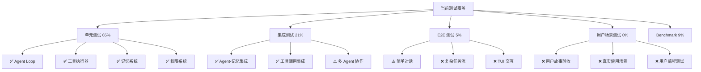
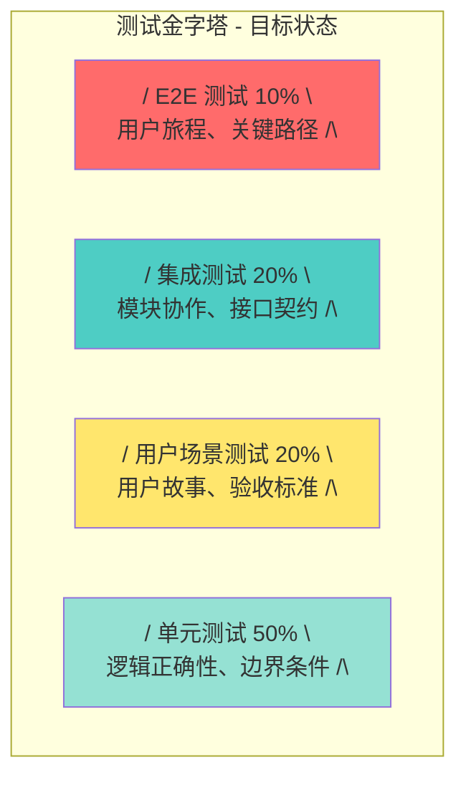
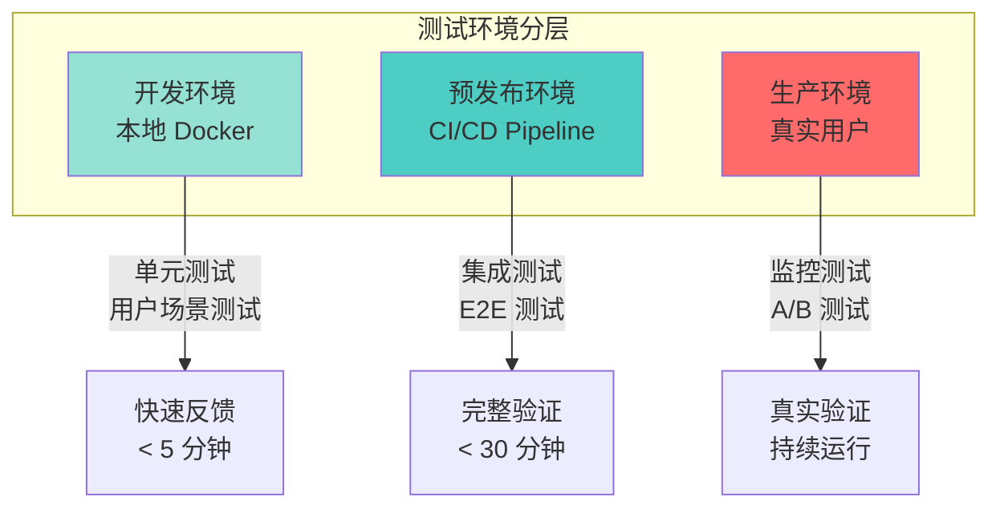

# SherryAgent 测试策略

## 概述

本文档定义 SherryAgent 项目的完整测试体系，包括测试金字塔比例、覆盖要求、环境管理规范以及改进优先级。当前项目存在**用户场景测试缺失**的核心问题，本策略将系统性解决此问题。

## 当前测试覆盖分析

### 测试类型分布

| 测试类型 | 文件数 | 测试函数数 | 占比 | 状态 |
|---------|--------|-----------|------|------|
| 单元测试 | 30+ | ~250 | 65% | ✅ 覆盖较好 |
| 集成测试 | 12 | ~80 | 21% | ⚠️ 需加强 |
| E2E 测试 | 3 | ~20 | 5% | ❌ 严重不足 |
| 用户场景测试 | 0 | 0 | 0% | ❌ **完全缺失** |
| Benchmark 测试 | 4 | ~35 | 9% | ✅ GAIA 基准已建立 |

### 覆盖率现状



### 核心问题：用户场景测试缺失

当前测试体系存在**结构性缺陷**：

| 问题类型 | 具体表现 | 影响 |
|---------|---------|------|
| **技术导向过重** | 测试关注 API 正确性，而非用户价值 | 功能正确但用户体验差 |
| **缺少用户故事** | 无验收标准验证 | 无法确认需求是否满足 |
| **缺少真实场景** | Mock 数据无法暴露真实问题 | 生产环境问题频发 |
| **缺少用户旅程** | 未测试端到端用户流程 | 用户无法完成核心任务 |

**示例对比**：

| 当前测试 | 缺失的用户场景测试 |
|---------|------------------|
| ✅ `test_agent_loop_basic` - 验证 Agent Loop 返回正确事件 | ❌ 用户发起对话 → Agent 理解意图 → 执行任务 → 返回结果 |
| ✅ `test_read_file_tool` - 验证文件读取工具返回内容 | ❌ 用户请求分析代码 → Agent 读取文件 → 理解代码结构 → 生成分析报告 |
| ✅ `test_permission_checker` - 验证权限检查逻辑 | ❌ 用户尝试危险操作 → Agent 拒绝并解释原因 → 用户理解限制 |

## 测试金字塔

### 目标比例



### 各层职责与要求

| 层级 | 比例 | 职责 | 覆盖要求 | 执行频率 |
|------|------|------|---------|---------|
| **单元测试** | 50% | 验证单个函数/类的逻辑正确性 | 核心逻辑 ≥ 80%<br/>工具函数 ≥ 90%<br/>安全模块 100% | 每次提交 |
| **用户场景测试** | 20% | 验证用户故事和验收标准 | 覆盖所有用户故事<br/>覆盖核心用户旅程 | 每次提交 |
| **集成测试** | 20% | 验证模块间协作和接口契约 | 覆盖关键集成点<br/>覆盖跨模块流程 | 每日构建 |
| **E2E 测试** | 10% | 验证端到端用户流程 | 覆盖关键用户路径<br/>覆盖高风险场景 | 每次发布 |

## 用户场景测试体系

### 用户故事验收测试

**定义**：基于用户故事编写的端到端验收测试，验证功能是否满足用户需求。

**结构模板**：

```python
@pytest.mark.user_scenario
@pytest.mark.asyncio
async def test_user_story_code_analysis():
    """
    用户故事：作为开发者，我希望 Agent 能分析代码并生成报告
    
    验收标准：
    1. 用户可以指定要分析的文件或目录
    2. Agent 能读取并理解代码结构
    3. Agent 能生成结构化的分析报告
    4. 报告包含代码质量、复杂度、依赖关系等信息
    """
    # Given: 准备测试环境和数据
    agent = await create_test_agent()
    test_code_dir = create_test_codebase()
    
    # When: 用户发起请求
    user_request = f"请分析 {test_code_dir} 目录下的代码"
    response = await agent.run(user_request)
    
    # Then: 验证验收标准
    assert response.status == "success"
    assert "代码结构" in response.content
    assert "代码质量" in response.content
    assert "依赖关系" in response.content
```

### 用户旅程测试

**定义**：测试用户完成核心任务的完整流程，包括多个步骤和决策点。

**示例场景**：

| 用户旅程 | 步骤数 | 关键决策点 | 优先级 |
|---------|--------|-----------|--------|
| 首次使用引导 | 5 | 配置 LLM、选择模式 | P0 |
| 代码重构任务 | 8 | 理解需求、分析代码、生成方案、执行重构、验证结果 | P0 |
| 多文件协作任务 | 10 | 任务分解、Agent 协作、结果合并 | P1 |
| 自主运行监控 | 6 | 设置心跳、配置任务、监控状态、处理异常 | P1 |
| 插件开发流程 | 7 | 创建插件、编写逻辑、测试验证、发布 | P2 |

**实现示例**：

```python
@pytest.mark.user_journey
@pytest.mark.asyncio
async def test_user_journey_code_refactoring():
    """
    用户旅程：开发者使用 Agent 完成代码重构
    
    步骤：
    1. 用户发起重构请求
    2. Agent 理解重构目标
    3. Agent 分析现有代码
    4. Agent 生成重构方案
    5. 用户确认方案
    6. Agent 执行重构
    7. Agent 运行测试验证
    8. Agent 生成重构报告
    """
    agent = await create_test_agent()
    
    # Step 1-2: 用户发起请求，Agent 理解目标
    response = await agent.run("将 utils.py 中的重复代码提取为公共函数")
    assert "重构方案" in response.content
    
    # Step 3-4: Agent 分析并生成方案
    assert response.metadata.get("analysis_complete") is True
    assert len(response.metadata.get("refactor_plan", [])) > 0
    
    # Step 5: 用户确认
    confirmation = await agent.run("确认执行重构方案")
    assert "执行中" in confirmation.content
    
    # Step 6-7: 执行并验证
    final_response = await agent.wait_for_completion()
    assert final_response.metadata.get("tests_passed") is True
    
    # Step 8: 生成报告
    assert "重构报告" in final_response.content
```

### 真实场景测试

**定义**：使用真实数据和真实环境进行的测试，而非 Mock 数据。

**实施策略**：

| 场景类型 | 数据来源 | 环境要求 | 执行频率 |
|---------|---------|---------|---------|
| 真实代码库分析 | 开源项目代码 | 隔离的测试仓库 | 每周 |
| 真实 LLM 调用 | OpenAI/Claude API | API 密钥配置 | 每日 |
| 真实文件操作 | 测试文件系统 | Docker 容器 | 每次提交 |
| 真实网络请求 | 测试 API 服务器 | Mock 服务器 | 每次提交 |

**实现示例**：

```python
@pytest.mark.real_scenario
@pytest.mark.slow
@pytest.mark.asyncio
async def test_real_codebase_analysis():
    """
    真实场景：分析真实的开源项目代码库
    """
    # 使用真实的开源项目代码
    real_repo = clone_test_repository("https://github.com/example/project")
    
    agent = await create_test_agent_with_real_llm()
    response = await agent.run(f"分析 {real_repo} 的架构并生成文档")
    
    # 验证生成的文档质量
    assert os.path.exists(f"{real_repo}/ARCHITECTURE.md")
    assert "模块结构" in read_file(f"{real_repo}/ARCHITECTURE.md")
```

## 测试环境管理规范

### 环境分层



### 环境配置矩阵

| 环境变量 | 开发环境 | CI 环境 | 预发布环境 | 生产环境 |
|---------|---------|---------|-----------|---------|
| `LLM_PROVIDER` | mock | mock + ollama | openai/claude | openai/claude |
| `DATABASE_URL` | sqlite:///:memory: | sqlite:///test.db | postgresql://test | postgresql://prod |
| `PERMISSION_MODE` | permissive | strict | strict | strict |
| `LOG_LEVEL` | DEBUG | INFO | WARN | ERROR |
| `ENABLE_MONITORING` | false | true | true | true |
| `TEST_DATA_SOURCE` | synthetic | synthetic | real | real |

### 测试数据管理

#### 数据生成策略

| 数据类型 | 生成方式 | 管理位置 | 更新频率 |
|---------|---------|---------|---------|
| 合成数据 | Factory Pattern | `tests/fixtures/factories/` | 按需更新 |
| 真实数据快照 | 数据库快照 | `tests/fixtures/snapshots/` | 每月更新 |
| 用户行为数据 | 录制回放 | `tests/fixtures/recordings/` | 按需更新 |
| 边界数据 | 手工编写 | `tests/fixtures/edge_cases/` | 按需更新 |

#### 数据工厂示例

```python
# tests/fixtures/factories/agent_factory.py
from factory import Factory, Faker, SubFactory
from sherry_agent.models.config import AgentConfig

class AgentConfigFactory(Factory):
    class Meta:
        model = AgentConfig
    
    model = Faker("word", ext_word_list=["gpt-4", "claude-3", "qwen3:0.6b"])
    max_tool_rounds = Faker("random_int", min=1, max=10)
    token_budget = Faker("random_int", min=1000, max=100000)
    
    @classmethod
    def for_code_analysis(cls):
        return cls(
            model="claude-3",
            max_tool_rounds=20,
            token_budget=50000,
            tools=["read_file", "write_file", "exec_command"]
        )
```

### 隔离策略

| 隔离维度 | 实现方式 | 工具/技术 |
|---------|---------|----------|
| 文件系统 | 临时目录 + 清理 | `pytest-tmp` / `tempfile` |
| 数据库 | 独立数据库 + 事务回滚 | `pytest-asyncio` + `aiosqlite` |
| 网络 | Mock 服务器 | `aioresponses` / `responses` |
| LLM | Mock 客户端 + 录制回放 | `MockLLMClient` / VCR |
| 进程 | 子进程隔离 | `subprocess` / Docker |

## 测试执行策略

### 执行频率矩阵

| 测试类型 | 本地开发 | Pre-commit | CI Pipeline | Nightly Build | Release |
|---------|---------|-----------|------------|---------------|---------|
| 单元测试 | ✅ 每次运行 | ✅ 每次提交 | ✅ 每次提交 | ✅ 每次运行 | ✅ 每次运行 |
| 用户场景测试 | ⚠️ 按需 | ✅ 每次提交 | ✅ 每次提交 | ✅ 每次运行 | ✅ 每次运行 |
| 集成测试 | ⚠️ 按需 | ❌ 跳过 | ✅ 每次提交 | ✅ 每次运行 | ✅ 每次运行 |
| E2E 测试 | ❌ 手动 | ❌ 跳过 | ⚠️ PR 合并 | ✅ 每次运行 | ✅ 每次运行 |
| Benchmark | ❌ 手动 | ❌ 跳过 | ❌ 跳过 | ✅ 每周运行 | ✅ 每次发布 |

### 执行时间目标

| 测试套件 | 目标时间 | 当前时间 | 状态 |
|---------|---------|---------|------|
| 单元测试 | < 30s | ~20s | ✅ 达标 |
| 用户场景测试 | < 2min | N/A | ❌ 待建立 |
| 集成测试 | < 5min | ~3min | ✅ 达标 |
| E2E 测试 | < 10min | ~8min | ✅ 达标 |
| 全量测试 | < 20min | ~12min | ✅ 达标 |

### 并行执行策略

```yaml
# pytest-parallel 配置
# pyproject.toml
[tool.pytest.ini_options]
addopts = "-n auto --dist loadscope"

# 测试分组策略
# tests/conftest.py
def pytest_collection_modifyitems(config, items):
    # 单元测试：完全并行
    # 集成测试：按模块分组并行
    # E2E 测试：串行执行
    # 用户场景测试：按用户旅程分组并行
```

## 改进优先级与路线图

### P0 - 立即执行（1-2 周）

| 任务 | 目标 | 验收标准 | 负责人 |
|------|------|---------|--------|
| **建立用户场景测试框架** | 创建测试基础设施 | 框架可运行，示例测试通过 | 开发团队 |
| **编写核心用户故事测试** | 覆盖 Top 5 用户故事 | 5 个用户故事测试通过 | 开发团队 |
| **补充 E2E 测试** | 增加到 10+ 测试 | E2E 测试覆盖率 ≥ 10% | 测试团队 |
| **建立测试数据工厂** | 统一数据生成 | 所有测试使用工厂模式 | 开发团队 |

### P1 - 短期改进（3-4 周）

| 任务 | 目标 | 验收标准 | 负责人 |
|------|------|---------|--------|
| **编写用户旅程测试** | 覆盖 Top 3 用户旅程 | 3 个完整旅程测试通过 | 测试团队 |
| **建立真实场景测试** | 使用真实数据测试 | 至少 2 个真实场景测试 | 开发团队 |
| **完善集成测试** | 覆盖多 Agent 协作 | 集成测试覆盖率 ≥ 20% | 开发团队 |
| **建立测试环境隔离** | Docker 化测试环境 | CI 中使用 Docker 运行测试 | DevOps |

### P2 - 中期优化（5-8 周）

| 任务 | 目标 | 验收标准 | 负责人 |
|------|------|---------|--------|
| **建立录制回放机制** | LLM 调用可录制回放 | 减少真实 LLM 调用 80% | 开发团队 |
| **建立性能基准测试** | 自动化性能回归检测 | 每次构建运行性能测试 | 测试团队 |
| **建立测试覆盖率门禁** | CI 中强制覆盖率 | 覆盖率 < 80% 构建失败 | DevOps |
| **建立测试报告系统** | 可视化测试结果 | 测试报告自动生成和发布 | 测试团队 |

### P3 - 长期演进（9-12 周）

| 任务 | 目标 | 验收标准 | 负责人 |
|------|------|---------|--------|
| **建立 A/B 测试框架** | 支持功能实验 | A/B 测试框架可用 | 开发团队 |
| **建立混沌工程测试** | 验证系统韧性 | 定期运行混沌测试 | 测试团队 |
| **建立用户行为录制** | 录制真实用户行为 | 可回放用户操作 | 开发团队 |
| **建立自动化测试生成** | AI 生成测试用例 | 自动生成测试通过率 ≥ 70% | AI 团队 |

## 测试质量指标

### 覆盖率指标

| 指标 | 当前值 | 目标值 | 截止日期 |
|------|--------|--------|---------|
| 单元测试覆盖率 | ~70% | ≥ 80% | 2026-05-01 |
| 集成测试覆盖率 | ~15% | ≥ 20% | 2026-05-15 |
| E2E 测试覆盖率 | ~5% | ≥ 10% | 2026-05-15 |
| 用户场景测试覆盖率 | 0% | ≥ 20% | 2026-06-01 |
| 安全模块覆盖率 | ~85% | 100% | 2026-04-30 |

### 质量指标

| 指标 | 定义 | 目标值 | 监控方式 |
|------|------|--------|---------|
| 测试通过率 | 通过测试数 / 总测试数 | ≥ 95% | CI Dashboard |
| 测试稳定性 | 连续 10 次运行通过率 | ≥ 98% | Flaky Test Detector |
| 测试执行时间 | 全量测试运行时间 | ≤ 20min | CI Metrics |
| 缺陷逃逸率 | 生产缺陷 / 总缺陷 | ≤ 5% | Issue Tracker |
| 测试维护成本 | 测试代码行数 / 生产代码行数 | ≤ 1.5 | Code Metrics |

## 测试工具链

### 核心工具

| 工具 | 用途 | 配置文件 |
|------|------|---------|
| `pytest` | 测试框架 | `pyproject.toml` |
| `pytest-asyncio` | 异步测试支持 | `pyproject.toml` |
| `pytest-cov` | 覆盖率收集 | `pyproject.toml` |
| `pytest-xdist` | 并行执行 | `pyproject.toml` |
| `factory-boy` | 测试数据工厂 | `requirements-dev.txt` |
| `faker` | 假数据生成 | `requirements-dev.txt` |
| `aioresponses` | HTTP Mock | `requirements-dev.txt` |
| `pytest-docker` | Docker 集成 | `requirements-dev.txt` |

### 扩展工具（待引入）

| 工具 | 用途 | 优先级 |
|------|------|--------|
| `pytest-bdd` | BDD 风格用户场景测试 | P0 |
| `pytest-recording` | LLM 调用录制回放 | P1 |
| `pytest-benchmark` | 性能基准测试 | P1 |
| `pytest-randomly` | 随机化测试顺序 | P2 |
| `pytest-timeout` | 测试超时控制 | P2 |

## 附录

### A. 用户故事清单

| ID | 用户故事 | 优先级 | 测试状态 |
|----|---------|--------|---------|
| US-001 | 作为开发者，我希望 Agent 能分析代码并生成报告 | P0 | ❌ 待编写 |
| US-002 | 作为开发者，我希望 Agent 能执行代码重构 | P0 | ❌ 待编写 |
| US-003 | 作为开发者，我希望 Agent 能运行测试并报告结果 | P0 | ❌ 待编写 |
| US-004 | 作为开发者，我希望 Agent 能自主完成定时任务 | P1 | ❌ 待编写 |
| US-005 | 作为开发者，我希望多个 Agent 能协作完成复杂任务 | P1 | ❌ 待编写 |
| US-006 | 作为开发者，我希望 Agent 能学习和记忆我的偏好 | P1 | ❌ 待编写 |
| US-007 | 作为开发者，我希望 Agent 能安全地执行危险操作 | P0 | ⚠️ 部分覆盖 |
| US-008 | 作为开发者，我希望 Agent 能解释它的决策过程 | P2 | ❌ 待编写 |

### B. 测试模板库

#### 单元测试模板

```python
import pytest
from unittest.mock import Mock, AsyncMock

@pytest.mark.unit
class TestModuleName:
    """测试模块名称"""
    
    @pytest.fixture
    def setup_data(self):
        """测试数据准备"""
        return {"key": "value"}
    
    def test_function_normal_case(self, setup_data):
        """测试正常情况"""
        # Arrange
        input_data = setup_data
        
        # Act
        result = function_under_test(input_data)
        
        # Assert
        assert result == expected_value
    
    def test_function_edge_case(self):
        """测试边界情况"""
        # Test edge cases
        pass
    
    def test_function_error_case(self):
        """测试错误情况"""
        # Test error handling
        with pytest.raises(ExpectedException):
            function_under_test(invalid_input)
```

#### 用户场景测试模板

```python
@pytest.mark.user_scenario
@pytest.mark.asyncio
async def test_user_story_xxx():
    """
    用户故事：作为 <角色>，我希望 <功能>
    
    验收标准：
    1. <标准 1>
    2. <标准 2>
    3. <标准 3>
    """
    # Given: 准备环境
    agent = await create_test_agent()
    
    # When: 执行操作
    response = await agent.run(user_request)
    
    # Then: 验证结果
    assert response.status == "success"
    # 验证验收标准
```

#### E2E 测试模板

```python
@pytest.mark.e2e
@pytest.mark.slow
@pytest.mark.asyncio
async def test_e2e_user_journey():
    """
    E2E 测试：<用户旅程名称>
    """
    # Setup: 创建完整环境
    env = await create_e2e_environment()
    
    try:
        # Execute: 执行完整流程
        result = await execute_user_journey(env)
        
        # Verify: 验证端到端结果
        assert result.success
        assert verify_side_effects(env)
    finally:
        # Cleanup: 清理环境
        await cleanup_e2e_environment(env)
```

### C. 参考资料

- [测试金字塔](https://martinfowler.com/articles/practical-test-pyramid.html)
- [用户故事验收测试](https://www.agilealliance.org/glossary/acceptance/)
- [BDD 测试最佳实践](https://cucumber.io/docs/bdd/)
- [测试数据管理策略](https://martinfowler.com/articles/test-data-strategies.html)
