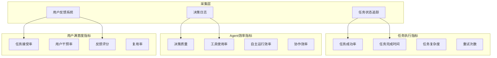
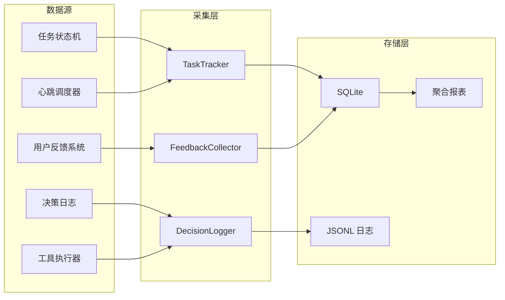

# 业务指标

本文档定义 SherryAgent 的业务指标体系，用于评估系统业务价值、用户满意度和运营效率。

## 指标体系概览



## 任务执行指标

### 成功率指标

| 指标名 | 类型 | 描述 | 采集方式 | 阈值 |
|--------|------|------|----------|------|
| `task_success_rate_percent` | Gauge | 任务成功率 | 成功任务数/总任务数 | > 85% |
| `task_failure_rate_percent` | Gauge | 任务失败率 | 失败任务数/总任务数 | < 15% |
| `task_cancellation_rate_percent` | Gauge | 任务取消率 | 用户取消数/总任务数 | < 5% |
| `task_timeout_rate_percent` | Gauge | 任务超时率 | 超时任务数/总任务数 | < 3% |
| `first_attempt_success_rate_percent` | Gauge | 首次尝试成功率 | 无重试成功数/总成功数 | > 70% |

### 完成时间指标

| 指标名 | 类型 | 描述 | 采集方式 | 阈值 |
|--------|------|------|----------|------|
| `task_completion_time_seconds` | Gauge | 任务完成时间 | 任务结束时间 - 开始时间 | P95 < 300s |
| `task_queue_wait_time_seconds` | Gauge | 任务排队等待时间 | 开始执行时间 - 提交时间 | P95 < 30s |
| `task_processing_time_seconds` | Gauge | 任务实际处理时间 | 完成时间 - 开始执行时间 | P95 < 270s |
| `time_to_first_response_seconds` | Gauge | 首次响应时间 | 首次输出时间 - 任务开始时间 | P95 < 10s |
| `time_to_completion_estimate_accuracy` | Gauge | 完成时间预估准确度 | 实际时间/预估时间 | 0.8-1.2 |

### 任务复杂度指标

| 指标名 | 类型 | 描述 | 采集方式 | 阈值 |
|--------|------|------|----------|------|
| `task_complexity_score` | Gauge | 任务复杂度评分 | 基于工具数、步骤数、Token 数 | 1-10 分 |
| `task_step_count` | Gauge | 任务步骤数 | Agent Loop 迭代次数 | N/A |
| `task_tool_call_count` | Gauge | 任务工具调用次数 | 工具调用计数器 | N/A |
| `task_context_turns` | Gauge | 上下文轮次 | 用户交互次数 | N/A |
| `task_file_operations_count` | Gauge | 文件操作次数 | 文件读写计数 | N/A |

### 重试与恢复指标

| 指标名 | 类型 | 描述 | 采集方式 | 阈值 |
|--------|------|------|----------|------|
| `task_retry_count_avg` | Gauge | 平均重试次数 | 总重试次数/任务数 | < 1.5 |
| `task_retry_rate_percent` | Gauge | 需要重试的任务比例 | 重试任务数/总任务数 | < 30% |
| `task_recovery_success_rate_percent` | Gauge | 任务恢复成功率 | 恢复成功数/恢复尝试数 | > 90% |
| `task_manual_intervention_rate_percent` | Gauge | 需人工干预的任务比例 | 人工干预数/总任务数 | < 10% |

## Agent 效率指标

### 决策质量指标

| 指标名 | 类型 | 描述 | 采集方式 | 阈值 |
|--------|------|------|----------|------|
| `decision_accuracy_rate_percent` | Gauge | 决策准确率 | 正确决策数/总决策数 | > 80% |
| `decision_revision_rate_percent` | Gauge | 决策修正率 | 修正决策数/总决策数 | < 20% |
| `decision_confidence_avg` | Gauge | 平均决策置信度 | LLM 输出置信度 | > 0.7 |
| `decision_time_seconds` | Gauge | 决策耗时 | 决策开始到结束时间 | P95 < 5s |
| `decision_reversal_rate_percent` | Gauge | 决策反转率 | 反转决策数/总决策数 | < 5% |

### 工具使用指标

| 指标名 | 类型 | 描述 | 采集方式 | 阈值 |
|--------|------|------|----------|------|
| `tool_usage_success_rate_percent` | Gauge | 工具调用成功率 | 成功调用数/总调用数 | > 95% |
| `tool_selection_accuracy_percent` | Gauge | 工具选择准确率 | 正确选择数/总选择数 | > 85% |
| `tool_redundant_call_rate_percent` | Gauge | 冗余工具调用率 | 冗余调用数/总调用数 | < 10% |
| `tool_avg_execution_time_ms` | Gauge | 工具平均执行时间 | 执行时间总和/调用次数 | < 5000ms |
| `tool_error_recovery_rate_percent` | Gauge | 工具错误恢复率 | 恢复成功数/错误总数 | > 90% |

### 自主运行效率指标

| 指标名 | 类型 | 描述 | 采集方式 | 阈值 |
|--------|------|------|----------|------|
| `autonomous_task_completion_rate_percent` | Gauge | 自主任务完成率 | 无干预完成数/总任务数 | > 60% |
| `heartbeat_task_yield_count` | Counter | 心跳触发任务产出数 | 心跳任务计数 | N/A |
| `scheduled_task_success_rate_percent` | Gauge | 定时任务成功率 | 成功数/计划数 | > 95% |
| `autonomous_decision_count_per_task` | Gauge | 单任务自主决策数 | 自主决策计数 | N/A |
| `human_approval_wait_time_seconds` | Gauge | 人工审批等待时间 | 审批完成时间 - 请求时间 | P95 < 300s |

### 多 Agent 协作指标

| 指标名 | 类型 | 描述 | 采集方式 | 阈值 |
|--------|------|------|----------|------|
| `fork_task_success_rate_percent` | Gauge | 子任务成功率 | 子任务成功数/子任务总数 | > 80% |
| `fork_spawn_overhead_ms` | Gauge | 子 Agent 派生开销 | 派生耗时 | < 1000ms |
| `fork_communication_latency_ms` | Gauge | 子 Agent 通信延迟 | 消息传递耗时 | < 100ms |
| `fork_result_aggregation_time_ms` | Gauge | 结果聚合耗时 | 聚合操作耗时 | < 500ms |
| `multi_agent_coordination_efficiency` | Gauge | 多 Agent 协调效率 | 理论最优时间/实际时间 | > 0.7 |

## 用户满意度指标

### 任务接受指标

| 指标名 | 类型 | 描述 | 采集方式 | 阈值 |
|--------|------|------|----------|------|
| `task_result_acceptance_rate_percent` | Gauge | 任务结果接受率 | 接受数/完成任务数 | > 80% |
| `task_result_revision_rate_percent` | Gauge | 结果修订率 | 修订请求数/完成任务数 | < 20% |
| `task_result_rejection_rate_percent` | Gauge | 结果拒绝率 | 拒绝数/完成任务数 | < 5% |
| `task_acceptance_time_seconds` | Gauge | 结果接受时间 | 接受时间 - 完成时间 | P95 < 60s |

### 用户干预指标

| 指标名 | 类型 | 描述 | 采集方式 | 阈值 |
|--------|------|------|----------|------|
| `human_intervention_rate_percent` | Gauge | 人工干预率 | 干预任务数/总任务数 | < 20% |
| `human_intervention_type_distribution` | Gauge | 干预类型分布 | 按类型统计干预次数 | N/A |
| `human_correction_count_per_task` | Gauge | 单任务人工修正次数 | 修正计数 | < 2 |
| `human_guidance_request_rate_percent` | Gauge | 请求指导率 | 请求指导数/总任务数 | < 15% |

### 反馈评分指标

| 指标名 | 类型 | 描述 | 采集方式 | 阈值 |
|--------|------|------|----------|------|
| `user_satisfaction_score_avg` | Gauge | 平均用户满意度评分 | 1-5 星评分均值 | > 4.0 |
| `user_feedback_rate_percent` | Gauge | 用户反馈率 | 反馈数/完成任务数 | > 30% |
| `positive_feedback_rate_percent` | Gauge | 正面反馈率 | 正面反馈数/总反馈数 | > 70% |
| `negative_feedback_response_time_hours` | Gauge | 负面反馈响应时间 | 响应时间 - 反馈时间 | < 24h |
| `nps_score` | Gauge | 净推荐值 (NPS) | 推荐者%-贬低者% | > 30 |

### 用户行为指标

| 指标名 | 类型 | 描述 | 采集方式 | 阈值 |
|--------|------|------|----------|------|
| `user_retention_rate_percent` | Gauge | 用户留存率 | 活跃用户数/总用户数 | > 60% |
| `user_task_frequency_avg` | Gauge | 用户平均任务频率 | 任务数/活跃天数 | > 3 |
| `user_session_duration_minutes` | Gauge | 用户会话时长 | 会话结束时间 - 开始时间 | > 15min |
| `task_reuse_rate_percent` | Gauge | 任务复用率 | 复用任务数/总任务数 | > 20% |

## 指标采集方式

### 采集架构



### 采集组件

| 组件 | 位置 | 采集内容 | 采集频率 |
|------|------|----------|----------|
| `TaskTracker` | `execution/task_tracker.py` | 任务状态、时间、复杂度 | 实时 |
| `DecisionLogger` | `execution/decision_logger.py` | 决策过程、置信度 | 每次决策 |
| `FeedbackCollector` | `interaction/feedback.py` | 用户评分、反馈 | 任务完成后 |
| `ToolUsageTracker` | `execution/tool_executor.py` | 工具调用统计 | 每次调用 |

### 采集代码示例

```python
from sherry_agent.execution.task_tracker import TaskTracker
from sherry_agent.execution.decision_logger import DecisionLogger

tracker = TaskTracker()

tracker.start_task(task_id="task-001", complexity_estimate=5)

tracker.record_step(
    step_type="tool_call",
    tool_name="file_read",
    success=True,
    latency_ms=45.2
)

tracker.complete_task(success=True, user_accepted=True)

metrics = tracker.get_metrics()
print(f"Success rate: {metrics['success_rate']}%")
print(f"Avg completion time: {metrics['avg_completion_time']}s")

logger = DecisionLogger()
logger.log_decision(
    decision_type="tool_selection",
    tool_name="file_read",
    confidence=0.85,
    reasoning="User requested file content"
)
```

### 日志格式

```json
{
  "timestamp": "2026-04-07T12:00:00Z",
  "event": "task_completed",
  "task_id": "task-001",
  "metrics": {
    "completion_time_seconds": 45.2,
    "step_count": 12,
    "tool_call_count": 8,
    "retry_count": 0,
    "user_accepted": true,
    "satisfaction_score": 5
  },
  "decision_trace": [
    {
      "step": 1,
      "decision": "select_tool",
      "tool": "file_read",
      "confidence": 0.85
    }
  ]
}
```

## 当前缺失指标分析

### 高优先级缺失

| 缺失指标 | 影响范围 | 建议优先级 | 实现复杂度 |
|----------|----------|------------|------------|
| 决策质量评估系统 | Agent 自主能力评估 | P0 | 高 |
| 用户满意度采集机制 | 产品迭代依据 | P0 | 中 |
| 任务复杂度评分模型 | 任务分类与优化 | P0 | 中 |
| 业务价值量化指标 | ROI 评估 | P1 | 高 |

### 中优先级缺失

| 缺失指标 | 影响范围 | 建议优先级 | 实现复杂度 |
|----------|----------|------------|------------|
| 多 Agent 协作效率指标 | 编排优化 | P1 | 中 |
| 用户行为分析系统 | 用户画像 | P1 | 中 |
| A/B 测试框架 | 功能效果对比 | P2 | 高 |
| 任务推荐系统 | 用户体验提升 | P2 | 高 |

### 现有实现状态

| 模块 | 指标覆盖 | 实现位置 | 状态 |
|------|----------|----------|------|
| 任务状态追踪 | 基本状态 | `execution/agent_loop.py` | ⚠️ 部分实现 |
| Token 追踪 | 输入/输出/缓存 | `execution/agent_loop.py` | ✅ 已实现 |
| 错误追踪 | 异常日志 | `structlog` | ⚠️ 部分实现 |
| 决策日志 | 决策过程 | - | ❌ 未实现 |
| 用户反馈系统 | 满意度评分 | - | ❌ 未实现 |
| 任务复杂度评估 | 复杂度评分 | - | ❌ 未实现 |
| 多 Agent 协作指标 | 协作效率 | - | ❌ 未实现 |

## 指标使用指南

### 业务健康度评估

1. **任务成功率**：核心指标，低于 85% 需立即排查
2. **用户满意度**：低于 4.0 分需分析负面反馈
3. **人工干预率**：高于 20% 说明自主能力不足

### Agent 能力优化

1. **决策质量**：通过 `decision_accuracy_rate_percent` 评估
2. **工具使用**：通过 `tool_selection_accuracy_percent` 优化工具推荐
3. **自主运行**：通过 `autonomous_task_completion_rate_percent` 评估自主能力

### 用户体验改进

1. **响应速度**：监控 `time_to_first_response_seconds`
2. **结果质量**：监控 `task_result_acceptance_rate_percent`
3. **用户留存**：监控 `user_retention_rate_percent`

## 参考资料

- [系统技术指标](technical-metrics.md)
- [六层融合架构](../specs/six-layer-architecture.md)
- [MVP 开发路线图](../plans/mvp-roadmap.md)
