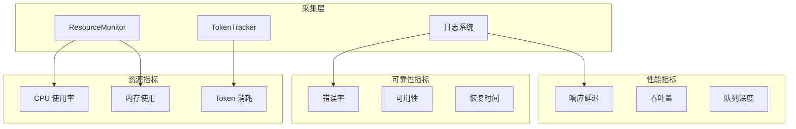
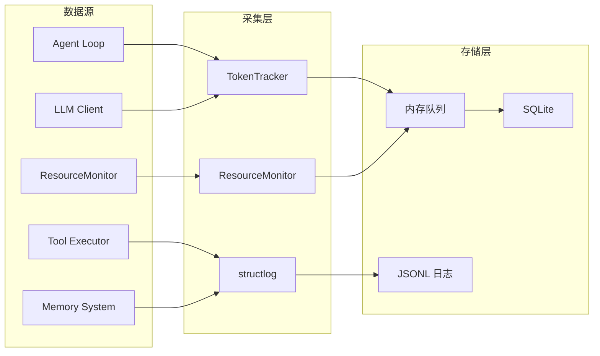

# 系统技术指标

本文档定义 SherryAgent 系统的可观测性指标体系，为性能优化、容量规划和故障诊断提供量化依据。

## 指标体系概览



## 性能指标

### 延迟指标

| 指标名 | 类型 | 描述 | 采集方式 | 阈值 |
|--------|------|------|----------|------|
| `agent_loop_latency_ms` | Gauge | Agent Loop 单次迭代延迟 | `time.time()` 差值 | P95 < 5000ms |
| `llm_response_latency_ms` | Gauge | LLM API 响应延迟 | SDK 回调 | P95 < 10000ms |
| `tool_execution_latency_ms` | Gauge | 工具执行延迟 | `tool_executor` 包装 | P95 < 30000ms |
| `memory_query_latency_ms` | Gauge | 记忆检索延迟 | `memory` 模块 | P95 < 100ms |
| `context_compression_latency_ms` | Gauge | 上下文压缩延迟 | `ShortTermMemory` | P95 < 500ms |
| `fork_spawn_latency_ms` | Gauge | 子 Agent 派生延迟 | `Forker` 模块 | P95 < 1000ms |

### 吞吐量指标

| 指标名 | 类型 | 描述 | 采集方式 | 阈值 |
|--------|------|------|----------|------|
| `tasks_completed_per_minute` | Counter | 每分钟完成任务数 | 任务状态变更计数 | > 10/min |
| `tool_calls_per_minute` | Counter | 每分钟工具调用次数 | `tool_executor` 计数 | < 100/min |
| `messages_processed_per_minute` | Counter | 每分钟处理消息数 | `agent_loop` 计数 | > 50/min |
| `memory_operations_per_second` | Gauge | 记忆操作 QPS | `memory` 模块 | > 1000/s |

### 队列指标

| 指标名 | 类型 | 描述 | 采集方式 | 阈值 |
|--------|------|------|----------|------|
| `lane_queue_depth` | Gauge | Lane 队列深度 | `LaneQueue.size()` | < 100 |
| `lane_queue_wait_time_ms` | Gauge | 队列等待时间 | 入队/出队时间差 | P95 < 5000ms |
| `active_fork_count` | Gauge | 活跃子 Agent 数量 | `Forker` 状态 | < 10 |
| `concurrent_tool_executions` | Gauge | 并发工具执行数 | `ConcurrencyManager` | < 配置上限 |

## 可靠性指标

### 错误指标

| 指标名 | 类型 | 描述 | 采集方式 | 阈值 |
|--------|------|------|----------|------|
| `error_rate_percent` | Gauge | 整体错误率 | 错误数/总请求数 | < 5% |
| `llm_error_rate_percent` | Gauge | LLM 调用错误率 | SDK 异常捕获 | < 1% |
| `tool_error_rate_percent` | Gauge | 工具执行错误率 | `tool_executor` 异常 | < 3% |
| `permission_denied_rate_percent` | Gauge | 权限拒绝率 | `PermissionChecker` | < 1% |
| `timeout_rate_percent` | Gauge | 超时率 | 超时计数/总请求数 | < 2% |

### 可用性指标

| 指标名 | 类型 | 描述 | 采集方式 | 阈值 |
|--------|------|------|----------|------|
| `system_uptime_seconds` | Counter | 系统运行时长 | 启动时间戳 | N/A |
| `heartbeat_success_rate_percent` | Gauge | 心跳成功率 | 心跳计数/预期心跳数 | > 99% |
| `scheduler_job_success_rate_percent` | Gauge | 定时任务成功率 | `APScheduler` 回调 | > 95% |
| `recovery_success_rate_percent` | Gauge | 断点续传成功率 | 恢复计数/崩溃次数 | > 90% |

### 恢复指标

| 指标名 | 类型 | 描述 | 采集方式 | 阈值 |
|--------|------|------|----------|------|
| `mttr_seconds` | Gauge | 平均恢复时间 (MTTR) | 崩溃到恢复的时间差 | < 60s |
| `crash_count_total` | Counter | 累计崩溃次数 | 异常捕获计数 | N/A |
| `state_recovery_latency_ms` | Gauge | 状态恢复延迟 | 恢复操作耗时 | < 5000ms |

## 资源指标

### CPU 指标

| 指标名 | 类型 | 描述 | 采集方式 | 阈值 |
|--------|------|------|----------|------|
| `cpu_percent` | Gauge | 进程 CPU 使用率 | `psutil.Process.cpu_percent()` | < 80% |
| `cpu_time_user_seconds` | Counter | 用户态 CPU 时间 | `psutil.Process.cpu_times()` | N/A |
| `cpu_time_system_seconds` | Counter | 内核态 CPU 时间 | `psutil.Process.cpu_times()` | N/A |

### 内存指标

| 指标名 | 类型 | 描述 | 采集方式 | 阈值 |
|--------|------|------|----------|------|
| `memory_rss_mb` | Gauge | 物理内存使用 (RSS) | `psutil.Process.memory_info()` | < 2048MB |
| `memory_percent` | Gauge | 内存使用百分比 | `psutil.Process.memory_percent()` | < 80% |
| `memory_warning_threshold` | Constant | 内存告警阈值 | 配置项 | 80% |
| `memory_critical_threshold` | Constant | 内存临界阈值 | 配置项 | 90% |

### Token 指标

| 指标名 | 类型 | 描述 | 采集方式 | 阈值 |
|--------|------|------|----------|------|
| `token_input_total` | Counter | 输入 Token 总数 | `TokenTracker.total_input_tokens` | N/A |
| `token_output_total` | Counter | 输出 Token 总数 | `TokenTracker.total_output_tokens` | N/A |
| `token_cache_read_total` | Counter | 缓存读取 Token 数 | `TokenTracker.total_cache_read_tokens` | N/A |
| `token_cache_creation_total` | Counter | 缓存创建 Token 数 | `TokenTracker.total_cache_creation_tokens` | N/A |
| `token_cost_usd` | Gauge | Token 成本估算 | 单价 × Token 数 | 按预算配置 |
| `token_per_task_avg` | Gauge | 单任务平均 Token 消耗 | 总 Token / 任务数 | < 100k |

### 存储指标

| 指标名 | 类型 | 描述 | 采集方式 | 阈值 |
|--------|------|------|----------|------|
| `database_size_mb` | Gauge | 数据库文件大小 | `os.path.getsize()` | < 1024MB |
| `log_file_size_mb` | Gauge | 日志文件大小 | `os.path.getsize()` | < 512MB |
| `context_window_usage_percent` | Gauge | 上下文窗口使用率 | 当前 Token / 模型上限 | < 90% |

## 指标采集方式

### 采集架构



### 采集组件

| 组件 | 位置 | 采集内容 | 采集频率 |
|------|------|----------|----------|
| `ResourceMonitor` | `infrastructure/monitoring.py` | CPU、内存 | 可配置，默认 5s |
| `TokenTracker` | `execution/agent_loop.py` | Token 使用 | 每次响应 |
| `TokenEstimator` | `infrastructure/token_estimator.py` | Token 估算 | 按需调用 |
| `structlog` | 全局 | 结构化日志 | 每次事件 |

### 采集代码示例

```python
from sherry_agent.infrastructure.monitoring import ResourceMonitor
from sherry_agent.infrastructure.token_estimator import TokenEstimator

monitor = ResourceMonitor(
    memory_warning_threshold=80.0,
    memory_critical_threshold=90.0,
    history_size=100,
)

await monitor.start_monitoring(interval=5.0)

snapshot = monitor.get_current_snapshot()
print(f"CPU: {snapshot.cpu_percent}%")
print(f"Memory: {snapshot.memory_percent}%")

estimator = TokenEstimator()
token_count = estimator.estimate(text)
```

### 日志格式

```json
{
  "timestamp": "2026-04-07T12:00:00Z",
  "level": "INFO",
  "event": "tool_execution",
  "tool_name": "file_read",
  "latency_ms": 45.2,
  "success": true,
  "token_usage": {
    "input": 1234,
    "output": 567
  }
}
```

## 当前缺失指标分析

### 高优先级缺失

| 缺失指标 | 影响范围 | 建议优先级 | 实现复杂度 |
|----------|----------|------------|------------|
| 分布式追踪 ID | 跨模块调用链分析 | P0 | 中 |
| 实时告警系统 | 故障快速响应 | P0 | 中 |
| Token 成本实时计算 | 预算控制 | P0 | 低 |
| 指标导出接口 (Prometheus) | 外部监控集成 | P1 | 中 |

### 中优先级缺失

| 缺失指标 | 影响范围 | 建议优先级 | 实现复杂度 |
|----------|----------|------------|------------|
| Agent 决策质量指标 | 自主运行效果评估 | P1 | 高 |
| 记忆检索相关性指标 | 记忆系统优化 | P1 | 中 |
| 用户满意度指标 | 产品迭代依据 | P2 | 高 |
| 多 Agent 协作效率指标 | 编排优化 | P2 | 中 |

### 现有实现状态

> 说明：本表反映 pre-phoenix 的历史实现快照（实现代码已删除）。能力口径统一以 `docs/legacy/implementation-snapshot.md` 的锚点为准。

| 模块 | 指标覆盖 | 能力锚点（历史） | 状态 |
|------|----------|----------|------|
| 资源监控 | CPU、内存 | `implementation-snapshot.md#ifl-monitoring` | 历史实现（已删除） |
| Token 追踪 | 输入/输出/缓存 | `implementation-snapshot.md#el-agentloop` | 历史实现（已删除） |
| Token 估算 | 文本 Token 数 | `implementation-snapshot.md#ifl-tokenestimator` | 历史实现（已删除） |
| 性能基准 | 延迟、吞吐 | `implementation-snapshot.md#ev-benchmarkharness` | 历史实现（已删除） |
| 错误追踪 | 异常日志 | `structlog` | ⚠️ 部分实现 |
| 告警系统 | 阈值告警 | `ResourceMonitor` 回调 | ⚠️ 部分实现 |
| 指标导出 | Prometheus 格式 | - | ❌ 未实现 |
| 分布式追踪 | Trace ID | - | ❌ 未实现 |

## 指标使用指南

### 性能诊断

1. **延迟异常**：检查 `agent_loop_latency_ms` 和 `llm_response_latency_ms`
2. **吞吐下降**：检查 `lane_queue_depth` 和 `concurrent_tool_executions`
3. **内存泄漏**：监控 `memory_rss_mb` 趋势

### 容量规划

1. **Token 预算**：基于 `token_per_task_avg` 估算成本
2. **并发配置**：基于 `lane_queue_wait_time_ms` 调整并发数
3. **存储规划**：基于 `database_size_mb` 增长率预估

### 故障排查

1. **错误定位**：通过 `error_rate_percent` 下钻到具体模块
2. **恢复验证**：检查 `recovery_success_rate_percent` 和 `mttr_seconds`
3. **性能回归**：对比基准测试报告中的指标

## 参考资料

- [六层融合架构](../specs/six-layer-architecture.md)
- [Agent Loop 设计](../specs/agent-loop.md)
- [技术栈总览](tech-stack.md)
- 性能基准历史证据：见 [agent-evaluation-retrospective.md](../research/agent-evaluation-retrospective.md)（仅保留研究结论，源码与日志已删除）
