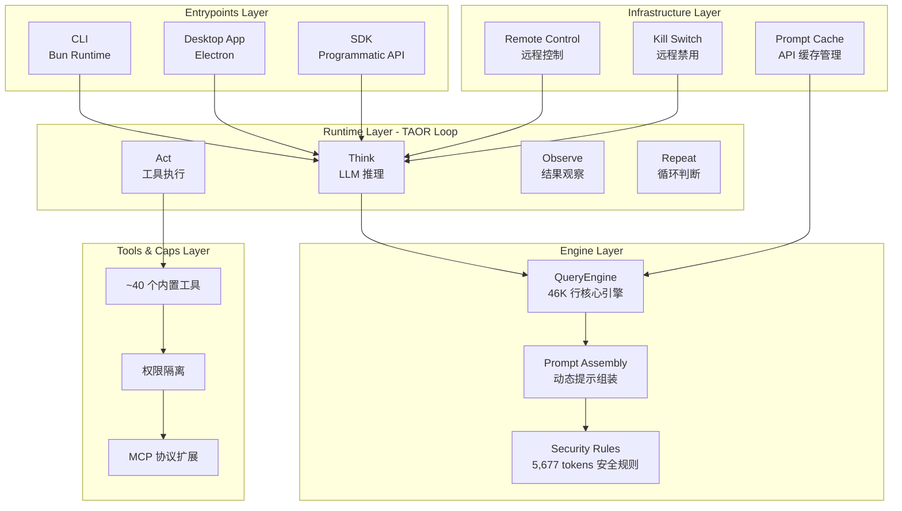

# Claude Code 架构分析

> Claude Code 是 Anthropic 推出的终端原生（Terminal-native）AI 编程助手。2026 年 3 月 31 日，因 Bun 构建工具的 Source Map 配置疏忽，其约 51 万行 TypeScript 源码意外泄露，引发了行业对其五层架构、多 Agent 编排体系和上下文压缩策略的深度解读。

## 五层架构总览

## 核心设计原则

| 原则 | 说明 |
|------|------|
| Streaming-first | 所有 LLM 交互均采用流式传输，用户可实时看到"思考过程" |
| Tool-use loop | Agent 核心行为模式是"推理-调用工具-观察结果-继续推理"的闭环 |
| Layered context | 上下文按优先级和时效性分层管理 |
| Permission-gated | 每个工具操作都经过多层权限检查 |

## 四层上下文压缩策略

| 压缩层 | 触发条件 | 操作内容 | 成本 |
|--------|----------|----------|------|
| Micro-Compact | ~100K tokens | 清理旧工具结果 | 极低 |
| Auto-Compact | ~167K tokens | LLM 摘要旧消息 | 中等 |
| Session Memory Compact | 10K-40K tokens | 提取关键信息到持久会话记忆 | 中等 |
| Reactive Compact | API 返回错误 | 截断最旧的消息组 | 低 |

## 六层权限管道

| 层级 | 名称 | 检查内容 |
|------|------|----------|
| 第1层 | 工具自身检查 | 输入校验、参数验证、路径安全 |
| 第2层 | 全局安全规则 | 禁止危险操作、敏感信息过滤 |
| 第3层 | 自动模式分类器 | LLM 判断操作安全性 |
| 第4层 | 用户配置规则 | Glob 模式匹配的允许/拒绝规则 |
| 第5层 | 企业策略 | 组织级权限策略、合规审计 |
| 第6层 | 沙箱隔离 | 文件系统访问限制、网络访问白名单 |

## 三层多Agent体系

| 层级 | 名称 | 触发方式 | 核心特征 |
|------|------|----------|----------|
| 第一层 | Sub-Agent | AgentTool 自动派生 | 隔离文件缓存、独立 AbortController |
| 第二层 | Coordinator Mode | 环境变量触发 | 系统提示重写为编排角色 |
| 第三层 | Team Mode | TeamCreateTool 创建 | 命名团队、文件持久化 |

## 关键技术亮点

### Fork 优化

子 Agent 继承父 Agent 的完整上下文前缀，最大化 API Prompt Cache 的命中率。并行运行多个子 Agent 的成本与顺序运行一个子 Agent 大致相当。

### Hook 系统

暴露超过 25 个生命周期事件，支持五种实现方式：
- Shell 命令
- LLM 注入上下文
- 完整 Agent 验证循环
- HTTP Webhook
- JavaScript 函数

### AutoDream 机制

后台进程在 Agent 空闲时自动启动，负责整理和巩固会话记忆，每 24 小时或每 5 个会话触发一次。
