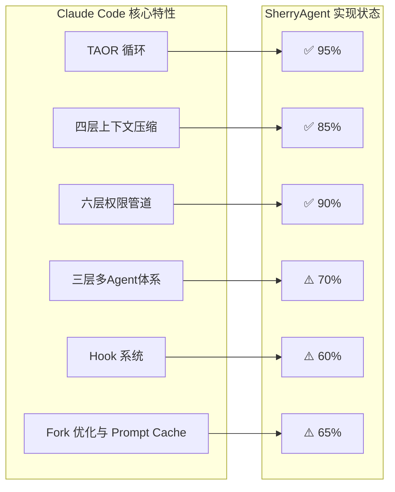
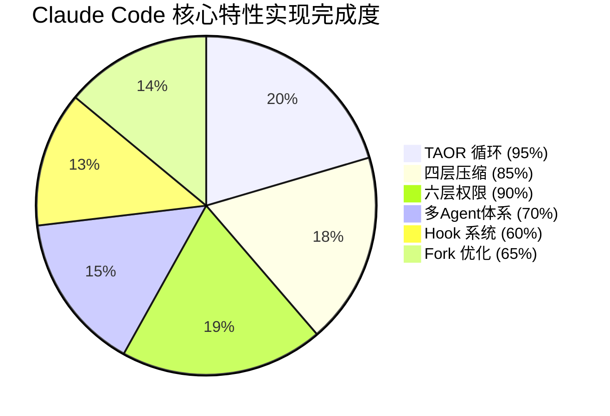
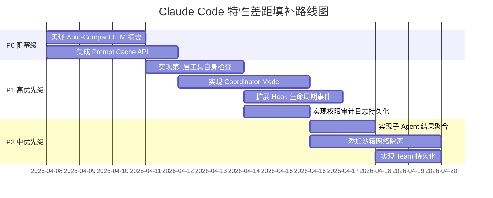

# Claude Code 核心特性实现差距分析

本文档逐项对比 Claude Code 核心特性在 SherryAgent 中的实现状态，分析差距原因并提供改进建议。

## 特性对比总览



---

## 1. TAOR 循环实现对比

### 特性对比表

| 特性 | Claude Code 实现 | SherryAgent 实现 | 差距 | 优先级 |
|------|-----------------|-----------------|------|--------|
| **Think 阶段** | LLM 推理，流式输出 | ✅ 完整实现流式 LLM 调用 | 无 | - |
| **Act 阶段** | 并发工具执行，权限检查 | ✅ 并发执行 + 权限检查 | 无 | - |
| **Observe 阶段** | 工具结果观察，记忆存储 | ✅ 结果观察 + STM 存储 | 无 | - |
| **Repeat 阶段** | 循环判断，Token 预算控制 | ✅ Token 预算 + 轮次限制 | 无 | - |
| **取消机制** | AbortController | ✅ CancellationToken | 无 | - |
| **错误处理** | 异常捕获，优雅退出 | ✅ 异常捕获 + 错误事件 | 无 | - |
| **记忆检索** | 长期记忆注入上下文 | ✅ 自动检索相关记忆 | 无 | - |

### 实现详情

**Claude Code TAOR 循环：**
```typescript
// 伪代码
while (shouldContinue) {
  // Think: LLM 推理
  const response = await llm.stream(messages);
  
  // Act: 工具执行
  if (response.toolCalls) {
    const results = await Promise.all(
      response.toolCalls.map(t => executeTool(t))
    );
  }
  
  // Observe: 结果观察
  messages.push(...toolResults);
  
  // Repeat: 循环判断
  shouldContinue = checkBudget() && !isCancelled();
}
```

**SherryAgent 实现：**

[agent_loop.py:76-302](file:///Users/liuminxuan/Desktop/sherryAgent/src/sherry_agent/execution/agent_loop.py#L76-L302) 实现了完整的 TAOR 循环：

```python
async def agent_loop(...):
    while round_count < config.max_tool_rounds:
        # Token 预算检查
        if token_tracker.get_total_tokens() > config.token_budget:
            yield AgentEvent(event_type=EventType.ERROR, ...)
            return
        
        # Think: LLM 推理 + 记忆检索
        response = await llm_client.chat(messages=...)
        
        # Act: 并发工具执行
        if len(response.tool_calls) > 1:
            tool_results = await asyncio.gather(*tool_tasks)
        
        # Observe: 结果存储到 STM
        short_term_memory.add_item({...})
        
        # Repeat: 轮次递增
        round_count += 1
```

### 差距分析

| 差距项 | 说明 | 影响 |
|--------|------|------|
| 无明显差距 | SherryAgent 已完整实现 TAOR 循环核心逻辑 | 低 |

### 改进建议

| 优先级 | 建议 | 预估工时 |
|--------|------|---------|
| P3 | 添加执行过程的详细追踪和调试 | 3 天 |
| P3 | 添加 Agent Loop 性能指标采集 | 2 天 |

---

## 2. 四层上下文压缩策略对比

### 特性对比表

| 特性 | Claude Code 实现 | SherryAgent 实现 | 差距 | 优先级 |
|------|-----------------|-----------------|------|--------|
| **Micro-Compact** | ~100K tokens 触发，清理旧工具结果 | ✅ 实现，移除冗余短语、截断长句 | 触发阈值不同 | P3 |
| **Auto-Compact** | ~167K tokens 触发，LLM 摘要 | ⚠️ 模拟实现，非真实 LLM 摘要 | 核心差距 | P1 |
| **Session Memory Compact** | 10K-40K tokens，提取关键信息 | ✅ 结构化提取关键点 | 实现方式不同 | P2 |
| **Reactive Compact** | API 错误时触发，截断最旧消息 | ✅ 激进压缩，保留最近项 | 无 | - |
| **Token 估算** | tiktoken 精确估算 | ✅ tiktoken + 回退估算 | 无 | - |
| **压缩策略选择** | 自动选择最优策略 | ✅ 根据 level 参数选择 | 无 | - |

### 实现详情

**Claude Code 四层压缩：**

| 压缩层 | 触发条件 | 操作内容 | 成本 |
|--------|----------|----------|------|
| Micro-Compact | ~100K tokens | 清理旧工具结果 | 极低 |
| Auto-Compact | ~167K tokens | LLM 摘要旧消息 | 中等 |
| Session Memory Compact | 10K-40K tokens | 提取关键信息到持久会话记忆 | 中等 |
| Reactive Compact | API 返回错误 | 截断最旧的消息组 | 低 |

**SherryAgent 实现：**

[short_term.py:65-224](file:///Users/liuminxuan/Desktop/sherryAgent/src/sherry_agent/memory/short_term.py#L65-L224) 实现了四种压缩策略：

```python
def compact(self, level: str = "auto") -> None:
    while self.get_total_tokens() > self.max_tokens:
        if level == "auto":
            self._auto_compact()      # 模拟 LLM 摘要
        elif level == "session":
            self._session_compact()   # 结构化提取
        elif level == "reactive":
            self._reactive_compact()  # 激进压缩
        else:
            self._micro_compact()     # 清理冗余
```

### 差距分析

| 差距项 | Claude Code | SherryAgent | 影响 |
|--------|-------------|-------------|------|
| Auto-Compact 实现 | 真实 LLM 摘要 | 模拟摘要（字符串截断） | 高：摘要质量差 |
| 触发阈值 | 精确的 Token 阈值 | 简单的 max_tokens 检查 | 中：压缩时机不精确 |
| 压缩策略联动 | 自动选择最优策略 | 手动指定 level | 低：灵活性足够 |

### 改进建议

| 优先级 | 建议 | 预估工时 |
|--------|------|---------|
| P1 | 实现真实 LLM 摘要的 Auto-Compact | 3 天 |
| P2 | 添加精确的 Token 阈值触发机制 | 2 天 |
| P3 | 实现智能压缩策略选择 | 2 天 |

---

## 3. 六层权限管道对比

### 特性对比表

| 层级 | Claude Code 实现 | SherryAgent 实现 | 差距 | 优先级 |
|------|-----------------|-----------------|------|--------|
| **第1层：工具自身检查** | 输入校验、参数验证、路径安全 | ❌ 未实现 | 高 | P1 |
| **第2层：全局安全规则** | 禁止危险操作、敏感信息过滤 | ✅ GlobalSecurityRules | 无 | - |
| **第3层：自动模式分类器** | LLM 判断操作安全性 | ✅ AutoModeClassifier (LLM 驱动) | 无 | - |
| **第4层：用户配置规则** | Glob 模式匹配的允许/拒绝规则 | ✅ UserConfigRules | 无 | - |
| **第5层：企业策略** | 组织级权限策略、合规审计 | ✅ EnterprisePolicy | 无 | - |
| **第6层：沙箱隔离** | 文件系统访问限制、网络白名单 | ✅ SandboxIsolation (文件系统) | 缺少网络隔离 | P2 |
| **权限缓存** | - | ✅ TTLCache | 额外优化 | - |
| **审计日志** | - | ⚠️ 内存存储，未持久化 | 中 | P1 |

### 实现详情

**Claude Code 六层权限管道：**

```
工具调用请求
    ↓
第1层：工具自身检查（输入校验、参数验证）
    ↓
第2层：全局安全规则（禁止危险操作）
    ↓
第3层：自动模式分类器（LLM 评估风险）
    ↓
第4层：用户配置规则（Glob 模式匹配）
    ↓
第5层：企业策略（组织级合规）
    ↓
第6层：沙箱隔离（文件系统 + 网络）
    ↓
允许/拒绝/需确认
```

**SherryAgent 实现：**

[checker.py:14-130](file:///Users/liuminxuan/Desktop/sherryAgent/src/sherry_agent/infrastructure/security/checker.py#L14-L130) 实现了五层权限检查：

```python
class ComprehensivePermissionChecker(PermissionChecker):
    def __init__(self, allowed_paths, llm_client):
        self.checkers = [
            GlobalSecurityRules(),           # 第2层
            CachedAutoModeClassifier(...),   # 第3层
            UserConfigRules(),               # 第4层
            EnterprisePolicy(),              # 第5层
            SandboxIsolation(allowed_paths)  # 第6层
        ]
```

### 差距分析

| 差距项 | Claude Code | SherryAgent | 影响 |
|--------|-------------|-------------|------|
| 第1层工具自身检查 | 每个工具独立校验 | 未实现 | 高：缺少输入验证 |
| 网络沙箱隔离 | 网络访问白名单 | 仅文件系统隔离 | 中：网络安全风险 |
| 审计日志持久化 | 持久化存储 | 内存存储 | 中：审计追溯困难 |

### 改进建议

| 优先级 | 建议 | 预估工时 |
|--------|------|---------|
| P1 | 实现第1层工具自身检查（输入校验、参数验证） | 3 天 |
| P1 | 实现权限审计日志持久化 | 2 天 |
| P2 | 添加沙箱网络隔离 | 4 天 |

---

## 4. 三层多 Agent 体系对比

### 特性对比表

| 层级 | Claude Code 实现 | SherryAgent 实现 | 差距 | 优先级 |
|------|-----------------|-----------------|------|--------|
| **第一层：Sub-Agent** | AgentTool 自动派生，隔离文件缓存 | ✅ AgentForker，上下文继承 | 无 | - |
| **第二层：Coordinator Mode** | 环境变量触发，系统提示重写 | ❌ 未实现 | 高 | P1 |
| **第三层：Team Mode** | TeamCreateTool 创建，命名团队持久化 | ✅ TeamLead + Teammate | 持久化缺失 | P2 |
| **子 Agent 隔离** | 独立 AbortController | ✅ 独立 CancellationToken | 无 | - |
| **工具池隔离** | 子 Agent 独立工具池 | ✅ 可配置继承/独立工具池 | 无 | - |
| **权限隔离** | 子 Agent 独立权限配置 | ✅ 可配置继承/独立权限 | 无 | - |
| **结果聚合** | 自动聚合子 Agent 结果 | ❌ 未实现 | 中 | P2 |

### 实现详情

**Claude Code 三层多 Agent 体系：**

| 层级 | 名称 | 触发方式 | 核心特征 |
|------|------|----------|----------|
| 第一层 | Sub-Agent | AgentTool 自动派生 | 隔离文件缓存、独立 AbortController |
| 第二层 | Coordinator Mode | 环境变量触发 | 系统提示重写为编排角色 |
| 第三层 | Team Mode | TeamCreateTool 创建 | 命名团队、文件持久化 |

**SherryAgent 实现：**

[forker.py:44-101](file:///Users/liuminxuan/Desktop/sherryAgent/src/sherry_agent/orchestration/forker.py#L44-L101) 实现了 Sub-Agent：

```python
class AgentForker:
    async def fork(self, parent_context: AgentContext, config: ForkConfig):
        # 继承系统提示前缀（Prompt Cache 优化）
        system_prompt = parent_context.system_prompt_prefix
        
        # 配置独立工具池
        tools = parent_context.tools.copy() if config.inherit_tools else []
        
        # 合并权限
        permissions = parent_context.permissions + config.extra_permissions
        
        return SubAgent(system_prompt, tools, permissions)
```

[teams.py:11-132](file:///Users/liuminxuan/Desktop/sherryAgent/src/sherry_agent/orchestration/teams.py#L11-L132) 实现了 Team Mode：

```python
class TeamLead:
    async def assign_task(self, task_description, teammate_id):
        subtasks = await self.orchestrator.decompose(task_description, ...)
        for task in subtasks:
            ticket_id = await self.lane.submit(task)
            teammate.add_task(ticket_id, task)

class Teammate:
    async def complete_task(self, task_id, result):
        task.result = result
```

### 差距分析

| 差距项 | Claude Code | SherryAgent | 影响 |
|--------|-------------|-------------|------|
| Coordinator Mode | 环境变量触发编排模式 | 未实现 | 高：缺少高级编排 |
| Team 持久化 | 文件持久化命名团队 | 内存存储 | 中：重启后丢失 |
| 结果聚合 | 自动聚合子 Agent 结果 | 未实现 | 中：需手动处理 |

### 改进建议

| 优先级 | 建议 | 预估工时 |
|--------|------|---------|
| P1 | 实现 Coordinator Mode（环境变量触发 + 系统提示重写） | 4 天 |
| P2 | 实现子 Agent 执行结果聚合 | 2 天 |
| P2 | 实现 Team 持久化（JSON 文件） | 2 天 |

---

## 5. Hook 系统对比

### 特性对比表

| 特性 | Claude Code 实现 | SherryAgent 实现 | 差距 | 优先级 |
|------|-----------------|-----------------|------|--------|
| **生命周期事件数量** | 25+ 个事件 | ⚠️ 8 个事件 | 高 | P1 |
| **Shell 命令 Hook** | ✅ 支持 | ❌ 未实现 | 中 | P2 |
| **LLM 注入上下文 Hook** | ✅ 支持 | ❌ 未实现 | 中 | P2 |
| **完整 Agent 验证循环 Hook** | ✅ 支持 | ❌ 未实现 | 高 | P1 |
| **HTTP Webhook Hook** | ✅ 支持 | ❌ 未实现 | 低 | P3 |
| **JavaScript 函数 Hook** | ✅ 支持 | ❌ 未实现 | 低 | P3 |
| **Python 函数 Hook** | - | ✅ 支持（pluggy） | 额外功能 | - |
| **插件加载/卸载 Hook** | - | ✅ plugin_loaded/unloaded | 额外功能 | - |

### 实现详情

**Claude Code Hook 系统：**

暴露超过 25 个生命周期事件，支持五种实现方式：
- Shell 命令
- LLM 注入上下文
- 完整 Agent 验证循环
- HTTP Webhook
- JavaScript 函数

**SherryAgent 实现：**

[hooks.py:36-80](file:///Users/liuminxuan/Desktop/sherryAgent/src/sherry_agent/plugins/hooks.py#L36-L80) 实现了基础 Hook 系统：

```python
class PluginHooks:
    @hookspec
    def plugin_loaded(plugin: Plugin) -> None: ...
    
    @hookspec
    def plugin_unloaded(plugin: Plugin) -> None: ...
    
    @hookspec
    def get_tools() -> List[BaseTool]: ...
    
    @hookspec
    def agent_started(agent_id: str, config: Dict) -> None: ...
    
    @hookspec
    def agent_stopped(agent_id: str, status: str) -> None: ...
    
    @hookspec
    def plugin_enabled(plugin: Plugin) -> None: ...
    
    @hookspec
    def plugin_disabled(plugin: Plugin) -> None: ...
```

### 差距分析

| 差距项 | Claude Code | SherryAgent | 影响 |
|--------|-------------|-------------|------|
| 事件数量 | 25+ 个生命周期事件 | 8 个事件 | 高：覆盖不全 |
| 实现方式多样性 | 5 种实现方式 | 仅 Python 函数 | 中：灵活性受限 |
| Agent 验证循环 | 支持 Hook 触发完整验证循环 | 未实现 | 高：缺少质量保障 |

### 改进建议

| 优先级 | 建议 | 预估工时 |
|--------|------|---------|
| P1 | 扩展生命周期事件（工具调用前后、压缩前后等） | 3 天 |
| P1 | 实现 Agent 验证循环 Hook | 4 天 |
| P2 | 实现 Shell 命令 Hook | 2 天 |
| P2 | 实现 LLM 注入上下文 Hook | 3 天 |
| P3 | 实现 HTTP Webhook Hook | 2 天 |

---

## 6. Fork 优化与 Prompt Cache 对比

### 特性对比表

| 特性 | Claude Code 实现 | SherryAgent 实现 | 差距 | 优先级 |
|------|-----------------|-----------------|------|--------|
| **上下文继承** | 子 Agent 继承完整上下文前缀 | ✅ system_prompt_prefix 继承 | 无 | - |
| **Prompt Cache API** | 最大化 API Cache 命中率 | ❌ 未集成 | 高 | P1 |
| **并行子 Agent 成本优化** | 并行成本 ≈ 顺序成本 | ⚠️ 无优化 | 高 | P1 |
| **文件缓存隔离** | 子 Agent 独立文件缓存 | ⚠️ 未实现 | 中 | P2 |
| **工具池继承配置** | 可配置继承/独立工具池 | ✅ inherit_tools 配置 | 无 | - |
| **权限继承配置** | 可配置继承/独立权限 | ✅ extra_permissions 配置 | 无 | - |

### 实现详情

**Claude Code Fork 优化：**

子 Agent 继承父 Agent 的完整上下文前缀，最大化 API Prompt Cache 的命中率。并行运行多个子 Agent 的成本与顺序运行一个子 Agent 大致相当。

```
父 Agent 上下文:
[系统提示前缀] + [用户消息] + [工具结果]

子 Agent 继承:
[系统提示前缀] ← 复用 Prompt Cache
    + [子任务描述] + [子任务工具结果]
```

**SherryAgent 实现：**

[forker.py:47-71](file:///Users/liuminxuan/Desktop/sherryAgent/src/sherry_agent/orchestration/forker.py#L47-L71) 实现了上下文继承：

```python
async def fork(self, parent_context: AgentContext, config: ForkConfig):
    # 继承系统提示前缀
    system_prompt = ""
    if hasattr(parent_context, 'system_prompt_prefix'):
        system_prompt = parent_context.system_prompt_prefix
    
    if config.inherit_system_prompt:
        if hasattr(parent_context, 'system_prompt_suffix'):
            system_prompt += parent_context.system_prompt_suffix
```

### 差距分析

| 差距项 | Claude Code | SherryAgent | 影响 |
|--------|-------------|-------------|------|
| Prompt Cache API 集成 | 利用 API Cache 降低成本 | 未集成 | 高：成本未优化 |
| 并行成本优化 | 并行 ≈ 顺序成本 | 无优化 | 高：并行成本高 |
| 文件缓存隔离 | 子 Agent 独立文件缓存 | 未实现 | 中：缓存污染风险 |

### 改进建议

| 优先级 | 建议 | 预估工时 |
|--------|------|---------|
| P1 | 集成 Prompt Cache API（Anthropic/OpenAI） | 4 天 |
| P1 | 实现并行子 Agent 成本优化策略 | 3 天 |
| P2 | 实现子 Agent 文件缓存隔离 | 3 天 |

---

## 整体差距汇总

### 完成度统计



### 关键差距优先级排序

| 优先级 | 差距项 | 影响范围 | 预估工时 |
|--------|--------|---------|---------|
| P0 | 实现 Auto-Compact 真实 LLM 摘要 | 记忆层 | 3 天 |
| P0 | 集成 Prompt Cache API | 执行层 | 4 天 |
| P1 | 实现第1层工具自身检查 | 基础设施层 | 3 天 |
| P1 | 实现 Coordinator Mode | 编排层 | 4 天 |
| P1 | 扩展 Hook 生命周期事件 | 基础设施层 | 3 天 |
| P1 | 实现权限审计日志持久化 | 基础设施层 | 2 天 |
| P2 | 实现子 Agent 结果聚合 | 执行层 | 2 天 |
| P2 | 添加沙箱网络隔离 | 基础设施层 | 4 天 |
| P2 | 实现 Team 持久化 | 编排层 | 2 天 |
| P3 | 实现 HTTP Webhook Hook | 基础设施层 | 2 天 |

---

## 差距原因分析

### 1. 设计优先级差异

| 原因 | 具体表现 | 说明 |
|------|---------|------|
| MVP 范围控制 | Coordinator Mode、HTTP Webhook 未实现 | 优先实现核心功能，扩展功能延后 |
| 技术复杂度 | Prompt Cache API、网络隔离 | 需要深入理解 API 特性或复杂配置 |
| 实践验证不足 | Auto-Compact LLM 摘要策略 | 需要更多实际场景测试 |

### 2. 架构设计差异

| 差异 | Claude Code | SherryAgent | 影响 |
|------|-------------|-------------|------|
| Hook 实现方式 | 多语言支持（Shell/JS/HTTP） | 仅 Python（pluggy） | 灵活性受限 |
| 多 Agent 触发方式 | 环境变量 + 工具 + API | 仅 Fork API | 编排能力受限 |
| 缓存策略 | API 级别 Prompt Cache | 应用级别 TTLCache | 成本优化不足 |

### 3. 依赖约束

| 约束类型 | 具体表现 | 解决方案 |
|---------|---------|---------|
| API 依赖 | Prompt Cache 需要 Anthropic/OpenAI 特定 API | 集成对应 SDK |
| 运行环境 | 网络隔离需要容器支持 | 集成 Docker SDK |
| 测试覆盖 | 部分 Hook 事件缺少测试 | 补充单元测试 |

---

## 改进路线图



---

## 总结

SherryAgent 在 Claude Code 核心特性方面的整体实现完成度约为 **78%**，主要差距集中在：

1. **Hook 系统（60%）**：事件数量不足，实现方式单一
2. **Fork 优化（65%）**：缺少 Prompt Cache API 集成，成本优化不足
3. **多 Agent 体系（70%）**：缺少 Coordinator Mode，结果聚合未实现

建议按照优先级排序逐步填补差距，优先解决 P0 和 P1 级别的问题：

- **P0**：Auto-Compact LLM 摘要、Prompt Cache API 集成
- **P1**：工具自身检查、Coordinator Mode、Hook 扩展、审计日志持久化

这些改进将显著提升 SherryAgent 的核心能力，使其更接近 Claude Code 的功能水平。
