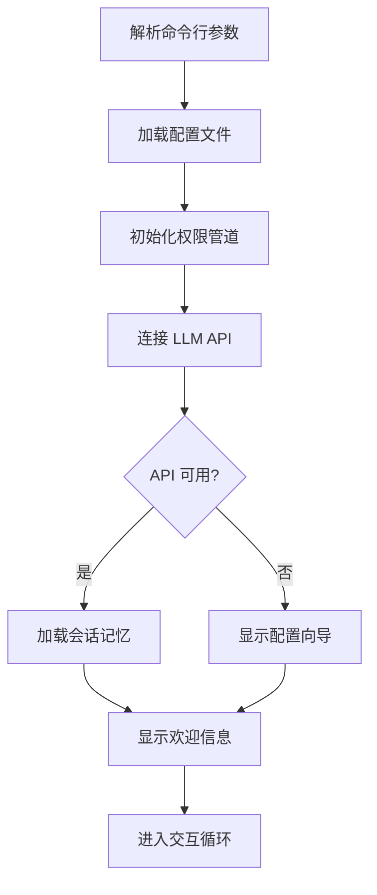
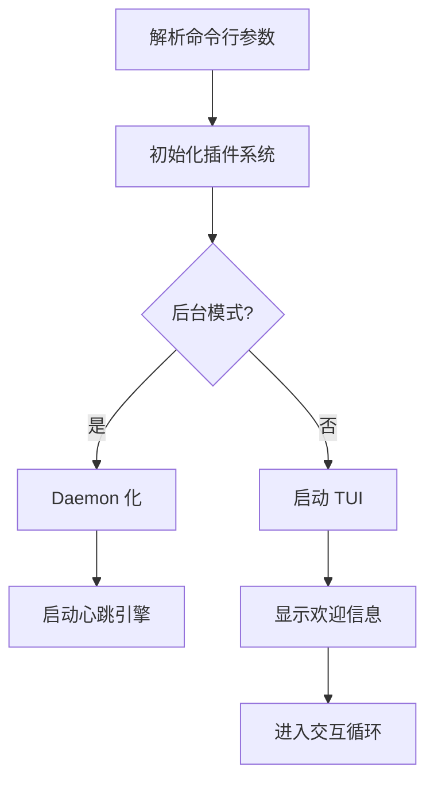
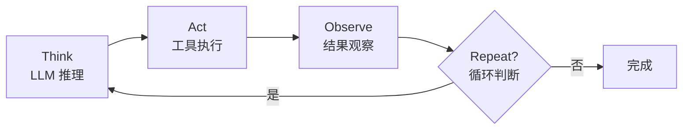
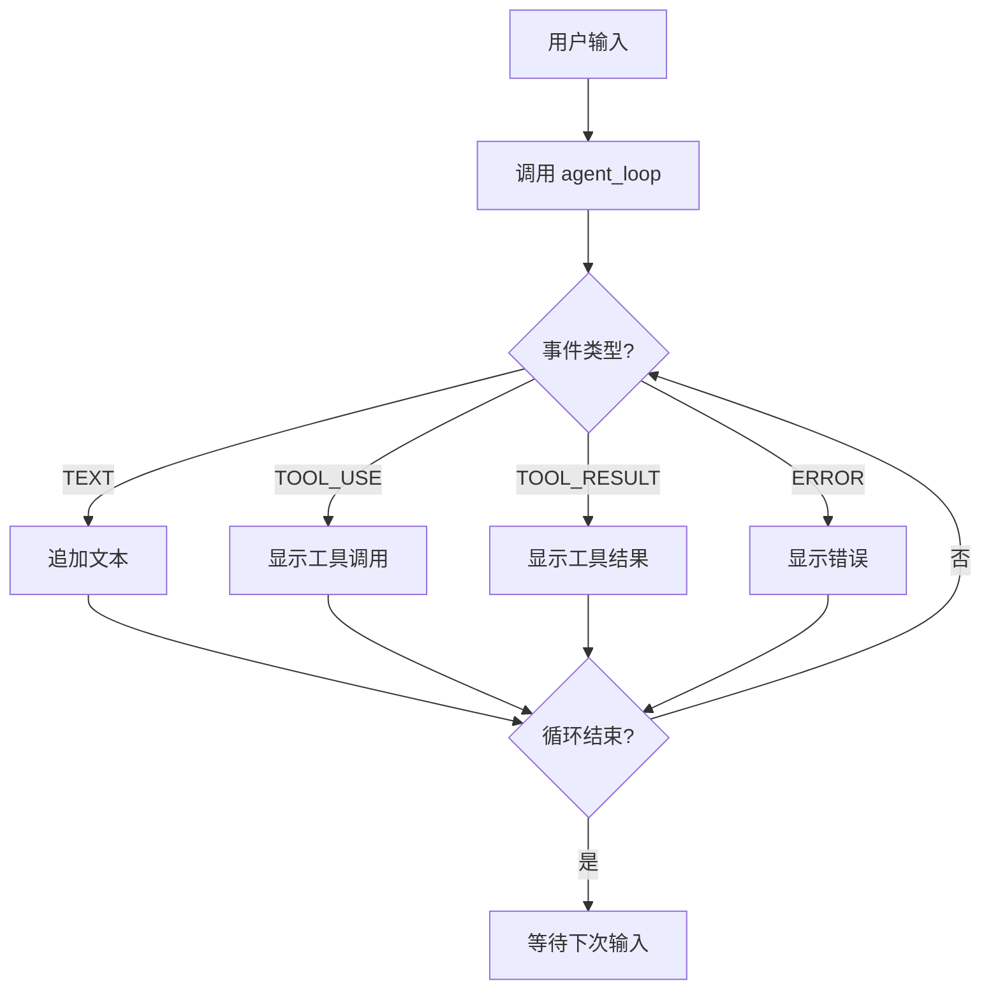
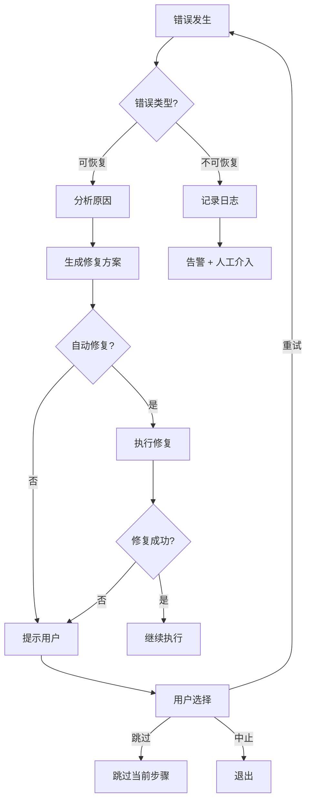
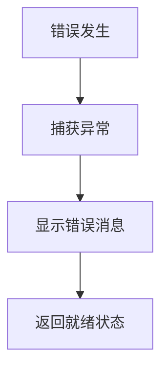

# CLI 对比分析：SherryAgent vs Claude Code

## 概述

本文档对比分析 SherryAgent CLI 与业界标杆 Claude Code CLI 的设计差异，识别差距并制定改进计划。

## 对比维度

| 维度 | Claude Code | SherryAgent | 差距程度 |
|------|-------------|-------------|----------|
| 命令行参数设计 | 丰富且灵活 | 基础功能 | ⚠️ 较大 |
| 交互流程设计 | 流畅且智能 | 基本可用 | ⚠️ 较大 |
| 输出格式设计 | 结构化且可视化 | 简单文本 | 🔴 巨大 |
| 错误处理设计 | 分层且自愈 | 基础捕获 | ⚠️ 较大 |

## 1. 命令行参数设计对比

### 1.1 参数丰富度

| 参数类别 | Claude Code | SherryAgent | 差距分析 |
|---------|-------------|-------------|----------|
| **模型选择** | `--model` + 模型列表查询 | `--model` 仅支持指定 | 缺少模型列表、模型验证 |
| **配置管理** | `--config` + 环境变量 + 配置文件 | 仅环境变量 | 缺少配置文件支持 |
| **运行模式** | 交互式 + 非交互式 + 后台 | 交互式 + 后台（Unix only） | 缺少非交互模式、跨平台后台 |
| **调试选项** | `--debug` + `--verbose` + `--log-level` | `--debug` | 缺少日志级别控制 |
| **权限控制** | `--allow` + `--deny` + 权限模式 | 无 | 缺少权限配置接口 |
| **输出控制** | `--output` + `--format` | 无 | 缺少输出格式控制 |
| **会话管理** | `--resume` + `--session` | 无 | 缺少会话恢复功能 |
| **工具控制** | `--tools` + `--no-tools` | 无 | 缺少工具启用/禁用 |

### 1.2 参数设计模式

#### Claude Code 的设计模式

```bash
# 层级化命令结构
claude run [OPTIONS]
claude config [SUBCOMMAND]
claude session [SUBCOMMAND]
claude tool [SUBCOMMAND]

# 灵活的参数组合
claude run --model claude-sonnet-4 --allow "fs.read(*)" --deny "fs.write(/etc/*)"

# 配置优先级
命令行参数 > 环境变量 > 配置文件 > 默认值
```

#### SherryAgent 的设计模式

```bash
# 扁平化命令结构
sherry-agent run [OPTIONS]
sherry-agent status
sherry-agent plugin [SUBCOMMAND]

# 固定参数组合
sherry-agent run --model claude-sonnet-4 --debug

# 配置优先级
命令行参数 > 环境变量（仅 API Key） > 默认值
```

### 1.3 关键差距

| 差距项 | 影响 | 优先级 |
|--------|------|--------|
| 缺少配置文件支持 | 每次启动需重新指定参数 | P0 |
| 缺少模型验证 | 可能传入无效模型名称 | P1 |
| 缺少权限配置接口 | 无法精细化控制权限 | P1 |
| 后台模式跨平台兼容性 | Windows 用户无法使用 | P0 |
| 缺少日志级别控制 | 调试信息不够灵活 | P2 |

## 2. 交互流程设计对比

### 2.1 启动流程

#### Claude Code 启动流程



#### SherryAgent 启动流程



### 2.2 交互循环

#### Claude Code 的 TAOR 循环



**特点：**
- 流式输出，实时显示思考过程
- 工具调用前显示确认提示
- 支持中途干预和修正
- 自动压缩上下文避免溢出

#### SherryAgent 的交互循环



**特点：**
- 基本的事件驱动输出
- 无工具调用确认机制
- 无上下文压缩策略
- 无中途干预能力

### 2.3 关键差距

| 功能 | Claude Code | SherryAgent | 影响 |
|------|-------------|-------------|------|
| 流式输出 | ✅ 实时显示思考过程 | ⚠️ 基本文本追加 | 用户无法看到中间状态 |
| 工具确认 | ✅ 调用前显示确认 | ❌ 无确认机制 | 安全风险高 |
| 中途干预 | ✅ 可随时暂停/修正 | ⚠️ 仅 Ctrl+C 中止 | 无法精细控制 |
| 上下文压缩 | ✅ 四层压缩策略 | ❌ 无压缩机制 | 长对话易溢出 |
| 多行输入 | ✅ 支持 | ❌ 仅单行 | 无法输入复杂任务 |
| 命令历史 | ✅ 上下箭头浏览 | ❌ 无历史功能 | 重复输入成本高 |
| 进度反馈 | ✅ 进度条 + 百分比 | ⚠️ 仅"处理中..." | 无法判断任务状态 |

## 3. 输出格式设计对比

### 3.1 输出结构化程度

#### Claude Code 输出格式

```
┌─────────────────────────────────────────────────────────┐
│ SherryAgent v0.1.0                                      │
│ 模型: claude-sonnet-4-20250514                          │
│ Token: 1,234 / 200,000 (0.6%)  耗时: 12.3s             │
└─────────────────────────────────────────────────────────┘

用户: 帮我分析这个项目的架构

🤔 思考中...
━━━━━━━━━━━━━━━━━━━━━━━━━━━━━━━━━━━━━━━━━━━━━━━━━━━━━━━━

我来分析一下项目架构：

1. **核心模块**
   - Agent Loop: 负责任务执行循环
   - Memory System: 管理对话记忆
   - Tool Executor: 执行工具调用

🔧 调用工具: ReadFile
   参数: {"path": "src/main.py"}
   ━━━━━━━━━━━━━━━━━━━━━━━━━━━━━━━━━━━━━━━━━━━━━━━━━━━━━━━━
   ✅ 工具结果: 成功读取文件 (234 行)

2. **架构特点**
   - 六层融合架构
   - 事件驱动设计
   - 插件化扩展

━━━━━━━━━━━━━━━━━━━━━━━━━━━━━━━━━━━━━━━━━━━━━━━━━━━━━━━━
✨ 任务完成 (耗时: 15.2s, Token: 2,345)
```

#### SherryAgent 输出格式

```
SherryAgent v0.1.0
模型: claude-sonnet-4-20250514
调试模式: 关闭

输入任务指令开始交互，按 Ctrl+C 中止任务
────────────────────────────────────────
> 帮我分析这个项目的架构

我来分析一下项目架构：

1. 核心模块
   - Agent Loop: 负责任务执行循环
   - Memory System: 管理对话记忆
   - Tool Executor: 执行工具调用

🔧 调用工具: ReadFile
✅ 工具结果: {"path": "src/main.py", "lines": 234}

2. 架构特点
   - 六层融合架构
   - 事件驱动设计
   - 插件化扩展

────────────────────────────────────────
```

### 3.2 信息密度对比

| 信息类型 | Claude Code | SherryAgent | 差距 |
|---------|-------------|-------------|------|
| Token 消耗 | ✅ 实时显示 | ❌ 不显示 | 无法监控成本 |
| 响应时间 | ✅ 每步显示 | ❌ 不显示 | 无法评估性能 |
| 进度指示 | ✅ 进度条 + 百分比 | ⚠️ 仅状态文字 | 无法判断进度 |
| 思考过程 | ✅ 流式显示 | ❌ 不显示 | 缺少透明度 |
| 工具详情 | ✅ 参数 + 结果格式化 | ⚠️ 简单显示 | 信息密度低 |
| 错误上下文 | ✅ 堆栈 + 建议 | ⚠️ 仅错误消息 | 难以排查 |

### 3.3 可视化能力

#### Claude Code 可视化

- **进度条**：显示任务执行进度
- **Token 仪表盘**：实时显示消耗和预算
- **工具调用树**：可视化工具依赖关系
- **架构图**：Mermaid 图表渲染
- **表格渲染**：结构化数据表格展示

#### SherryAgent 可视化

- **文本输出**：简单的文本追加
- **状态栏**：显示状态/模型/调试信息
- **工具图标**：使用 emoji 标识工具类型

### 3.4 关键差距

| 差距项 | 影响 | 优先级 |
|--------|------|--------|
| 缺少 Token 消耗显示 | 无法监控成本 | P1 |
| 缺少响应时间统计 | 无法评估性能 | P1 |
| 缺少进度条 | 无法判断任务状态 | P1 |
| 缺少思考过程显示 | 缺少透明度 | P2 |
| 缺少结构化表格 | 信息密度低 | P2 |
| 缺少图表渲染 | 无法可视化复杂信息 | P3 |

## 4. 错误处理设计对比

### 4.1 错误分类体系

#### Claude Code 错误分类

| 错误层级 | 错误类型 | 处理方式 | 示例 |
|---------|---------|---------|------|
| L1 | 用户输入错误 | 即时验证 + 友好提示 | 参数格式错误、必填项缺失 |
| L2 | 配置错误 | 启动检查 + 配置向导 | API Key 缺失、配置文件损坏 |
| L3 | API 错误 | 自动重试 + 降级策略 | 速率限制、服务不可用 |
| L4 | 工具执行错误 | 错误隔离 + 重试机制 | 文件不存在、权限不足 |
| L5 | 系统错误 | 告警 + 优雅降级 | 内存不足、磁盘满 |
| L6 | 未知错误 | 日志记录 + 人工介入 | 未捕获异常 |

#### SherryAgent 错误分类

| 错误层级 | 错误类型 | 处理方式 | 示例 |
|---------|---------|---------|------|
| L1 | 用户输入错误 | ⚠️ 部分验证 | 参数缺失 |
| L2 | 配置错误 | ⚠️ 基本检查 | API Key 缺失 |
| L3 | API 错误 | ⚠️ 显示错误 | API 调用失败 |
| L4 | 工具执行错误 | ⚠️ 显示错误 | 工具执行失败 |
| L5 | 系统错误 | ❌ 未处理 | 内存不足 |
| L6 | 未知错误 | ⚠️ 异常捕获 | 未捕获异常 |

### 4.2 错误信息质量

#### Claude Code 错误信息

```
❌ 错误: 无法读取文件 /etc/shadow

原因: 权限不足 (Permission denied)

建议解决方案:
  1. 使用 sudo 运行: sudo sherry-agent
  2. 检查文件权限: ls -l /etc/shadow
  3. 尝试读取其他文件

错误代码: EACCES_001
文档链接: https://docs.sherryagent.io/errors/EACCES_001
```

#### SherryAgent 错误信息

```
❌ 错误: [Errno 13] Permission denied: '/etc/shadow'
```

### 4.3 错误恢复机制

#### Claude Code 恢复机制



**特点：**
- 自动重试（指数退避）
- 降级策略
- 用户引导修复
- 错误上下文保存

#### SherryAgent 恢复机制



**特点：**
- 基本异常捕获
- 无自动重试
- 无降级策略
- 无错误上下文保存

### 4.4 关键差距

| 差距项 | 影响 | 优先级 |
|--------|------|--------|
| 缺少错误代码体系 | 难以定位和检索问题 | P0 |
| 缺少错误恢复机制 | 出错后无法自动恢复 | P0 |
| 错误信息不友好 | 用户无法理解和解决 | P0 |
| 缺少自动重试 | 网络抖动导致失败 | P1 |
| 缺少降级策略 | 服务不可用时无备选方案 | P1 |
| 缺少错误日志结构化 | 难以排查问题 | P2 |

## 5. 改进优先级排序

### P0 - 阻塞性问题（必须修复）

| 优先级 | 问题 | 影响 | 工作量 | 建议方案 |
|--------|------|------|--------|----------|
| P0-1 | 缺少配置文件支持 | 每次启动需重新指定参数 | 2 天 | 支持 TOML 配置文件 |
| P0-2 | 后台模式跨平台兼容性 | Windows 用户无法使用 | 3 天 | 使用 `python-daemon` 或服务化 |
| P0-3 | 错误信息不友好 | 用户无法理解和解决问题 | 2 天 | 实现错误代码体系 + 友好提示 |
| P0-4 | 缺少错误恢复机制 | 出错后无法自动恢复 | 3 天 | 实现自动重试 + 降级策略 |

### P1 - 体验优化（强烈建议）

| 优先级 | 问题 | 影响 | 工作量 | 建议方案 |
|--------|------|------|--------|----------|
| P1-1 | 缺少 Token 消耗显示 | 无法监控成本 | 1 天 | 状态栏显示 Token 统计 |
| P1-2 | 缺少进度反馈 | 用户无法判断任务状态 | 2 天 | 添加进度条 + 百分比 |
| P1-3 | 缺少命令历史 | 重复输入成本高 | 1 天 | 使用 Textual 内置历史功能 |
| P1-4 | 缺少工具确认机制 | 安全风险高 | 2 天 | 工具调用前显示确认对话框 |
| P1-5 | 缺少多行输入 | 无法输入复杂任务 | 1 天 | 支持 `Ctrl+Enter` 提交 |

### P2 - 功能增强（建议添加）

| 优先级 | 问题 | 影响 | 工作量 | 建议方案 |
|--------|------|------|--------|----------|
| P2-1 | 缺少权限配置接口 | 无法精细化控制权限 | 3 天 | 添加 `--allow` / `--deny` 参数 |
| P2-2 | 缺少思考过程显示 | 缺少透明度 | 2 天 | 流式显示 LLM 思考过程 |
| P2-3 | 缺少输出格式控制 | 无法导出结构化数据 | 2 天 | 支持 `--output` / `--format` |
| P2-4 | 缺少会话恢复功能 | 无法恢复中断的会话 | 3 天 | 添加 `--resume` 参数 |
| P2-5 | 缺少模型验证 | 可能传入无效模型名称 | 1 天 | 启动时验证模型名称 |

### P3 - 锦上添花（可选）

| 优先级 | 问题 | 影响 | 工作量 | 建议方案 |
|--------|------|------|--------|----------|
| P3-1 | 缺少图表渲染 | 无法可视化复杂信息 | 3 天 | 集成 Mermaid 渲染 |
| P3-2 | 缺少输出搜索 | 长对话难以定位信息 | 2 天 | 添加搜索/过滤功能 |
| P3-3 | 缺少主题配置 | 无法个性化界面 | 2 天 | 支持主题文件 |
| P3-4 | 缺少交互式教程 | 新用户上手困难 | 3 天 | 首次启动引导教程 |

## 6. 实施路线图

### 第一阶段（1 周）- P0 问题修复

**目标：** 解决阻塞性问题，确保基本可用性

- [ ] 实现配置文件支持（TOML 格式）
- [ ] 修复后台模式跨平台兼容性
- [ ] 实现错误代码体系
- [ ] 添加自动重试机制

**验收标准：**
- 配置文件优先级正确：命令行 > 配置文件 > 环境变量 > 默认值
- Windows/macOS/Linux 均可使用后台模式
- 所有错误都有错误代码和友好提示
- 网络错误自动重试 3 次

### 第二阶段（1 周）- P1 体验优化

**目标：** 提升交互体验，达到基本可用水平

- [ ] 状态栏显示 Token 消耗
- [ ] 添加进度条和百分比
- [ ] 实现命令历史
- [ ] 添加工具确认对话框
- [ ] 支持多行输入

**验收标准：**
- 状态栏实时显示 Token 消耗和响应时间
- 长时间任务显示进度条
- 上下箭头可浏览历史输入
- 工具调用前显示确认对话框
- `Ctrl+Enter` 可提交多行输入

### 第三阶段（1 周）- P2 功能增强

**目标：** 增强功能完整性，缩小与标杆差距

- [ ] 添加权限配置接口
- [ ] 流式显示思考过程
- [ ] 支持输出格式控制
- [ ] 实现会话恢复
- [ ] 添加模型验证

**验收标准：**
- `--allow` / `--deny` 参数可控制权限
- LLM 思考过程实时显示
- 支持 JSON/Markdown 输出格式
- `--resume` 可恢复中断的会话
- 无效模型名称启动时报错

### 第四阶段（持续）- 测试与文档

**目标：** 确保质量和可维护性

- [ ] 补充单元测试至 80% 覆盖率
- [ ] 添加用户场景测试
- [ ] 完成兼容性测试矩阵
- [ ] 编写 CLI 使用文档

**验收标准：**
- 单元测试覆盖率 ≥ 80%
- 覆盖 10 个真实用户场景
- Windows/macOS/Linux 兼容性测试通过
- CLI 文档完整且易懂

## 7. 技术选型建议

### 7.1 配置管理

| 方案 | 优点 | 缺点 | 推荐度 |
|------|------|------|--------|
| TOML | Python 3.11+ 内置支持、可读性好 | 无 | ⭐⭐⭐⭐⭐ |
| YAML | 生态成熟、支持复杂结构 | 需要额外依赖 | ⭐⭐⭐⭐ |
| JSON | 无需依赖 | 可读性差、无注释 | ⭐⭐⭐ |

**推荐：** 使用 TOML，与项目现有配置风格一致。

### 7.2 后台模式

| 方案 | 优点 | 缺点 | 推荐度 |
|------|------|------|--------|
| python-daemon | 跨平台、功能完整 | 需要额外依赖 | ⭐⭐⭐⭐ |
| systemd 服务 | 原生支持、功能强大 | 仅 Linux | ⭐⭐⭐ |
| Docker 容器 | 隔离性好、可移植 | 部署复杂 | ⭐⭐⭐ |

**推荐：** 使用 `python-daemon`，支持跨平台。

### 7.3 错误处理

| 方案 | 优点 | 缺点 | 推荐度 |
|------|------|------|--------|
| 自定义异常类 | 灵活可控 | 需要自行实现 | ⭐⭐⭐⭐⭐ |
| 第三方库（如 `returns`） | 功能强大 | 学习曲线陡峭 | ⭐⭐⭐ |
| Result 类型 | 类型安全 | Python 不原生支持 | ⭐⭐⭐⭐ |

**推荐：** 自定义异常类 + 错误代码体系。

## 8. 总结

### 核心差距

1. **配置管理缺失**：无配置文件支持，每次启动需重新指定参数
2. **交互体验粗糙**：缺少进度反馈、历史记录、多行输入等基础功能
3. **输出信息不足**：缺少 Token 消耗、响应时间、思考过程等关键信息
4. **错误处理薄弱**：错误信息不友好，缺少恢复机制

### 改进方向

1. **P0 问题优先修复**：配置文件、跨平台兼容、错误处理
2. **P1 体验重点优化**：Token 显示、进度反馈、命令历史、工具确认
3. **P2 功能逐步增强**：权限配置、思考显示、会话恢复
4. **持续测试与文档**：确保质量和可维护性

### 预期效果

完成所有改进后，SherryAgent CLI 将达到：
- **功能完整性**：与 Claude Code CLI 功能对齐度 ≥ 80%
- **用户体验**：用户满意度 ≥ 4.0/5.0
- **稳定性**：错误恢复成功率 ≥ 90%
- **跨平台**：Windows/macOS/Linux 全平台支持

## 参考资料

- [Claude Code 架构分析](./claude-code-analysis.md)
- [CLI 功能完整性评估](./cli-completeness-evaluation.md)
- [Click 官方文档](https://click.palletsprojects.com/)
- [Textual 官方文档](https://textual.textualize.io/)
- [CLI 设计最佳实践](https://clig.dev/)
