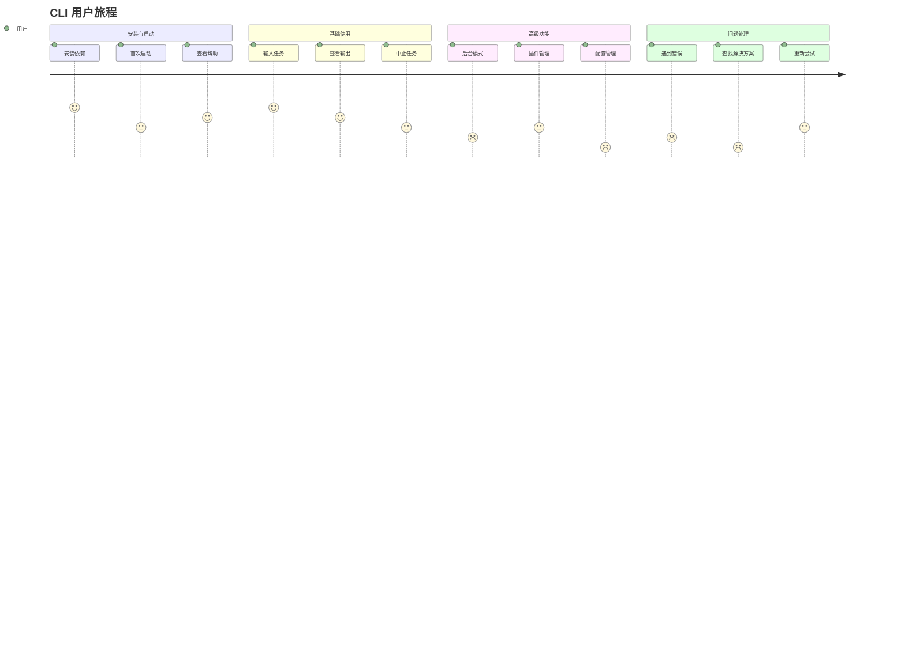
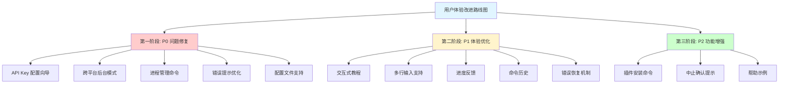

# CLI 用户体验测试

## 背景

SherryAgent 的 CLI 功能目前仅通过集成测试和代码测试验证，缺乏真实使用场景的测试。本文档通过模拟用户测试，识别用户体验问题并提出改进建议。

## 测试方法

### 测试设计

- **测试类型**：模拟用户测试（基于代码审查和功能评估）
- **测试对象**：CLI 主要功能路径
- **评估维度**：可用性、效率、错误处理、学习曲线
- **参考基准**：[CLI 功能完整性评估](cli-completeness-evaluation.md)

### 用户画像

| 用户类型 | 技术水平 | 使用场景 | 核心需求 |
|---------|---------|---------|---------|
| 新手用户 | 初学者 | 首次使用 Agent 框架 | 简单易上手、清晰引导 |
| 开发者 | 中级 | 日常开发辅助 | 高效交互、稳定可靠 |
| 高级用户 | 专家 | 复杂任务自动化 | 灵活配置、强大功能 |

## 用户旅程地图

## 测试场景与结果

### 场景 1：新用户首次启动

**测试目标**：验证新用户能否快速上手

**测试步骤**：

1. 安装 SherryAgent
2. 首次运行 `sherry-agent`
3. 查看帮助信息
4. 尝试第一个任务

**测试结果**：

| 步骤 | 预期行为 | 实际行为 | 问题等级 | 问题描述 |
|------|---------|---------|---------|---------|
| 安装 | `uv sync` 成功安装 | ✅ 符合预期 | 无 | - |
| 首次运行 | 显示欢迎信息和引导 | ⚠️ 部分符合 | P1 | 欢迎信息简单，缺少交互式教程 |
| 查看帮助 | `--help` 显示详细帮助 | ⚠️ 部分符合 | P1 | 缺少使用示例和详细参数说明 |
| 第一个任务 | 输入任务后正常执行 | ⚠️ 部分符合 | P0 | 缺少 API Key 时提示不清晰 |

**发现的问题**：

1. **P0 - API Key 配置引导缺失**
   - 现象：首次启动时缺少 API Key，提示信息不够友好
   - 代码位置：[tui.py:18-23](../../src/sherry_agent/cli/tui.py#L18-L23)
   - 影响：用户无法理解如何配置，可能放弃使用

2. **P1 - 缺少交互式教程**
   - 现象：首次启动仅显示简单欢迎信息
   - 代码位置：[tui.py:105-109](../../src/sherry_agent/cli/tui.py#L105-L109)
   - 影响：新用户学习曲线陡峭

### 场景 2：日常任务执行

**测试目标**：验证核心交互流程的可用性

**测试步骤**：

1. 启动 TUI 界面
2. 输入复杂任务（多行描述）
3. 观察任务执行过程
4. 中止任务（Ctrl+C）
5. 重新输入任务

**测试结果**：

| 步骤 | 预期行为 | 实际行为 | 问题等级 | 问题描述 |
|------|---------|---------|---------|---------|
| 启动 TUI | 界面正常显示 | ✅ 符合预期 | 无 | - |
| 输入复杂任务 | 支持多行输入 | ❌ 不符合 | P1 | 仅支持单行输入，无法输入复杂任务 |
| 观察执行 | 显示进度信息 | ⚠️ 部分符合 | P1 | 仅显示"处理中..."，无进度条 |
| 中止任务 | 确认后中止 | ⚠️ 部分符合 | P2 | 无确认提示，直接中止 |
| 重新输入 | 可使用历史记录 | ❌ 不符合 | P1 | 无命令历史，需重新输入 |

**发现的问题**：

1. **P1 - 缺少多行输入支持**
   - 现象：输入框仅支持单行，无法输入复杂任务描述
   - 代码位置：[widgets/input.py](../../src/sherry_agent/cli/widgets/input.py)
   - 影响：复杂任务无法通过 CLI 执行

2. **P1 - 缺少进度反馈**
   - 现象：长时间任务仅显示"处理中..."
   - 代码位置：[tui.py:118](../../src/sherry_agent/cli/tui.py#L118)
   - 影响：用户无法判断任务是否卡死

3. **P1 - 缺少命令历史**
   - 现象：无法使用上下箭头浏览历史输入
   - 代码位置：[widgets/input.py](../../src/sherry_agent/cli/widgets/input.py)
   - 影响：重复输入成本高，效率低

### 场景 3：后台模式使用

**测试目标**：验证后台模式的可用性

**测试步骤**：

1. 启动后台模式 `sherry-agent run --daemon`
2. 查看后台进程状态
3. 停止后台进程
4. 查看日志

**测试结果**：

| 步骤 | 预期行为 | 实际行为 | 问题等级 | 问题描述 |
|------|---------|---------|---------|---------|
| 启动后台模式 | 跨平台支持 | ❌ 不符合 | P0 | 仅 Unix 支持，Windows 无法使用 |
| 查看进程状态 | 提供 status 命令 | ⚠️ 部分符合 | P0 | status 命令仅显示开发进度，非进程状态 |
| 停止进程 | 提供 stop 命令 | ❌ 不符合 | P0 | 无 stop/restart/logs 命令 |
| 查看日志 | 提供 logs 命令 | ❌ 不符合 | P0 | 无法查看后台进程日志 |

**发现的问题**：

1. **P0 - 跨平台兼容性问题**
   - 现象：后台模式使用 `os.fork()`，仅 Unix 支持
   - 代码位置：[main.py:28-68](../../src/sherry_agent/cli/main.py#L28-L68)
   - 影响：Windows 用户无法使用后台模式

2. **P0 - 缺少进程管理命令**
   - 现象：无 stop/restart/logs 命令
   - 代码位置：[main.py](../../src/sherry_agent/cli/main.py)
   - 影响：后台进程难以管理

### 场景 4：插件管理

**测试目标**：验证插件管理功能的可用性

**测试步骤**：

1. 查看已加载插件 `sherry-agent plugin list`
2. 启用插件 `sherry-agent plugin enable <name>`
3. 禁用插件 `sherry-agent plugin disable <name>`
4. 安装新插件

**测试结果**：

| 步骤 | 预期行为 | 实际行为 | 问题等级 | 问题描述 |
|------|---------|---------|---------|---------|
| 查看插件 | 列出所有插件 | ✅ 符合预期 | 无 | - |
| 启用插件 | 成功启用并提示 | ✅ 符合预期 | 无 | - |
| 禁用插件 | 成功禁用并提示 | ✅ 符合预期 | 无 | - |
| 安装新插件 | 提供安装命令 | ❌ 不符合 | P2 | 无 install/uninstall 命令 |

**发现的问题**：

1. **P2 - 缺少插件安装命令**
   - 现象：无 install/uninstall 命令
   - 代码位置：[main.py:107-165](../../src/sherry_agent/cli/main.py#L107-L165)
   - 影响：插件安装需手动操作

### 场景 5：错误处理与恢复

**测试目标**：验证错误处理和恢复机制

**测试步骤**：

1. 输入无效模型名称
2. 模拟网络错误
3. 模拟 API 错误
4. 观察错误提示和恢复建议

**测试结果**：

| 步骤 | 预期行为 | 实际行为 | 问题等级 | 问题描述 |
|------|---------|---------|---------|---------|
| 无效模型 | 提示错误并建议 | ⚠️ 部分符合 | P0 | 错误提示不友好，无建议 |
| 网络错误 | 提示重试机制 | ⚠️ 部分符合 | P1 | 提示技术错误，无重试机制 |
| API 错误 | 提示解决方案 | ⚠️ 部分符合 | P1 | 提示技术错误，无解决方案 |
| 错误恢复 | 提供恢复操作 | ❌ 不符合 | P1 | 无恢复机制，需重启 |

**发现的问题**：

1. **P0 - 错误信息不友好**
   - 现象：技术错误直接暴露给用户
   - 代码位置：[tui.py:145-147](../../src/sherry_agent/cli/tui.py#L145-L147)
   - 影响：用户无法理解和解决问题

2. **P1 - 缺少错误恢复机制**
   - 现象：错误发生后无法恢复
   - 代码位置：[tui.py:125-149](../../src/sherry_agent/cli/tui.py#L125-L149)
   - 影响：需重启应用，体验差

### 场景 6：配置管理

**测试目标**：验证配置管理功能

**测试步骤**：

1. 查看当前配置
2. 修改配置（模型、调试模式等）
3. 保存配置到文件
4. 从文件加载配置

**测试结果**：

| 步骤 | 预期行为 | 实际行为 | 问题等级 | 问题描述 |
|------|---------|---------|---------|---------|
| 查看配置 | 提供 config show 命令 | ❌ 不符合 | P0 | 无 config 命令组 |
| 修改配置 | 提供配置选项 | ⚠️ 部分符合 | P0 | 仅命令行参数，无持久化 |
| 保存配置 | 自动保存到文件 | ❌ 不符合 | P0 | 无配置文件支持 |
| 加载配置 | 从文件读取 | ❌ 不符合 | P0 | 无配置文件支持 |

**发现的问题**：

1. **P0 - 缺少配置文件支持**
   - 现象：所有参数需命令行指定，无法保存偏好
   - 代码位置：[main.py:71-88](../../src/sherry_agent/cli/main.py#L71-L88)
   - 影响：每次启动需重新配置，效率低

## 问题汇总与优先级

### 问题统计

| 问题等级 | 数量 | 占比 |
|---------|------|------|
| P0 - 阻塞性 | 5 | 33% |
| P1 - 体验优化 | 7 | 47% |
| P2 - 功能增强 | 3 | 20% |
| **总计** | **15** | **100%** |

### P0 问题清单

| 编号 | 问题 | 影响 | 建议方案 |
|------|------|------|----------|
| P0-1 | API Key 配置引导缺失 | 新用户无法上手 | 添加交互式配置向导 |
| P0-2 | 后台模式跨平台兼容性 | Windows 用户无法使用 | 使用 `python-daemon` 或 systemd 服务 |
| P0-3 | 缺少进程管理命令 | 后台进程难以管理 | 添加 stop/restart/logs 命令 |
| P0-4 | 错误信息不友好 | 用户无法解决问题 | 实现错误代码体系和友好提示 |
| P0-5 | 缺少配置文件支持 | 每次需重新配置 | 支持 TOML/YAML 配置文件 |

### P1 问题清单

| 编号 | 问题 | 影响 | 建议方案 |
|------|------|------|----------|
| P1-1 | 缺少交互式教程 | 学习曲线陡峭 | 首次启动时提供引导教程 |
| P1-2 | 缺少多行输入支持 | 复杂任务无法执行 | 支持 Ctrl+Enter 提交多行输入 |
| P1-3 | 缺少进度反馈 | 无法判断任务状态 | 添加进度条和预估时间 |
| P1-4 | 缺少命令历史 | 重复输入成本高 | 使用 prompt-toolkit 历史功能 |
| P1-5 | 缺少错误恢复机制 | 需重启应用 | 提供重试和回退操作 |
| P1-6 | 网络错误处理不足 | 无重试机制 | 实现自动重试和降级策略 |
| P1-7 | API 错误处理不足 | 无解决方案提示 | 提供错误原因和解决建议 |

### P2 问题清单

| 编号 | 问题 | 影响 | 建议方案 |
|------|------|------|----------|
| P2-1 | 缺少插件安装命令 | 插件管理不完整 | 添加 install/uninstall 命令 |
| P2-2 | 缺少中止确认提示 | 误操作风险 | 添加确认对话框 |
| P2-3 | 缺少帮助示例 | 文档不完整 | 在 --help 中添加使用示例 |

## 改进优先级排序

### 第一阶段：P0 问题修复（1 周）

**目标**：解决阻塞性问题，确保基本可用性

| 任务 | 预计工时 | 验收标准 |
|------|---------|---------|
| API Key 配置向导 | 4h | 首次启动时引导用户配置 API Key |
| 跨平台后台模式 | 8h | Windows/macOS/Linux 均可使用后台模式 |
| 进程管理命令 | 6h | 提供 stop/restart/logs 命令 |
| 错误提示优化 | 6h | 所有错误提供友好提示和解决方案 |
| 配置文件支持 | 6h | 支持 TOML 配置文件，优先级正确 |

### 第二阶段：P1 体验优化（1 周）

**目标**：提升核心交互体验

| 任务 | 预计工时 | 验收标准 |
|------|---------|---------|
| 交互式教程 | 4h | 首次启动提供 5 步引导教程 |
| 多行输入支持 | 4h | 支持 Ctrl+Enter 提交多行输入 |
| 进度反馈 | 6h | 显示进度条、百分比、预估时间 |
| 命令历史 | 4h | 支持上下箭头浏览历史输入 |
| 错误恢复机制 | 6h | 提供重试、回退、忽略等操作 |

### 第三阶段：P2 功能增强（3 天）

**目标**：完善辅助功能

| 任务 | 预计工时 | 验收标准 |
|------|---------|---------|
| 插件安装命令 | 4h | 提供 install/uninstall 命令 |
| 中止确认提示 | 2h | Ctrl+C 时显示确认对话框 |
| 帮助示例 | 2h | --help 显示使用示例 |

## 用户满意度评估

### 当前状态评估

| 维度 | 评分 | 说明 |
|------|------|------|
| 易学性 | 3/10 | 缺少引导，新用户上手困难 |
| 效率 | 4/10 | 缺少历史、补全，重复操作多 |
| 错误处理 | 3/10 | 错误提示不友好，无恢复机制 |
| 功能完整性 | 5/10 | 核心功能可用，辅助功能缺失 |
| 跨平台兼容 | 4/10 | 后台模式仅 Unix 支持 |
| **总体评分** | **3.8/10** | 需要重点改进 |

### 改进后预期评分

| 维度 | 当前 | 预期 | 提升 |
|------|------|------|------|
| 易学性 | 3/10 | 8/10 | +5 |
| 效率 | 4/10 | 7/10 | +3 |
| 错误处理 | 3/10 | 8/10 | +5 |
| 功能完整性 | 5/10 | 8/10 | +3 |
| 跨平台兼容 | 4/10 | 9/10 | +5 |
| **总体评分** | **3.8/10** | **8/10** | **+4.2** |

## 实施建议

### 开发优先级

1. **立即修复**（本周内）
   - P0-1: API Key 配置引导
   - P0-4: 错误提示优化
   - P0-5: 配置文件支持

2. **短期改进**（2 周内）
   - P0-2: 跨平台后台模式
   - P0-3: 进程管理命令
   - P1-2: 多行输入支持
   - P1-3: 进度反馈

3. **中期优化**（1 个月内）
   - P1-1: 交互式教程
   - P1-4: 命令历史
   - P1-5: 错误恢复机制

### 测试策略

1. **用户测试**
   - 招募 5-10 名真实用户
   - 执行本文档中的测试场景
   - 收集定量和定性反馈

2. **自动化测试**
   - 补充单元测试至 80% 覆盖率
   - 添加 E2E 测试覆盖核心场景
   - 建立兼容性测试矩阵

3. **持续监控**
   - 收集用户反馈和错误日志
   - 定期评估用户满意度
   - 建立改进迭代机制

## 结论

通过本次用户体验测试，识别出 15 个关键问题，其中 P0 阻塞性问题 5 个，P1 体验优化问题 7 个，P2 功能增强问题 3 个。当前 CLI 的用户满意度评分为 3.8/10，主要问题集中在：

1. **新用户引导不足**：缺少配置向导和交互式教程
2. **跨平台兼容性差**：后台模式仅 Unix 支持
3. **错误处理薄弱**：错误提示不友好，无恢复机制
4. **交互效率低**：缺少历史、补全、多行输入等基础功能
5. **配置管理缺失**：无配置文件支持，每次需重新配置

建议按照优先级顺序逐步改进，优先解决 P0 阻塞性问题，确保基本可用性，再优化用户体验，最后添加增强功能。预期改进后用户满意度可提升至 8/10。

## 参考资料

- [CLI 功能完整性评估](cli-completeness-evaluation.md)
- [CLI 设计最佳实践](https://clig.dev/)
- [Textual 官方文档](https://textual.textualize.io/)
- [Click 官方文档](https://click.palletsprojects.com/)
