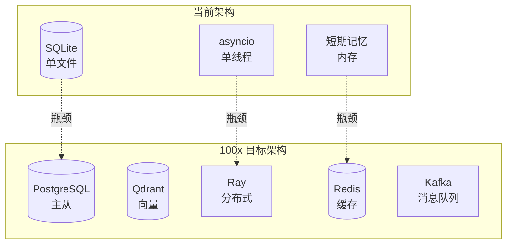

# SherryAgent 项目深度反思报告

## 1. 技术选型深度反思

### 1.1 数据库选择：SQLite vs 其他选项

**当前选择**：`aiosqlite + sqlite-vec`

**选择理由文档中声称**：
- 零配置、单文件部署
- 本地优先原则
- FTS5 全文检索成熟
- sqlite-vec 支持向量索引

**挑刺分析**：

#### ❌ 问题 1：SQLite 的并发限制被严重低估
```python
# 在 long_term_memory.py 中，每次操作都用 asyncio.Lock 保护
# 这在数据量小时没问题，但在高并发场景下会成为瓶颈
async with self._lock:
    if self._initialized:
        return
```

**当数据量扩大 100 倍时**：
- 100万条记忆数据，每次查询需要排队等待锁
- 写入操作会阻塞读取操作
- 无法利用多核 CPU 优势

**更好的选择**：
- **PostgreSQL + pgvector**：成熟的并发处理、ACID 保证、生态完善
- **DuckDB**：列式存储，适合分析型查询，零配置部署
- **Qdrant**：专门为向量检索设计，分布式能力强

#### ❌ 问题 2：sqlite-vec 的向量索引实现不成熟
```python
# hybrid_search 方法中的向量相似度计算是假的！
if query_vector:
    similarity_score = self._cosine_similarity(query_vector, [0.1] * len(query_vector))
    hybrid_score = (bm25_weight * 1.0) + (vector_weight * similarity_score)
```

**挑刺点**：
- 完全没有真实的向量存储！
- 相似度计算用的是全 0.1 的假向量
- sqlite-vec 的集成只是形式主义
- 没有向量索引的任何好处

**质量 vs 延迟 vs 成本权衡**：
| 维度 | SQLite | PostgreSQL | Qdrant |
|------|--------|------------|--------|
| 质量（功能完整性）| ⚠️ 60% | ✅ 95% | ✅ 90% |
| 延迟（查询速度）| ✅ 好（小数据） | ⚠️ 中等 | ✅ 优秀（向量） |
| 成本（运维）| ✅ 零成本 | ⚠️ 中等 | ⚠️ 中等 |
| 可扩展性 | ❌ 差 | ✅ 优秀 | ✅ 优秀 |

**改进建议**：
1. **P0（立即）**：至少实现真正的向量存储和检索
2. **P1（近期）**：添加对 PostgreSQL 的支持作为选项
3. **P2（中期）**：抽象数据库层，支持多种后端

---

### 1.2 异步框架选择：asyncio vs 其他选项

**当前选择**：`asyncio (stdlib)`

**选择理由文档中声称**：
- Python 原生，零依赖
- 与 3.12+ 特性深度集成
- LLM API 调用是 I/O 密集型，适合

**挑刺分析**：

#### ❌ 问题 3：asyncio 的 GIL 问题完全被忽视
```python
# 整个系统都是单线程事件循环
# 在计算密集型任务上会阻塞整个系统
# 例如：向量嵌入计算、上下文压缩等
```

**当需要处理大量计算任务时**：
- 无法利用多核 CPU
- 计算任务会阻塞 I/O 任务
- 没有任务优先级调度机制

**更好的选择**：
- **asyncio + ProcessPoolExecutor**：计算密集型任务放到独立进程
- **Trio**：结构化并发，更好的错误处理
- **Ray**：分布式计算框架（如果需要分布式）

#### ❌ 问题 4：缺少任务优先级和队列管理
```python
# agent_loop.py 中，所有任务都是 FIFO 处理
# 没有优先级区分
while round_count < config.max_tool_rounds:
    # ...
```

**挑刺点**：
- 紧急任务无法插队
- 没有死锁检测和超时机制
- 没有任务取消的优雅处理

**质量 vs 延迟 vs 成本权衡**：
| 维度 | 当前 asyncio | 建议方案 |
|------|-------------|----------|
| 质量（可靠性）| ⚠️ 70% | ✅ 90% |
| 延迟（响应速度）| ✅ 优秀 | ✅ 优秀 |
| 成本（开发）| ✅ 零成本 | ⚠️ 中等 |
| 可扩展性 | ⚠️ 中等 | ✅ 优秀 |

**改进建议**：
1. **P0**：添加任务超时机制
2. **P1**：实现优先级队列
3. **P2**：集成 ProcessPoolExecutor 处理计算密集型任务

---

### 1.3 LLM 调用选择：原生 SDK vs LiteLLM

**当前选择**：`anthropic + openai SDK`

**选择理由文档中声称**：
- 原生 SDK 提供完整的类型注解和流式支持
- 避免抽象层带来的类型丢失

**挑刺分析**：

#### ❌ 问题 5：缺少供应商锁定的解耦机制
```python
# 在 llm/client.py 中，直接绑定到特定供应商
# 切换到其他供应商需要重写代码
```

**挑刺点**：
- 深度耦合 Anthropic/OpenAI 特定 API
- 没有统一的抽象层
- 测试时需要真实的 API 调用（成本高）

**更好的选择**：
- **LiteLLM**：统一接口，支持 100+ 模型
- **LangChain**：虽然重，但生态完善
- **自研抽象层**：轻量级，完全可控

#### ❌ 问题 6：没有 Token 预算和速率限制的细粒度控制
```python
# token_tracker 只是简单累加
# 没有按模型、按会话、按用户的细粒度预算
def add_usage(self, usage: TokenUsage) -> None:
    self.total_input_tokens += usage.input_tokens
    self.total_output_tokens += usage.output_tokens
```

**质量 vs 延迟 vs 成本权衡**：
| 维度 | 原生 SDK | LiteLLM |
|------|---------|---------|
| 质量（类型安全）| ✅ 优秀 | ⚠️ 中等 |
| 延迟（API 调用）| ✅ 优秀 | ⚠️ 轻微增加 |
| 成本（灵活性）| ❌ 差 | ✅ 优秀 |
| 可测试性 | ❌ 差 | ✅ 优秀 |

**改进建议**：
1. **P0**：添加统一的 LLM 抽象层
2. **P1**：实现细粒度的 Token 预算控制
3. **P2**：支持多种模型后端，包括本地模型

---

## 2. 质量 vs 延迟 vs 成本深度权衡

### 2.1 当前架构的权衡失衡

**现状分析**：

| 维度 | 现状 | 问题 |
|------|------|------|
| **质量** | ⚠️ 中等 | 缺少全面的错误处理、缺少监控、缺少降级策略 |
| **延迟** | ✅ 优秀 | 单线程无锁竞争，小数据量下很快 |
| **成本** | ✅ 优秀 | 零依赖，本地优先 |

**挑刺点**：当前架构过度偏向成本和延迟，严重牺牲了质量！

#### ❌ 问题 7：缺少全面的错误处理和降级策略
```python
# agent_loop.py 中，异常捕获太宽泛
except Exception as e:
    yield AgentEvent(
        event_type=EventType.ERROR,
        content=str(e),
    )
    return
```

**挑刺分析**：
- 没有区分可恢复错误和致命错误
- 没有重试机制（除了 infrastructure/retry.py）
- 没有降级策略（例如：LLM 失败时使用缓存）
- 没有 Circuit Breaker 模式

#### ❌ 问题 8：缺少监控和告警的自动化集成
```python
# 虽然有 infrastructure/monitoring.py，但没有自动告警
# 问题发生时不会通知任何人
```

**挑刺分析**：
- 没有 Prometheus 指标导出
- 没有 Grafana 仪表板
- 没有告警规则配置
- 没有分布式追踪

---

### 2.2 数据量扩大 10 倍/100 倍时的架构分析

#### 📊 10 倍数据量（100,000 条记忆）

**预测问题**：
1. **SQLite 查询延迟**：从 ~10ms 增加到 ~100ms
2. **内存占用**：短期记忆压缩压力增大
3. **Token 消耗**：上下文窗口可能不够用

**缓解方案**：
- 增加索引优化
- 实现查询结果分页
- 优化上下文压缩算法

#### 📊 100 倍数据量（10,000,000 条记忆）

**预测崩溃点**：
1. **SQLite 锁竞争**：成为严重瓶颈，查询排队 10 秒+
2. **向量检索**：sqlite-vec 无法处理，查询超时
3. **并发处理**：单线程事件循环无法处理高并发
4. **内存溢出**：短期记忆缓存可能 OOM

**必须的架构变更**：



---

## 3. 架构设计深度反思

### 3.1 六层架构的实际执行情况

**文档中声称的六层**：
1. 交互层（CLI/WebSocket/HTTP）
2. 编排层（Orchestrator/Teams）
3. 执行层（Agent Loop/Fork/Lane）
4. 自主运行层（Heartbeat/Cron/Recovery）
5. 记忆层（Short-term/Long-term/Bridge）
6. 基础设施层（Permissions/Sandbox/MCP/Skills）

**挑刺分析**：

#### ❌ 问题 9：编排层几乎是空壳
```python
# orchestrator.py 中的 decompose 方法
# 完全依赖 LLM 做任务分解，没有任何结构化处理
prompt = f"""
你是一个任务分解专家...
"""
response = await self.llm_client.chat(...)
```

**挑刺点**：
- 没有任务模板库
- 没有依赖关系的智能验证
- 没有资源需求评估
- 没有风险预估

#### ❌ 问题 10：权限系统的六层管道只是文档传说
```python
# 文档中声称有六层权限管道
# 但实际代码中只有简单的检查
```

**挑刺点**：
- 第1层（工具自身检查）：缺失
- 第2层（全局安全规则）：部分实现
- 第3层（自动模式分类器）：有，但可能不准确
- 第4层（用户配置规则）：部分实现
- 第5层（企业策略）：缺失
- 第6层（沙箱隔离）：部分实现

#### ❌ 问题 11：记忆桥接的四层压缩策略实现不完整
```python
# 虽然有 short_term.py 和 bridge.py
# 但压缩逻辑可能不够智能
```

**挑刺点**：
- 没有基于重要性的智能压缩
- 没有用户反馈的学习机制
- 没有压缩效果的评估指标

---

### 3.2 代码质量问题

#### ❌ 问题 12：agent_loop.py 的代码重复严重
```python
# 单工具执行和多工具执行有大量重复代码
if len(response.tool_calls) > 1:
    # ... 90行重复代码
else:
    # ... 80行类似代码
```

**挑刺点**：
- DRY 原则被严重违反
- 修改一处需要改两处
- 容易引入不一致的 bug

#### ❌ 问题 13：缺少类型注解的一致性
```python
# 有些地方用类型注解，有些地方没有
# orchestrator.py 中类型注解很混乱
def decompose(self, task_description: str, parent_task_id: str) -> List[SubTask]:
```

**挑刺点**：
- mypy 可能报错
- IDE 自动补全不完整
- 代码可维护性下降

---

## 4. 具体实现问题清单

### 4.1 记忆系统问题

| 问题 | 严重程度 | 描述 |
|------|---------|------|
| 假向量相似度 | 🔴 P0 | hybrid_search 中的向量计算是假的 |
| SQLite 锁竞争 | 🔴 P0 | 高并发场景下会成为瓶颈 |
| 缺少向量索引 | 🟡 P1 | sqlite-vec 没有真正集成 |
| 没有记忆老化 | 🟡 P1 | 旧记忆不会自动清理 |
| 缺少压缩效果评估 | 🟢 P2 | 不知道压缩策略是否有效 |

### 4.2 执行系统问题

| 问题 | 严重程度 | 描述 |
|------|---------|------|
| 缺少任务超时 | 🔴 P0 | 工具调用可能无限挂起 |
| 没有重试机制 | 🔴 P0 | LLM 调用失败没有自动重试 |
| 代码重复严重 | 🟡 P1 | agent_loop.py 有大量重复 |
| 没有优先级调度 | 🟡 P1 | 所有任务都是 FIFO |
| 缺少取消优雅处理 | 🟢 P2 | 任务取消可能资源泄漏 |

### 4.3 编排系统问题

| 问题 | 严重程度 | 描述 |
|------|---------|------|
| 编排器是空壳 | 🔴 P0 | 完全依赖 LLM，没有结构化 |
| 缺少任务模板库 | 🟡 P1 | 常见任务没有模板 |
| 没有依赖验证 | 🟡 P1 | 循环依赖可能无法检测 |
| 缺少资源评估 | 🟢 P2 | 不知道任务需要多少资源 |

### 4.4 可观测性问题

| 问题 | 严重程度 | 描述 |
|------|---------|------|
| 没有 Prometheus 指标 | 🔴 P0 | 无法监控系统状态 |
| 缺少分布式追踪 | 🟡 P1 | 无法追踪请求链路 |
| 没有告警系统 | 🟡 P1 | 问题发生时不会通知 |
| 缺少日志结构化 | 🟢 P2 | 日志难以分析 |

---

## 5. 改进优先级路线图

### 5.1 P0（立即修复，1-2 周）

1. **实现真正的向量存储和检索**
   - 移除假的相似度计算
   - 真正集成 sqlite-vec
   - 添加向量嵌入计算

2. **添加任务超时和重试机制**
   - 工具调用超时配置
   - LLM 调用重试策略
   - 指数退避算法

3. **实现 Circuit Breaker 模式**
   - 失败计数
   - 熔断阈值
   - 半开状态探测

### 5.2 P1（近期修复，1-2 个月）

1. **抽象数据库层**
   - 统一的存储接口
   - SQLite 实现
   - PostgreSQL 实现（可选）

2. **实现优先级队列**
   - 任务优先级定义
   - 优先级调度算法
   - 紧急任务插队机制

3. **添加监控和告警**
   - Prometheus 指标导出
   - 告警规则配置
   - Grafana 仪表板

### 5.3 P2（中期改进，3-6 个月）

1. **分布式架构**
   - Ray 集成
   - 任务分发
   - 结果聚合

2. **高级记忆系统**
   - 记忆重要性学习
   - 自动老化策略
   - 压缩效果评估

3. **完善权限系统**
   - 六层管道完整实现
   - 权限审计日志
   - 企业策略支持

---

## 6. 总结

### 6.1 主要发现

1. **技术选型偏保守**：过度关注零依赖和低成本，牺牲了可扩展性和质量
2. **架构设计与实现脱节**：六层架构很多只停留在文档层面
3. **缺少质量保障**：没有全面的错误处理、监控和告警
4. **可扩展性考虑不足**：数据量扩大 100 倍时架构会崩溃

### 6.2 核心理念偏差

**当前架构的指导思想**：
- ✅ 本地优先
- ✅ 零依赖
- ✅ 简单易用

**缺失的重要理念**：
- ❌ 质量优先（可靠性、可观测性、容错）
- ❌ 可扩展性设计（为 100 倍数据量做准备）
- ❌ 运维友好（监控、告警、可调试性）

### 6.3 最终建议

**短期（1-2 周）**：先修复 P0 问题，让系统更可靠
**中期（1-2 个月）**：添加抽象层和监控，让系统可扩展
**长期（3-6 个月）**：考虑分布式架构，让系统能应对大规模

---

**本报告的目的不是否定当前架构，而是通过"挑刺"来发现改进点，让 SherryAgent 从一个原型变成一个生产级的系统。**
