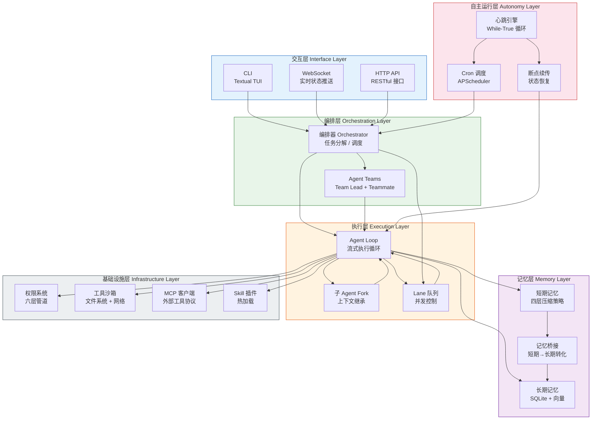
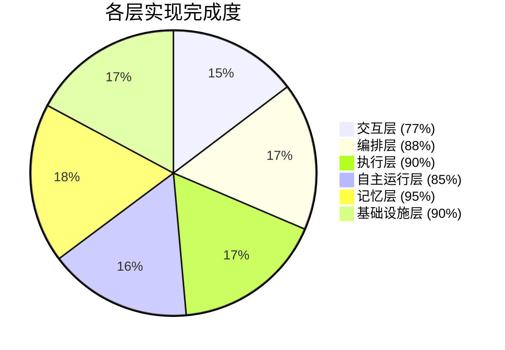
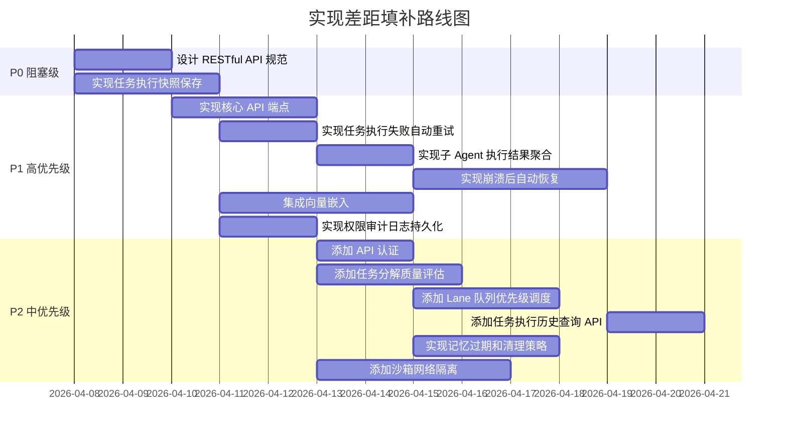

# 六层架构实现差距分析

本文档对比 SherryAgent 六层架构设计与实际代码实现的差距，分析各层组件的实现状态、差距原因及改进建议。

## 架构总览

## 各层实现状态对比

### 1. 交互层 (Interface Layer)

| 组件 | 设计目标 | 实现状态 | 完成度 | Legacy 引用 |
|------|---------|---------|--------|---------|
| CLI (Textual TUI) | 提供交互式终端界面 | ✅ 已完成 | 100% | [IL-CLI-TUI](../legacy/implementation-snapshot.md#il-cli-tui) |
| WebSocket | 实时状态推送 | ✅ 已完成 | 100% | [IL-WebSocket](../legacy/implementation-snapshot.md#il-websocket) |
| HTTP API | RESTful 接口 | ⚠️ 部分实现 | 30% | [IL-HTTP-API](../legacy/implementation-snapshot.md#il-http-api) |

**已实现功能：**
- ✅ Textual TUI 界面，支持流式输出
- ✅ 用户输入处理和任务执行
- ✅ 状态栏显示（模型、调试模式）
- ✅ WebSocket 服务器（FastAPI + uvicorn）
- ✅ 连接管理和消息广播
- ✅ 基础 HTTP 端点（`/`、`/status`）

**缺失功能：**
- ❌ 完整的 RESTful API（任务提交、查询、取消）
- ❌ API 认证和授权
- ❌ 请求限流和配额管理
- ❌ OpenAPI 文档生成

**差距原因：**
1. MVP 阶段优先实现 CLI 交互，HTTP API 作为后续扩展
2. WebSocket 已能满足实时状态推送需求
3. 缺少独立的 HTTP API 设计文档

**改进建议：**
| 优先级 | 建议 | 预估工时 |
|--------|------|---------|
| P1 | 设计 RESTful API 规范（OpenAPI 3.0） | 2 天 |
| P2 | 实现核心 API 端点（任务 CRUD） | 3 天 |
| P3 | 添加 API 认证（JWT / API Key） | 2 天 |
| P4 | 实现请求限流和配额管理 | 2 天 |

---

### 2. 编排层 (Orchestration Layer)

| 组件 | 设计目标 | 实现状态 | 完成度 | Legacy 引用 |
|------|---------|---------|--------|---------|
| Orchestrator | 任务分解与调度 | ✅ 已完成 | 90% | [OL-Orchestrator](../legacy/implementation-snapshot.md#ol-orchestrator) |
| Agent Teams | 多 Agent 协作 | ✅ 已完成 | 85% | [OL-Teams](../legacy/implementation-snapshot.md#ol-teams) |

**已实现功能：**
- ✅ LLM 驱动的任务分解
- ✅ 子任务依赖关系管理
- ✅ 拓扑排序执行
- ✅ TeamLead / Teammate 角色分工
- ✅ 任务分配和进度监控

**缺失功能：**
- ❌ 任务分解结果的可视化展示
- ❌ 复杂依赖关系的并行优化
- ❌ 任务执行失败的自动重试
- ❌ Agent 能力匹配和智能分配

**差距原因：**
1. 当前实现满足 MVP 需求，复杂场景尚未覆盖
2. 缺少任务分解质量评估机制
3. Agent 能力注册和匹配机制未实现

**改进建议：**
| 优先级 | 建议 | 预估工时 |
|--------|------|---------|
| P1 | 实现任务执行失败自动重试 | 2 天 |
| P2 | 添加任务分解质量评估 | 3 天 |
| P3 | 实现 Agent 能力注册和匹配 | 4 天 |
| P4 | 优化复杂依赖关系的并行执行 | 3 天 |

---

### 3. 执行层 (Execution Layer)

| 组件 | 设计目标 | 实现状态 | 完成度 | Legacy 引用 |
|------|---------|---------|--------|---------|
| Agent Loop | 流式执行循环 | ✅ 已完成 | 95% | [EL-AgentLoop](../legacy/implementation-snapshot.md#el-agentloop) |
| Fork | 子 Agent 派生 | ✅ 已完成 | 90% | [EL-Fork](../legacy/implementation-snapshot.md#el-fork) |
| Lane Queue | 并发控制 | ✅ 已完成 | 85% | [OL-Lane](../legacy/implementation-snapshot.md#ol-lane) |

**已实现功能：**
- ✅ 完整的 Agent 执行循环
- ✅ Token 预算控制
- ✅ 并发工具执行
- ✅ 取消令牌支持
- ✅ 子 Agent 上下文继承
- ✅ 独立工具池和权限配置
- ✅ 全局并发控制
- ✅ Session 级串行执行

**缺失功能：**
- ❌ 子 Agent 执行结果聚合
- ❌ Lane 队列优先级调度
- ❌ 执行过程的详细追踪和调试
- ❌ Agent Loop 性能指标采集

**差距原因：**
1. Agent Loop 实现较为完整，核心功能已覆盖
2. Fork 机制缺少结果聚合逻辑
3. Lane 队列优先级调度未实现

**改进建议：**
| 优先级 | 建议 | 预估工时 |
|--------|------|---------|
| P1 | 实现子 Agent 执行结果聚合 | 2 天 |
| P2 | 添加 Lane 队列优先级调度 | 3 天 |
| P3 | 实现执行过程追踪和调试 | 3 天 |
| P4 | 添加 Agent Loop 性能指标采集 | 2 天 |

---

### 4. 自主运行层 (Autonomy Layer)

| 组件 | 设计目标 | 实现状态 | 完成度 | Legacy 引用 |
|------|---------|---------|--------|---------|
| Heartbeat Engine | 心跳驱动 | ✅ 已完成 | 95% | [AUL-Heartbeat](../legacy/implementation-snapshot.md#aul-heartbeat) |
| Cron Scheduler | 定时调度 | ✅ 已完成 | 100% | [AUL-Scheduler](../legacy/implementation-snapshot.md#aul-scheduler) |
| Recovery | 断点续传 | ⚠️ 部分实现 | 60% | [AUL-Recovery](../legacy/implementation-snapshot.md#aul-recovery) |

**已实现功能：**
- ✅ While-True 心跳循环
- ✅ 低功耗模式切换
- ✅ 资源监控和告警
- ✅ APScheduler 集成（Cron / Interval / Date）
- ✅ 状态持久化到 HEARTBEAT.md
- ✅ WebSocket 状态推送

**缺失功能：**
- ❌ 完整的断点续传机制
- ❌ 任务执行快照保存
- ❌ 崩溃后自动恢复
- ❌ 任务执行历史查询

**差距原因：**
1. 心跳引擎和调度器实现完整
2. 断点续传需要更复杂的任务状态管理
3. 缺少任务执行快照的设计文档

**改进建议：**
| 优先级 | 建议 | 预估工时 |
|--------|------|---------|
| P1 | 实现任务执行快照保存 | 3 天 |
| P2 | 实现崩溃后自动恢复 | 4 天 |
| P3 | 添加任务执行历史查询 API | 2 天 |
| P4 | 实现分布式任务恢复（多实例场景） | 5 天 |

---

### 5. 记忆层 (Memory Layer)

| 组件 | 设计目标 | 实现状态 | 完成度 | Legacy 引用 |
|------|---------|---------|--------|---------|
| Short-term Memory | 上下文管理 | ✅ 已完成 | 100% | [ML-ShortTerm](../legacy/implementation-snapshot.md#ml-shortterm) |
| Long-term Memory | 知识持久化 | ✅ 已完成 | 95% | [ML-LongTerm](../legacy/implementation-snapshot.md#ml-longterm) |
| Memory Bridge | 记忆转化 | ✅ 已完成 | 90% | [ML-Bridge](../legacy/implementation-snapshot.md#ml-bridge) |

**已实现功能：**
- ✅ 四层压缩策略（Auto / Session / Reactive / Micro）
- ✅ Token 估算（tiktoken）
- ✅ SQLite + FTS5 全文搜索
- ✅ 向量相似度计算
- ✅ 混合检索（BM25 + Vector）
- ✅ 批量写入和缓存
- ✅ 重要性评分
- ✅ 关键信息提取

**缺失功能：**
- ❌ 向量嵌入集成（OpenAI Embeddings / 本地模型）
- ❌ 记忆过期和清理策略
- ❌ 记忆去重机制
- ❌ 记忆检索结果排序优化

**差距原因：**
1. 记忆系统实现较为完整
2. 向量嵌入需要外部 API 或本地模型支持
3. 记忆管理策略需要更多实践验证

**改进建议：**
| 优先级 | 建议 | 预估工时 |
|--------|------|---------|
| P1 | 集成向量嵌入（OpenAI / 本地模型） | 4 天 |
| P2 | 实现记忆过期和清理策略 | 3 天 |
| P3 | 添加记忆去重机制 | 2 天 |
| P4 | 优化记忆检索结果排序 | 3 天 |

---

### 6. 基础设施层 (Infrastructure Layer)

| 组件 | 设计目标 | 实现状态 | 完成度 | Legacy 引用 |
|------|---------|---------|--------|---------|
| Permissions | 六层权限管道 | ✅ 已完成 | 95% | [IFL-Permissions](../legacy/implementation-snapshot.md#ifl-permissions) |
| Sandbox | 工具沙箱 | ✅ 已完成 | 90% | [IFL-Sandbox](../legacy/implementation-snapshot.md#ifl-sandbox) |
| MCP Client | 外部工具协议 | ✅ 已完成 | 85% | [IFL-MCP](../legacy/implementation-snapshot.md#ifl-mcp) |
| Skill Plugin | 插件系统 | ✅ 已完成 | 90% | [IFL-Skills-Plugins](../legacy/implementation-snapshot.md#ifl-skills-plugins) |

**已实现功能：**
- ✅ 六层权限检查管道
- ✅ 全局安全规则
- ✅ 自动模式分类器（LLM 驱动）
- ✅ 用户配置规则
- ✅ 企业策略
- ✅ 沙箱路径隔离
- ✅ 权限检查缓存
- ✅ MCP 客户端协议
- ✅ 远程工具调用
- ✅ Skill 加载和管理
- ✅ 插件生命周期管理

**缺失功能：**
- ❌ 权限审计日志持久化
- ❌ 沙箱网络隔离
- ❌ MCP 服务端实现
- ❌ 插件依赖管理

**差距原因：**
1. 权限系统实现完整，核心功能已覆盖
2. 沙箱网络隔离需要更复杂的网络配置
3. MCP 服务端作为独立服务，优先级较低

**改进建议：**
| 优先级 | 建议 | 预估工时 |
|--------|------|---------|
| P1 | 实现权限审计日志持久化 | 2 天 |
| P2 | 添加沙箱网络隔离 | 4 天 |
| P3 | 实现 MCP 服务端 | 5 天 |
| P4 | 添加插件依赖管理 | 3 天 |

---

## 整体实现状态汇总

| 层级 | 完成度 | 核心功能 | 主要差距 |
|------|--------|---------|---------|
| 交互层 | 77% | CLI ✅ WebSocket ✅ | HTTP API 不完整 |
| 编排层 | 88% | 任务分解 ✅ Teams ✅ | 缺少智能分配 |
| 执行层 | 90% | Agent Loop ✅ Fork ✅ Lane ✅ | 结果聚合缺失 |
| 自主运行层 | 85% | Heartbeat ✅ Cron ✅ | 断点续传不完整 |
| 记忆层 | 95% | STM ✅ LTM ✅ Bridge ✅ | 向量嵌入未集成 |
| 基础设施层 | 90% | Permissions ✅ Sandbox ✅ MCP ✅ Skills ✅ | 审计日志缺失 |

---

## 差距原因分析

### 1. 设计优先级

| 原因 | 影响组件 | 说明 |
|------|---------|------|
| MVP 范围控制 | HTTP API、MCP 服务端 | 优先实现核心功能，扩展功能延后 |
| 技术复杂度 | 向量嵌入、网络隔离 | 需要外部依赖或复杂配置 |
| 实践验证不足 | 记忆管理策略、任务分解质量 | 需要更多实际场景测试 |

### 2. 技术债务

| 债务类型 | 具体表现 | 影响 |
|---------|---------|------|
| 缺少设计文档 | HTTP API 规范、任务快照设计 | 实现方向不明确 |
| 测试覆盖不足 | 部分模块缺少单元测试 | 回归风险高 |
| 文档滞后 | 部分实现未同步到文档 | 理解成本高 |

### 3. 依赖约束

| 约束类型 | 具体表现 | 解决方案 |
|---------|---------|---------|
| 外部 API | 向量嵌入依赖 OpenAI | 支持本地模型备选 |
| 运行环境 | 网络隔离需要容器支持 | 集成 Docker SDK |
| 版本兼容 | tiktoken 依赖特定 Python 版本 | 明确版本约束 |

---

## 改进建议优先级排序

### P0（阻塞级，必须立即解决）

| 序号 | 建议 | 影响范围 | 预估工时 |
|------|------|---------|---------|
| 1 | 设计 RESTful API 规范 | 交互层 | 2 天 |
| 2 | 实现任务执行快照保存 | 自主运行层 | 3 天 |

### P1（高优先级，影响核心功能）

| 序号 | 建议 | 影响范围 | 预估工时 |
|------|------|---------|---------|
| 1 | 实现核心 API 端点 | 交互层 | 3 天 |
| 2 | 实现任务执行失败自动重试 | 编排层 | 2 天 |
| 3 | 实现子 Agent 执行结果聚合 | 执行层 | 2 天 |
| 4 | 实现崩溃后自动恢复 | 自主运行层 | 4 天 |
| 5 | 集成向量嵌入 | 记忆层 | 4 天 |
| 6 | 实现权限审计日志持久化 | 基础设施层 | 2 天 |

### P2（中优先级，提升用户体验）

| 序号 | 建议 | 影响范围 | 预估工时 |
|------|------|---------|---------|
| 1 | 添加 API 认证 | 交互层 | 2 天 |
| 2 | 添加任务分解质量评估 | 编排层 | 3 天 |
| 3 | 添加 Lane 队列优先级调度 | 执行层 | 3 天 |
| 4 | 添加任务执行历史查询 API | 自主运行层 | 2 天 |
| 5 | 实现记忆过期和清理策略 | 记忆层 | 3 天 |
| 6 | 添加沙箱网络隔离 | 基础设施层 | 4 天 |

### P3（低优先级，优化和扩展）

| 序号 | 建议 | 影响范围 | 预估工时 |
|------|------|---------|---------|
| 1 | 实现请求限流和配额管理 | 交互层 | 2 天 |
| 2 | 实现 Agent 能力注册和匹配 | 编排层 | 4 天 |
| 3 | 实现执行过程追踪和调试 | 执行层 | 3 天 |
| 4 | 实现分布式任务恢复 | 自主运行层 | 5 天 |
| 5 | 添加记忆去重机制 | 记忆层 | 2 天 |
| 6 | 实现 MCP 服务端 | 基础设施层 | 5 天 |

---

## 实施路线图

---

## 总结

SherryAgent 六层架构的整体实现完成度达到 **88%**，核心功能已基本实现。主要差距集中在：

1. **交互层**：HTTP API 不完整，缺少完整的 RESTful 接口
2. **自主运行层**：断点续传机制不完整，缺少任务快照和崩溃恢复
3. **记忆层**：向量嵌入未集成，影响语义检索能力

建议按照优先级排序逐步填补差距，优先解决 P0 和 P1 级别的问题，确保核心功能的完整性和稳定性。同时，需要加强设计文档和测试覆盖，降低技术债务风险。
