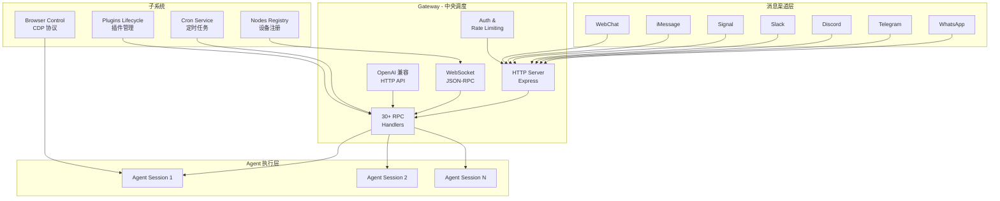
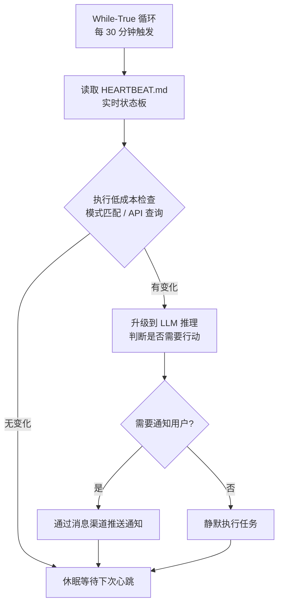

# OpenClaw 架构分析

> OpenClaw（俗称"龙虾"）是由奥地利开发者 Peter Steinberger 创建的开源、本地优先（Local-first）AI Agent 框架。该项目于 2025 年 11 月发布，24 小时内获得超过 9,000 个 GitHub Star，数周内突破 25 万 Star，成为 GitHub 历史上增长最快的项目之一。

## Hub-and-Spoke 架构

## 核心特性

### 心跳机制（Heartbeat）

### 三层记忆系统

| 层级 | 名称 | 内容 | 持久化方式 |
|------|------|------|------------|
| 身份层 | Identity | 角色性格、人设定义 | `SOUL.md` |
| 操作层 | Operational | 行为规则、工作流约束 | `AGENTS.md` + `TOOLS.md` |
| 记忆层 | Memory | 交互历史、事实存储 | `MEMORY.md` + SQLite + JSONL |

### Skill 插件系统

四层插件架构：

| 层级 | 职责 | 关键机制 |
|------|------|----------|
| 发现与验证 | 扫描技能目录、验证格式、检查门控条件 | SKILL.md 作为能力声明单元 |
| 运行时加载 | 按需注入上下文、动态加载脚本 | 无需重启 Gateway |
| 配置管理 | 声明技能目录、管理依赖 | `openclaw.plugin.json` |
| 生命周期管理 | 安装、激活、执行、停用、卸载 | 完整生命周期钩子 |

### Lane 队列系统

| 队列层级 | 说明 | 控制参数 |
|----------|------|----------|
| Session 级串行队列 | 同一会话内的任务严格串行执行 | 无（强制串行） |
| Global 级限流队列 | 跨会话的全局并发控制 | `maxConcurrent` |

## 技术栈

| 维度 | 详情 |
|------|------|
| 技术栈 | TypeScript + Node.js v22+ |
| agents/ 模块 | ~720 文件，~130K 行代码 |
| auto-reply/ 模块 | ~260 文件 |
| gateway/ 模块 | ~310 文件 |
| Gateway 功能 | HTTP Server + WebSocket JSON-RPC + OpenAI 兼容 API + 30+ RPC Handlers |

## 社区生态

| 指标 | 数据 |
|------|------|
| GitHub Star | 250,000+ |
| ClawHub 注册技能数 | 5,700+ |
| 平均实现复杂度 | ~20 行代码即可实现一个完整技能 |

## 安全隐患

| 问题 | 说明 |
|------|------|
| 暴露实例 | 40,214 个 OpenClaw 实例暴露于公网，63% 可被远程代码执行攻击 |
| CVE-2026-25253 | CVSS 8.8，允许攻击者通过恶意网页完全控制系统 |
| ClawHavoc 事件 | 341 个恶意技能被上传到 ClawHub |
| 间接提示词注入 | 与 Google Workspace、Slack 等工具的集成创建了间接提示词注入向量 |
