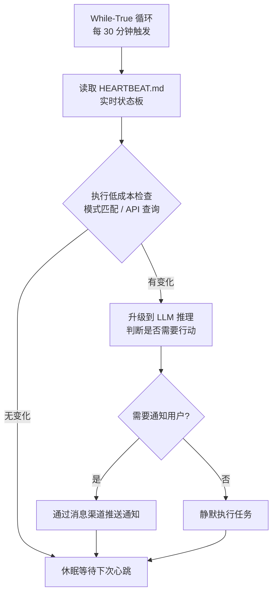
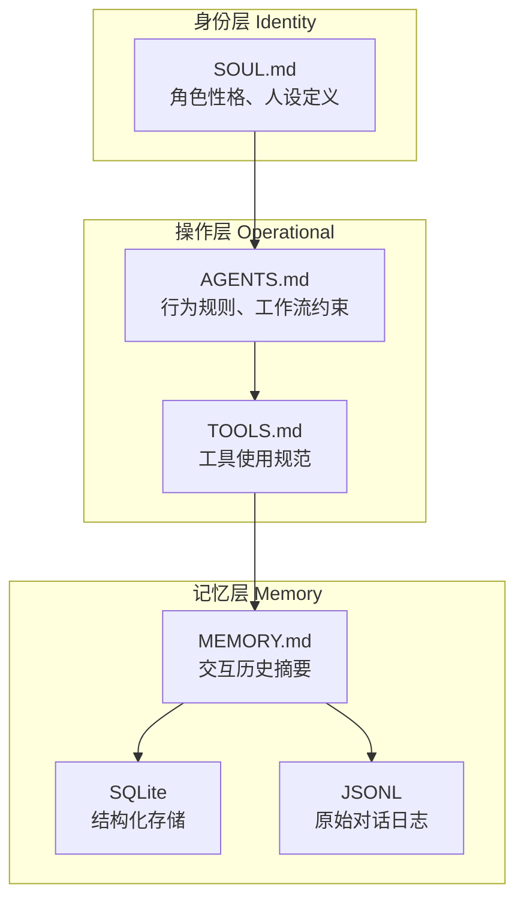
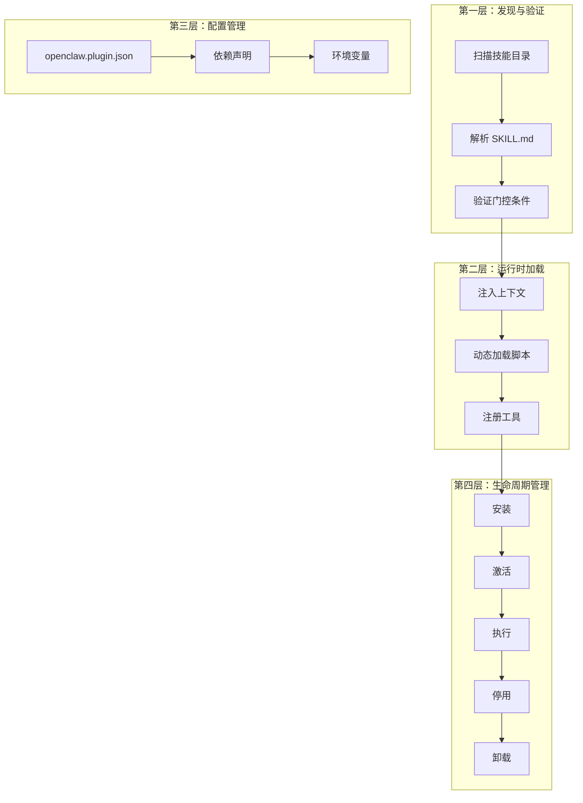
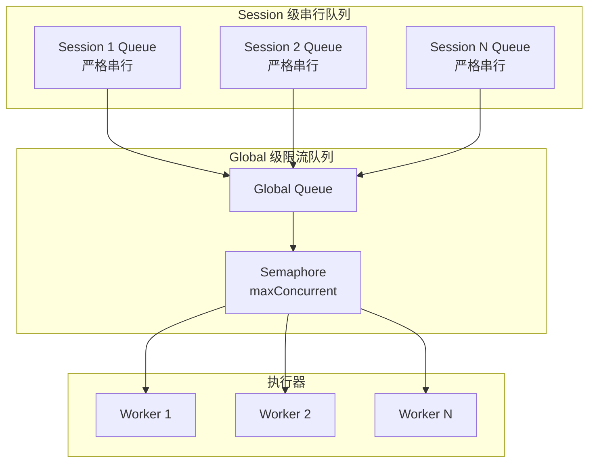
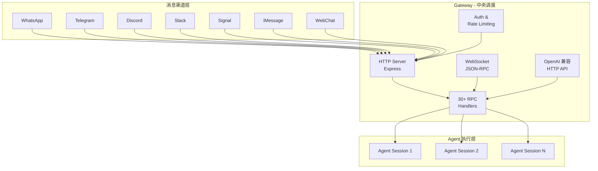
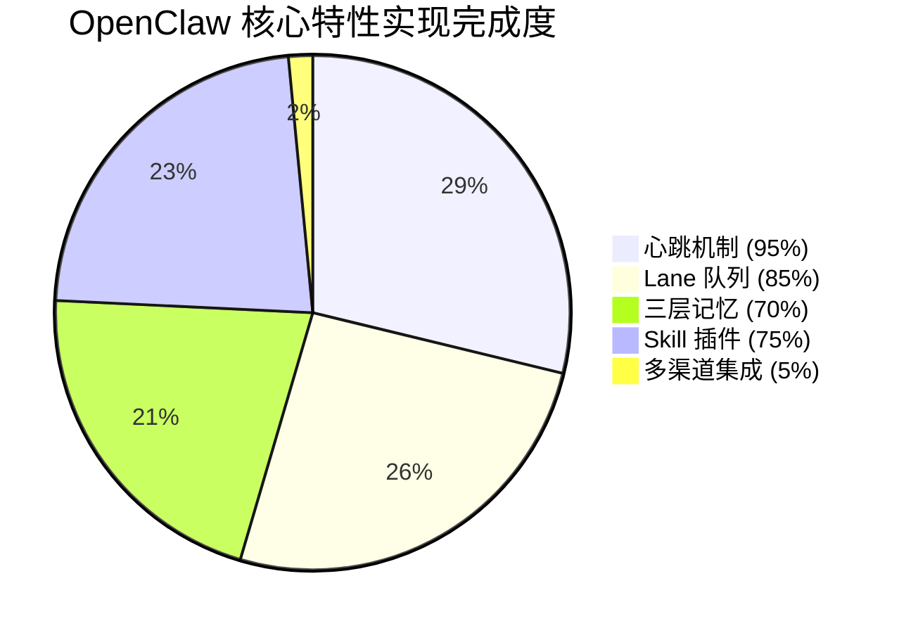
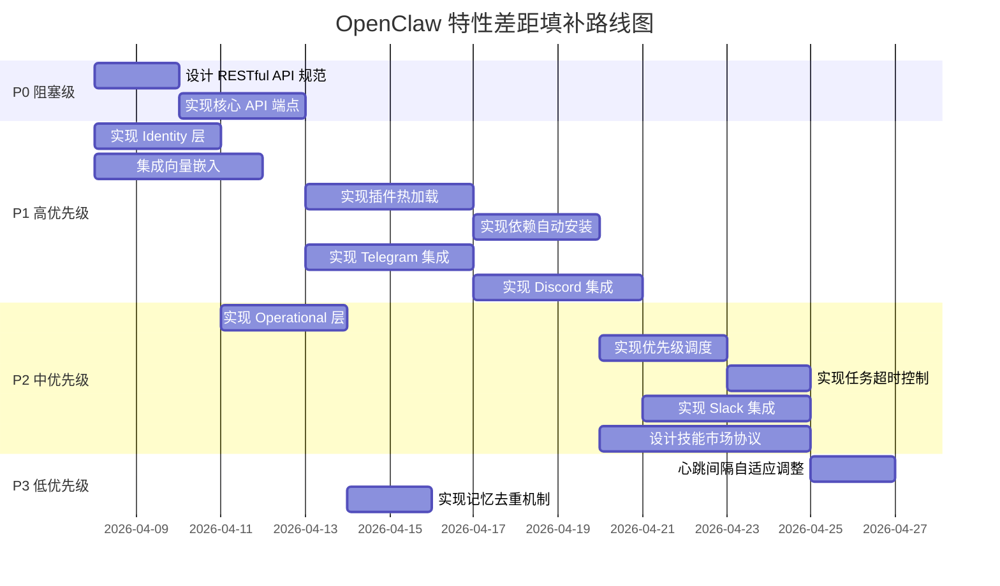

# OpenClaw 核心特性实现差距分析

本文档逐项对比 OpenClaw 核心特性在 SherryAgent 中的实现状态，分析差距原因并提供改进建议。

## 特性对比总览

| 特性模块 | OpenClaw 实现状态 | SherryAgent 实现状态 | 整体差距 | 优先级 |
|---------|------------------|---------------------|---------|--------|
| 心跳机制 | ✅ 完整实现 | ✅ 完整实现 | 🟢 5% | P3 |
| 三层记忆系统 | ✅ 完整实现 | ⚠️ 部分实现 | 🟡 30% | P1 |
| Skill 插件系统 | ✅ 完整实现 | ⚠️ 部分实现 | 🟡 25% | P1 |
| Lane 队列系统 | ✅ 完整实现 | ✅ 基本实现 | 🟢 15% | P2 |
| 多渠道集成 | ✅ 完整实现 | ❌ 未实现 | 🔴 95% | P0 |

---

## 1. 心跳机制对比

### 实现对比表

| 特性 | OpenClaw 实现 | SherryAgent 实现 | 差距 | 优先级 |
|------|--------------|-----------------|------|--------|
| While-True 循环 | ✅ 每 30 分钟触发 | ✅ 可配置间隔（默认 60 秒） | 无 | - |
| HEARTBEAT.md 状态板 | ✅ 实时状态持久化 | ✅ HeartbeatStatusManager | 无 | - |
| 低功耗模式 | ✅ 空闲时切换 | ✅ consecutive_idle_cycles 检测 | 无 | - |
| 资源监控 | ⚠️ 基础监控 | ✅ ResourceMonitor + 告警回调 | SherryAgent 更完善 | - |
| 动态并发调整 | ❌ 固定并发 | ✅ 根据内存/CPU 动态调整 | SherryAgent 更完善 | - |
| Cron 任务集成 | ✅ 独立 Cron Service | ✅ APScheduler 集成 | 无 | - |
| WebSocket 状态推送 | ❌ 无内置 | ✅ WebSocketServer | SherryAgent 更完善 | - |

### OpenClaw 实现细节



**核心特点：**
- 固定 30 分钟心跳间隔
- 低成本检查优先，避免频繁调用 LLM
- 状态持久化到 `HEARTBEAT.md` 文件
- 支持从状态文件恢复

### SherryAgent 实现细节

**关键文件：** [heartbeat.py](file:///Users/liuminxuan/Desktop/sherryAgent/src/sherry_agent/autonomy/heartbeat.py)

```python
class HeartbeatEngine:
    def __init__(self, settings: Settings | None = None, enable_websocket: bool = True):
        self.config = HeartbeatConfig(
            base_interval_seconds=60,           # 默认 60 秒
            low_power_interval_seconds=300,     # 低功耗模式 5 分钟
            idle_threshold_cycles=5,            # 5 个空闲周期后切换
            max_concurrent_tasks=3,
        )
        self.resource_monitor = ResourceMonitor(
            memory_warning_threshold=80.0,
            memory_critical_threshold=90.0,
        )
```

**增强功能：**
1. **动态并发调整**：根据内存/CPU 使用率动态调整 `max_concurrent_tasks`
2. **资源告警**：内存超过阈值时触发告警回调
3. **WebSocket 推送**：实时推送心跳状态到前端
4. **状态恢复**：从 `HEARTBEAT.md` 恢复 `cycle_count` 和 `mode`

### 差距分析

| 维度 | 分析 |
|------|------|
| 功能完整性 | ✅ SherryAgent 实现更完善，增加了资源监控和动态调整 |
| 性能优化 | ✅ SherryAgent 支持低功耗模式切换 |
| 可观测性 | ✅ SherryAgent 提供 WebSocket 实时状态推送 |
| 差距原因 | OpenClaw 的心跳机制较为简单，SherryAgent 在此基础上进行了增强 |

### 改进建议

| 优先级 | 建议 | 预估工时 |
|--------|------|---------|
| P3 | 添加心跳间隔的自适应调整（根据任务负载动态调整） | 2 天 |
| P3 | 实现心跳任务的优先级队列 | 2 天 |

---

## 2. 三层记忆系统对比

### 实现对比表

| 特性 | OpenClaw 实现 | SherryAgent 实现 | 差距 | 优先级 |
|------|--------------|-----------------|------|--------|
| **身份层 (Identity)** | ✅ SOUL.md 定义角色性格 | ❌ 未实现 | 🔴 完全缺失 | P1 |
| **操作层 (Operational)** | ✅ AGENTS.md + TOOLS.md | ⚠️ 仅配置文件 | 🟡 缺少行为规则文件 | P2 |
| **记忆层 (Memory)** | ✅ MEMORY.md + SQLite + JSONL | ✅ SQLite + FTS5 + 向量 | 🟢 功能更强 | - |
| 短期记忆压缩 | ⚠️ 简单截断 | ✅ 四层压缩策略 | SherryAgent 更完善 | - |
| 长期记忆检索 | ⚠️ 基础全文搜索 | ✅ FTS5 + 向量混合检索 | SherryAgent 更完善 | - |
| 记忆桥接 | ⚠️ 手动触发 | ✅ 自动重要性评分 + 批量转移 | SherryAgent 更完善 | - |
| 向量嵌入 | ✅ 集成外部 API | ⚠️ 框架已就绪，未集成 | 🟡 需要配置 | P1 |

### OpenClaw 三层记忆架构



**层级职责：**
| 层级 | 文件 | 内容 | 更新频率 |
|------|------|------|---------|
| 身份层 | `SOUL.md` | 角色性格、核心价值观、人设定义 | 极少更新 |
| 操作层 | `AGENTS.md` + `TOOLS.md` | 行为规则、工作流约束、工具使用规范 | 按需更新 |
| 记忆层 | `MEMORY.md` + SQLite + JSONL | 交互历史、事实存储、对话日志 | 实时更新 |

### SherryAgent 记忆系统实现

**关键文件：**
- [short_term.py](file:///Users/liuminxuan/Desktop/sherryAgent/src/sherry_agent/memory/short_term.py)
- [long_term.py](file:///Users/liuminxuan/Desktop/sherryAgent/src/sherry_agent/memory/long_term.py)
- [bridge.py](file:///Users/liuminxuan/Desktop/sherryAgent/src/sherry_agent/memory/bridge.py)

**短期记忆（ShortTermMemory）：**
```python
class ShortTermMemory:
    def compact(self, level: str = "auto"):
        """四层压缩策略：
        - auto: LLM 摘要压缩
        - session: 结构化提取
        - reactive: 激进压缩（保留最近 100 字符）
        - micro: 单项压缩（移除冗余短语）
        """
```

**长期记忆（LongTermMemory）：**
```python
class LongTermMemory:
    async def hybrid_search(
        self, 
        query: str, 
        query_vector: list[float] | None = None,
        bm25_weight: float = 0.5,
        vector_weight: float = 0.5
    ):
        """混合检索：BM25 全文搜索 + 向量相似度"""
```

**记忆桥接（MemoryBridge）：**
```python
class MemoryBridge:
    def calculate_importance_score(self, item: dict[str, Any]) -> float:
        """重要性评分：
        - 长度得分（最长 0.3 分）
        - 关键信息得分（最多 0.3 分）
        - 关键词得分（最多 0.2 分）
        - 时效性得分（最多 0.3 分）
        """
```

### 差距分析

| 维度 | OpenClaw | SherryAgent | 差距原因 |
|------|----------|-------------|---------|
| 身份层 | ✅ SOUL.md 定义角色 | ❌ 未实现 | SherryAgent 侧重功能性，缺少人设管理 |
| 操作层 | ✅ AGENTS.md + TOOLS.md | ⚠️ 仅配置文件 | SherryAgent 使用 TOML 配置，缺少行为规则文档 |
| 记忆层 | ✅ MEMORY.md + SQLite | ✅ SQLite + FTS5 | SherryAgent 实现更完善 |
| 向量嵌入 | ✅ 集成 OpenAI | ⚠️ 框架已就绪 | 需要配置外部 API |

### 改进建议

| 优先级 | 建议 | 预估工时 |
|--------|------|---------|
| P1 | 实现 Identity 层：创建 `SOUL.md` 文件格式和加载逻辑 | 3 天 |
| P1 | 集成向量嵌入：支持 OpenAI Embeddings 或本地模型 | 4 天 |
| P2 | 实现 Operational 层：创建 `AGENTS.md` 和 `TOOLS.md` 行为规则文件 | 3 天 |
| P2 | 添加记忆过期和清理策略 | 3 天 |
| P3 | 实现记忆去重机制 | 2 天 |

---

## 3. Skill 插件系统对比

### 实现对比表

| 特性 | OpenClaw 实现 | SherryAgent 实现 | 差距 | 优先级 |
|------|--------------|-----------------|------|--------|
| **发现与验证** | ✅ 扫描技能目录 + SKILL.md | ✅ SkillLoader + SkillValidator | 无 | - |
| **运行时加载** | ✅ 按需注入上下文 | ⚠️ 启动时加载 | 🟡 缺少热加载 | P1 |
| **配置管理** | ✅ openclaw.plugin.json | ✅ settings.toml | 无 | - |
| **生命周期管理** | ✅ 完整生命周期钩子 | ✅ PluginHooks | 无 | - |
| SKILL.md 标准格式 | ✅ 标准化能力声明 | ✅ SkillParser 解析 | 无 | - |
| 依赖管理 | ✅ 自动依赖解析 | ⚠️ 仅检查，未解析 | 🟡 缺少自动安装 | P2 |
| 热加载 | ✅ 无需重启 Gateway | ❌ 需要重启 | 🔴 缺失 | P1 |
| 技能市场 | ✅ ClawHub（5700+ 技能） | ❌ 未实现 | 🔴 完全缺失 | P2 |

### OpenClaw 四层插件架构



**SKILL.md 标准格式：**
```markdown
# Skill Name
version: 1.0.0
description: Skill description

## Dependencies
- dependency_name@version

## Triggers
- keyword: "trigger phrase"
- event: "event_name"
- schedule: "cron_expression"

## Entry Point
path/to/entry.py::function_name

## Environment Variables
API_KEY=required
DEBUG=false
```

### SherryAgent 插件系统实现

**关键文件：**
- [manager.py](file:///Users/liuminxuan/Desktop/sherryAgent/src/sherry_agent/plugins/manager.py)
- [loader.py](file:///Users/liuminxuan/Desktop/sherryAgent/src/sherry_agent/plugins/loader.py)
- [skill_parser.py](file:///Users/liuminxuan/Desktop/sherryAgent/src/sherry_agent/plugins/skill_parser.py)

**插件加载流程：**
```python
class PluginLoader:
    def load_all(self) -> List[Plugin]:
        """加载所有插件：
        1. 从 plugin_dirs 目录加载
        2. 从 entry points 加载
        3. 注册到 plugin_hooks
        """
        loaded = []
        for directory in self.plugin_dirs:
            loaded.extend(self.load_from_directory(directory))
        loaded.extend(self.load_from_entry_points())
        return loaded
```

**技能解析：**
```python
class SkillParser:
    @staticmethod
    def parse(file_path: str) -> Optional[SkillDefinition]:
        """解析 SKILL.md：
        - 元数据（名称、版本、描述）
        - 依赖列表
        - 触发条件
        - 入口点
        - 环境变量
        """
```

**生命周期钩子：**
```python
class PluginHooks:
    @hookspec
    def plugin_loaded(self, plugin: Plugin) -> None: ...
    
    @hookspec
    def plugin_unloaded(self, plugin: Plugin) -> None: ...
    
    @hookspec
    def agent_started(self, agent_id: str, config: Dict) -> None: ...
    
    @hookspec
    def agent_stopped(self, agent_id: str, status: str) -> None: ...
```

### 差距分析

| 维度 | OpenClaw | SherryAgent | 差距原因 |
|------|----------|-------------|---------|
| 发现与验证 | ✅ 完整 | ✅ 完整 | 无差距 |
| 运行时加载 | ✅ 热加载 | ❌ 启动时加载 | SherryAgent 缺少热加载机制 |
| 依赖管理 | ✅ 自动解析安装 | ⚠️ 仅检查 | SherryAgent 未实现自动依赖安装 |
| 技能市场 | ✅ ClawHub | ❌ 未实现 | 需要独立的基础设施 |

### 改进建议

| 优先级 | 建议 | 预估工时 |
|--------|------|---------|
| P1 | 实现插件热加载：使用 `watchdog` 监听文件变化 | 4 天 |
| P1 | 实现依赖自动安装：集成 `pip` 或 `uv` | 3 天 |
| P2 | 设计技能市场协议：支持技能发布、搜索、安装 | 5 天 |
| P2 | 添加插件隔离：使用独立进程或沙箱 | 4 天 |
| P3 | 实现插件版本管理：支持多版本共存 | 3 天 |

---

## 4. Lane 队列系统对比

### 实现对比表

| 特性 | OpenClaw 实现 | SherryAgent 实现 | 差距 | 优先级 |
|------|--------------|-----------------|------|--------|
| **Session 级串行队列** | ✅ 同会话严格串行 | ✅ session_queues 字典 | 无 | - |
| **Global 级限流队列** | ✅ maxConcurrent 控制 | ✅ Semaphore 控制 | 无 | - |
| 优先级调度 | ⚠️ 基础优先级 | ❌ 未实现 | 🟡 缺失 | P2 |
| 任务取消 | ✅ 支持取消 | ⚠️ 部分支持 | 🟡 需完善 | P2 |
| 任务超时 | ✅ 超时控制 | ❌ 未实现 | 🟡 缺失 | P2 |
| 结果聚合 | ✅ 自动聚合 | ❌ 未实现 | 🟡 缺失 | P1 |
| 队列监控 | ⚠️ 基础监控 | ⚠️ 基础监控 | 无 | - |

### OpenClaw Lane 队列架构



**控制参数：**
| 参数 | 说明 | 默认值 |
|------|------|--------|
| `maxConcurrent` | 全局最大并发数 | 10 |
| `sessionSerial` | 是否启用 Session 级串行 | true |
| `taskTimeout` | 任务超时时间（秒） | 300 |

### SherryAgent Lane 队列实现

**关键文件：** [lane.py](file:///Users/liuminxuan/Desktop/sherryAgent/src/sherry_agent/orchestration/lane.py)

```python
class LaneQueue:
    def __init__(self, config: LaneConfig):
        self._global_queue = asyncio.Queue()
        self._session_queues: Dict[str, asyncio.Queue] = {}
        self._task_semaphore = asyncio.Semaphore(config.max_concurrent)
        
    async def submit(self, sub_task: SubTask) -> str:
        """提交子任务：
        - Session 级串行：放入 session_queues
        - Global 级并发：放入 global_queue
        """
        if self.config.session_serial and sub_task.session_id:
            await self._session_queues[session_id].put((ticket_id, sub_task))
        else:
            await self._global_queue.put((ticket_id, sub_task))
```

**执行流程：**
```python
async def _process_queue(self):
    """处理队列中的任务：
    1. 优先处理 Session 队列
    2. 再处理 Global 队列
    3. 使用 Semaphore 控制并发
    """
    while self._running:
        # 处理 session 队列
        for session_id, session_queue in self._session_queues.items():
            if not session_queue.empty():
                ticket_id, task = await session_queue.get()
                await self._execute_task(ticket_id, task)
        
        # 处理全局队列
        if not self._global_queue.empty():
            ticket_id, task = await self._global_queue.get()
            await self._execute_task(ticket_id, task)
```

### 差距分析

| 维度 | OpenClaw | SherryAgent | 差距原因 |
|------|----------|-------------|---------|
| Session 级串行 | ✅ 严格串行 | ✅ 严格串行 | 无差距 |
| Global 级限流 | ✅ Semaphore | ✅ Semaphore | 无差距 |
| 优先级调度 | ⚠️ 基础实现 | ❌ 未实现 | SherryAgent 使用 FIFO 队列 |
| 任务超时 | ✅ 超时控制 | ❌ 未实现 | SherryAgent 缺少超时机制 |
| 结果聚合 | ✅ 自动聚合 | ❌ 未实现 | SherryAgent 需要手动查询结果 |

### 改进建议

| 优先级 | 建议 | 预估工时 |
|--------|------|---------|
| P1 | 实现子 Agent 执行结果聚合 | 2 天 |
| P2 | 添加 Lane 队列优先级调度 | 3 天 |
| P2 | 实现任务超时控制 | 2 天 |
| P2 | 完善任务取消机制 | 2 天 |
| P3 | 添加队列监控指标（队列长度、等待时间） | 2 天 |

---

## 5. 多渠道集成对比

### 实现对比表

| 特性 | OpenClaw 实现 | SherryAgent 实现 | 差距 | 优先级 |
|------|--------------|-----------------|------|--------|
| **WebSocket** | ✅ JSON-RPC | ✅ FastAPI WebSocket | 无 | - |
| **HTTP API** | ✅ OpenAI 兼容 API | ⚠️ 基础端点 | 🟡 不完整 | P0 |
| **WhatsApp** | ✅ 完整集成 | ❌ 未实现 | 🔴 完全缺失 | P1 |
| **Telegram** | ✅ 完整集成 | ❌ 未实现 | 🔴 完全缺失 | P1 |
| **Discord** | ✅ 完整集成 | ❌ 未实现 | 🔴 完全缺失 | P1 |
| **Slack** | ✅ 完整集成 | ❌ 未实现 | 🔴 完全缺失 | P1 |
| **Signal** | ✅ 完整集成 | ❌ 未实现 | 🔴 完全缺失 | P2 |
| **iMessage** | ✅ 完整集成 | ❌ 未实现 | 🔴 完全缺失 | P2 |
| **WebChat** | ✅ 完整集成 | ⚠️ WebSocket 替代 | 🟡 功能受限 | P2 |
| **RPC Handlers** | ✅ 30+ Handlers | ❌ 未实现 | 🔴 完全缺失 | P1 |

### OpenClaw Hub-and-Spoke 架构



**支持的渠道：**
| 渠道 | 协议 | 特点 |
|------|------|------|
| WhatsApp | WhatsApp Business API | 企业级消息推送 |
| Telegram | Bot API | 免费且功能强大 |
| Discord | Discord.js | 社区生态丰富 |
| Slack | Slack API | 企业协作首选 |
| Signal | Signal CLI | 注重隐私 |
| iMessage | AppleScript | macOS 专属 |
| WebChat | WebSocket | 自定义前端 |

### SherryAgent 渠道实现

**关键文件：** [websocket.py](file:///Users/liuminxuan/Desktop/sherryAgent/src/sherry_agent/autonomy/websocket.py)

```python
class WebSocketServer:
    def __init__(self, host: str = "0.0.0.0", port: int = 8000):
        self.app = FastAPI()
        self.manager = ConnectionManager()
        
    def _setup_routes(self):
        @self.app.websocket("/ws")
        async def websocket_endpoint(websocket: WebSocket):
            await self.manager.connect(websocket)
            while True:
                await websocket.receive_text()
        
        @self.app.get("/")
        async def root():
            return {"message": "SherryAgent WebSocket Server"}
        
        @self.app.get("/status")
        async def get_status():
            return {
                "active_connections": len(self.manager.active_connections),
                "server": f"{self.host}:{self.port}"
            }
```

**已实现功能：**
- ✅ WebSocket 连接管理
- ✅ 消息广播
- ✅ 基础 HTTP 端点（`/`、`/status`）
- ✅ CORS 支持

**缺失功能：**
- ❌ 完整的 RESTful API
- ❌ OpenAI 兼容 API
- ❌ 第三方消息渠道集成
- ❌ RPC Handlers
- ❌ 认证和授权
- ❌ 请求限流

### 差距分析

| 维度 | OpenClaw | SherryAgent | 差距原因 |
|------|----------|-------------|---------|
| 架构设计 | ✅ Hub-and-Spoke | ⚠️ 单一 WebSocket | SherryAgent 缺少中央网关设计 |
| 渠道数量 | ✅ 7+ 渠道 | ⚠️ 仅 WebSocket | SherryAgent 专注 CLI，未扩展渠道 |
| API 完整性 | ✅ OpenAI 兼容 | ⚠️ 基础端点 | SherryAgent HTTP API 不完整 |
| RPC 支持 | ✅ 30+ Handlers | ❌ 未实现 | SherryAgent 缺少 RPC 机制 |

### 改进建议

| 优先级 | 建议 | 预估工时 |
|--------|------|---------|
| P0 | 设计 RESTful API 规范（OpenAPI 3.0） | 2 天 |
| P0 | 实现核心 API 端点（任务 CRUD） | 3 天 |
| P1 | 实现 Telegram Bot 集成 | 4 天 |
| P1 | 实现 Discord Bot 集成 | 4 天 |
| P1 | 实现 Slack App 集成 | 4 天 |
| P1 | 设计 RPC Handler 机制 | 3 天 |
| P2 | 实现 WhatsApp Business API 集成 | 5 天 |
| P2 | 实现 Signal CLI 集成 | 3 天 |
| P2 | 添加 API 认证（JWT / API Key） | 2 天 |
| P3 | 实现请求限流和配额管理 | 2 天 |

---

## 整体差距汇总

### 实现完成度统计



### 优先级排序

| 优先级 | 特性模块 | 关键差距 | 预估总工时 |
|--------|---------|---------|-----------|
| P0 | 多渠道集成 | HTTP API 不完整，缺少第三方渠道 | 5 天 |
| P1 | 三层记忆 | 缺少 Identity 层，向量嵌入未集成 | 7 天 |
| P1 | Skill 插件 | 缺少热加载和依赖自动安装 | 7 天 |
| P2 | Lane 队列 | 缺少优先级调度和任务超时 | 7 天 |
| P3 | 心跳机制 | 可选优化项 | 4 天 |

### 差距原因分析

| 原因类型 | 具体表现 | 影响范围 |
|---------|---------|---------|
| **架构差异** | SherryAgent 采用六层架构，OpenClaw 采用 Hub-and-Spoke | 多渠道集成 |
| **设计优先级** | SherryAgent 优先实现核心 Agent 功能，渠道集成延后 | 多渠道集成、HTTP API |
| **技术复杂度** | 向量嵌入、热加载需要外部依赖或复杂机制 | 三层记忆、Skill 插件 |
| **实践验证** | 部分功能需要更多实际场景测试 | Lane 队列、心跳机制 |

---

## 实施路线图



---

## 总结

SherryAgent 在核心 Agent 功能（心跳机制、Lane 队列、记忆系统）方面实现较为完善，甚至在某些方面（资源监控、四层压缩、混合检索）超越了 OpenClaw。主要差距集中在：

1. **多渠道集成（95% 差距）**：SherryAgent 仅实现了 WebSocket，缺少第三方消息渠道和完整的 HTTP API
2. **三层记忆系统（30% 差距）**：缺少 Identity 层（SOUL.md）和向量嵌入集成
3. **Skill 插件系统（25% 差距）**：缺少热加载机制和技能市场

建议按照 P0 → P1 → P2 → P3 的优先级顺序逐步填补差距，优先解决 HTTP API 和 Identity 层的实现，确保核心功能的完整性和可用性。
