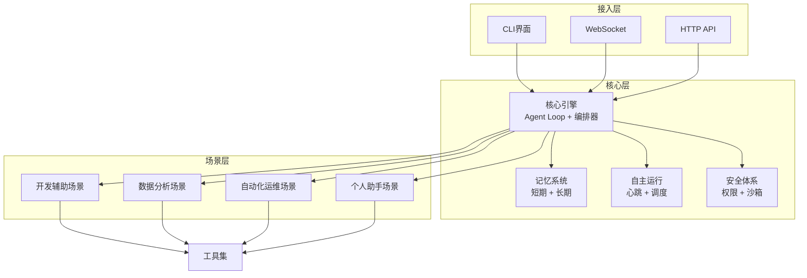
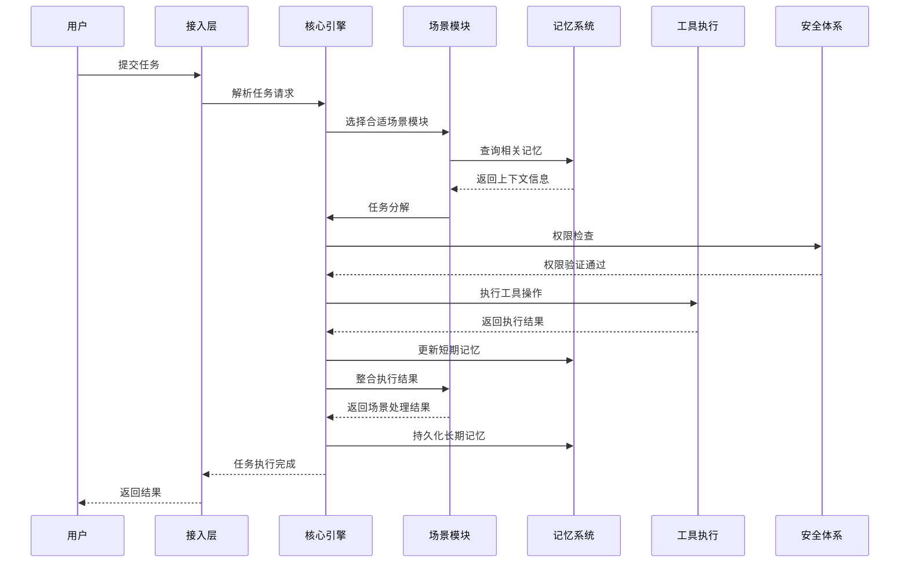
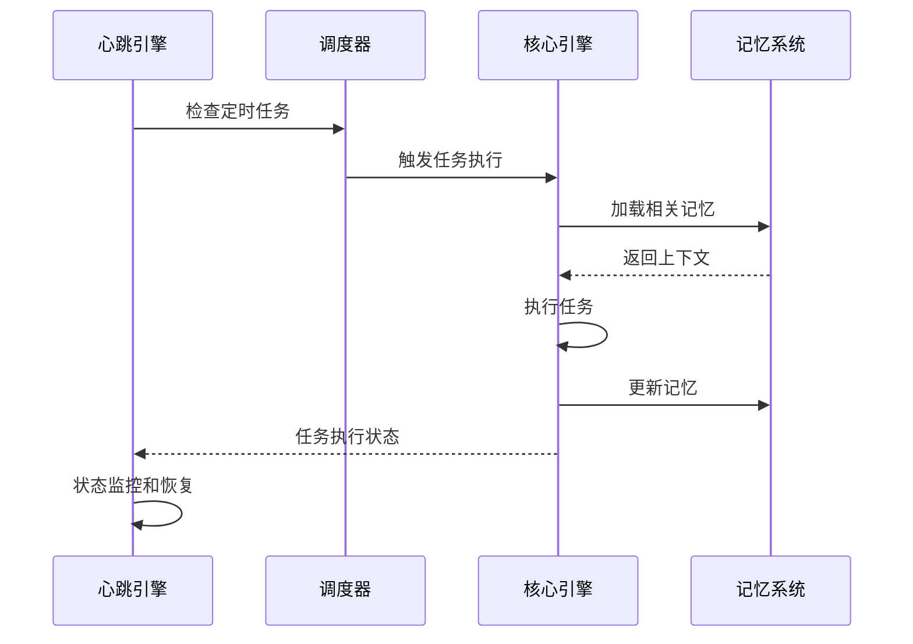

# SherryAgent 系统进化设计

## 1. 系统目标与价值

### 1.1 核心目标

- **学习Agent开发技术**：作为实践项目，深入理解AI Agent架构和实现原理
- **毕业项目需求**：提供完整的技术实现和文档，满足学位论文要求
- **简历项目展示**：在简历中展示AI相关技能和项目经验
- **解决特定业务问题**：针对开发辅助、数据分析、自动化运维、个人助手等场景提供解决方案

### 1.2 价值主张

- **技术融合**：融合Claude Code的编排精度和OpenClaw的自主运行能力
- **学习平台**：提供完整的Agent开发学习体系和实践环境
- **解决方案**：针对特定业务场景提供实用的Agent解决方案
- **可扩展架构**：为未来功能扩展和技术迭代提供基础

## 2. 核心痛点与解决方案

### 2.1 核心痛点

| 痛点 | 描述 | 解决方案 |
|------|------|----------|
| **Agent自主性不足** | 现有Agent框架缺乏持续自主运行能力，依赖人工监督 | 增强心跳引擎，实现智能调度和自动决策 |
| **记忆系统不完善** | Agent难以有效存储和检索长期记忆，上下文管理混乱 | 优化记忆系统，实现四层压缩和三层长期记忆 |
| **编排能力有限** | 多Agent协作和任务分解能力不足，难以处理复杂任务 | 强化编排器，支持动态任务分解和团队协作 |
| **安全风险高** | Agent操作缺乏有效权限控制和安全保障 | 完善权限系统，实现六层纵深防御 |
| **开发门槛高** | 现有框架学习曲线陡峭，难以快速上手 | 提供模块化设计和场景化插件，降低开发难度 |

### 2.2 技术挑战

- **Token消耗失控**：心跳循环可能导致Token消耗"滚雪球"式增长
- **权限过于严格**：六层权限管道可能影响自动化效率
- **记忆检索冗余**：全量检索可能注入冗余信息
- **异步操作复杂性**：asyncio使用不当可能导致性能问题

## 3. 可用与有效的定义

### 3.1 可用的定义

- **基础功能完备**：核心Agent Loop、工具调用、基本记忆等功能正常工作
- **稳定可靠**：系统运行稳定，错误处理完善，具备崩溃恢复能力
- **易用性**：提供清晰的接口和文档，易于集成和扩展
- **兼容性**：支持主流LLM模型和工具集成

### 3.2 有效的定义

- **任务完成率高**：能高质量完成各类指定任务，成功率达到预期
- **资源消耗合理**：Token使用、计算资源消耗在可接受范围内
- **可扩展性强**：易于添加新功能、集成新工具和模型
- **响应速度快**：任务处理的响应时间和执行速度满足用户需求

## 4. 系统架构设计

### 4.1 场景驱动的模块化架构

### 4.2 模块拆解

#### 4.2.1 核心层模块

1. **核心引擎模块**
   - Agent Loop：流式执行循环，支持工具调用和上下文管理
   - 编排器：任务分解、子Agent分配、团队协调
   - 工具执行器：安全执行外部工具和插件

2. **记忆系统模块**
   - 短期记忆：四层压缩策略，管理会话级上下文
   - 长期记忆：SQLite + 向量存储，持久化知识
   - 记忆桥接：短期→长期转化，智能检索

3. **自主运行模块**
   - 心跳引擎：持续运行监控，状态管理
   - Cron调度：定时任务管理，计划执行
   - 断点续传：崩溃恢复，状态持久化

4. **安全体系模块**
   - 权限系统：六层纵深防御，细粒度控制
   - 沙箱：文件系统和网络访问限制
   - 审计日志：操作记录，可追溯性

#### 4.2.2 场景层模块

1. **开发辅助场景**
   - 代码生成：智能代码生成和补全
   - 代码审查：代码质量分析和优化建议
   - 技术文档：自动生成技术文档

2. **数据分析场景**
   - 数据处理：数据清洗和转换
   - 可视化：数据可视化和图表生成
   - 洞察生成：智能数据分析和洞察

3. **自动化运维场景**
   - 系统监控：资源使用和性能监控
   - 故障排查：自动诊断和问题解决
   - 日常维护：自动化运维任务执行

4. **个人助手场景**
   - 日程管理：日历和任务管理
   - 信息整理：文档和信息组织
   - 任务提醒：智能提醒和通知

#### 4.2.3 接入层模块

1. **CLI界面**
   - Textual TUI：交互式终端界面
   - 命令解析：命令行参数处理
   - 流式输出：实时执行状态展示

2. **WebSocket**
   - 实时状态推送：系统状态和执行进度
   - 双向通信：支持远程控制和监控

3. **HTTP API**
   - RESTful接口：标准化API设计
   - 认证授权：安全访问控制
   - 批量操作：支持批量任务提交

## 5. 系统链路设计

### 5.1 核心执行链路

### 5.2 自主运行链路

## 6. 评测体系设计

### 6.1 混合评测方案

#### 6.1.1 标准化评测

- **数据集选择**：GAIA、MT-Bench、AgentBench等标准数据集
- **评测指标**：
  - 任务成功率：完成指定任务的比例
  - 响应时间：任务处理的平均时间
  - Token消耗：完成任务的Token使用量
  - 稳定性：系统运行的稳定性和错误率

#### 6.1.2 场景化评测

- **开发辅助场景**：
  - 代码生成质量：正确性、可读性、性能
  - 代码审查效果：问题发现率、修复建议质量
  - 文档生成质量：完整性、准确性、格式规范

- **数据分析场景**：
  - 数据处理准确性：处理结果的正确性
  - 可视化效果：图表质量和信息传达
  - 洞察质量：分析深度和实用性

- **自动化运维场景**：
  - 监控覆盖率：系统监控的全面性
  - 故障诊断准确率：问题定位的准确性
  - 运维效率提升：自动化带来的时间节省

- **个人助手场景**：
  - 任务完成率：日常任务的完成质量
  - 信息管理效果：信息组织的有效性
  - 用户满意度：用户体验和交互质量

### 6.2 评测流程

1. **基准测试**：使用标准数据集建立性能基准
2. **场景测试**：针对各场景执行专门测试用例
3. **集成测试**：测试系统整体性能和稳定性
4. **回归测试**：确保系统更新后性能不退化
5. **用户反馈**：收集真实用户的使用反馈

## 7. 回归测试策略

### 7.1 测试分层

- **单元测试**：测试核心组件和函数
- **集成测试**：测试模块间的交互
- **E2E测试**：测试完整业务流程
- **性能测试**：测试系统性能和资源消耗

### 7.2 回归测试流程

1. **测试用例管理**：维护标准化测试用例库
2. **自动化测试**：使用CI/CD流程自动执行测试
3. **性能监控**：持续监控系统性能指标
4. **问题追踪**：及时发现和修复回归问题
5. **测试覆盖**：确保关键功能和路径都有测试覆盖

### 7.3 测试工具链

- **pytest**：单元测试和集成测试
- **Playwright**：E2E测试
- **Locust**：性能测试
- **GitHub Actions**：CI/CD集成

## 8. 成本控制策略

### 8.1 Token使用优化

- **智能上下文压缩**：根据任务类型和重要性动态调整上下文长度
- **Token预算管理**：为每个任务设置Token使用上限
- **缓存机制**：缓存重复计算和工具执行结果
- **增量更新**：只传递变化的上下文信息

### 8.2 模型选择策略

- **动态模型选择**：根据任务复杂度自动选择合适的模型
- **模型分级**：将任务分为不同级别，使用对应能力的模型
- **本地模型集成**：对于简单任务使用本地模型，复杂任务使用API模型
- **模型微调**：针对特定场景微调模型，提高效率

### 8.3 计算资源优化

- **并发控制**：合理控制并发任务数量，避免资源竞争
- **任务调度**：智能调度任务执行顺序，优化资源利用
- **资源监控**：实时监控系统资源使用情况，动态调整
- **容器化部署**：使用容器化技术，提高资源利用率

### 8.4 缓存与复用

- **记忆缓存**：缓存频繁访问的记忆信息
- **工具结果缓存**：缓存工具执行结果，避免重复调用
- **知识图谱复用**：构建和复用领域知识图谱
- **模板复用**：为常见任务提供预定义模板

## 9. 从Demo到完整项目的进化路径

### 9.1 阶段一：核心能力构建（2-3周）

- **目标**：完善核心Agent Loop和基础功能
- **任务**：
  - 实现稳定的Agent Loop执行流程
  - 构建基本的记忆系统
  - 实现基础的工具调用能力
  - 建立安全权限体系

### 9.2 阶段二：场景能力开发（4-6周）

- **目标**：开发各场景模块，实现业务功能
- **任务**：
  - 开发开发辅助场景模块
  - 开发数据分析场景模块
  - 开发自动化运维场景模块
  - 开发个人助手场景模块

### 9.3 阶段三：自主运行能力强化（2-3周）

- **目标**：实现持续自主运行能力
- **任务**：
  - 完善心跳引擎
  - 实现Cron调度系统
  - 开发断点续传功能
  - 优化自主决策算法

### 9.4 阶段四：评测与优化（2-3周）

- **目标**：建立评测体系，优化系统性能
- **任务**：
  - 实现标准化评测框架
  - 开发场景化评测用例
  - 执行性能优化
  - 成本控制策略实施

### 9.5 阶段五：文档与部署（1-2周）

- **目标**：完善文档，准备部署
- **任务**：
  - 编写完整的技术文档
  - 准备部署配置和脚本
  - 开发用户指南
  - 进行最终测试和验证

## 10. 风险与应对策略

### 10.1 技术风险

| 风险 | 描述 | 应对策略 |
|------|------|----------|
| **Token消耗失控** | 心跳循环导致Token使用量激增 | 实现Token预算管理和智能上下文压缩 |
| **系统稳定性** | 复杂任务可能导致系统崩溃 | 加强错误处理和崩溃恢复机制 |
| **性能瓶颈** | 并发任务可能导致性能下降 | 优化并发控制和资源调度 |
| **安全漏洞** | 工具调用可能带来安全风险 | 强化权限系统和沙箱隔离 |

### 10.2 项目风险

| 风险 | 描述 | 应对策略 |
|------|------|----------|
| **范围蔓延** | 功能需求不断增加 | 严格控制项目范围，采用MVP策略 |
| **时间压力** | 开发时间不足 | 合理规划任务，优先实现核心功能 |
| **技术债务** | 快速开发导致代码质量下降 | 定期代码审查，保持代码质量 |
| **依赖风险** | 外部依赖可能不稳定 | 锁定依赖版本，建立依赖管理机制 |

## 11. 结论与建议

SherryAgent系统通过场景驱动的重构方案，能够从一个demo项目进化为完整的AI Agent框架。该方案既保留了现有架构的核心优势，又通过场景化设计提升了系统的实用性和扩展性。

### 关键建议

1. **坚持场景驱动**：以业务场景为中心，确保系统能够解决实际问题
2. **注重核心能力**：优先完善核心引擎、记忆系统和自主运行能力
3. **建立评测体系**：持续评估系统性能，指导优化方向
4. **控制成本消耗**：实施Token使用优化和资源管理策略
5. **保持模块化**：确保系统各组件松耦合，易于扩展和维护

通过以上策略，SherryAgent将成为一个功能完备、性能优异、成本可控的AI Agent框架，既满足学习和研究需求，又能为实际业务场景提供有效的解决方案。