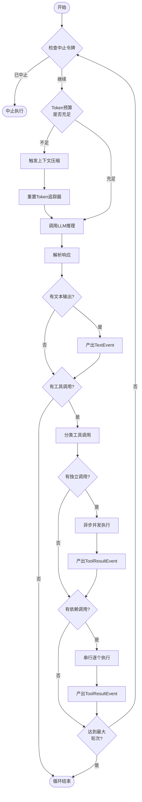

# Agent Loop 模块设计

Agent Loop 是整个框架的执行核心，负责驱动单个Agent完成"思考-行动-观察"的循环。基于 Python asyncio 实现流式执行，支持工具调用、上下文压缩和中止控制。

## 设计思路

采用异步生成器模式，将Agent执行过程抽象为事件流。调用方通过 `async for` 逐个消费事件，实现流式输出和实时反馈。工具执行采用独立调用异步并发、有依赖调用串行的混合策略，最大化执行效率。

## 核心数据结构

```python
from dataclasses import dataclass, field
from enum import Enum
from typing import Any


class EventType(Enum):
    TEXT = "text"
    TOOL_USE = "tool_use"
    TOOL_RESULT = "tool_result"
    ERROR = "error"
    COMPACTION = "compaction"
    THINKING = "thinking"


@dataclass
class AgentEvent:
    event_type: EventType
    content: str
    metadata: dict[str, Any] = field(default_factory=dict)
    token_usage: TokenUsage | None = None


@dataclass
class TokenUsage:
    input_tokens: int = 0
    output_tokens: int = 0
    cache_read_tokens: int = 0
    cache_creation_tokens: int = 0


@dataclass
class ToolCall:
    tool_name: str
    tool_input: dict[str, Any]
    call_id: str


@dataclass
class AgentConfig:
    model: str = "claude-sonnet-4-20250514"
    max_tokens: int = 8192
    token_budget: int = 200_000
    max_tool_rounds: int = 20
    system_prompt: str = ""
    tools: list[dict[str, Any]] = field(default_factory=list)
```

## 关键接口

```python
import asyncio
from collections.abc import AsyncIterator


class CancellationToken:
    """用于中止Agent执行的中止令牌"""

    def __init__(self) -> None:
        self._cancelled = False

    def cancel(self) -> None:
        self._cancelled = True

    @property
    def is_cancelled(self) -> bool:
        return self._cancelled


async def agent_loop(
    messages: list[dict[str, Any]],
    config: AgentConfig,
    tool_executor: ToolExecutor,
    memory_manager: MemoryManager,
    cancellation_token: CancellationToken | None = None,
) -> AsyncIterator[AgentEvent]:
    """
    Agent核心执行循环。

    驱动LLM进行推理，执行工具调用，管理上下文压缩，
    通过异步生成器产出事件流供调用方消费。

    Args:
        messages: 对话消息列表（含系统提示）
        config: Agent配置（模型、token预算等）
        tool_executor: 工具执行器
        memory_manager: 记忆管理器（负责上下文压缩）
        cancellation_token: 可选的中止令牌

    Yields:
        AgentEvent: 执行过程中的各类事件

    Raises:
        AgentError: 执行过程中遇到不可恢复的错误
        asyncio.CancelledError: 被外部中止
    """
    ...
```

## 执行流程



## 工具执行策略

| 调用类型 | 执行方式 | 原因 |
|----------|----------|------|
| 只读操作（文件读取、Grep搜索） | 异步并发 | 无副作用，可并行 |
| 写操作（文件修改、命令执行） | 严格串行 | 避免竞态条件 |
| 有依赖的调用 | 按依赖顺序串行 | 确保数据一致性 |
