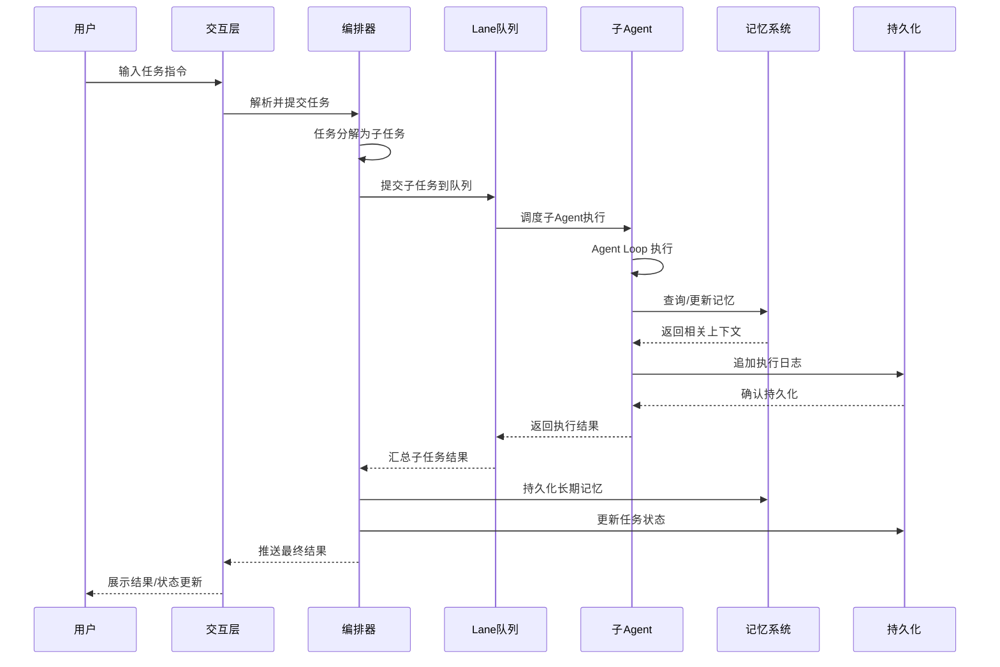
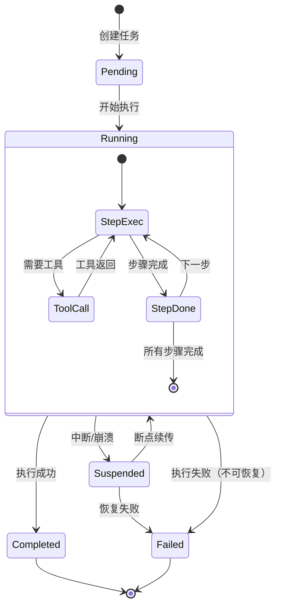

# 数据流设计

以下序列图展示了从用户输入到最终状态更新的完整数据流，涵盖编排、执行、记忆、持久化各环节的交互。

## 完整数据流



## 任务状态机



## 持久化格式

```
tasks/
└── {task-id}/
    ├── state.json          # 任务元数据与状态
    ├── transcript.jsonl    # 执行日志（追加写入）
    ├── heartbeat.md        # 人类可读进度看板
    └── context_snapshot/   # 上下文快照（可选）
        └── latest.msgpack
```
