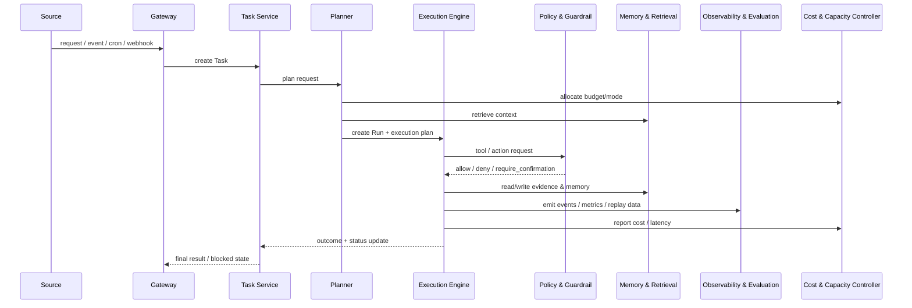

# 数据流契约

本文件定义平台级数据流，不再描述旧实现中的局部模块调用关系。

## 平台主数据流

## 核心对象流转

- `Gateway` 创建或标准化请求
- `Task Service` 维护 `Task`
- `Planner` 生成 `Run` 计划并路由模式
- `Execution Engine` 产出 `Evidence / Decision / Cost Record`
- `Observability & Evaluation` 消费运行事件并形成回放与指标

## 关键约束

- 任一链路都必须可追踪到 `Task -> Run -> Evidence -> Decision -> Cost Record`
- 数据流中不能出现“只在日志里存在、没有对象归属”的关键决策
- 后台与批量任务必须经过与交互任务相同的数据对象体系，只是模式和预算不同

