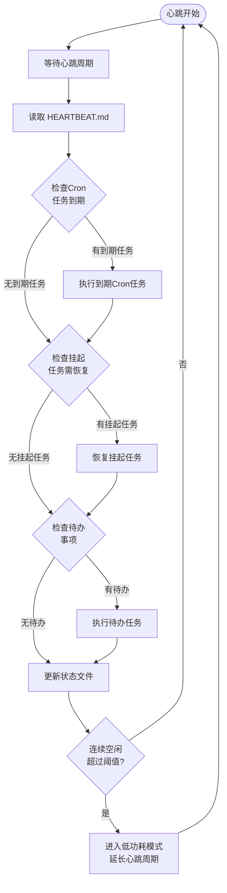

# 心跳引擎模块设计

心跳引擎是后台自主模式的核心驱动，通过持续的循环确保Agent在无人监督时仍能主动执行任务、响应定时调度和恢复中断工作。

## 设计思路

采用 `while True` 循环作为心跳基础，每次循环执行一轮完整的检查-执行-更新流程。心跳周期可配置（默认60秒），空闲时自动进入低功耗模式降低资源消耗。心跳引擎与Cron调度深度集成，定时任务到期时自动触发执行。

## 心跳循环流程



## 核心数据结构

```python
from dataclasses import dataclass, field
from datetime import datetime


@dataclass
class HeartbeatConfig:
    """心跳引擎配置"""

    base_interval_seconds: int = 60
    low_power_interval_seconds: int = 300
    idle_threshold_cycles: int = 5
    max_concurrent_tasks: int = 3


@dataclass
class HeartbeatStatus:
    """心跳状态记录"""

    cycle_count: int = 0
    last_heartbeat_at: datetime | None = None
    tasks_completed_this_cycle: int = 0
    current_mode: str = "normal"  # normal | low_power
    consecutive_idle_cycles: int = 0
```

## 关键接口

```python
class HeartbeatEngine:
    """心跳引擎，驱动后台自主运行"""

    async def start(self) -> None:
        """启动心跳循环，阻塞直到被中止"""
        ...

    async def stop(self) -> None:
        """优雅停止心跳引擎"""
        ...

    async def heartbeat_cycle(self) -> None:
        """
        执行一次心跳周期。

        1. 读取 HEARTBEAT.md 获取待办
        2. 检查 Cron 任务到期
        3. 检查挂起任务需恢复
        4. 执行到期任务
        5. 更新状态文件
        """
        ...
```

## HEARTBEAT.md 格式

```markdown
# Agent Heartbeat Status

## Current Mode
- Mode: normal | low_power
- Last Heartbeat: 2026-04-03T10:30:00Z
- Cycle Count: 42

## Pending Tasks
- [ ] Task-001: Review pull request #123
- [ ] Task-002: Run daily backup

## Cron Schedule
| Task | Schedule | Next Run |
|------|----------|----------|
| Daily Report | 0 8 * * * | 2026-04-04T08:00:00Z |
| Health Check | every 2h | 2026-04-03T12:00:00Z |

## Recent Activity
- 2026-04-03T10:25:00Z: Completed Task-003
- 2026-04-03T10:20:00Z: Started Task-003
```

## 低功耗模式

| 条件 | 正常模式 | 低功耗模式 |
|------|----------|------------|
| 心跳间隔 | 60秒 | 300秒 |
| 触发条件 | 默认 | 连续空闲超过5个周期 |
| 唤醒条件 | - | 检测到待办任务、Cron到期、外部唤醒信号 |
