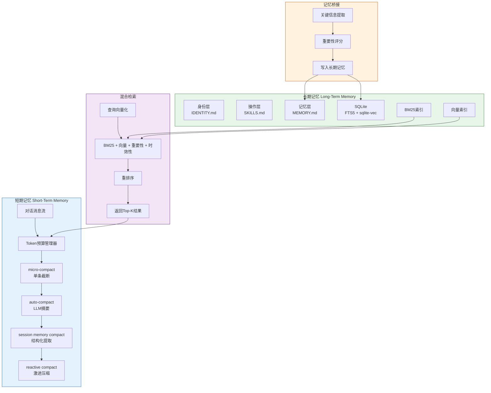

# 记忆系统模块设计

记忆系统是Agent智能水平的关键支撑，融合了Claude Code的短期上下文压缩策略与OpenClaw的三层长期记忆模型，实现从会话内到跨会话的完整记忆链路。

## 设计思路

短期记忆负责管理当前会话的上下文窗口，通过四级渐进压缩策略最大化有效信息密度。长期记忆负责跨会话的知识持久化，采用SQLite + FTS5 + 向量检索的混合方案。记忆桥接机制在会话结束时自动将短期记忆中的关键信息提炼并写入长期记忆。

## 短期记忆：四层压缩策略

| 压缩层级 | 触发条件 | 压缩方式 | 保留内容 |
|----------|---------|---------|---------|
| micro-compact | 单条消息超过阈值 | 截断长输出，保留首尾 | 工具调用结果摘要 |
| auto-compact | 上下文接近预算80% | LLM摘要压缩早期对话 | 关键决策、当前任务状态 |
| session memory compact | 会话中途里程碑 | 提取结构化知识到session memory | 代码变更、文件操作记录 |
| reactive compact | 紧急超预算 | 激进压缩，仅保留最近N轮 | 最近对话 + 系统提示 |

## 长期记忆：三层记忆模型

| 记忆层 | 存储内容 | 存储格式 | 检索方式 |
|--------|---------|---------|---------|
| 身份层 | Agent角色、能力边界、行为准则 | IDENTITY.md | 启动时全量加载 |
| 操作层 | 学到的操作模式、常用命令组合 | SKILLS.md | 按任务类型检索 |
| 记忆层 | 项目知识、历史决策、错误经验 | MEMORY.md + SQLite | BM25 + 向量混合检索 |

## 核心数据结构

```python
from dataclasses import dataclass, field
from datetime import datetime
from enum import Enum


class MemoryType(Enum):
    IDENTITY = "identity"
    OPERATION = "operation"
    EPISODIC = "episodic"


@dataclass
class MemoryEntry:
    """长期记忆条目"""

    memory_id: str
    memory_type: MemoryType
    content: str
    embedding: list[float] | None = None
    importance: float = 0.5
    created_at: datetime = field(default_factory=datetime.now)
    accessed_at: datetime = field(default_factory=datetime.now)
    access_count: int = 0
    source_task_id: str | None = None
    tags: list[str] = field(default_factory=list)


@dataclass
class MemoryQuery:
    """记忆检索查询"""

    query_text: str
    memory_types: list[MemoryType] | None = None
    max_results: int = 10
    min_importance: float = 0.0
    recency_weight: float = 0.3
    relevance_weight: float = 0.5
    importance_weight: float = 0.2


@dataclass
class CompactionResult:
    """上下文压缩结果"""

    original_token_count: int
    compressed_token_count: int
    compression_ratio: float
    preserved_keys: list[str]
    summary: str
```

## 记忆系统架构



## 关键接口

```python
from collections.abc import AsyncIterator


class ShortTermMemory:
    """短期记忆管理器，负责上下文窗口内的消息压缩"""

    async def compact(
        self, messages: list[dict[str, Any]], level: str = "auto"
    ) -> list[dict[str, Any]]:
        """
        对消息列表执行压缩，返回压缩后的消息列表。

        Args:
            messages: 当前对话消息列表
            level: 压缩级别 (micro/auto/session/reactive)

        Returns:
            压缩后的消息列表
        """
        ...

    async def estimate_tokens(self, messages: list[dict[str, Any]]) -> int:
        """估算消息列表的token数量"""
        ...


class LongTermMemory:
    """长期记忆管理器，负责跨会话知识持久化"""

    async def store(self, entry: MemoryEntry) -> str:
        """存储一条记忆，返回记忆ID"""
        ...

    async def search(self, query: MemoryQuery) -> list[MemoryEntry]:
        """混合检索，返回按相关性排序的记忆列表"""
        ...

    async def update_access(self, memory_id: str) -> None:
        """更新记忆的访问时间和计数（用于时效性评分）"""
        ...


class MemoryBridge:
    """记忆桥接，负责短期记忆到长期记忆的转化"""

    async def transfer_session_insights(
        self, messages: list[dict[str, Any]], task_id: str
    ) -> list[str]:
        """
        会话结束时提取关键洞察写入长期记忆。

        Args:
            messages: 本次会话的完整消息列表
            task_id: 关联的任务ID

        Returns:
            写入的长期记忆ID列表
        """
        ...
```

## 混合检索评分公式

```
最终得分 = α × BM25得分 + β × 向量相似度 + γ × 重要性评分 + δ × 时效性评分
```

| 检索维度 | 说明 | 默认权重 |
|----------|------|----------|
| BM25 | 关键词匹配，适用于精确查询 | 0.3 |
| 向量相似度 | 语义匹配，适用于模糊查询 | 0.5 |
| 重要性 | 基于记忆被引用的频率和上下文 | 0.2 |
| 时效性 | 越近的记忆权重越高 | 0.3 |
