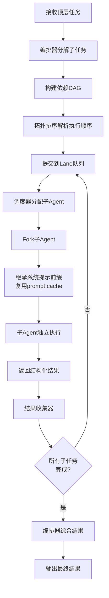

# 多Agent编排模块设计

多Agent编排是框架处理复杂任务的核心能力，通过编排器将大任务分解为子任务，分配给子Agent并行或串行执行，最终汇总结果。

## 设计思路

编排器（Orchestrator）作为中枢，接收顶层任务后进行分解和调度。子Agent通过Fork机制继承父Agent的系统提示前缀，复用prompt cache降低延迟。Lane队列提供双层并发控制，确保资源利用率和执行顺序的平衡。Agent Teams支持更复杂的团队协作模式。

## 核心数据结构

```python
from dataclasses import dataclass, field
from enum import Enum


class TaskPriority(Enum):
    CRITICAL = 0
    HIGH = 1
    NORMAL = 2
    LOW = 3


@dataclass
class SubTask:
    """子任务定义"""

    sub_task_id: str
    description: str
    parent_task_id: str
    assigned_agent_id: str | None = None
    priority: TaskPriority = TaskPriority.NORMAL
    dependencies: list[str] = field(default_factory=list)
    status: TaskStatus = TaskStatus.PENDING
    result: str | None = None


@dataclass
class ForkConfig:
    """子Agent Fork配置"""

    inherit_system_prompt: bool = True
    inherit_tools: list[str] | None = None  # None表示继承全部
    extra_tools: list[str] = field(default_factory=list)
    extra_permissions: list[str] = field(default_factory=list)
    restricted_paths: list[str] = field(default_factory=list)
    max_tokens: int = 4096


@dataclass
class LaneConfig:
    """Lane队列配置"""

    max_concurrent: int = 3
    session_serial: bool = True  # 同一会话内串行
    priority_queue: bool = True
```

## 编排流程



## 三种子Agent执行模型

| 模型 | 通信方式 | 隔离级别 | 适用场景 |
|------|----------|----------|----------|
| Fork Model | 共享上下文前缀 + API Prompt Cache | 上下文克隆 | 并行代码搜索、多文件分析 |
| Teammate Model | 基于文件邮箱（File-based Mailbox） | 终端面板隔离 | 跨面板协作、代码审查 |
| Worktree Model | 独立 Git 分支 | 完全隔离 | 并行功能开发、实验性修改 |

## 关键接口

```python
class Orchestrator:
    """任务编排器"""

    async def decompose(self, task_description: str) -> list[SubTask]:
        """
        将顶层任务分解为子任务列表。

        Args:
            task_description: 顶层任务描述

        Returns:
            子任务列表（含依赖关系）
        """
        ...

    async def execute_sub_tasks(
        self, sub_tasks: list[SubTask], lane: LaneQueue
    ) -> dict[str, str]:
        """
        通过Lane队列调度执行子任务。

        Args:
            sub_tasks: 子任务列表
            lane: Lane队列实例

        Returns:
            子任务ID到结果的映射
        """
        ...


class LaneQueue:
    """Lane并发控制队列"""

    async def submit(self, sub_task: SubTask) -> str:
        """提交子任务到队列，返回票据ID"""
        ...

    async def wait_for_result(self, ticket_id: str) -> SubTask:
        """等待指定票据对应的子任务完成"""
        ...


class AgentForker:
    """子Agent派生器"""

    async def fork(
        self, parent_context: AgentContext, config: ForkConfig
    ) -> SubAgent:
        """
        从父Agent上下文派生子Agent。

        继承系统提示前缀以复用prompt cache，
        配置独立的工具池和权限。
        """
        ...
```

## Agent Teams

| 角色 | 职责 |
|------|------|
| Team Lead | 任务分配、进度监控、结果汇总 |
| Teammate | 独立执行分配的子任务、通过邮箱通信 |

通信机制：
- 共享任务列表文件
- 消息邮箱（Message Mailbox）
- 状态广播
