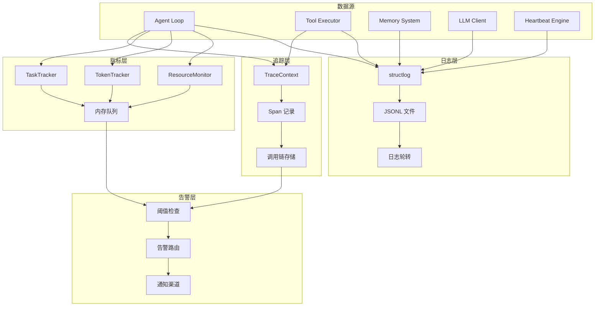
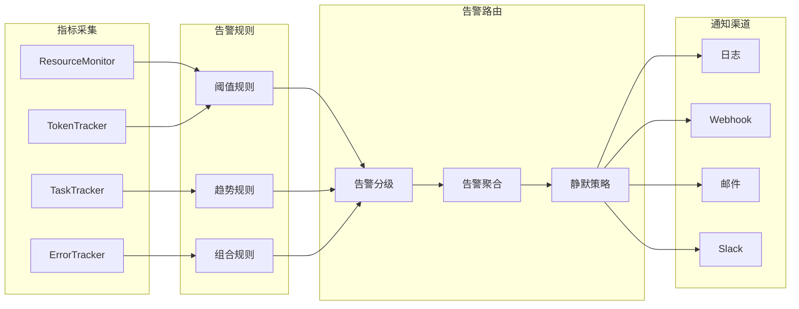
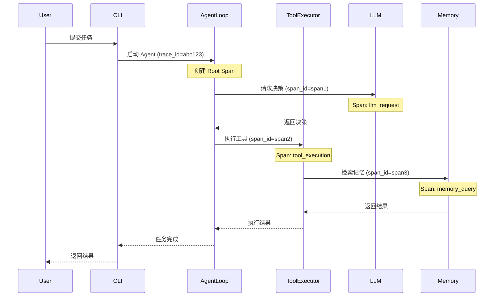
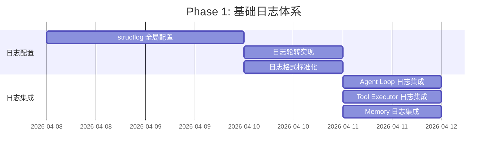
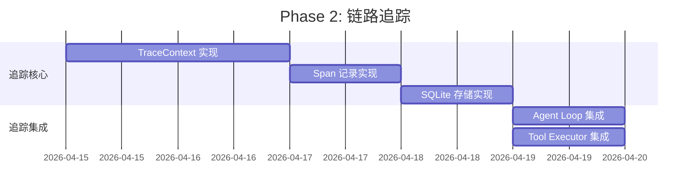
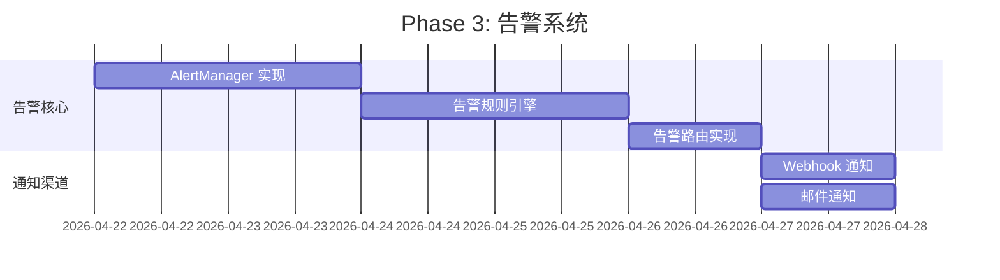
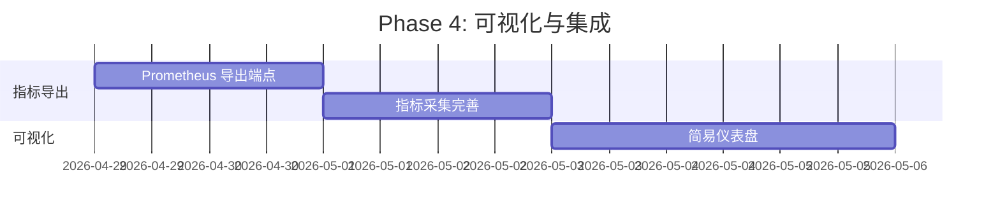

# 可观测性体系

本文档定义 SherryAgent 的可观测性体系，包括日志规范、监控告警和链路追踪，为系统健康度评估和故障诊断提供完整支撑。

## 可观测性架构



## 日志规范

### 日志级别定义

| 级别 | 用途 | 示例场景 | 是否输出堆栈 |
|------|------|----------|-------------|
| `ERROR` | 必须立即处理的错误 | LLM API 失败、数据库连接断开、权限拒绝 | ✅ 是 |
| `WARN` | 需要关注的异常情况 | 内存使用超阈值、Token 预算接近上限、重试次数过多 | ❌ 否 |
| `INFO` | 关键业务事件 | 任务开始/完成、工具调用、心跳触发、状态恢复 | ❌ 否 |
| `DEBUG` | 调试详细信息 | 决策过程、记忆检索、上下文压缩详情 | ❌ 否 |

### 日志级别使用规则

```python
# ✅ 正确：ERROR 用于必须处理的错误
logger.error(
    "llm_api_failed",
    provider="anthropic",
    error_type="RateLimitError",
    retry_after=60,
    exc_info=True
)

# ✅ 正确：WARN 用于需要关注的异常
logger.warning(
    "memory_threshold_exceeded",
    memory_percent=85.5,
    threshold=80.0,
    recommendation="Consider increasing memory limit"
)

# ✅ 正确：INFO 用于关键业务事件
logger.info(
    "task_completed",
    task_id="task-001",
    duration_ms=4520,
    success=True,
    token_usage={"input": 1234, "output": 567}
)

# ✅ 正确：DEBUG 用于调试详情
logger.debug(
    "memory_retrieval",
    query="previous error handling",
    results_count=5,
    latency_ms=23.5
)
```

### 结构化日志格式

```json
{
  "timestamp": "2026-04-07T12:00:00.123456Z",
  "level": "INFO",
  "event": "task_completed",
  "logger": "sherry_agent.execution.agent_loop",
  "trace_id": "abc123def456",
  "span_id": "span789",
  "parent_span_id": "span456",
  "task_id": "task-001",
  "agent_id": "agent-main",
  "duration_ms": 4520.5,
  "success": true,
  "token_usage": {
    "input": 1234,
    "output": 567,
    "cache_read": 200,
    "cache_creation": 50
  },
  "metadata": {
    "tool_calls": 8,
    "retry_count": 0,
    "memory_queries": 3
  },
  "environment": "production",
  "version": "0.1.0"
}
```

### 日志字段规范

| 字段 | 类型 | 必填 | 描述 |
|------|------|------|------|
| `timestamp` | ISO 8601 | ✅ | UTC 时间戳，精确到微秒 |
| `level` | string | ✅ | 日志级别：ERROR/WARN/INFO/DEBUG |
| `event` | string | ✅ | 事件名称，使用 snake_case |
| `logger` | string | ✅ | 模块路径，如 `sherry_agent.execution.agent_loop` |
| `trace_id` | string | ✅ | 分布式追踪 ID，贯穿整个请求链路 |
| `span_id` | string | ✅ | 当前 Span ID |
| `parent_span_id` | string | ❌ | 父 Span ID（用于调用链构建） |
| `error` | string | ❌ | 错误消息（仅 ERROR 级别） |
| `error_type` | string | ❌ | 错误类型（仅 ERROR 级别） |
| `stack_trace` | string | ❌ | 堆栈信息（仅 ERROR 级别） |
| `duration_ms` | float | ❌ | 操作耗时（毫秒） |
| `task_id` | string | ❌ | 任务 ID |
| `agent_id` | string | ❌ | Agent ID |
| `user_id` | string | ❌ | 用户 ID |
| `token_usage` | object | ❌ | Token 使用详情 |
| `metadata` | object | ❌ | 额外元数据 |

### 日志事件命名规范

| 事件类别 | 事件名称 | 描述 |
|----------|----------|------|
| **任务生命周期** | `task_started` | 任务开始执行 |
| | `task_completed` | 任务成功完成 |
| | `task_failed` | 任务执行失败 |
| | `task_cancelled` | 任务被取消 |
| | `task_timeout` | 任务执行超时 |
| **Agent Loop** | `agent_loop_iteration` | Agent Loop 单次迭代 |
| | `agent_loop_decision` | Agent 做出决策 |
| | `agent_loop_stopped` | Agent Loop 停止 |
| **工具调用** | `tool_call_started` | 工具调用开始 |
| | `tool_call_completed` | 工具调用完成 |
| | `tool_call_failed` | 工具调用失败 |
| | `tool_call_timeout` | 工具调用超时 |
| **LLM 交互** | `llm_request_started` | LLM 请求开始 |
| | `llm_request_completed` | LLM 请求完成 |
| | `llm_request_failed` | LLM 请求失败 |
| | `llm_stream_chunk` | LLM 流式响应块 |
| **记忆系统** | `memory_query` | 记忆检索 |
| | `memory_store` | 记忆存储 |
| | `memory_compress` | 记忆压缩 |
| | `memory_transfer` | 短期记忆转长期 |
| **心跳与调度** | `heartbeat_triggered` | 心跳触发 |
| | `heartbeat_task_spawned` | 心跳产生新任务 |
| | `scheduled_job_executed` | 定时任务执行 |
| **资源监控** | `resource_warning` | 资源使用告警 |
| | `resource_critical` | 资源使用临界 |
| | `token_budget_exceeded` | Token 预算超限 |
| **权限与安全** | `permission_denied` | 权限拒绝 |
| | `permission_granted` | 权限授予 |
| | `security_violation` | 安全违规 |

### 日志轮转策略

```yaml
logging:
  rotation:
    max_size_mb: 100
    backup_count: 10
    compress: true
  retention:
    days: 30
    compress_after_days: 7
  paths:
    application: "logs/sherry-agent.jsonl"
    error: "logs/error.jsonl"
    audit: "logs/audit.jsonl"
```

### 日志配置实现

```python
import structlog
from structlog.processors import JSONRenderer, TimeStamper, add_log_level

def configure_logging(
    environment: str = "development",
    log_level: str = "INFO",
    log_dir: Path = Path("logs"),
) -> None:
    """配置结构化日志"""
    
    processors = [
        structlog.contextvars.merge_contextvars,
        structlog.stdlib.add_logger_name,
        structlog.stdlib.add_log_level,
        TimeStamper(fmt="iso", utc=True),
        structlog.processors.StackInfoRenderer(),
        structlog.processors.format_exc_info,
        structlog.processors.UnicodeDecoder(),
        JSONRenderer(ensure_ascii=False),
    ]
    
    structlog.configure(
        processors=processors,
        wrapper_class=structlog.stdlib.BoundLogger,
        context_class=dict,
        logger_factory=structlog.stdlib.LoggerFactory(),
        cache_logger_on_first_use=True,
    )
    
    log_dir.mkdir(parents=True, exist_ok=True)
```

## 监控告警配置

### 告警架构



### 告警级别定义

| 级别 | 含义 | 响应时间 | 通知方式 | 示例 |
|------|------|----------|----------|------|
| `P0` | 系统不可用 | < 5 分钟 | 电话 + 短信 + Slack | 数据库连接失败、内存耗尽 |
| `P1` | 严重性能下降 | < 15 分钟 | Slack + 邮件 | 错误率 > 10%、响应时间 > 10s |
| `P2` | 需要关注 | < 1 小时 | 邮件 | 内存使用 > 80%、Token 预算 > 80% |
| `P3` | 信息提示 | < 24 小时 | 日志 | 任务成功率下降、重试率上升 |

### 告警规则配置

```yaml
alerts:
  # P0 级别告警
  - name: system_unavailable
    level: P0
    condition: "system_health == false"
    duration: 0s
    notification:
      - phone
      - sms
      - slack
    message: "系统不可用，请立即处理"
    
  - name: database_connection_failed
    level: P0
    condition: "database_connection_errors > 3"
    duration: 30s
    notification:
      - phone
      - sms
      - slack
    message: "数据库连接失败次数过多"
    
  - name: memory_exhausted
    level: P0
    condition: "memory_percent >= 95"
    duration: 10s
    notification:
      - phone
      - sms
      - slack
    message: "内存即将耗尽，当前使用率 {memory_percent}%"

  # P1 级别告警
  - name: high_error_rate
    level: P1
    condition: "error_rate_percent >= 10"
    duration: 60s
    notification:
      - slack
      - email
    message: "错误率过高，当前 {error_rate_percent}%"
    
  - name: slow_response_time
    level: P1
    condition: "p95_latency_ms >= 10000"
    duration: 120s
    notification:
      - slack
      - email
    message: "P95 响应时间过慢，当前 {p95_latency_ms}ms"
    
  - name: llm_api_failure
    level: P1
    condition: "llm_error_rate_percent >= 5"
    duration: 60s
    notification:
      - slack
      - email
    message: "LLM API 错误率过高，当前 {llm_error_rate_percent}%"

  # P2 级别告警
  - name: memory_warning
    level: P2
    condition: "memory_percent >= 80"
    duration: 300s
    notification:
      - email
    message: "内存使用率较高，当前 {memory_percent}%"
    
  - name: token_budget_warning
    level: P2
    condition: "token_budget_usage_percent >= 80"
    duration: 600s
    notification:
      - email
    message: "Token 预算使用率较高，当前 {token_budget_usage_percent}%"
    
  - name: task_queue_backlog
    level: P2
    condition: "lane_queue_depth >= 50"
    duration: 300s
    notification:
      - email
    message: "任务队列积压，当前深度 {lane_queue_depth}"

  # P3 级别告警
  - name: task_success_rate_drop
    level: P3
    condition: "task_success_rate_percent < 85"
    duration: 1800s
    notification:
      - log
    message: "任务成功率下降，当前 {task_success_rate_percent}%"
    
  - name: high_retry_rate
    level: P3
    condition: "task_retry_rate_percent >= 30"
    duration: 1800s
    notification:
      - log
    message: "任务重试率较高，当前 {task_retry_rate_percent}%"
    
  - name: tool_error_rate_high
    level: P3
    condition: "tool_error_rate_percent >= 5"
    duration: 1800s
    notification:
      - log
    message: "工具调用错误率较高，当前 {tool_error_rate_percent}%"
```

### 告警聚合策略

```yaml
alert_aggregation:
  # 相同告警在时间窗口内聚合
  time_window: 300s
  max_alerts_per_window: 3
  
  # 相同规则的告警聚合
  group_by:
    - alert_name
    - severity
    
  # 静默策略
  silence_rules:
    - name: maintenance_window
      match:
        environment: production
      time_range:
        start: "02:00"
        end: "04:00"
        timezone: "Asia/Shanghai"
        
    - name: known_issue
      match:
        alert_name: "llm_api_failure"
        error_type: "RateLimitError"
      duration: 600s
```

### 告警实现代码

```python
from dataclasses import dataclass
from enum import Enum
from typing import Any, Callable
from collections.abc import Awaitable

class AlertLevel(Enum):
    P0 = "P0"
    P1 = "P1"
    P2 = "P2"
    P3 = "P3"

@dataclass
class AlertRule:
    name: str
    level: AlertLevel
    condition: Callable[[dict[str, Any]], bool]
    duration_seconds: float
    notification_channels: list[str]
    message_template: str

class AlertManager:
    def __init__(self) -> None:
        self._rules: list[AlertRule] = []
        self._handlers: dict[str, Callable[[AlertLevel, str, dict], Awaitable[None]]] = {}
        self._alert_history: dict[str, list[float]] = {}
        
    def add_rule(self, rule: AlertRule) -> None:
        self._rules.append(rule)
        
    def register_handler(
        self,
        channel: str,
        handler: Callable[[AlertLevel, str, dict], Awaitable[None]]
    ) -> None:
        self._handlers[channel] = handler
        
    async def check_alerts(self, metrics: dict[str, Any]) -> None:
        for rule in self._rules:
            if rule.condition(metrics):
                await self._process_alert(rule, metrics)
                
    async def _process_alert(self, rule: AlertRule, metrics: dict[str, Any]) -> None:
        message = rule.message_template.format(**metrics)
        
        for channel in rule.notification_channels:
            if handler := self._handlers.get(channel):
                await handler(rule.level, message, metrics)
```

## 链路追踪方案

### 追踪架构



### TraceContext 设计

```python
from dataclasses import dataclass, field
from contextvars import ContextVar
import uuid
import time

@dataclass
class SpanContext:
    trace_id: str
    span_id: str
    parent_span_id: str | None = None
    start_time: float = field(default_factory=time.time)
    end_time: float | None = None
    operation_name: str = ""
    tags: dict[str, str] = field(default_factory=dict)
    logs: list[dict[str, Any]] = field(default_factory=list)

@dataclass
class TraceContext:
    trace_id: str
    current_span: SpanContext | None = None
    spans: list[SpanContext] = field(default_factory=list)
    
    @staticmethod
    def generate_trace_id() -> str:
        return uuid.uuid4().hex[:32]
    
    @staticmethod
    def generate_span_id() -> str:
        return uuid.uuid4().hex[:16]

_current_trace: ContextVar[TraceContext | None] = ContextVar("current_trace", default=None)

def get_current_trace() -> TraceContext | None:
    return _current_trace.get()

def start_trace(trace_id: str | None = None) -> TraceContext:
    ctx = TraceContext(trace_id=trace_id or TraceContext.generate_trace_id())
    _current_trace.set(ctx)
    return ctx

def start_span(operation_name: str, tags: dict[str, str] | None = None) -> SpanContext:
    trace_ctx = get_current_trace()
    if not trace_ctx:
        trace_ctx = start_trace()
    
    parent_span_id = trace_ctx.current_span.span_id if trace_ctx.current_span else None
    
    span = SpanContext(
        trace_id=trace_ctx.trace_id,
        span_id=TraceContext.generate_span_id(),
        parent_span_id=parent_span_id,
        operation_name=operation_name,
        tags=tags or {},
    )
    
    trace_ctx.current_span = span
    trace_ctx.spans.append(span)
    
    return span

def end_span(span: SpanContext) -> None:
    span.end_time = time.time()
    trace_ctx = get_current_trace()
    if trace_ctx and trace_ctx.current_span == span:
        trace_ctx.current_span = None
```

### Span 记录规范

| 操作类型 | Span 名称 | 必需 Tags | 可选 Tags |
|----------|-----------|-----------|-----------|
| Agent Loop 迭代 | `agent_loop_iteration` | `agent_id`, `iteration` | `decision_type` |
| LLM 请求 | `llm_request` | `provider`, `model` | `stream`, `temperature` |
| 工具调用 | `tool_execution` | `tool_name`, `success` | `error_type`, `retry_count` |
| 记忆检索 | `memory_query` | `query_type`, `results_count` | `similarity_threshold` |
| 记忆存储 | `memory_store` | `memory_type`, `content_length` | `compression_ratio` |
| 任务执行 | `task_execution` | `task_id`, `task_type` | `complexity_score` |
| Fork 派生 | `fork_spawn` | `parent_agent_id`, `child_agent_id` | `task_type` |
| 心跳触发 | `heartbeat_trigger` | `heartbeat_id` | `spawned_tasks` |

### 追踪使用示例

```python
from sherry_agent.infrastructure.tracing import start_trace, start_span, end_span

async def execute_task(task_id: str) -> None:
    trace_ctx = start_trace()
    
    with start_span("task_execution", {"task_id": task_id}) as span:
        logger.info("task_started", task_id=task_id, trace_id=trace_ctx.trace_id)
        
        with start_span("llm_request", {"provider": "anthropic", "model": "claude-sonnet"}):
            response = await llm_client.generate(prompt)
            
        with start_span("tool_execution", {"tool_name": "file_read"}):
            result = await tool_executor.execute("file_read", {"path": "/path/to/file"})
            
        span.tags["success"] = "true"
        logger.info("task_completed", task_id=task_id, trace_id=trace_ctx.trace_id)
```

### 调用链存储

```yaml
tracing:
  storage:
    type: sqlite
    path: "data/traces.db"
    retention_days: 7
    
  sampling:
    # 采样策略
    default_rate: 1.0
    error_rate: 1.0
    slow_trace_threshold_ms: 5000
    
  export:
    # 导出配置（可选）
    enabled: false
    format: jaeger
    endpoint: "http://localhost:14268/api/traces"
```

### 调用链分析查询

```sql
-- 查询慢调用链（总耗时 > 5s）
SELECT 
    trace_id,
    SUM(end_time - start_time) as total_duration_ms,
    COUNT(*) as span_count
FROM spans
GROUP BY trace_id
HAVING total_duration_ms > 5000
ORDER BY total_duration_ms DESC
LIMIT 20;

-- 查询错误调用链
SELECT DISTINCT
    trace_id,
    operation_name,
    tags->>'error_type' as error_type
FROM spans
WHERE tags->>'success' = 'false'
ORDER BY start_time DESC
LIMIT 20;

-- 查询工具调用耗时分布
SELECT 
    operation_name,
    AVG(end_time - start_time) as avg_duration_ms,
    MAX(end_time - start_time) as max_duration_ms,
    COUNT(*) as call_count
FROM spans
WHERE operation_name = 'tool_execution'
GROUP BY operation_name, tags->>'tool_name'
ORDER BY avg_duration_ms DESC;
```

## 当前缺失能力分析

### 高优先级缺失（P0）

| 缺失能力 | 影响范围 | 实现复杂度 | 建议方案 |
|----------|----------|------------|----------|
| **全局日志配置** | 所有模块 | 低 | 使用 structlog 配置全局日志处理器 |
| **Trace ID 贯穿** | 跨模块调用链分析 | 中 | 实现 ContextVar 传递 TraceContext |
| **实时告警系统** | 故障快速响应 | 中 | 实现 AlertManager + 多渠道通知 |
| **日志轮转** | 磁盘空间管理 | 低 | 使用 logging.handlers.RotatingFileHandler |
| **错误追踪聚合** | 错误模式识别 | 中 | 实现错误指纹 + 聚合统计 |

### 中优先级缺失（P1）

| 缺失能力 | 影响范围 | 实现复杂度 | 建议方案 |
|----------|----------|------------|----------|
| **指标导出接口** | 外部监控集成 | 中 | 实现 Prometheus 格式导出端点 |
| **调用链可视化** | 性能瓶颈定位 | 高 | 集成 Jaeger 或实现简易 UI |
| **告警静默策略** | 维护窗口管理 | 中 | 实现基于时间/规则的静默 |
| **日志采样** | 存储成本控制 | 低 | 实现基于规则的日志采样 |
| **审计日志分离** | 合规性要求 | 低 | 独立审计日志文件 + 保留策略 |

### 低优先级缺失（P2）

| 缺失能力 | 影响范围 | 实现复杂度 | 建议方案 |
|----------|----------|------------|----------|
| **日志搜索界面** | 日志查询效率 | 高 | 集成 Elasticsearch 或实现简易搜索 |
| **指标仪表盘** | 可视化监控 | 高 | 集成 Grafana 或实现简易 UI |
| **告警历史分析** | 告警趋势分析 | 中 | 实现告警历史存储 + 分析接口 |
| **分布式追踪导出** | 跨服务追踪 | 高 | 支持 OpenTelemetry 协议导出 |

### 现有实现状态

| 模块 | 功能 | 实现位置 | 状态 |
|------|------|----------|------|
| 资源监控 | CPU、内存监控 | `implementation-snapshot.md#ifl-monitoring` | 历史实现（已删除） |
| 阈值告警 | 内存阈值告警 | `implementation-snapshot.md#ifl-monitoring` | 历史实现（已删除） |
| Token 追踪 | Token 使用统计 | `implementation-snapshot.md#el-agentloop` | 历史实现（已删除） |
| 执行日志 | Benchmark 日志 | `implementation-snapshot.md#ev-benchmarkharness` | 历史实现（已删除） |
| 全局日志配置 | structlog 配置 | - | ❌ 未实现 |
| Trace ID | 分布式追踪 | - | ❌ 未实现 |
| Span 记录 | 调用链追踪 | - | ❌ 未实现 |
| 告警路由 | 多渠道通知 | - | ❌ 未实现 |
| 日志轮转 | 文件管理 | - | ❌ 未实现 |
| 指标导出 | Prometheus 格式 | - | ❌ 未实现 |

## 实施路线图

### Phase 1: 基础日志体系（1 周）



**任务清单：**
- [ ] 实现 `infrastructure/logging_config.py`
- [ ] 配置 structlog 全局处理器
- [ ] 实现日志轮转策略
- [ ] 集成到 Agent Loop
- [ ] 集成到 Tool Executor
- [ ] 集成到 Memory System

### Phase 2: 链路追踪（1 周）



**任务清单：**
- [ ] 实现 `infrastructure/tracing.py`
- [ ] 实现 TraceContext 和 SpanContext
- [ ] 实现 Span 存储到 SQLite
- [ ] 集成到 Agent Loop
- [ ] 集成到 Tool Executor
- [ ] 实现调用链查询接口

### Phase 3: 告警系统（1 周）



**任务清单：**
- [ ] 实现 `infrastructure/alerting.py`
- [ ] 实现 AlertManager
- [ ] 实现告警规则引擎
- [ ] 实现告警聚合策略
- [ ] 实现 Webhook 通知
- [ ] 实现邮件通知
- [ ] 集成到 ResourceMonitor

### Phase 4: 可视化与集成（可选）



**任务清单：**
- [ ] 实现 Prometheus 指标导出端点
- [ ] 完善指标采集
- [ ] 实现简易仪表盘（可选）
- [ ] 集成 Grafana（可选）

## 参考资料

- [系统技术指标](../reference/technical-metrics.md)
- [业务指标](../reference/business-metrics.md)
- [六层融合架构](six-layer-architecture.md)
- [Agent Loop 设计](agent-loop.md)
- [structlog 官方文档](https://www.structlog.org/)
- [OpenTelemetry 规范](https://opentelemetry.io/docs/reference/specification/)
