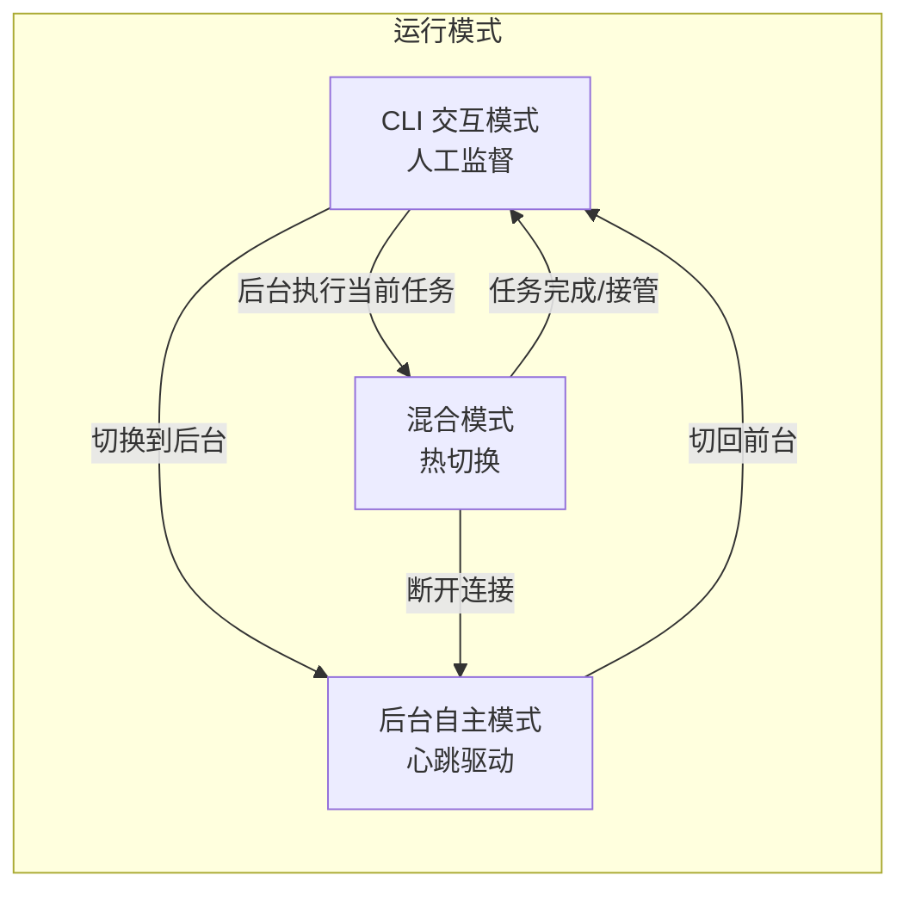

# 运行模式设计

系统支持三种运行模式，覆盖从人工监督到完全自主的全场景需求。

## CLI 交互模式

类似 Claude Code 的阻塞式对话模式。用户在终端中与Agent实时交互，每一步操作都经过人工确认（或通过权限系统自动放行）。适合需要精细控制的开发、调试场景。

**特征**：同步阻塞、人工监督、实时流式输出、上下文窗口内操作。

## 后台自主模式

类似 OpenClaw 的心跳驱动模式。Agent在后台持续运行，通过心跳循环定期检查待办、执行任务、更新状态。适合长时间运行的监控、巡检、自动化运维场景。

**特征**：异步非阻塞、心跳驱动、自动决策、审计日志、异常告警。

## 混合模式

CLI启动任务后，可将任务切换到后台执行。Agent通过WebSocket推送状态更新，用户随时可切回CLI接管。适合需要启动后等待的编译、部署、批量处理场景。

**特征**：模式热切换、WebSocket状态推送、断点续传、双向通信。

## 模式切换流程

## 后台模式权限策略

后台自主模式下，权限系统调整为"自动模式 + 审计日志 + 异常告警"：

| 风险等级 | 处理方式 |
|----------|----------|
| 低风险操作 | 自动放行，记录审计日志 |
| 中风险操作 | 自动放行，记录审计日志 + 推送通知 |
| 高风险操作 | 暂停执行，推送告警等待人工确认 |
| 严重风险操作 | 直接拒绝，推送紧急告警 |
