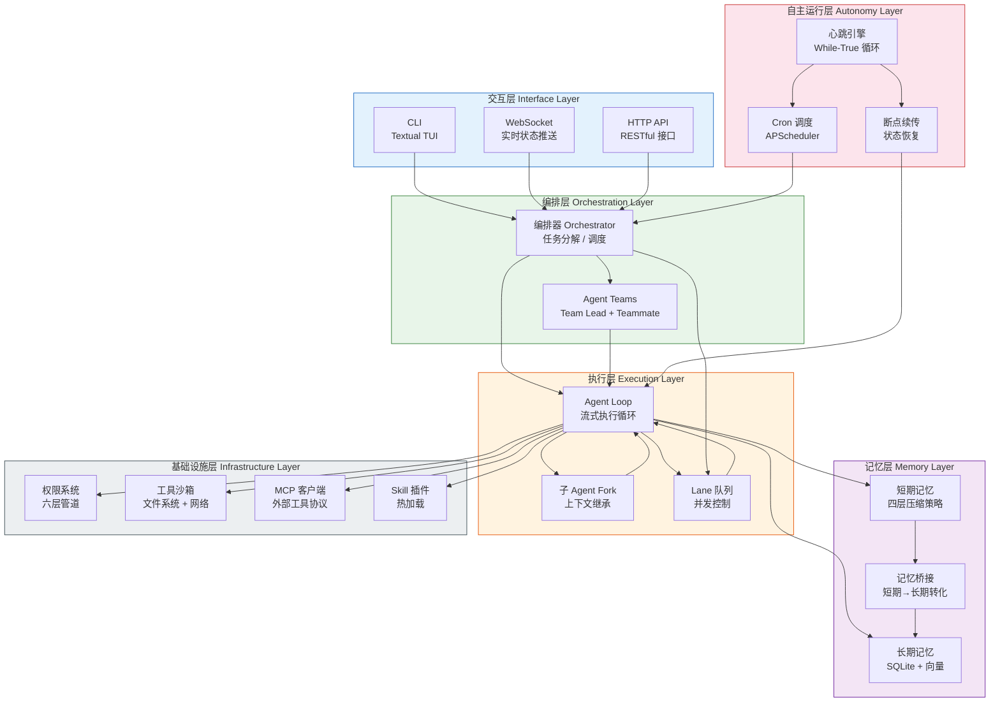

# 六层融合架构

系统采用六层分层架构，自上而下分别为交互层、编排层、执行层、自主运行层、记忆层和基础设施层。各层职责清晰，通过明确定义的接口进行通信。

## 架构图

## 各层职责说明

| 层级 | 核心职责 | 关键组件 |
|------|---------|---------|
| 交互层 | 用户输入/输出，多通道适配 | CLI（Textual TUI）、WebSocket、HTTP API |
| 编排层 | 任务分解、子Agent分配、团队协调 | Orchestrator、Agent Teams |
| 执行层 | Agent执行循环、子Agent派生、并发控制 | Agent Loop、Fork、Lane队列 |
| 自主运行层 | 持续运行、定时调度、崩溃恢复 | 心跳引擎、Cron调度、断点续传 |
| 记忆层 | 上下文管理、信息压缩、知识持久化 | 短期记忆、长期记忆、记忆桥接 |
| 基础设施层 | 安全管控、工具执行、插件扩展 | 权限系统、沙箱、MCP、Skill插件 |

## 与原框架的对应关系

| 本框架模块 | Claude Code 对应 | OpenClaw 对应 | 融合方式 |
|-----------|-----------------|--------------|---------|
| Agent Loop | Agent Loop | Agent执行 | 以Claude Code为基础，增加异步流式 |
| 短期记忆 | Context Window Management | - | 直接采用四层压缩策略 |
| 长期记忆 | - | 三层记忆系统 | 直接采用，增加向量检索 |
| 任务持久化 | - | Task Persistence | 直接采用JSONL格式 |
| 心跳引擎 | - | While-True Heartbeat | 直接采用，增加低功耗模式 |
| Cron调度 | - | Cron System | 集成APScheduler替代自研 |
| 编排器 | Orchestrator | - | 直接采用 |
| 子Agent Fork | Sub-Agent Fork | - | 直接采用，增加独立权限 |
| Agent Teams | Agent Teams | - | 直接采用 |
| Lane队列 | - | Lane Queue | 直接采用，增加优先级 |
| 权限系统 | Permission Pipeline | - | 直接采用六层管道 |
| MCP集成 | MCP Client | - | 直接采用 |
| Skill插件 | - | Skill System | 直接采用，增加pluggy框架 |
