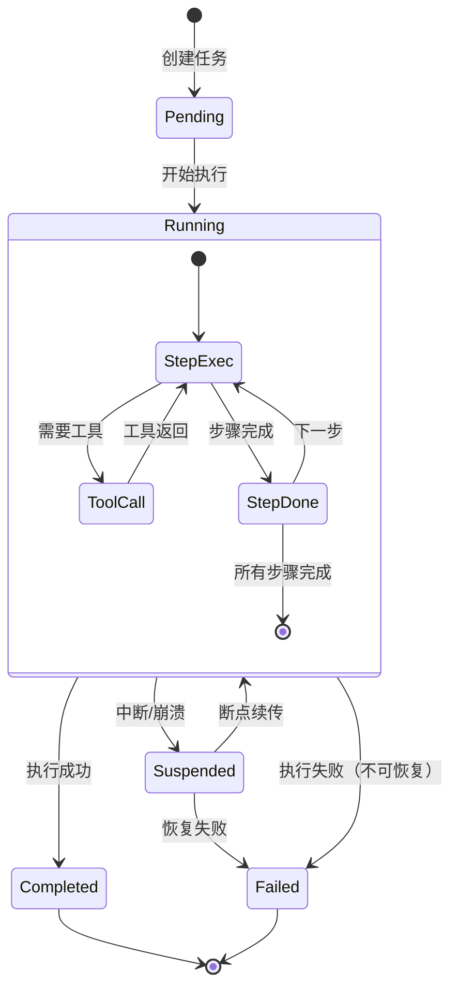

# 任务持久化与断点续传

任务持久化确保Agent在任何时刻崩溃都能恢复到最近的一致状态，是系统可靠性的基石。断点续传让长时间运行的任务不会因意外中断而丢失进度。

## 设计思路

每个任务拥有独立的目录，包含状态文件、执行日志和人类可读的进度看板。状态文件记录元数据和当前步骤，执行日志采用JSONL追加写入格式保证崩溃安全，进度看板供人类快速了解任务进展。恢复时通过扫描任务目录发现未完成任务，读取执行日志重建上下文。

## 任务状态机



## 持久化格式

```
tasks/
└── {task-id}/
    ├── state.json          # 任务元数据与状态
    ├── transcript.jsonl    # 执行日志（追加写入）
    ├── heartbeat.md        # 人类可读进度看板
    └── context_snapshot/   # 上下文快照（可选）
        └── latest.msgpack
```

## 核心数据结构

```python
from dataclasses import dataclass, field
from datetime import datetime
from enum import Enum


class TaskStatus(Enum):
    PENDING = "pending"
    RUNNING = "running"
    SUSPENDED = "suspended"
    COMPLETED = "completed"
    FAILED = "failed"


@dataclass
class TaskState:
    """任务状态，序列化为 state.json"""

    task_id: str
    description: str
    status: TaskStatus
    parent_task_id: str | None = None
    created_at: datetime = field(default_factory=datetime.now)
    updated_at: datetime = field(default_factory=datetime.now)
    completed_at: datetime | None = None
    current_step: int = 0
    total_steps: int = 0
    progress: float = 0.0
    result_summary: str | None = None
    error_message: str | None = None
    metadata: dict[str, Any] = field(default_factory=dict)


@dataclass
class TranscriptEntry:
    """执行日志条目，追加写入 transcript.jsonl"""

    timestamp: datetime
    step_index: int
    event_type: str
    content: str
    token_usage: dict[str, int] | None = None
    duration_ms: int | None = None
```

## 断点续传流程

```python
class TaskRecovery:
    """任务恢复管理器"""

    async def scan_interrupted_tasks(self) -> list[TaskState]:
        """
        扫描tasks/目录，发现所有Suspended状态的任务。

        Returns:
            中断的任务列表，按更新时间倒序排列
        """
        ...

    async def recover_task(self, task_id: str) -> RecoveryContext:
        """
        从断点恢复指定任务。

        恢复流程：
        1. 读取 state.json 获取任务元数据
        2. 读取 transcript.jsonl 重建执行上下文
        3. 加载 context_snapshot（如果存在）
        4. 构建恢复上下文返回

        Args:
            task_id: 要恢复的任务ID

        Returns:
            RecoveryContext: 包含恢复所需的所有上下文信息
        """
        ...


@dataclass
class RecoveryContext:
    """任务恢复上下文"""

    task_state: TaskState
    messages: list[dict[str, Any]]
    last_successful_step: int
    pending_steps: list[str]
    memory_snapshot: dict[str, Any] | None = None
```

## 崩溃安全保证

| 机制 | 说明 |
|------|------|
| JSONL追加写入 | 每条日志独立完整，崩溃不影响已写入内容 |
| 原子性状态更新 | 使用临时文件+重命名确保状态文件完整性 |
| 定期快照 | 可选的上下文快照，减少恢复时重放量 |
| 心跳看板 | 人类可读的进度记录，便于手动干预 |
