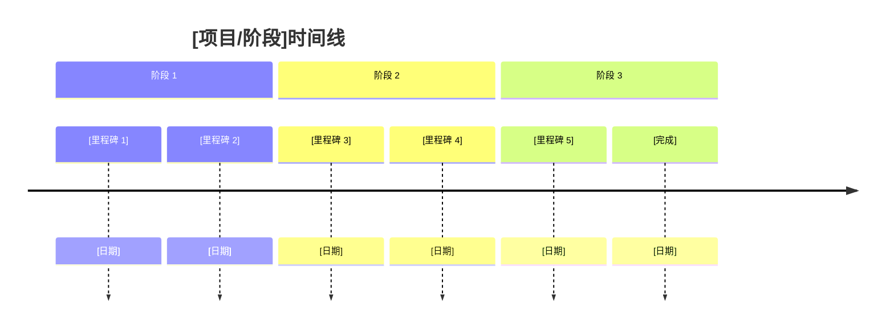
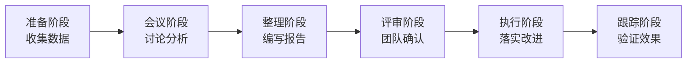

# 复盘报告模板

本文档提供标准化的复盘报告格式，确保复盘过程系统化、经验可传承。

## 文档元数据说明

```yaml
---
title: "[项目/阶段]复盘报告"
status: draft | in-review | approved | deprecated
created: YYYY-MM-DD
updated: YYYY-MM-DD
author: "作者名称"
related: ["相关文档路径"]
---
```

## 1. 复盘概述

### 1.1 基本信息

| 项目信息 | 内容 |
|----------|------|
| 项目名称 | [项目名称] |
| 复盘阶段 | [MVP-X / Sprint X / 版本 X.X] |
| 复盘日期 | YYYY-MM-DD |
| 参与人员 | [姓名列表] |
| 复盘主持人 | [姓名] |
| 文档记录人 | [姓名] |

### 1.2 复盘目标

**核心目标**：[一句话描述本次复盘的核心目的]

**具体目标**：
- [ ] 总结成功经验，形成最佳实践
- [ ] 识别问题根因，制定改进措施
- [ ] 沉淀知识资产，提升团队能力
- [ ] 其他：________

### 1.3 复盘范围

**时间范围**：[开始日期] 至 [结束日期]

**内容范围**：
- [ ] 技术实现
- [ ] 项目管理
- [ ] 团队协作
- [ ] 流程规范
- [ ] 其他：________

**排除范围**：
- 明确不在本次复盘范围内的事项

## 2. 时间线回顾

### 2.1 阶段划分



### 2.2 关键事件

| 时间 | 事件类型 | 事件描述 | 影响评估 |
|------|----------|----------|----------|
| YYYY-MM-DD | 启动/里程碑/问题/决策 | [描述] | 正面/负面/中性 |
| YYYY-MM-DD | [类型] | [描述] | [影响] |
| YYYY-MM-DD | [类型] | [描述] | [影响] |

事件类型说明：
- **启动**：项目/阶段启动
- **里程碑**：重要节点完成
- **问题**：遇到的问题或障碍
- **决策**：关键决策点
- **变更**：需求或计划变更

### 2.3 阶段详细回顾

#### 阶段 1：[阶段名称]

**时间范围**：[开始日期] 至 [结束日期]

**主要工作**：
- 工作项 1：[描述及成果]
- 工作项 2：[描述及成果]
- 工作项 3：[描述及成果]

**关键成果**：
- [成果 1]
- [成果 2]
- [成果 3]

**遇到的问题**：
- [问题 1] - 影响：[高/中/低] - 处理：[简述]
- [问题 2] - 影响：[高/中/低] - 处理：[简述]

#### 阶段 2：[阶段名称]

[同上结构]

#### 阶段 3：[阶段名称]

[同上结构]

## 3. 问题分析与分类

### 3.1 问题分类框架

| 分类 | 定义 | 示例 |
|------|------|------|
| **技术问题** | 技术实现、架构设计、性能优化等方面的问题 | Bug、性能瓶颈、架构缺陷 |
| **流程问题** | 开发流程、项目管理、质量保障等方面的问题 | 流程缺失、流程不合理、执行不到位 |
| **沟通问题** | 需求理解、团队协作、信息传递等方面的问题 | 需求偏差、信息不对称、协作障碍 |
| **资源问题** | 人力、时间、工具、环境等方面的问题 | 资源不足、资源分配不当 |
| **外部问题** | 第三方依赖、环境变化等外部因素导致的问题 | 第三方服务故障、政策变化 |

### 3.2 问题详细分析

#### 技术问题

| 问题编号 | 问题描述 | 发生时间 | 影响范围 | 根本原因 | 解决方案 | 预防措施 |
|----------|----------|----------|----------|----------|----------|----------|
| T-001 | [问题描述] | YYYY-MM-DD | [范围] | [根因] | [方案] | [措施] |
| T-002 | [问题描述] | YYYY-MM-DD | [范围] | [根因] | [方案] | [措施] |

**问题 T-001 详细分析**：

**现象**：[具体表现]

**原因分析**（5 Why 法）：
1. 为什么会出现这个问题？→ [原因 1]
2. 为什么会出现 [原因 1]？→ [原因 2]
3. 为什么会出现 [原因 2]？→ [原因 3]
4. 为什么会出现 [原因 3]？→ [原因 4]
5. 为什么会出现 [原因 4]？→ [根本原因]

**影响评估**：
- 影响范围：[具体范围]
- 影响程度：高/中/低
- 影响时长：[时间长度]

**解决方案**：
- 短期方案：[描述]
- 长期方案：[描述]

**预防措施**：
- [ ] 措施 1
- [ ] 措施 2
- [ ] 措施 3

#### 流程问题

| 问题编号 | 问题描述 | 发生时间 | 影响范围 | 根本原因 | 解决方案 | 预防措施 |
|----------|----------|----------|----------|----------|----------|----------|
| P-001 | [问题描述] | YYYY-MM-DD | [范围] | [根因] | [方案] | [措施] |
| P-002 | [问题描述] | YYYY-MM-DD | [范围] | [根因] | [方案] | [措施] |

[详细分析同上]

#### 沟通问题

| 问题编号 | 问题描述 | 发生时间 | 影响范围 | 根本原因 | 解决方案 | 预防措施 |
|----------|----------|----------|----------|----------|----------|----------|
| C-001 | [问题描述] | YYYY-MM-DD | [范围] | [根因] | [方案] | [措施] |
| C-002 | [问题描述] | YYYY-MM-DD | [范围] | [根因] | [方案] | [措施] |

[详细分析同上]

#### 资源问题

| 问题编号 | 问题描述 | 发生时间 | 影响范围 | 根本原因 | 解决方案 | 预防措施 |
|----------|----------|----------|----------|----------|----------|----------|
| R-001 | [问题描述] | YYYY-MM-DD | [范围] | [根因] | [方案] | [措施] |

[详细分析同上]

#### 外部问题

| 问题编号 | 问题描述 | 发生时间 | 影响范围 | 根本原因 | 解决方案 | 预防措施 |
|----------|----------|----------|----------|----------|----------|----------|
| E-001 | [问题描述] | YYYY-MM-DD | [范围] | [根因] | [方案] | [措施] |

[详细分析同上]

### 3.3 问题统计

| 问题分类 | 数量 | 占比 | 高影响数量 | 已解决 | 待解决 |
|----------|------|------|------------|--------|--------|
| 技术问题 | [数量] | [占比] | [数量] | [数量] | [数量] |
| 流程问题 | [数量] | [占比] | [数量] | [数量] | [数量] |
| 沟通问题 | [数量] | [占比] | [数量] | [数量] | [数量] |
| 资源问题 | [数量] | [占比] | [数量] | [数量] | [数量] |
| 外部问题 | [数量] | [占比] | [数量] | [数量] | [数量] |
| **总计** | **[总数]** | **100%** | **[总数]** | **[总数]** | **[总数]** |

## 4. 成功经验总结

### 4.1 经验分类框架

| 分类 | 定义 | 示例 |
|------|------|------|
| **技术实践** | 技术选型、架构设计、编码实践等方面的成功经验 | 架构模式、技术方案、工具使用 |
| **流程实践** | 开发流程、项目管理、质量保障等方面的成功经验 | 敏捷实践、测试策略、发布流程 |
| **团队协作** | 团队沟通、知识共享、协作模式等方面的成功经验 | 协作工具、沟通机制、团队文化 |
| **创新突破** | 技术创新、方法创新、工具创新等方面的成功经验 | 新技术应用、创新方案、自动化工具 |

### 4.2 经验详细总结

#### 技术实践

| 经验编号 | 经验名称 | 应用场景 | 具体做法 | 实际效果 | 可复用性 |
|----------|----------|----------|----------|----------|----------|
| TP-001 | [经验名称] | [场景] | [做法] | [效果] | 高/中/低 |
| TP-002 | [经验名称] | [场景] | [做法] | [效果] | 高/中/低 |

**经验 TP-001 详细说明**：

**背景**：[为什么采用这个实践]

**具体做法**：
1. 步骤 1：[描述]
2. 步骤 2：[描述]
3. 步骤 3：[描述]

**实际效果**：
- 效果 1：[量化描述]
- 效果 2：[量化描述]
- 效果 3：[量化描述]

**适用场景**：
- [场景 1]
- [场景 2]
- [场景 3]

**注意事项**：
- [注意点 1]
- [注意点 2]

**可复用性评估**：
- 复用难度：低/中/高
- 复用成本：[估算]
- 推荐指数：⭐⭐⭐⭐⭐

#### 流程实践

| 经验编号 | 经验名称 | 应用场景 | 具体做法 | 实际效果 | 可复用性 |
|----------|----------|----------|----------|----------|----------|
| PP-001 | [经验名称] | [场景] | [做法] | [效果] | 高/中/低 |
| PP-002 | [经验名称] | [场景] | [做法] | [效果] | 高/中/低 |

[详细说明同上]

#### 团队协作

| 经验编号 | 经验名称 | 应用场景 | 具体做法 | 实际效果 | 可复用性 |
|----------|----------|----------|----------|----------|----------|
| TC-001 | [经验名称] | [场景] | [做法] | [效果] | 高/中/低 |
| TC-002 | [经验名称] | [场景] | [做法] | [效果] | 高/中/低 |

[详细说明同上]

#### 创新突破

| 经验编号 | 经验名称 | 创新类型 | 具体做法 | 实际效果 | 推广价值 |
|----------|----------|----------|----------|----------|----------|
| IB-001 | [经验名称] | 技术/方法/工具 | [做法] | [效果] | 高/中/低 |

[详细说明同上]

### 4.3 经验统计

| 经验分类 | 数量 | 高可复用数量 | 推广价值 |
|----------|------|--------------|----------|
| 技术实践 | [数量] | [数量] | 高/中/低 |
| 流程实践 | [数量] | [数量] | 高/中/低 |
| 团队协作 | [数量] | [数量] | 高/中/低 |
| 创新突破 | [数量] | [数量] | 高/中/低 |
| **总计** | **[总数]** | **[总数]** | - |

## 5. 技能与知识沉淀

### 5.1 技能掌握情况

| 技能类别 | 具体技能 | 应用场景 | 掌握程度 | 后续计划 |
|----------|----------|----------|----------|----------|
| 编程语言 | [技能名称] | [场景] | 熟练/掌握/了解 | [计划] |
| 框架/库 | [技能名称] | [场景] | 熟练/掌握/了解 | [计划] |
| 工具使用 | [技能名称] | [场景] | 熟练/掌握/了解 | [计划] |
| 方法论 | [技能名称] | [场景] | 熟练/掌握/了解 | [计划] |

### 5.2 知识资产沉淀

| 资产类型 | 资产名称 | 存放位置 | 价值评估 | 维护责任 |
|----------|----------|----------|----------|----------|
| 技术文档 | [名称] | [路径] | 高/中/低 | [责任人] |
| 代码模板 | [名称] | [路径] | 高/中/低 | [责任人] |
| 工具脚本 | [名称] | [路径] | 高/中/低 | [责任人] |
| 最佳实践 | [名称] | [路径] | 高/中/低 | [责任人] |
| 培训材料 | [名称] | [路径] | 高/中/低 | [责任人] |

### 5.3 待提升领域

| 领域 | 现状 | 目标 | 提升计划 | 预期时间 |
|------|------|------|----------|----------|
| [领域 1] | [现状描述] | [目标描述] | [具体计划] | [时间] |
| [领域 2] | [现状描述] | [目标描述] | [具体计划] | [时间] |
| [领域 3] | [现状描述] | [目标描述] | [具体计划] | [时间] |

## 6. 改进建议

### 6.1 改进建议分类

| 分类 | 定义 | 优先级标准 |
|------|------|------------|
| **P0 - 紧急** | 影响项目成功，必须立即解决 | 阻塞关键路径，影响交付 |
| **P1 - 高优先级** | 影响质量或效率，短期内解决 | 影响用户体验或开发效率 |
| **P2 - 中优先级** | 有改进空间，中期内解决 | 优化项，提升质量或效率 |
| **P3 - 低优先级** | 长期优化项，可延后解决 | 锦上添花，非必要 |

### 6.2 改进建议详细列表

#### 技术改进

| 编号 | 改进建议 | 优先级 | 预期效果 | 实施成本 | 责任人 | 截止日期 |
|------|----------|--------|----------|----------|--------|----------|
| TI-001 | [建议描述] | P0/P1/P2/P3 | [效果] | [成本] | [姓名] | YYYY-MM-DD |
| TI-002 | [建议描述] | P0/P1/P2/P3 | [效果] | [成本] | [姓名] | YYYY-MM-DD |
| TI-003 | [建议描述] | P0/P1/P2/P3 | [效果] | [成本] | [姓名] | YYYY-MM-DD |

**改进建议 TI-001 详细说明**：

**背景**：[为什么需要这个改进]

**具体建议**：
1. [具体措施 1]
2. [具体措施 2]
3. [具体措施 3]

**预期效果**：
- 效果 1：[量化描述]
- 效果 2：[量化描述]

**实施计划**：
| 阶段 | 时间 | 任务 | 交付物 |
|------|------|------|--------|
| 准备 | [时间] | [任务] | [交付物] |
| 实施 | [时间] | [任务] | [交付物] |
| 验证 | [时间] | [任务] | [交付物] |

**风险评估**：
| 风险 | 影响 | 概率 | 缓解措施 |
|------|------|------|----------|
| [风险 1] | 高/中/低 | 高/中/低 | [措施] |
| [风险 2] | 高/中/低 | 高/中/低 | [措施] |

#### 流程改进

| 编号 | 改进建议 | 优先级 | 预期效果 | 实施成本 | 责任人 | 截止日期 |
|------|----------|--------|----------|----------|--------|----------|
| PI-001 | [建议描述] | P0/P1/P2/P3 | [效果] | [成本] | [姓名] | YYYY-MM-DD |
| PI-002 | [建议描述] | P0/P1/P2/P3 | [效果] | [成本] | [姓名] | YYYY-MM-DD |

[详细说明同上]

#### 团队协作改进

| 编号 | 改进建议 | 优先级 | 预期效果 | 实施成本 | 责任人 | 截止日期 |
|------|----------|--------|----------|----------|--------|----------|
| CI-001 | [建议描述] | P0/P1/P2/P3 | [效果] | [成本] | [姓名] | YYYY-MM-DD |
| CI-002 | [建议描述] | P0/P1/P2/P3 | [效果] | [成本] | [姓名] | YYYY-MM-DD |

[详细说明同上]

### 6.3 改进建议统计

| 改进分类 | P0 | P1 | P2 | P3 | 总计 |
|----------|----|----|----|----|----|
| 技术改进 | [数量] | [数量] | [数量] | [数量] | [总数] |
| 流程改进 | [数量] | [数量] | [数量] | [数量] | [总数] |
| 团队协作改进 | [数量] | [数量] | [数量] | [数量] | [总数] |
| **总计** | **[总数]** | **[总数]** | **[总数]** | **[总数]** | **[总数]** |

## 7. 行动计划

### 7.1 短期行动计划（1-2 周）

| 行动项 | 关联问题/建议 | 责任人 | 开始日期 | 截止日期 | 状态 |
|--------|---------------|--------|----------|----------|------|
| [行动描述] | [关联编号] | [姓名] | YYYY-MM-DD | YYYY-MM-DD | 进行中/已完成 |
| [行动描述] | [关联编号] | [姓名] | YYYY-MM-DD | YYYY-MM-DD | 进行中/已完成 |
| [行动描述] | [关联编号] | [姓名] | YYYY-MM-DD | YYYY-MM-DD | 进行中/已完成 |

### 7.2 中期行动计划（1-2 个月）

| 行动项 | 关联问题/建议 | 责任人 | 开始日期 | 截止日期 | 状态 |
|--------|---------------|--------|----------|----------|------|
| [行动描述] | [关联编号] | [姓名] | YYYY-MM-DD | YYYY-MM-DD | 未开始/进行中 |
| [行动描述] | [关联编号] | [姓名] | YYYY-MM-DD | YYYY-MM-DD | 未开始/进行中 |

### 7.3 长期行动计划（3-6 个月）

| 行动项 | 关联问题/建议 | 责任人 | 开始日期 | 截止日期 | 状态 |
|--------|---------------|--------|----------|----------|------|
| [行动描述] | [关联编号] | [姓名] | YYYY-MM-DD | YYYY-MM-DD | 未开始 |
| [行动描述] | [关联编号] | [姓名] | YYYY-MM-DD | YYYY-MM-DD | 未开始 |

### 7.4 行动项跟踪机制

**跟踪频率**：每周/每两周/每月

**跟踪方式**：
- [ ] 定期会议回顾
- [ ] 项目管理工具跟踪
- [ ] 邮件/即时通讯同步
- [ ] 其他：________

**汇报机制**：
- 汇报对象：[姓名/角色]
- 汇报频率：[频率]
- 汇报内容：[内容要点]

## 8. 量化指标

### 8.1 项目指标

| 指标类别 | 指标名称 | 目标值 | 实际值 | 达成率 | 趋势 |
|----------|----------|--------|--------|--------|------|
| 进度 | 按时交付率 | [目标] | [实际] | [达成率] | ↑/↓/→ |
| 质量 | Bug 密度 | [目标] | [实际] | [达成率] | ↑/↓/→ |
| 质量 | 测试覆盖率 | [目标] | [实际] | [达成率] | ↑/↓/→ |
| 效率 | 需求完成率 | [目标] | [实际] | [达成率] | ↑/↓/→ |
| 效率 | 代码审查率 | [目标] | [实际] | [达成率] | ↑/↓/→ |

### 8.2 团队指标

| 指标类别 | 指标名称 | 目标值 | 实际值 | 达成率 | 趋势 |
|----------|----------|--------|--------|--------|------|
| 协作 | 代码提交频率 | [目标] | [实际] | [达成率] | ↑/↓/→ |
| 协作 | 文档更新频率 | [目标] | [实际] | [达成率] | ↑/↓/→ |
| 成长 | 技能提升项 | [目标] | [实际] | [达成率] | ↑/↓/→ |

### 8.3 改进效果跟踪

| 改进项 | 改进前指标 | 改进后指标 | 提升幅度 | 验证方式 |
|--------|------------|------------|----------|----------|
| [改进项 1] | [数值] | [数值] | [百分比] | [方式] |
| [改进项 2] | [数值] | [数值] | [百分比] | [方式] |

## 9. 结论

### 9.1 总体评价

**整体评分**：⭐⭐⭐⭐⭐（1-5 星）

**核心成果**：
- [成果 1]
- [成果 2]
- [成果 3]

**主要问题**：
- [问题 1]
- [问题 2]
- [问题 3]

**关键经验**：
- [经验 1]
- [经验 2]
- [经验 3]

### 9.2 对后续工作的启示

**技术层面**：
- [启示 1]
- [启示 2]

**流程层面**：
- [启示 1]
- [启示 2]

**团队层面**：
- [启示 1]
- [启示 2]

### 9.3 下一步重点

**优先级排序**：
1. [重点 1] - 原因：[说明]
2. [重点 2] - 原因：[说明]
3. [重点 3] - 原因：[说明]

**资源需求**：
- [资源需求 1]
- [资源需求 2]
- [资源需求 3]

**风险预警**：
- [风险 1] - 应对：[措施]
- [风险 2] - 应对：[措施]

## 10. 附录

### 10.1 复盘会议记录

| 会议信息 | 内容 |
|----------|------|
| 会议时间 | YYYY-MM-DD HH:MM-HH:MM |
| 会议地点 | [地点/线上会议工具] |
| 参会人员 | [姓名列表] |
| 会议主持 | [姓名] |
| 记录人 | [姓名] |

**会议议程**：
1. [议程 1]
2. [议程 2]
3. [议程 3]

**讨论要点**：
- [要点 1]
- [要点 2]
- [要点 3]

**关键决策**：
- [决策 1]
- [决策 2]
- [决策 3]

### 10.2 相关文档

| 文档类型 | 文档名称 | 路径 | 说明 |
|----------|----------|------|------|
| 项目文档 | [名称] | [路径] | [说明] |
| 技术文档 | [名称] | [路径] | [说明] |
| 会议记录 | [名称] | [路径] | [说明] |

### 10.3 数据来源

| 数据项 | 数据来源 | 获取方式 | 数据时间范围 |
|--------|----------|----------|--------------|
| [数据项 1] | [来源] | [方式] | [时间范围] |
| [数据项 2] | [来源] | [方式] | [时间范围] |

---

## 使用指南

### 何时使用此模板

- MVP 阶段完成后
- Sprint 迭代结束后
- 重大版本发布后
- 项目里程碑达成后
- 出现重大问题需要总结时

### 填写建议

1. **时间线回顾**：使用客观数据，避免主观回忆偏差
2. **问题分析**：使用 5 Why 法找到根本原因，而非表面原因
3. **经验总结**：聚焦可复用的实践，避免"只可意会"的经验
4. **改进建议**：确保建议可执行、可验证、有责任人

### 审核要点

- [ ] 时间线是否完整且准确
- [ ] 问题分类是否合理
- [ ] 根本原因分析是否深入
- [ ] 经验总结是否可复用
- [ ] 改进建议是否可执行
- [ ] 行动计划是否有明确责任人和时间
- [ ] 量化指标是否客观可衡量

### 复盘流程建议



| 阶段 | 时间 | 参与人 | 主要活动 | 产出物 |
|------|------|--------|----------|--------|
| 准备 | 1-2 天 | 复盘主持人 | 收集数据、整理材料 | 数据包、材料清单 |
| 会议 | 2-4 小时 | 全体成员 | 回顾时间线、分析问题、总结经验 | 会议记录 |
| 整理 | 1-2 天 | 文档记录人 | 编写复盘报告 | 复盘报告初稿 |
| 评审 | 1 天 | 全体成员 | 评审报告、确认行动项 | 复盘报告终稿 |
| 执行 | 持续 | 责任人 | 落实改进措施 | 改进成果 |
| 跟踪 | 定期 | 复盘主持人 | 验证改进效果 | 跟踪报告 |

### 常见问题

**Q1：复盘会议应该邀请哪些人参加？**
A：建议邀请项目所有核心成员，包括开发、测试、产品、设计等角色，确保视角全面。

**Q2：如何避免复盘变成"甩锅大会"？**
A：聚焦问题和流程，而非个人；使用客观数据；强调改进而非追责；主持人及时引导。

**Q3：复盘报告应该多详细？**
A：根据项目规模和重要性调整。关键项目详细记录，小项目可简化。重点是可执行性。

**Q4：如何确保改进建议落地？**
A：明确责任人和时间；纳入项目管理工具；定期跟踪进度；与绩效考核关联。

**Q5：多久进行一次复盘？**
A：建议每个 Sprint 或里程碑后进行。重大问题可随时进行专项复盘。
