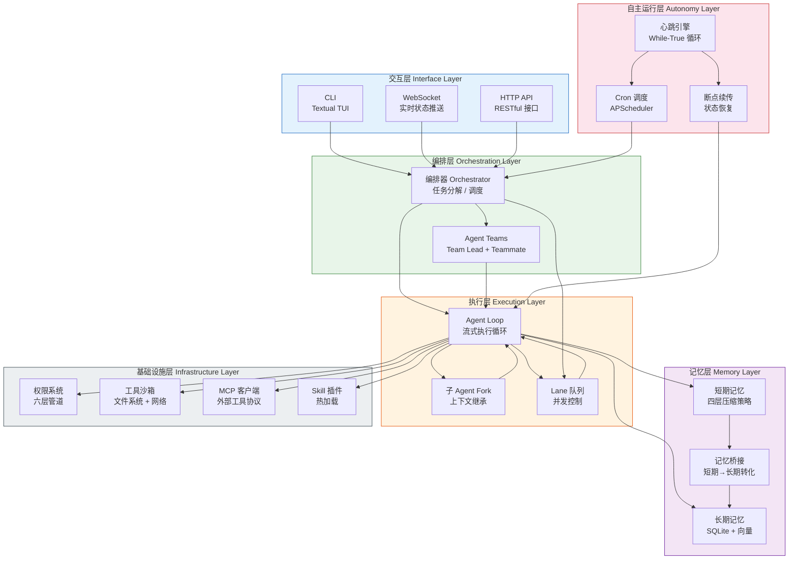
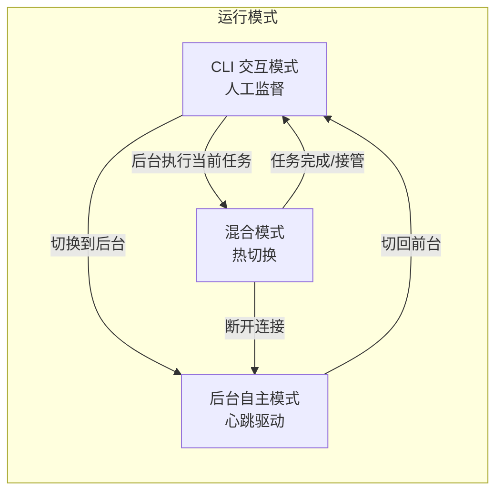
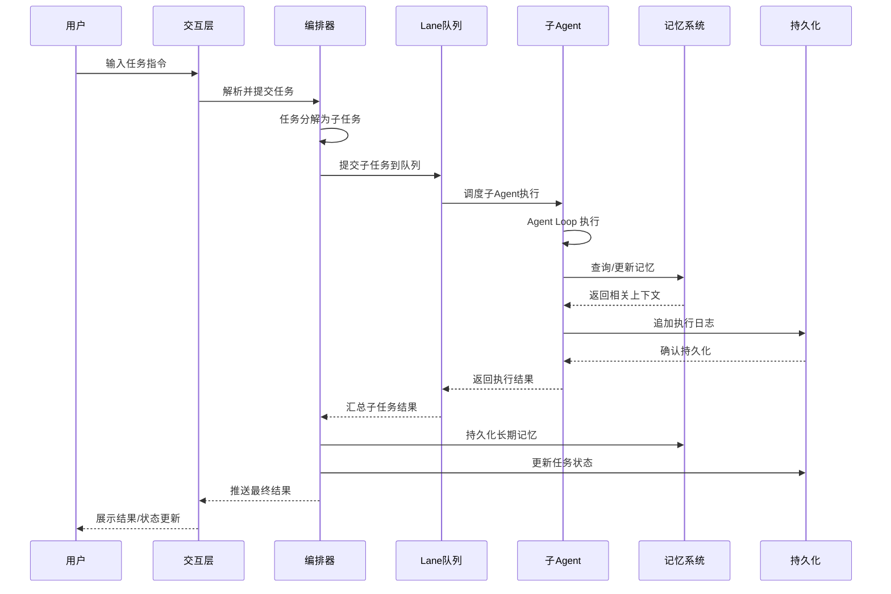
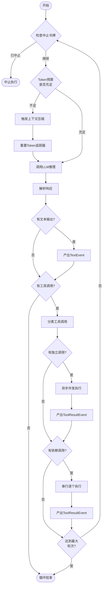
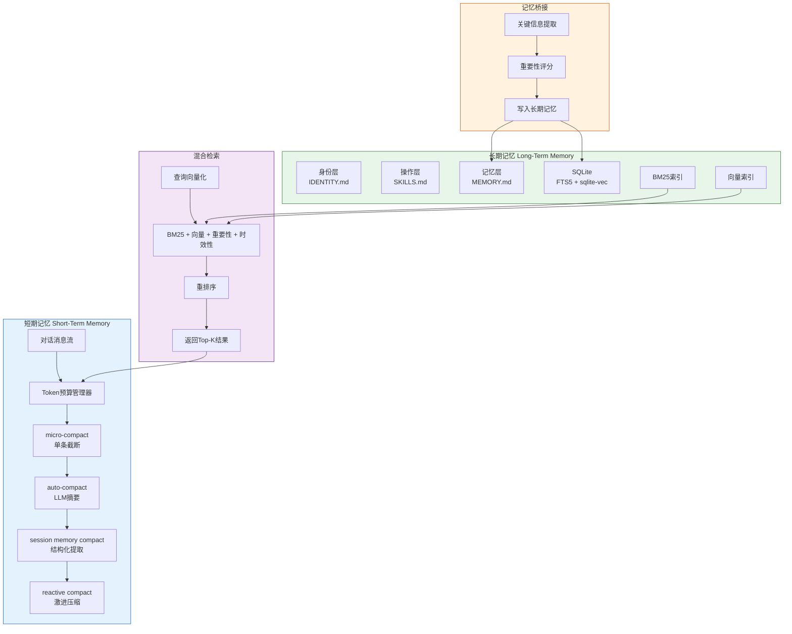
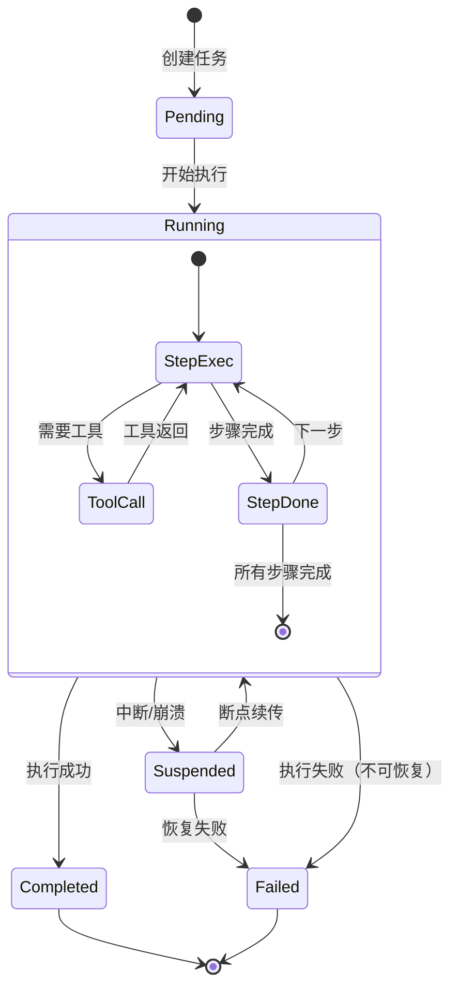
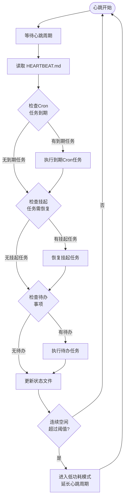
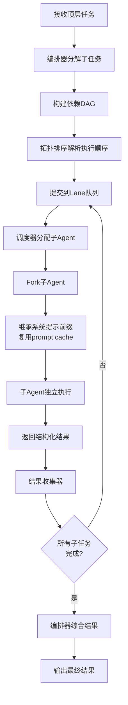
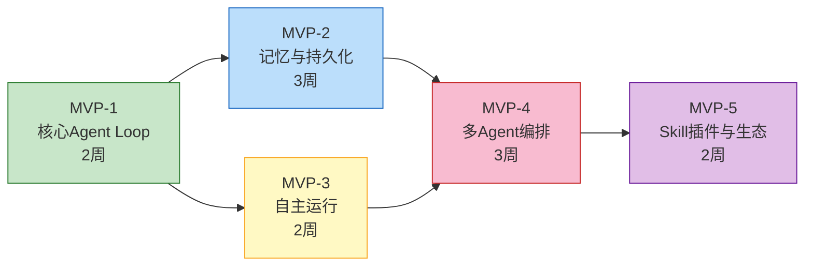

# Claude Code × OpenClaw 融合设计方案

> 基于 Claude Code 与 OpenClaw 两大 AI Agent 框架优势融合的 Python 多 Agent 框架设计

---

## 第1章 设计目标与原则

### 1.1 融合目标

本方案旨在将 Claude Code 与 OpenClaw 两个优秀 AI Agent 框架的核心优势进行深度融合，构建一个兼具交互深度与自主运行能力的 Python 多 Agent 框架。

**取自 Claude Code 的核心能力：**

| 能力 | 说明 |
|------|------|
| 编排器-子Agent架构 | 主Agent负责任务分解与调度，子Agent独立执行子任务，形成层次化的任务处理体系 |
| 四层上下文压缩策略 | micro-compact、auto-compact、session memory compact、reactive compact 四级渐进压缩，最大化上下文窗口利用率 |
| 六层权限管道 | 从工具声明到沙箱隔离的六层纵深防御，覆盖所有执行路径 |
| Fork优化 | 子Agent继承父Agent系统提示前缀，复用 prompt cache，降低冷启动成本 |
| MCP集成 | 通过 Model Context Protocol 连接外部工具服务器，扩展工具生态 |
| Agent Teams点对点通信 | Team Lead 协调 Teammate，共享任务列表与消息邮箱，支持并行协作 |

**取自 OpenClaw 的核心能力：**

| 能力 | 说明 |
|------|------|
| 心跳机制（While-True循环） | 持续运行的自主循环，定期检查待办、调度任务、更新状态 |
| 任务持久化与断点续传 | 任务状态、执行日志、进度看板全部落盘，崩溃后可从断点恢复 |
| 三层记忆系统 | 身份层（我是谁）、操作层（我会什么）、记忆层（我知道什么），结构化长期记忆 |
| Cron调度系统 | 基于时间表达式的周期性任务调度，支持定时检查、定期汇报等场景 |
| Lane队列并发控制 | 双层排队机制（session串行 + global并发），精确控制并发度 |
| Skill插件热加载 | 运行时动态加载/卸载技能插件，无需重启即可扩展Agent能力 |

### 1.2 设计原则

**模块化（Modularity）**：每个核心能力封装为独立模块，通过明确定义的接口交互。模块可独立替换、升级或禁用，不影响系统整体运行。例如，记忆系统可从 SQLite 切换到 PostgreSQL，权限系统可从六层简化为三层。

**渐进式（Progressive）**：采用 MVP（Minimum Viable Product）策略，先实现核心路径（Agent Loop + 基础工具），再逐步扩展记忆、持久化、多Agent编排等高级能力。每个阶段都有明确的验收标准。

**Python原生（Pythonic）**：充分利用 Python 3.12+ 的异步生态（asyncio、async for、TaskGroup），使用类型注解（typing）、数据类（dataclass）、Pydantic 模型确保类型安全，遵循 PEP 规范。

**安全优先（Security First）**：权限系统贯穿所有执行路径，从工具声明到沙箱隔离形成纵深防御。后台自主模式下启用审计日志和异常告警，确保无人值守时的安全性。

**本地优先（Local First）**：所有数据（任务状态、记忆、配置）存储在本地文件系统，用户完全掌控。不依赖外部云服务即可完整运行，可选接入云端LLM和工具服务。

---

## 第2章 整体架构设计

### 2.1 六层融合架构

系统采用六层分层架构，自上而下分别为交互层、编排层、执行层、自主运行层、记忆层和基础设施层。各层职责清晰，通过明确定义的接口进行通信。



**各层职责说明：**

| 层级 | 核心职责 | 关键组件 |
|------|---------|---------|
| 交互层 | 用户输入/输出，多通道适配 | CLI（Textual TUI）、WebSocket、HTTP API |
| 编排层 | 任务分解、子Agent分配、团队协调 | Orchestrator、Agent Teams |
| 执行层 | Agent执行循环、子Agent派生、并发控制 | Agent Loop、Fork、Lane队列 |
| 自主运行层 | 持续运行、定时调度、崩溃恢复 | 心跳引擎、Cron调度、断点续传 |
| 记忆层 | 上下文管理、信息压缩、知识持久化 | 短期记忆、长期记忆、记忆桥接 |
| 基础设施层 | 安全管控、工具执行、插件扩展 | 权限系统、沙箱、MCP、Skill插件 |

### 2.2 运行模式设计

系统支持三种运行模式，覆盖从人工监督到完全自主的全场景需求。

**CLI 交互模式**

类似 Claude Code 的阻塞式对话模式。用户在终端中与Agent实时交互，每一步操作都经过人工确认（或通过权限系统自动放行）。适合需要精细控制的开发、调试场景。

特征：同步阻塞、人工监督、实时流式输出、上下文窗口内操作。

**后台自主模式**

类似 OpenClaw 的心跳驱动模式。Agent在后台持续运行，通过心跳循环定期检查待办、执行任务、更新状态。适合长时间运行的监控、巡检、自动化运维场景。

特征：异步非阻塞、心跳驱动、自动决策、审计日志、异常告警。

**混合模式**

CLI启动任务后，可将任务切换到后台执行。Agent通过WebSocket推送状态更新，用户随时可切回CLI接管。适合需要启动后等待的编译、部署、批量处理场景。

特征：模式热切换、WebSocket状态推送、断点续传、双向通信。



### 2.3 数据流设计

以下序列图展示了从用户输入到最终状态更新的完整数据流，涵盖编排、执行、记忆、持久化各环节的交互。



---

## 第3章 核心模块设计

### 3.1 Agent Loop 模块

Agent Loop 是整个框架的执行核心，负责驱动单个Agent完成"思考-行动-观察"的循环。基于 Python asyncio 实现流式执行，支持工具调用、上下文压缩和中止控制。

**设计思路**

采用异步生成器模式，将Agent执行过程抽象为事件流。调用方通过 `async for` 逐个消费事件，实现流式输出和实时反馈。工具执行采用独立调用异步并发、有依赖调用串行的混合策略，最大化执行效率。

**核心数据结构**

```python
from dataclasses import dataclass, field
from enum import Enum
from typing import Any


class EventType(Enum):
    TEXT = "text"
    TOOL_USE = "tool_use"
    TOOL_RESULT = "tool_result"
    ERROR = "error"
    COMPACTION = "compaction"
    THINKING = "thinking"


@dataclass
class AgentEvent:
    event_type: EventType
    content: str
    metadata: dict[str, Any] = field(default_factory=dict)
    token_usage: TokenUsage | None = None


@dataclass
class TokenUsage:
    input_tokens: int = 0
    output_tokens: int = 0
    cache_read_tokens: int = 0
    cache_creation_tokens: int = 0


@dataclass
class ToolCall:
    tool_name: str
    tool_input: dict[str, Any]
    call_id: str


@dataclass
class AgentConfig:
    model: str = "claude-sonnet-4-20250514"
    max_tokens: int = 8192
    token_budget: int = 200_000
    max_tool_rounds: int = 20
    system_prompt: str = ""
    tools: list[dict[str, Any]] = field(default_factory=list)
```

**关键接口**

```python
import asyncio
from collections.abc import AsyncIterator


class CancellationToken:
    """用于中止Agent执行的中止令牌"""

    def __init__(self) -> None:
        self._cancelled = False

    def cancel(self) -> None:
        self._cancelled = True

    @property
    def is_cancelled(self) -> bool:
        return self._cancelled


async def agent_loop(
    messages: list[dict[str, Any]],
    config: AgentConfig,
    tool_executor: ToolExecutor,
    memory_manager: MemoryManager,
    cancellation_token: CancellationToken | None = None,
) -> AsyncIterator[AgentEvent]:
    """
    Agent核心执行循环。

    驱动LLM进行推理，执行工具调用，管理上下文压缩，
    通过异步生成器产出事件流供调用方消费。

    Args:
        messages: 对话消息列表（含系统提示）
        config: Agent配置（模型、token预算等）
        tool_executor: 工具执行器
        memory_manager: 记忆管理器（负责上下文压缩）
        cancellation_token: 可选的中止令牌

    Yields:
        AgentEvent: 执行过程中的各类事件

    Raises:
        AgentError: 执行过程中遇到不可恢复的错误
        asyncio.CancelledError: 被外部中止
    """
    token_tracker = TokenTracker(config.token_budget)

    for round_index in range(config.max_tool_rounds):
        if cancellation_token and cancellation_token.is_cancelled:
            yield AgentEvent(EventType.ERROR, "执行被用户中止")
            return

        if token_tracker.exceeded:
            yield AgentEvent(EventType.COMPACTION, "Token预算耗尽，触发压缩")
            messages = await memory_manager.compact(messages)
            token_tracker.reset()

        # 调用LLM获取响应
        response = await call_llm(messages, config, token_tracker)

        # 处理文本输出
        if response.text_content:
            yield AgentEvent(
                EventType.TEXT,
                response.text_content,
                token_usage=token_tracker.current_usage,
            )

        # 处理工具调用
        if not response.tool_calls:
            break

        # 分离独立调用和有依赖的调用
        independent_calls, dependent_calls = classify_tool_calls(response.tool_calls)

        # 独立调用并发执行
        if independent_calls:
            results = await execute_tools_concurrent(
                independent_calls, tool_executor
            )
            for result in results:
                yield AgentEvent(EventType.TOOL_RESULT, result.summary)
                messages.append(result.to_message())

        # 有依赖的调用串行执行
        for call in dependent_calls:
            result = await tool_executor.execute(call)
            yield AgentEvent(EventType.TOOL_RESULT, result.summary)
            messages.append(result.to_message())
```

**Agent Loop 执行流程**



### 3.2 记忆系统模块

记忆系统是Agent智能水平的关键支撑，融合了Claude Code的短期上下文压缩策略与OpenClaw的三层长期记忆模型，实现从会话内到跨会话的完整记忆链路。

**设计思路**

短期记忆负责管理当前会话的上下文窗口，通过四级渐进压缩策略最大化有效信息密度。长期记忆负责跨会话的知识持久化，采用SQLite + FTS5 + 向量检索的混合方案。记忆桥接机制在会话结束时自动将短期记忆中的关键信息提炼并写入长期记忆。

**短期记忆：四层压缩策略（取自Claude Code）**

| 压缩层级 | 触发条件 | 压缩方式 | 保留内容 |
|----------|---------|---------|---------|
| micro-compact | 单条消息超过阈值 | 截断长输出，保留首尾 | 工具调用结果摘要 |
| auto-compact | 上下文接近预算80% | LLM摘要压缩早期对话 | 关键决策、当前任务状态 |
| session memory compact | 会话中途里程碑 | 提取结构化知识到session memory | 代码变更、文件操作记录 |
| reactive compact | 紧急超预算 | 激进压缩，仅保留最近N轮 | 最近对话 + 系统提示 |

**长期记忆：三层记忆模型（取自OpenClaw）**

| 记忆层 | 存储内容 | 存储格式 | 检索方式 |
|--------|---------|---------|---------|
| 身份层 | Agent角色、能力边界、行为准则 | IDENTITY.md | 启动时全量加载 |
| 操作层 | 学到的操作模式、常用命令组合 | SKILLS.md | 按任务类型检索 |
| 记忆层 | 项目知识、历史决策、错误经验 | MEMORY.md + SQLite | BM25 + 向量混合检索 |

**核心数据结构**

```python
from dataclasses import dataclass, field
from datetime import datetime
from enum import Enum


class MemoryType(Enum):
    IDENTITY = "identity"
    OPERATION = "operation"
    EPISODIC = "episodic"


@dataclass
class MemoryEntry:
    """长期记忆条目"""

    memory_id: str
    memory_type: MemoryType
    content: str
    embedding: list[float] | None = None
    importance: float = 0.5
    created_at: datetime = field(default_factory=datetime.now)
    accessed_at: datetime = field(default_factory=datetime.now)
    access_count: int = 0
    source_task_id: str | None = None
    tags: list[str] = field(default_factory=list)


@dataclass
class MemoryQuery:
    """记忆检索查询"""

    query_text: str
    memory_types: list[MemoryType] | None = None
    max_results: int = 10
    min_importance: float = 0.0
    recency_weight: float = 0.3
    relevance_weight: float = 0.5
    importance_weight: float = 0.2


@dataclass
class CompactionResult:
    """上下文压缩结果"""

    original_token_count: int
    compressed_token_count: int
    compression_ratio: float
    preserved_keys: list[str]
    summary: str
```

**记忆系统架构**



**关键接口**

```python
from collections.abc import AsyncIterator


class ShortTermMemory:
    """短期记忆管理器，负责上下文窗口内的消息压缩"""

    async def compact(
        self, messages: list[dict[str, Any]], level: str = "auto"
    ) -> list[dict[str, Any]]:
        """
        对消息列表执行压缩，返回压缩后的消息列表。

        Args:
            messages: 当前对话消息列表
            level: 压缩级别 (micro/auto/session/reactive)

        Returns:
            压缩后的消息列表
        """
        ...

    async def estimate_tokens(self, messages: list[dict[str, Any]]) -> int:
        """估算消息列表的token数量"""
        ...


class LongTermMemory:
    """长期记忆管理器，负责跨会话知识持久化"""

    async def store(self, entry: MemoryEntry) -> str:
        """存储一条记忆，返回记忆ID"""
        ...

    async def search(self, query: MemoryQuery) -> list[MemoryEntry]:
        """混合检索，返回按相关性排序的记忆列表"""
        ...

    async def update_access(self, memory_id: str) -> None:
        """更新记忆的访问时间和计数（用于时效性评分）"""
        ...


class MemoryBridge:
    """记忆桥接，负责短期记忆到长期记忆的转化"""

    async def transfer_session_insights(
        self, messages: list[dict[str, Any]], task_id: str
    ) -> list[str]:
        """
        会话结束时提取关键洞察写入长期记忆。

        Args:
            messages: 本次会话的完整消息列表
            task_id: 关联的任务ID

        Returns:
            写入的长期记忆ID列表
        """
        ...
```

### 3.3 任务持久化与断点续传模块

任务持久化确保Agent在任何时刻崩溃都能恢复到最近的一致状态，是系统可靠性的基石。断点续传让长时间运行的任务不会因意外中断而丢失进度。

**设计思路**

每个任务拥有独立的目录，包含状态文件、执行日志和人类可读的进度看板。状态文件记录元数据和当前步骤，执行日志采用JSONL追加写入格式保证崩溃安全，进度看板供人类快速了解任务进展。恢复时通过扫描任务目录发现未完成任务，读取执行日志重建上下文。

**任务状态机**



**持久化格式**

```
tasks/
└── {task-id}/
    ├── state.json          # 任务元数据与状态
    ├── transcript.jsonl    # 执行日志（追加写入）
    ├── heartbeat.md        # 人类可读进度看板
    └── context_snapshot/   # 上下文快照（可选）
        └── latest.msgpack
```

**核心数据结构**

```python
from dataclasses import dataclass, field
from datetime import datetime
from enum import Enum


class TaskStatus(Enum):
    PENDING = "pending"
    RUNNING = "running"
    SUSPENDED = "suspended"
    COMPLETED = "completed"
    FAILED = "failed"


@dataclass
class TaskState:
    """任务状态，序列化为 state.json"""

    task_id: str
    description: str
    status: TaskStatus
    parent_task_id: str | None = None
    created_at: datetime = field(default_factory=datetime.now)
    updated_at: datetime = field(default_factory=datetime.now)
    completed_at: datetime | None = None
    current_step: int = 0
    total_steps: int = 0
    progress: float = 0.0
    result_summary: str | None = None
    error_message: str | None = None
    metadata: dict[str, Any] = field(default_factory=dict)


@dataclass
class TranscriptEntry:
    """执行日志条目，追加写入 transcript.jsonl"""

    timestamp: datetime
    step_index: int
    event_type: str
    content: str
    token_usage: dict[str, int] | None = None
    duration_ms: int | None = None
```

**断点续传流程**

```python
class TaskRecovery:
    """任务恢复管理器"""

    async def scan_interrupted_tasks(self) -> list[TaskState]:
        """
        扫描tasks/目录，发现所有Suspended状态的任务。

        Returns:
            中断的任务列表，按更新时间倒序排列
        """
        ...

    async def recover_task(self, task_id: str) -> RecoveryContext:
        """
        从断点恢复指定任务。

        恢复流程：
        1. 读取 state.json 获取任务元数据
        2. 读取 transcript.jsonl 重建执行上下文
        3. 加载 context_snapshot（如果存在）
        4. 构建恢复上下文返回

        Args:
            task_id: 要恢复的任务ID

        Returns:
            RecoveryContext: 包含恢复所需的所有上下文信息
        """
        ...


@dataclass
class RecoveryContext:
    """任务恢复上下文"""

    task_state: TaskState
    messages: list[dict[str, Any]]
    last_successful_step: int
    pending_steps: list[str]
    memory_snapshot: dict[str, Any] | None = None
```

### 3.4 心跳引擎模块

心跳引擎是后台自主模式的核心驱动，通过持续的循环确保Agent在无人监督时仍能主动执行任务、响应定时调度和恢复中断工作。

**设计思路**

采用 `while True` 循环作为心跳基础，每次循环执行一轮完整的检查-执行-更新流程。心跳周期可配置（默认60秒），空闲时自动进入低功耗模式降低资源消耗。心跳引擎与Cron调度深度集成，定时任务到期时自动触发执行。

**心跳循环流程**



**核心数据结构**

```python
from dataclasses import dataclass, field
from datetime import datetime


@dataclass
class HeartbeatConfig:
    """心跳引擎配置"""

    base_interval_seconds: int = 60
    low_power_interval_seconds: int = 300
    idle_threshold_cycles: int = 5
    max_concurrent_tasks: int = 3


@dataclass
class HeartbeatStatus:
    """心跳状态记录"""

    cycle_count: int = 0
    last_heartbeat_at: datetime | None = None
    tasks_completed_this_cycle: int = 0
    current_mode: str = "normal"  # normal | low_power
    consecutive_idle_cycles: int = 0
```

**关键接口**

```python
class HeartbeatEngine:
    """心跳引擎，驱动后台自主运行"""

    async def start(self) -> None:
        """启动心跳循环，阻塞直到被中止"""
        ...

    async def stop(self) -> None:
        """优雅停止心跳引擎"""
        ...

    async def heartbeat_cycle(self) -> None:
        """
        执行一次心跳周期。

        1. 读取 HEARTBEAT.md 获取待办
        2. 检查 Cron 任务到期
        3. 检查挂起任务需恢复
        4. 执行到期任务
        5. 更新状态文件
        """
        ...
```

### 3.5 多Agent编排模块

多Agent编排是框架处理复杂任务的核心能力，通过编排器将大任务分解为子任务，分配给子Agent并行或串行执行，最终汇总结果。

**设计思路**

编排器（Orchestrator）作为中枢，接收顶层任务后进行分解和调度。子Agent通过Fork机制继承父Agent的系统提示前缀，复用prompt cache降低延迟。Lane队列提供双层并发控制，确保资源利用率和执行顺序的平衡。Agent Teams支持更复杂的团队协作模式。

**核心数据结构**

```python
from dataclasses import dataclass, field
from enum import Enum


class TaskPriority(Enum):
    CRITICAL = 0
    HIGH = 1
    NORMAL = 2
    LOW = 3


@dataclass
class SubTask:
    """子任务定义"""

    sub_task_id: str
    description: str
    parent_task_id: str
    assigned_agent_id: str | None = None
    priority: TaskPriority = TaskPriority.NORMAL
    dependencies: list[str] = field(default_factory=list)
    status: TaskStatus = TaskStatus.PENDING
    result: str | None = None


@dataclass
class ForkConfig:
    """子Agent Fork配置"""

    inherit_system_prompt: bool = True
    inherit_tools: list[str] | None = None  # None表示继承全部
    extra_tools: list[str] = field(default_factory=list)
    extra_permissions: list[str] = field(default_factory=list)
    restricted_paths: list[str] = field(default_factory=list)
    max_tokens: int = 4096


@dataclass
class LaneConfig:
    """Lane队列配置"""

    max_concurrent: int = 3
    session_serial: bool = True  # 同一会话内串行
    priority_queue: bool = True
```

**编排流程**



**关键接口**

```python
class Orchestrator:
    """任务编排器"""

    async def decompose(self, task_description: str) -> list[SubTask]:
        """
        将顶层任务分解为子任务列表。

        Args:
            task_description: 顶层任务描述

        Returns:
            子任务列表（含依赖关系）
        """
        ...

    async def execute_sub_tasks(
        self, sub_tasks: list[SubTask], lane: LaneQueue
    ) -> dict[str, str]:
        """
        通过Lane队列调度执行子任务。

        Args:
            sub_tasks: 子任务列表
            lane: Lane队列实例

        Returns:
            子任务ID到结果的映射
        """
        ...


class LaneQueue:
    """Lane并发控制队列"""

    async def submit(self, sub_task: SubTask) -> str:
        """提交子任务到队列，返回票据ID"""
        ...

    async def wait_for_result(self, ticket_id: str) -> SubTask:
        """等待指定票据对应的子任务完成"""
        ...


class AgentForker:
    """子Agent派生器"""

    async def fork(
        self, parent_context: AgentContext, config: ForkConfig
    ) -> SubAgent:
        """
        从父Agent上下文派生子Agent。

        继承系统提示前缀以复用prompt cache，
        配置独立的工具池和权限。
        """
        ...
```

### 3.6 权限系统模块

权限系统为所有Agent操作提供安全保障，采用六层管道实现纵深防御。每一层都可以独立拦截危险操作，确保即使某一层被绕过，后续层仍能提供保护。

**六层权限管道（借鉴Claude Code）**

```
工具调用请求
    │
    ▼
┌─────────────────────────────────────┐
│ 第1层：工具声明式权限                 │
│ 工具自身声明所需权限（读/写/执行/网络）│
└──────────────┬──────────────────────┘
               ▼
┌─────────────────────────────────────┐
│ 第2层：全局安全规则                   │
│ 禁止列表：rm -rf /、DROP TABLE 等    │
└──────────────┬──────────────────────┘
               ▼
┌─────────────────────────────────────┐
│ 第3层：自动模式分类器                 │
│ LLM判断操作风险等级（低/中/高）       │
└──────────────┬──────────────────────┘
               ▼
┌─────────────────────────────────────┐
│ 第4层：用户配置规则                   │
│ .agent/config.toml 中的自定义规则    │
└──────────────┬──────────────────────┘
               ▼
┌─────────────────────────────────────┐
│ 第5层：企业策略（可选）               │
│ 组织级安全策略覆盖                    │
└──────────────┬──────────────────────┘
               ▼
┌─────────────────────────────────────┐
│ 第6层：沙箱隔离                      │
│ 文件系统路径限制 + 网络白名单         │
└──────────────┬──────────────────────┘
               ▼
          允许 / 拒绝
```

**核心数据结构**

```python
from dataclasses import dataclass, field
from enum import Enum


class RiskLevel(Enum):
    LOW = "low"
    MEDIUM = "medium"
    HIGH = "high"
    CRITICAL = "critical"


class PermissionDecision(Enum):
    ALLOW = "allow"
    DENY = "deny"
    REQUIRE_CONFIRM = "require_confirm"


@dataclass
class PermissionRequest:
    """权限请求"""

    tool_name: str
    operation: str
    target_path: str | None = None
    risk_level: RiskLevel = RiskLevel.LOW
    context: str = ""


@dataclass
class PermissionResult:
    """权限决策结果"""

    decision: PermissionDecision
    reason: str
    layer: str  # 哪一层做出的决策
    audit_log_entry: dict[str, Any] | None = None
```

**后台模式策略**

后台自主模式下，权限系统调整为"自动模式 + 审计日志 + 异常告警"：

- 低风险操作：自动放行，记录审计日志
- 中风险操作：自动放行，记录审计日志 + 推送通知
- 高风险操作：暂停执行，推送告警等待人工确认
- 严重风险操作：直接拒绝，推送紧急告警

---

## 第4章 Python 技术选型

### 4.1 技术栈总览

| 模块 | 推荐方案 | 备选方案 | 选择理由 |
|------|---------|---------|---------|
| 异步框架 | asyncio (stdlib) | - | Python原生，零依赖，与3.12+特性深度集成 |
| CLI框架 | Textual + click | Rich + Prompt Toolkit | Textual支持完整TUI（面板、布局、实时刷新），click处理命令行参数 |
| LLM调用 | anthropic + openai SDK | litellm | 原生SDK提供完整的类型注解和流式支持，避免抽象层带来的类型丢失 |
| 数据库 | aiosqlite + sqlite-vec | DuckDB | SQLite零配置、单文件部署，FTS5全文检索成熟，sqlite-vec支持向量索引 |
| Embedding | sentence-transformers | OpenAI API | 本地推理零成本，支持多语言，all-MiniLM-L6-v2模型体积小速度快 |
| 任务调度 | APScheduler | 自研 | 成熟稳定的调度库，支持Cron表达式、间隔调度、日期调度，异步友好 |
| 配置管理 | pydantic-settings + TOML | dynaconf | Pydantic提供类型安全的配置验证，TOML是Python生态标准配置格式 |
| 日志 | structlog | loguru | 结构化JSON日志，支持上下文绑定、处理器链，便于日志采集和分析 |
| 插件系统 | pluggy | stevedore | pytest同款插件框架，轻量、文档完善、hook规范清晰 |
| WebSocket | fastapi + websockets | aiohttp | FastAPI自动生成OpenAPI文档，websockets库性能优异，生态完善 |
| 测试 | pytest + pytest-asyncio | - | Python测试事实标准，pytest-asyncio提供完善的异步测试支持 |
| 依赖管理 | uv + pyproject.toml | poetry | uv比poetry快10-100倍，pyproject.toml是PEP标准格式 |

### 4.2 关键版本约束

| 依赖 | 最低版本 | 说明 |
|------|---------|------|
| Python | >= 3.12 | 需要TaskGroup、type alias、改进的错误信息 |
| anthropic | >= 0.40 | 流式响应、prompt cache、tool use |
| openai | >= 1.50 | 结构化输出、function calling |
| textual | >= 3.0 | TUI框架 |
| aiosqlite | >= 0.20 | 异步SQLite |
| sqlite-vec | >= 0.1 | SQLite向量扩展 |
| APScheduler | >= 3.10 | 异步调度器 |
| pydantic | >= 2.10 | 数据验证和序列化 |
| structlog | >= 24.0 | 结构化日志 |

### 4.3 项目结构

```
fusion-agent/
├── pyproject.toml
├── src/
│   └── fusion_agent/
│       ├── __init__.py
│       ├── cli/                    # 交互层
│       │   ├── app.py              # Textual TUI应用
│       │   └── commands.py         # click命令定义
│       ├── orchestration/          # 编排层
│       │   ├── orchestrator.py     # 任务编排器
│       │   ├── teams.py            # Agent Teams
│       │   └── lane.py             # Lane队列
│       ├── execution/              # 执行层
│       │   ├── loop.py             # Agent Loop
│       │   ├── fork.py             # 子Agent Fork
│       │   └── tools.py            # 工具执行器
│       ├── autonomy/               # 自主运行层
│       │   ├── heartbeat.py        # 心跳引擎
│       │   ├── scheduler.py        # Cron调度
│       │   └── recovery.py         # 断点续传
│       ├── memory/                 # 记忆层
│       │   ├── short_term.py       # 短期记忆（压缩）
│       │   ├── long_term.py        # 长期记忆（SQLite+向量）
│       │   └── bridge.py           # 记忆桥接
│       ├── infrastructure/         # 基础设施层
│       │   ├── permissions.py      # 权限系统
│       │   ├── sandbox.py          # 工具沙箱
│       │   ├── mcp_client.py       # MCP客户端
│       │   └── plugins.py          # Skill插件系统
│       ├── models/                 # 数据模型
│       │   ├── events.py           # 事件类型
│       │   ├── tasks.py            # 任务模型
│       │   └── memory.py           # 记忆模型
│       └── config/                 # 配置
│           ├── settings.py         # Pydantic Settings
│           └── defaults.toml       # 默认配置
├── tests/                          # 测试
│   ├── unit/
│   ├── integration/
│   └── e2e/
└── docs/                           # 文档
```

---

## 第5章 MVP实现路线图

### 阶段1：核心Agent Loop（MVP-1）

**目标**：实现最小可用的Agent执行循环，能够在CLI中完成简单的文件操作任务。

**实现范围**：

- 基础Agent Loop：消息输入 -> LLM推理 -> 工具执行 -> 结果反馈
- 流式输出：CLI实时显示LLM生成的文本和工具执行过程
- 3个基础工具：文件读写（read/write）、Shell执行（exec）、HTTP请求（fetch）
- 基础权限系统：第1层（工具声明）+ 第2层（全局安全规则）+ 第6层（沙箱）
- CLI交互模式：Textual TUI基础界面

**核心代码示例**：

```python
# src/fusion_agent/execution/loop.py

async def run_agent_loop(
    user_message: str,
    config: AgentConfig,
) -> AsyncIterator[AgentEvent]:
    """MVP-1: 最简Agent Loop"""
    messages = [
        {"role": "system", "content": config.system_prompt},
        {"role": "user", "content": user_message},
    ]
    tool_executor = ToolExecutor(config.tools)
    cancellation_token = CancellationToken()

    async for event in agent_loop(
        messages, config, tool_executor,
        memory_manager=StubMemoryManager(),
        cancellation_token=cancellation_token,
    ):
        yield event
```

**验收标准**：

| 编号 | 验收条件 | 验证方式 |
|------|---------|---------|
| 1.1 | CLI启动后能接收用户输入 | 手动测试 |
| 1.2 | LLM响应流式输出到终端 | 观察输出 |
| 1.3 | 能调用文件读写工具完成文件操作 | 端到端测试 |
| 1.4 | 能调用Shell工具执行命令 | 端到端测试 |
| 1.5 | 危险命令被权限系统拦截 | 单元测试 |
| 1.6 | 用户可中止正在执行的任务 | 手动测试 |

**预估工期**：2周

---

### 阶段2：记忆与持久化（MVP-2）

**目标**：实现上下文压缩和任务持久化，支持会话中断后断点续传和跨会话记忆检索。

**实现范围**：

- 短期记忆：token预算管理 + micro-compact + auto-compact
- 长期记忆：SQLite + FTS5 + 基础BM25检索
- 任务持久化：state.json + transcript.jsonl + heartbeat.md
- 断点续传：启动时扫描未完成任务，从最后成功步骤恢复
- 记忆桥接：会话结束时提取关键信息写入长期记忆

**验收标准**：

| 编号 | 验收条件 | 验证方式 |
|------|---------|---------|
| 2.1 | 长对话自动触发上下文压缩 | 压力测试 |
| 2.2 | 压缩后保留关键信息（可通过提问验证） | 回归测试 |
| 2.3 | 任务执行过程写入transcript.jsonl | 文件检查 |
| 2.4 | 进程崩溃后重启可恢复未完成任务 | 崩溃恢复测试 |
| 2.5 | 跨会话可检索到历史记忆 | 集成测试 |

**预估工期**：3周

---

### 阶段3：自主运行（MVP-3）

**目标**：实现后台自主运行能力，支持心跳驱动和定时调度。

**实现范围**：

- 心跳引擎：while-True循环 + 可配置周期
- Cron调度：集成APScheduler，支持Cron表达式
- 后台模式：CLI可切换到后台运行
- WebSocket状态推送：实时推送任务执行状态
- 空闲检测与低功耗模式

**验收标准**：

| 编号 | 验收条件 | 验证方式 |
|------|---------|---------|
| 3.1 | 心跳引擎持续运行24小时无崩溃 | 长时间运行测试 |
| 3.2 | Cron任务按预期时间触发 | 定时任务测试 |
| 3.3 | CLI可切换到后台，WebSocket推送状态 | 手动测试 |
| 3.4 | 断电重启后心跳引擎自动恢复 | 崩溃恢复测试 |
| 3.5 | 空闲时自动进入低功耗模式 | 资源监控 |

**预估工期**：2周

---

### 阶段4：多Agent编排（MVP-4）

**目标**：实现任务分解和并行执行能力，支持子Agent Fork和Lane队列。

**实现范围**：

- 编排器：任务分解为子任务 + 依赖解析
- 子Agent Fork：继承系统提示 + 独立工具池
- Lane队列：session串行 + global并发控制
- 基础Agent Teams：Team Lead + Teammate协作

**验收标准**：

| 编号 | 验收条件 | 验证方式 |
|------|---------|---------|
| 4.1 | 编排器能将复杂任务分解为合理子任务 | 人工评审 |
| 4.2 | 无依赖的子任务并行执行 | 并发测试 |
| 4.3 | 有依赖的子任务按序执行 | 顺序测试 |
| 4.4 | 子Agent继承父Agent系统提示 | 对比测试 |
| 4.5 | Lane队列并发度不超过配置上限 | 压力测试 |

**预估工期**：3周

---

### 阶段5：Skill插件与生态（MVP-5）

**目标**：实现插件化能力扩展，支持动态加载Skill和连接MCP工具服务器。

**实现范围**：

- 插件系统：基于pluggy的hook机制
- Skill加载：SKILL.md描述 + 门控检查 + 热加载/卸载
- MCP客户端：连接外部MCP工具服务器
- 权限系统完善：补充第3-5层

**验收标准**：

| 编号 | 验收条件 | 验证方式 |
|------|---------|---------|
| 5.1 | 运行时动态加载Skill插件 | 手动测试 |
| 5.2 | Skill卸载后Agent不再调用相关工具 | 回归测试 |
| 5.3 | MCP客户端成功连接外部工具服务器 | 集成测试 |
| 5.4 | 自动模式分类器正确判断风险等级 | 单元测试 |
| 5.5 | 用户配置规则正确生效 | 配置测试 |

**预估工期**：2周

**阶段依赖关系**



**总预估工期**：12周（约3个月），MVP-1至MVP-3可部分并行开发。

---

## 附录

### A. 与原框架的对应关系

| 本框架模块 | Claude Code 对应 | OpenClaw 对应 | 融合方式 |
|-----------|-----------------|--------------|---------|
| Agent Loop | Agent Loop | Agent执行 | 以Claude Code为基础，增加异步流式 |
| 短期记忆 | Context Window Management | - | 直接采用四层压缩策略 |
| 长期记忆 | - | 三层记忆系统 | 直接采用，增加向量检索 |
| 任务持久化 | - | Task Persistence | 直接采用JSONL格式 |
| 心跳引擎 | - | While-True Heartbeat | 直接采用，增加低功耗模式 |
| Cron调度 | - | Cron System | 集成APScheduler替代自研 |
| 编排器 | Orchestrator | - | 直接采用 |
| 子Agent Fork | Sub-Agent Fork | - | 直接采用，增加独立权限 |
| Agent Teams | Agent Teams | - | 直接采用 |
| Lane队列 | - | Lane Queue | 直接采用，增加优先级 |
| 权限系统 | Permission Pipeline | - | 直接采用六层管道 |
| MCP集成 | MCP Client | - | 直接采用 |
| Skill插件 | - | Skill System | 直接采用，增加pluggy框架 |

### B. 配置文件示例

```toml
# .agent/config.toml

[agent]
model = "claude-sonnet-4-20250514"
max_tokens = 8192
token_budget = 200000
max_tool_rounds = 20

[heartbeat]
enabled = true
interval_seconds = 60
low_power_interval_seconds = 300
idle_threshold = 5

[lane]
max_concurrent = 3
session_serial = true

[memory]
short_term_compression_threshold = 0.8
long_term_db_path = "~/.fusion-agent/memory.db"
embedding_model = "all-MiniLM-L6-v2"

[permissions]
auto_mode = false  # CLI模式默认关闭，后台模式默认开启
audit_log = true
alert_on_high_risk = true

[permissions.deny_list]
commands = ["rm -rf /", "DROP TABLE", "DELETE FROM"]
paths = ["/etc", "~/.ssh", "~/.aws"]

[cron]
tasks = []
```

### C. 核心接口汇总

| 接口 | 所属模块 | 签名 | 说明 |
|------|---------|------|------|
| `agent_loop` | 执行层 | `async (messages, config, ...) -> AsyncIterator[AgentEvent]` | Agent核心执行循环 |
| `compact` | 记忆层 | `async (messages, level) -> list[dict]` | 上下文压缩 |
| `store` | 记忆层 | `async (entry) -> str` | 存储长期记忆 |
| `search` | 记忆层 | `async (query) -> list[MemoryEntry]` | 混合检索 |
| `heartbeat_cycle` | 自主运行层 | `async () -> None` | 单次心跳周期 |
| `decompose` | 编排层 | `async (description) -> list[SubTask]` | 任务分解 |
| `fork` | 执行层 | `async (context, config) -> SubAgent` | 子Agent派生 |
| `submit` | 执行层 | `async (sub_task) -> str` | 提交到Lane队列 |
| `check_permission` | 基础设施层 | `async (request) -> PermissionResult` | 权限检查 |
| `recover_task` | 自主运行层 | `async (task_id) -> RecoveryContext` | 断点续传 |
